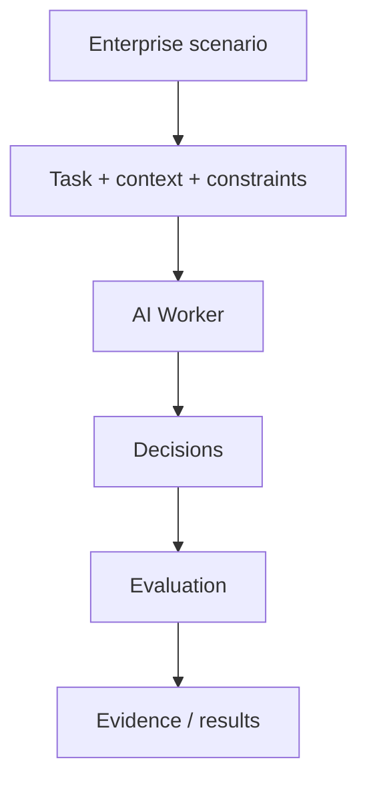
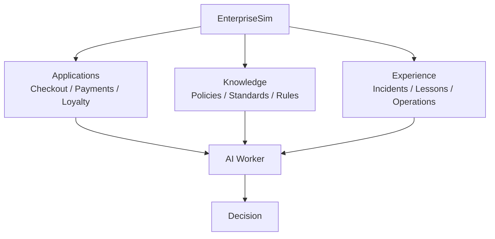
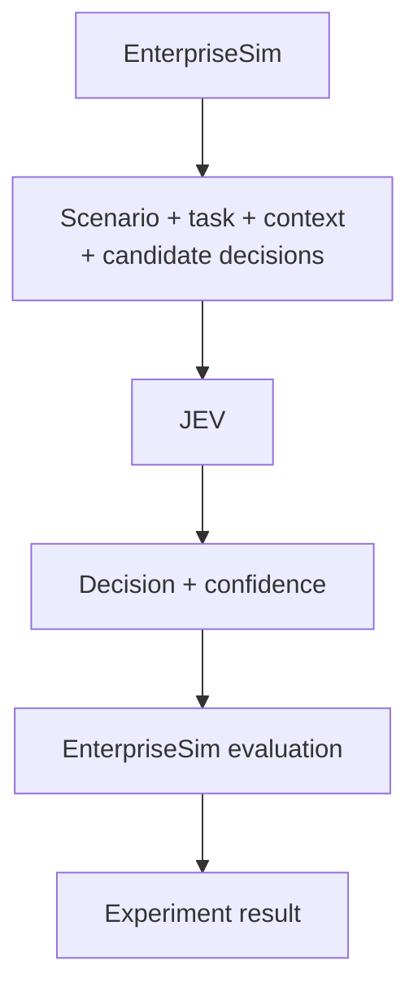
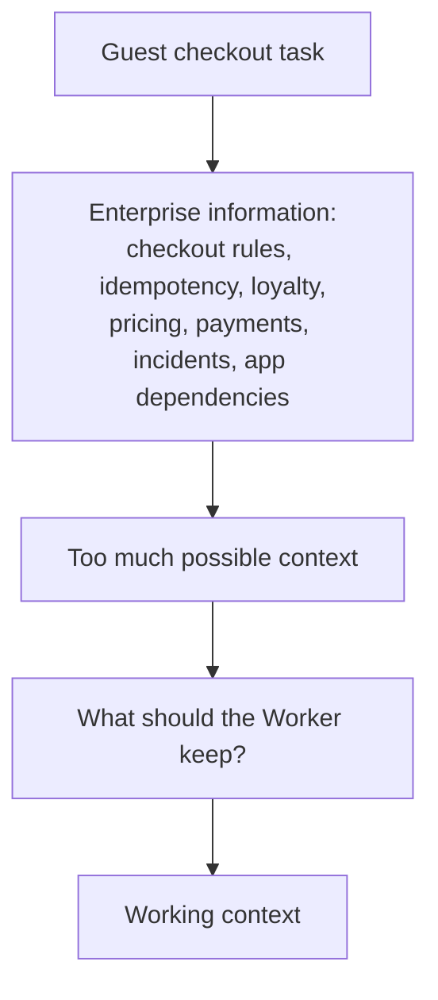
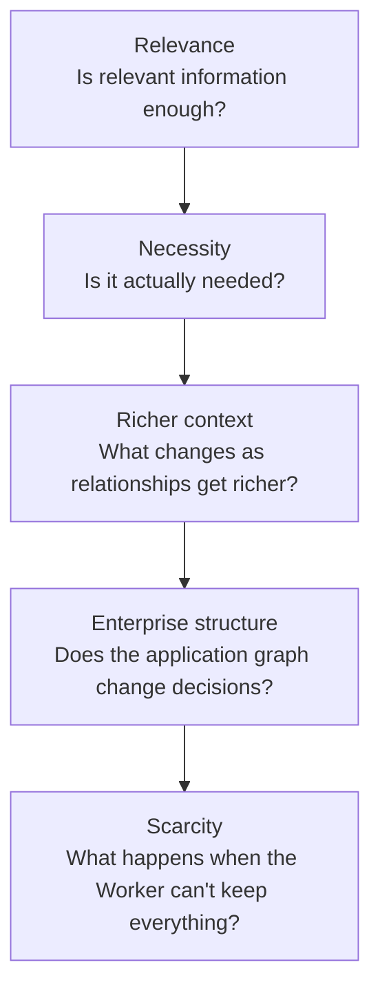
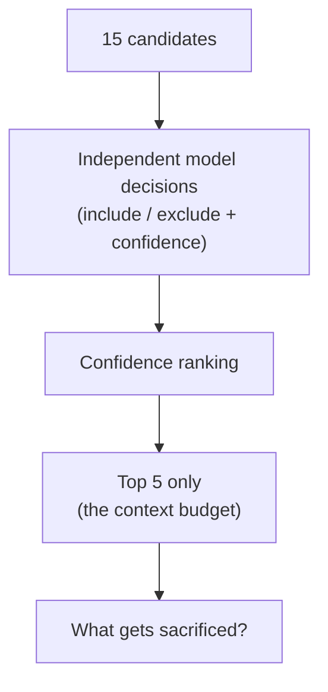
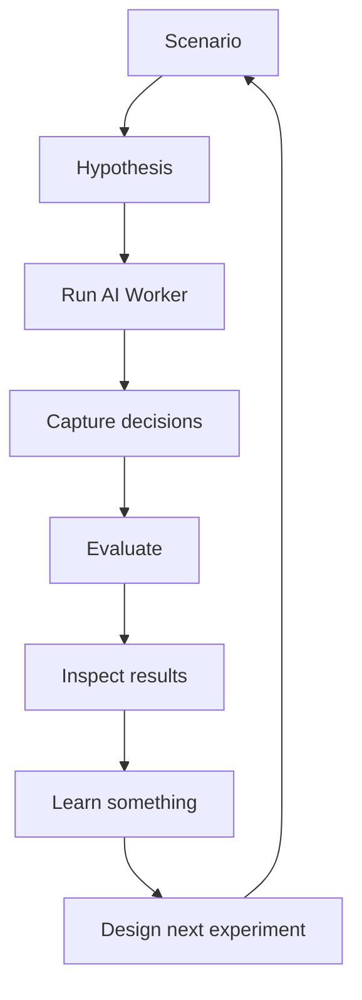

# EnterpriseSim

**An open-source testbed for simulating enterprise AI Worker use cases and evaluating the
decisions they make.**

Coding benchmarks test agents on isolated, toy repositories. Real enterprises are the
opposite: legacy debt, cross-team dependencies, incidents, governance rules, half-strangled
monoliths. EnterpriseSim is a coherent, fictional Fortune 500 you can drop an AI Worker
into — enterprise context, applications, relationships, constraints, candidate decisions,
and a fair scoreboard for what it actually does with all of it.

---

## What happens when an AI Worker has to make enterprise decisions, not just generate answers?

EnterpriseSim lets you build a controlled enterprise scenario — a task, the applications and
enterprise context around it, the relationships between them, the constraints, the candidate
decisions on the table, and the criteria you'll evaluate against — then run a Worker through
it and inspect what it actually did.



Inside one task, the Worker isn't reading a single document — it's sitting in the middle of
an interconnected enterprise:



One of the decision engines I'm experimenting with inside EnterpriseSim is **JEV**
(`typesafe/jev-1.13`). Instead of free-form generated text, JEV returns a structured decision
and a confidence/probability score — something you can repeat, compare, and score the same
way every time. To be clear about the shape of this: **EnterpriseSim is the testbed,
environment, and evaluator; JEV is one decision engine being tested inside it** — not the
other way around, and not the only one (GPT shows up throughout the research too).



Most agent demos show you the final answer. I'm interested in everything that happened
before it:

- What did the Worker look at?
- What did it ignore?
- What did it decide to keep?
- What did it decide to discard?
- What happens when context is limited?
- Which information survives?

That's what EnterpriseSim is for.

### A concrete example: guest checkout

Picture a Worker responsible for placing a guest checkout order. It potentially has access
to checkout rules, an order-idempotency standard, loyalty policy, pricing rules, payment
behavior, application dependencies, past incidents, and general operational experience. It
can't carry all of that into every decision.



The problem isn't access. The problem is selection. That turned into five controlled
experiments, each changing one thing at a time:



Internally these are tracked as `BC-0101` → `BC-0102` → `X-RICH-1` → `X-RICH-2` → `X-RICH-3`
— reproducible IDs, not the story. The scarcity experiment is where the research question
sharpened into something worth naming: **when an AI Worker cannot remember everything, does
it know what it cannot afford to forget?**



The model was not told about the budget. Fifteen candidates were independently judged
include/exclude with a confidence score, exactly as in the richer-context experiments before
it; a hard cap of five was then applied mechanically, after the fact, over the model's own
ranked confidence. Full numbers and caveats:
[`research/jev_context_decision/RESEARCH_STATE.md`](research/jev_context_decision/RESEARCH_STATE.md).

This is one instance of a loop I expect to keep running as EnterpriseSim grows past guest
checkout into more use cases:



### What you get

- Simulated enterprise scenarios
- Structured enterprise context
- Candidate decisions
- Application relationships
- Constraints
- Model/provider integrations
- Experiment runners
- Evaluation/scoring
- Reproducible results
- Raw research evidence

This is an actual experimental testbed you can run, not just documentation about AI Workers.
It's growing through concrete use cases — guest checkout and context assembly are the first
one, not the only one.

---

## Why use it

- **A realistic enterprise, already built.** A believable fake company — 24 apps, 30 teams,
  internally-consistent Jira, PRs, incidents, and API specs that all reference each other
  correctly — is months of work. It's here, done, and enforced by a single canon. Point your
  agent at it today.
- **It measures the _agent_, not the model.** Swap Claude → GPT → Gemini underneath the same
  agent and get comparable scores — so you can answer *"does my agent architecture add value
  beyond the raw LLM?"* and *"which model is best for my agent?"*
- **It measures _learning over time_.** A 100-run reference corpus and the benchmark are built
  to show whether an agent improves as it accumulates experience — not just one-shot accuracy.
- **Results are reproducible.** Frozen test cases + recorded model/seed/version + deterministic
  replay = a number you can trust and compare fairly.
- **Zero data risk.** Everything is 100% synthetic — demo it, publish results, reason about
  enterprise scenarios without touching any real company or customer data.

**Who it's for:** agent builders who need a hard, realistic proving ground · evaluators &
buyers comparing agents on enterprise-shaped work · researchers testing whether agent
memory / reflection actually helps.

> **Status — read this first.** V1 ships as **data + schemas + interface contracts** (the
> world, the corpus, the schemas, the benchmark spec). There is **no turnkey runner yet** —
> today you wire the contracts to your own model/runtime. A reference runtime is on the
> roadmap. See [Status](#status).

---

## Find your way around (4 buckets)

Twelve top-level folders, but they group into four ideas — think *building a game to test AI players*:

| Bucket | Folders | In plain terms |
|---|---|---|
| 🌍 **The world** | [`CANON.md`](CANON.md), [`enterprise/`](enterprise/) | The rulebook + the populated fictional company (Jira, PRs, incidents, specs) |
| 🤖 **Build an agent** | [`sdk/`](sdk/), [`schemas/`](schemas/), [`connectors/`](connectors/) | The contracts you implement to create a "Worker," and the data shapes it must produce |
| 📊 **Score it** | [`benchmarks/`](benchmarks/), [`corpus/`](corpus/) | 13 scoring suites + 100 recorded runs of a Worker improving over time |
| 📚 **Planning & docs** | [`docs/`](docs/), [`ecosystem/`](ecosystem/), [`research/`](research/), [`review/`](review/), [`evolution/`](evolution/), [`tools/`](tools/) | ADRs/RFCs, the V2 open-standards vision, studies, sprint history — safe to skip at first |

> **New here?** Run the [10-minute quickstart](examples/quickstart/) (no deps, no API
> key) → skim [`CANON.md`](CANON.md) (the world) and a run in [`corpus/`](corpus/) → then
> the [examples](#getting-started--examples) below.

### Try it in one command

```bash
python examples/quickstart/run_quickstart.py
```

Runs a baseline Worker against a real benchmark case (`BC-0101`, context assembly) and
prints an objective score — deterministic, zero dependencies. It scores **0.79 (PARTIAL)**,
just under the pass bar: your baseline to beat. See [`examples/quickstart/`](examples/quickstart/).

---

## The problem it solves

A stateless LLM knows *generic* software engineering. An **Enterprise AI Worker** is that
model wrapped in an **Enterprise Cognitive Layer (ECL)** — durable knowledge, accumulated
experience, context assembly, planning, evaluation, reflection and learning.

The question EnterpriseSim answers:

> **How good is a given Worker at real enterprise engineering work — and does it get
> better over time — independent of which model sits underneath?**

You can't measure that against a toy repo. It needs a believable enterprise with history,
dependencies, incidents, and technical debt. That's what this project provides.

---

## The world: Meridian Commerce Group (MCG)

Everything is grounded in [`CANON.md`](CANON.md) — the **authoritative, immutable source of
truth**. It defines **Meridian Commerce Group**, a completely fictional Fortune 500
omnichannel retailer (founded 2004, Austin TX) with a realistic engineering estate: a
strangled Rails monolith, an acquired .NET POS estate, a cloud-native re-platform, a
lakehouse data platform, and — from 2025 — AI Workers in the SDLC.

MCG is **fictional**. Any resemblance to a real company is coincidental. Retail is only a
backdrop that produces believable engineering artifacts; it is not the subject.

---

## Repository layout

| Path | What it is |
|---|---|
| [`CANON.md`](CANON.md) | The immutable world bible — company, org, apps, standards, ID/naming conventions. All artifacts must stay consistent with it. |
| [`enterprise/`](enterprise/) | The **reference enterprise** — a coherent commerce-path slice (12 focal apps, 10 teams, 25 repos, 10 releases): Jira issues, pull requests, incidents, postmortems, runbooks, API specs, knowledge docs, registries. |
| [`corpus/`](corpus/) | The **learning corpus** — 100 complete Worker executions showing the ECL lifecycle running against MCG, with a Worker that learns and improves over time. |
| [`benchmarks/`](benchmarks/) | The **benchmark framework** — 13 suites, scoring methodology, and object schemas that measure the Worker as a whole system, reproducibly and model-independently. |
| [`schemas/`](schemas/) | JSON Schemas for every ECL object (context, decision, plan, execution, evaluation, reflection, experience). |
| [`sdk/`](sdk/) | Framework code for building and running Workers. |
| [`connectors/`](connectors/) | Integrations (e.g. a public GitHub connector — public data only). |
| [`ecosystem/`](ecosystem/) | Forward-looking **V2+ open-standards strategy**: the Enterprise Worker Specification (EWS), an SDK charter, a reference runtime, and a conformance/certification suite. Planning artifacts — no frozen V1 artifact is modified. |
| [`research/`](research/) · [`review/`](review/) | First-principles ontology studies and adversarial architecture reviews. |
| [`docs/`](docs/) | ADRs, RFCs, architecture docs, guides, and contribution/release standards. |
| [`evolution/`](evolution/) | Sprint records and release notes. |

---

## The Enterprise Cognitive Layer (ECL)

Each Worker execution runs one full pass of the cognitive loop for a single task:

```
knowledge_retrieved → context → experience_retrieved → decision → plan →
execution → evaluation → reflection → experience_update   (+ evolving confidence)
```

Every stage is a schema-valid object (see [`schemas/`](schemas/)), and every execution in
[`corpus/`](corpus/) is a validated `WorkerExecutionBundle`. The benchmark isolates each
ECL competency into its own suite so you can see *where* a Worker is strong or weak — not
just a single aggregate score.

---

## Getting started — examples

EnterpriseSim V1 ships as **data + schemas + interface contracts** (there is no runnable
CLI yet — see [Status](#status)). The examples below use only what's in the repo today.

### 1. Explore the world and read a Worker execution

Every execution in [`corpus/`](corpus/) is a self-contained JSON bundle of one full ECL loop.

```python
import json

run = json.load(open("corpus/executions/RUN-0001.json"))

# The ECL lifecycle, as recorded fields on the bundle:
print(run["task"]["title"])
for stage in ["knowledge_retrieved", "context", "decision", "plan",
              "execution", "evaluation", "reflection", "experience_update"]:
    print(stage, "->", type(run[stage]).__name__)

print("confidence:", run["confidence"], "| outcome:", run["outcome"])
```

Read the 100 executions in order (`RUN-0001` → `RUN-0100`) to watch the Worker's confidence
and outcomes improve as it accumulates experience.

### 2. Validate an artifact against the frozen schemas

Every ECL object has a JSON Schema in [`schemas/`](schemas/). Validate any bundle stage:

```python
import json, jsonschema  # pip install jsonschema

ctx    = json.load(open("corpus/executions/RUN-0001.json"))["context"]
schema = json.load(open("schemas/context_object.schema.json"))

jsonschema.validate(ctx, schema)   # raises if the object drifts from canon
print("context object is schema-valid")
```

### 3. Inspect a benchmark case

A `BenchmarkCase` (`BC-####`) freezes the inputs, ground truth, rubric and scoring recipe
for one task. See [`benchmarks/`](benchmarks/) and the worked examples:

```python
import json

case   = json.load(open("benchmarks/examples/benchmark_case.example.json"))
result = json.load(open("benchmarks/examples/benchmark_result.example.json"))

print("case:", case["case_id"])           # inputs + machine-checkable ground truth
print("result:", result["cost"])          # outcome + judgment (dual-confidence)
```

Suite specs live in [`benchmarks/specs/`](benchmarks/specs/) (`BENCH-01`…), one competency
of the ECL per suite.

### 4. Define a Worker against the SDK contract

A Worker is domain-agnostic; you specialize it via a `WorkerSpec`
([`sdk/workers/interfaces.py`](sdk/workers/interfaces.py)). The SDK is the **contract** you
implement — pair it with your own model/runtime:

```python
from sdk.workers.interfaces import WorkerSpec

qa_worker = WorkerSpec(
    name="qa-worker",
    knowledge_domains=["testing", "checkout"],   # which KN corpora are in scope
    tools=["run_tests", "open_pr"],               # tools the Worker may act through
    rubrics=["RUB-checkout-quality"],             # evaluation rubric ids
    policies=["PCI", "SoD"],                       # guardrail policy ids
    default_routing={"tier": "frontier"},          # model-routing hints
)
# Implement Worker.run(trigger) / .replay(run_id) on your runtime,
# then benchmark it against the frozen cases — same tasks, any model underneath.
```

> **Reproducibility:** `Worker.replay(run_id)` re-executes a past run deterministically, and
> every `BenchmarkRun` records model, seed, temperature and dataset version — so results
> replay bit-for-bit (`ADR-0048`).

---

## Who this is for

- **Agent / worker builders** — a realistic environment and contract to build against.
- **Researchers & evaluators** — a reproducible, model-independent benchmark for enterprise
  engineering competency and learning-over-time.
- **Architects** — a reference for what an enterprise-grade AI-worker system looks like end
  to end (the ECL, governance, evaluation, and the open-standards path in [`ecosystem/`](ecosystem/)).

---

## Status

- **V1** — the MCG world, reference enterprise, learning corpus, schemas, and benchmark
  framework — is stabilized.
- **V2+** — the open-standards ecosystem (EWS spec, SDK, reference runtime, conformance) is
  in the architecture/planning phase. See [`ecosystem/README.md`](ecosystem/README.md).
  Prime directive: **evolution over replacement** — every V1 artifact has a destination and
  nothing is hard-deleted.

---

## A note on realism

All names, emails, and data in this repository are **synthetic** (`@example.com`,
`@meridian.example`, fictional teams and people). Nothing here represents a real
organization, customer, or individual.
