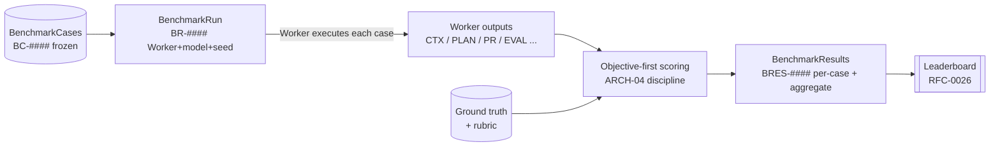

# EnterpriseSim Benchmark Framework

> **The Open Benchmark for Enterprise AI Workers.** This folder is what turns EnterpriseSim
> from a demonstrable architecture into a *measurable* one. It defines how any Enterprise AI
> Worker — on any model, from any vendor — is scored on identical Meridian Commerce Group
> (MCG) tasks, reproducibly and comparably.

| Field | Value |
|---|---|
| Scope | Benchmark suites, scoring methodology, object schemas |
| Canon Reference | `CANON-001` (MCG world), `CANON-001` §9 (Worker lifecycle) |
| Architecture Reference | `ARCH-04` (Evaluation Layer), `ARCH-07` (whole ECL) |
| Governing RFCs / ADRs | `RFC-0025` (Benchmarking Harness), `RFC-0026` (Scoring & Leaderboards), `ADR-0048` (Reproducibility), `ADR-0010` (Model Independence), `ADR-0034` (Loop Closure) |
| Status | Foundation Phase artifact |
| Owner | AI Engineering (`TEAM-070`), Quality Engineering (`TEAM-050`), Architecture Office (`TEAM-090`) |

---

## What this framework measures

A stateless LLM knows generic software engineering. An *Enterprise AI Worker* is that model
wrapped in the Enterprise Cognitive Layer (ECL, `ARCH-01`…`ARCH-07`): durable knowledge,
accumulated experience, context assembly, planning, evaluation, reflection and learning. The
question this framework answers is:

> **How good is a given Worker at real MCG engineering work — and does it get better over
> time — independent of which model sits underneath?**

We do not benchmark the model. We benchmark the *Worker as a whole system*, decomposed into
**13 suites** that each isolate one competency of the ECL, plus the operational axes
(latency, cost) that determine whether the Worker is deployable.

Every task is drawn from the MCG canon and its running example — the `CHK-1421` guest-checkout
loop (`ARCH-07`, Example A) — so scores are grounded in a concrete, referentially-consistent
enterprise rather than abstract toy problems.

---

## How a Worker is benchmarked (in one loop)

1. **Cases are frozen.** A `BenchmarkCase` (`BC-####`) fixes the inputs, the machine-checkable
   ground truth, the rubric reference and the scoring recipe for one task. Cases are versioned
   and never mutated in place (`ADR-0048`).
2. **A run is fully captured.** A `BenchmarkRun` (`BR-####`) records the Worker implementation,
   the provider/model, the **seed**, temperature, harness version and dataset version — every
   input needed to replay it bit-for-bit.
3. **Scoring is objective-first.** The harness compares the Worker's output to ground truth
   using deterministic gates first, model-assisted rubric items last, exactly as the Evaluation
   Layer (`ARCH-04`) does — every score line carries linked evidence.
4. **Results are dual-confidence.** A `BenchmarkResult` (`BRES-####`) reports both *outcome*
   (how good) and *judgment* (how certain the score is), per case and aggregated with
   confidence intervals across repeats.
5. **Leaderboards are constructed** from aggregate results, normalized so different models and
   Worker implementations compare fairly (`RFC-0026`).

---

## Model-independence is the point

EnterpriseSim's core thesis (`ARCH-07`) is that a Worker's competence lives **outside** the
model — in the ECL's knowledge, experience and policies — so the *same* accumulated
intelligence works with any provider. This framework operationalizes that claim:

- The **identical** `BenchmarkCase` set is executed against multiple providers by swapping only
  the `environment.provider`/`model` of the `BenchmarkRun` (`ADR-0010`) — nothing in the case
  or the scoring changes.
- Ground truth is defined in terms of **MCG artifacts and outcomes** (did it retrieve `EXP-090`?
  did it respect the `APP-012`→`APP-003` dependency rule?), never in terms of a model's
  idiosyncratic phrasing.
- **BENCH-11 (Model Independence)** is a first-class suite that quantifies cross-provider
  variance directly.

If a Worker scores well on one model and collapses on another, that is a finding the framework
is designed to surface — not something it hides.

---

## Reproducibility protocol (summary)

A benchmark that is not reproducible is not a benchmark (`ARCH-04`, Best Practice 7). The
framework guarantees reproducibility through (`ADR-0048`, `RFC-0025`):

- **Frozen, versioned cases** (`dataset_version`) — the corpus never shifts under a score.
- **Captured environment** — provider, model, `seed`, temperature, `harness_version` and a
  `gateway_capability_digest` are stored on every run.
- **Deterministic replay** — `sdk.workers.Worker.replay(run_id)` (`RFC-0024`) re-executes a run;
  deterministic gates must reproduce exactly, sampled steps reproduce under the recorded seed.
- **Repeats + statistics** — non-determinism that survives seeding is measured, not ignored:
  results carry mean, standard deviation and a bootstrap confidence interval over repeats.

See [`methodology.md`](methodology.md) for the full protocol.

---

## How it ties to the Evaluation Layer (`ARCH-04`)

This framework is the *standardized, comparative* extension of the in-loop Evaluation Layer.
`ARCH-04` scores one execution against its plan and standards to steer the live loop; the
benchmark framework runs *many curated cases across many Workers and models* and persists
comparable `BenchmarkResult` records. It reuses `ARCH-04`'s non-negotiables verbatim:

| `ARCH-04` principle | How the framework applies it |
|---|---|
| Objective first, subjective last | `scoring.objective_first: true`; gates weighted above rubric items |
| No score without evidence | `BenchmarkResult.evidence[]` and per-line `evidence` refs are mandatory |
| Separate the two confidences | `outcome_confidence` vs `judgment_confidence` on every result |
| Version the rubric | `BenchmarkCase.rubric.{id,version}`; cases are versioned |
| Check standards explicitly | dependency-rule / rollback / PCI gates appear as objective gates |
| Guard against gaming | `anti_gaming[]` per case; `gaming_flags[]` on results |
| Make it reproducible | the environment + seed capture above |

---

## The 13 suites

| Suite | Name | Primarily exercises | Spec |
|---|---|---|---|
| `BENCH-01` | Context Assembly | Context Layer (`ARCH-01`) | [specs/BENCH-01.md](specs/BENCH-01.md) |
| `BENCH-02` | Knowledge Retrieval | Knowledge Layer (`ARCH-02`) | [specs/BENCH-02.md](specs/BENCH-02.md) |
| `BENCH-03` | Experience Retrieval | Experience Layer (`ARCH-03`) | [specs/BENCH-03.md](specs/BENCH-03.md) |
| `BENCH-04` | Planning | Decision Intelligence (`ARCH-06`) | [specs/BENCH-04.md](specs/BENCH-04.md) |
| `BENCH-05` | Decision Intelligence | Decision Intelligence (`ARCH-06`) | [specs/BENCH-05.md](specs/BENCH-05.md) |
| `BENCH-06` | Tool Selection | Execution + Decision Intelligence | [specs/BENCH-06.md](specs/BENCH-06.md) |
| `BENCH-07` | Evaluation | Evaluation Layer (`ARCH-04`) | [specs/BENCH-07.md](specs/BENCH-07.md) |
| `BENCH-08` | Reflection | Learning Engine (`ARCH-05`) | [specs/BENCH-08.md](specs/BENCH-08.md) |
| `BENCH-09` | Continuous Learning | Learning Engine (`ARCH-05`) | [specs/BENCH-09.md](specs/BENCH-09.md) |
| `BENCH-10` | Confidence | cross-cutting (calibration) | [specs/BENCH-10.md](specs/BENCH-10.md) |
| `BENCH-11` | Model Independence | Model Gateway (`ARCH-07`) | [specs/BENCH-11.md](specs/BENCH-11.md) |
| `BENCH-12` | Latency | operational (whole loop) | [specs/BENCH-12.md](specs/BENCH-12.md) |
| `BENCH-13` | Cost | operational (whole loop) | [specs/BENCH-13.md](specs/BENCH-13.md) |

BENCH-01…06 measure the *ingredients* of good work; BENCH-07…09 measure *self-assessment and
improvement*; BENCH-10 measures *honesty*; BENCH-11…13 measure *portability and efficiency*.

---

## Schemas & examples

- [`schemas/`](schemas/) — JSON Schema (Draft 2020-12) for `BenchmarkCase`, `BenchmarkRun`,
  `BenchmarkResult`, composed on a local `benchmark_common.schema.json` base that extends the
  ECL [`../schemas/common.schema.json`](../schemas/common.schema.json). Same style as the ECL
  schemas: `allOf` on the base + `unevaluatedProperties: false`.
- [`examples/`](examples/) — a validated `BC-0101` / `BR-0101` / `BRES-0101` triple built on the
  `CHK-1421` loop (`CTX-0118`, `KN-045`, `KN-052`, `EXP-090`).

**Validation.** Load `../schemas/*.schema.json` and `schemas/*.schema.json` into one registry
keyed by `$id` (the benchmark schemas `$ref` the ECL `common.schema.json` by basename), then
validate with any Draft 2020-12 validator — exactly as [`../schemas/README.md`](../schemas/README.md)
describes.

---

## Non-goals

- **Not a model leaderboard.** Providers are compared only *through* a Worker; a raw model
  score is out of scope.
- **No implementation.** This folder is specifications, methodology and schemas only, per the
  EnterpriseSim documentation standard (`CANON-001` §4.7).
- **Not a substitute for `ARCH-04`.** The in-loop Evaluation Layer still governs live runs; this
  framework is the offline, comparative harness built on top of it.
