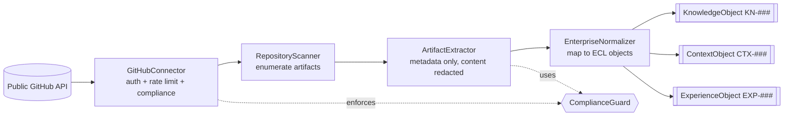

# Public GitHub Connector — Design

> **Design only. No implementation.** This module defines how EnterpriseSim can ingest
> **public** GitHub repositories and normalize their **engineering metadata** into ECL
> objects, so a real open-source project's engineering signal can seed or augment a
> reference enterprise — **without copying any proprietary or copyrightable content**.

| Field | Value |
|---|---|
| Module | `connectors/github` |
| Status | Design (interfaces only — see [`interfaces.py`](interfaces.py)) |
| Related | `ARCH-02` (Knowledge), `ARCH-01` (Context), `ARCH-03` (Experience), `RFC-0027` (plugins), `ADR-0049` (Apache-2.0 / synthetic-only), `ADR-0043` (sensitivity classification) |

## Purpose

Turn the observable **engineering metadata** of a public repository into schema-valid
EnterpriseSim `KnowledgeObject`s, `ContextObject`s and `ExperienceObject`s — the same objects
the ECL already consumes — so Enterprise AI Workers can be built and benchmarked against
patterns drawn from real, public engineering practice.

## Compliance boundary (non-negotiable)

This is the load-bearing design constraint, enforced by `ComplianceGuard`:

- **Metadata and structure only.** We extract *facts* (counts, timestamps, labels, languages,
  dependency edges, workflow stages, coverage numbers, PR/commit statistics) — **never**
  source code text, PR/issue bodies verbatim, or any other content that could be
  copyrightable. Free text (titles, messages, release notes) is **reduced to structured
  facts** (`redact_content`) before storage.
- **Public repositories only.** Private repos are never accessed (`is_public`).
- **License-aware.** Every source repo's SPDX license is recorded and gates extraction
  (`license_allows_metadata_extraction`); provenance (repo + license + commit SHA + fetch
  time) travels with every normalized object (`ADR-0020` provenance, `ADR-0043` classification).
- **ToS- and rate-limit-respecting.** All access goes through `GitHubConnector` with an
  explicit `RateLimiter`.

This keeps EnterpriseSim's output **original, synthetic (in composition), public and
commercially usable** even when informed by real repositories.

## Components

| Component | Responsibility |
|---|---|
| **`GitHubConnector`** | Authenticated (optional token), rate-limited entry point to the public API; exposes the `RateLimiter` and `ComplianceGuard`. Lists public repositories by query. |
| **`RepositoryScanner`** | Enumerates one repository's artifacts — `RepoMetadata`, releases, PRs, commits, labels, workflows, tests — into a `RepoSnapshot` (full or incremental `since` a watermark). |
| **`ArtifactExtractor`** | Reduces the raw scan to **content-free** structured metadata (redacting free text to facts) and derives `FileRelationship` edges from manifests (dependency/test/workflow structure, never file contents). |
| **`EnterpriseNormalizer`** | Maps a snapshot to ECL objects with provenance; output validates against the frozen `schemas/`. |

## Extraction scope (engineering metadata)

- **Repository metadata** — languages, topics, license, timestamps, stars/forks (facts).
- **Releases** — tags, dates, prerelease flag, asset counts.
- **PR metadata** — state, timings, size (files/±lines), commit/review counts, labels,
  linked-issue counts.
- **Commit metadata** — SHA, timestamp, size, conventional-commit type (parsed classification).
- **Labels** — names + usage counts (taxonomy signal).
- **File relationships** — dependency/test/workflow edges derived from manifests.
- **CI/CD workflows** — triggers, jobs/stages, matrix usage (structure, not YAML verbatim).
- **Test metadata** — framework, test-file counts, reported coverage, suite names.

## Normalization mapping

| Source metadata | ECL object | Rationale |
|---|---|---|
| Repo/architecture/CI facts, dependency graph, workflow structure | **`KnowledgeObject`** (`KN-###`) | Durable, retrievable truth about how a system is built (`ARCH-02`). `doc_type` = `external_repo` \| `external_ci` \| `external_dependency_graph`. |
| A scan/analysis task's assembled facts for one repo | **`ContextObject`** (`CTX-###`) | The ephemeral working set for an ingestion/analysis task (`ARCH-01`); provenance-carrying, budget-bounded. |
| Cross-repo recurring patterns (e.g. "repos with matrix CI + high coverage ship fewer revert commits") | **`ExperienceObject`** (`EXP-###`) | Reusable, evidence-linked lessons (`ARCH-03`) distilled across many repositories. |

All normalized IDs are namespaced to the connector source and carry `metadata.source` =
`github:owner/repo`, `metadata.license`, and `metadata.fetched_at` so they never collide with
the reference enterprise's IDs and remain auditable.

## Inputs / Outputs

- **Inputs:** a search query or explicit `owner/repo` list; optional auth token; an optional
  incremental watermark.
- **Outputs:** `NormalizationResult` — arrays of `KnowledgeObject`/`ContextObject`/
  `ExperienceObject` dicts plus provenance, ready to validate against `schemas/` and load into
  a Knowledge/Experience store.

## Failure modes & mitigations (design)

| Failure | Mitigation |
|---|---|
| Accidentally storing copyrightable content | `ComplianceGuard.redact_content` is mandatory in the extractor; normalizer stores facts only. |
| Rate-limit exhaustion / ToS breach | `RateLimiter.acquire` on every call; incremental `since` scans. |
| License incompatibility | `license_allows_metadata_extraction` gate; license recorded in provenance. |
| ID collision with the reference enterprise | Source-namespaced IDs + `metadata.source`. |
| Stale metadata | Incremental scans with watermark; `pushed_at`/SHA provenance. |

## Extension points

- Implement `GitHubConnector` for a specific API/auth setup; register via plugin entry points
  (`RFC-0027`).
- Implement `EnterpriseNormalizer` to change the metadata→ECL mapping or `doc_type` taxonomy.
- Provide alternative `ComplianceGuard`/`RateLimiter` policies.
- The same pattern generalizes to other forges (GitLab, Gitea) behind the same interfaces.

## Future evolution

- Cross-forge connectors sharing these interfaces.
- Streaming/event-driven ingestion (webhooks) for continuous normalization.
- Confidence-scored normalization (how strongly a pattern is evidenced across repos).
- Feeding normalized experiences into benchmark suites (`benchmarks/BENCH-11` model
  independence, cross-source generalization).

> **Reminder:** this document and `interfaces.py` are the *design*. No connector is
> implemented here, consistent with the Reference Implementation Phase brief.
