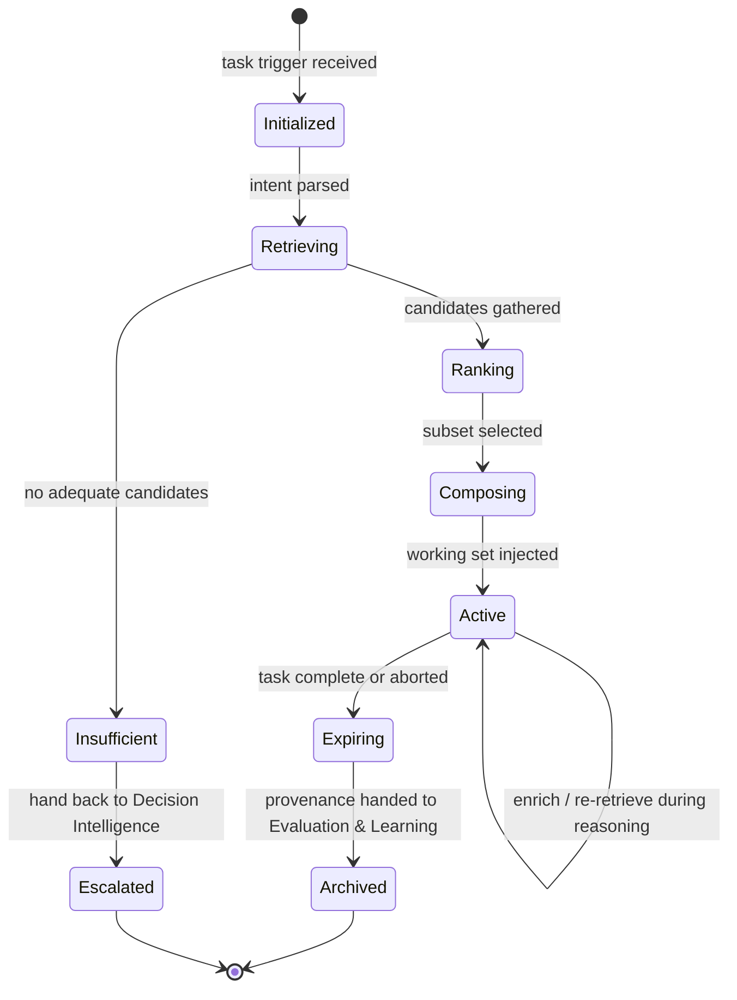
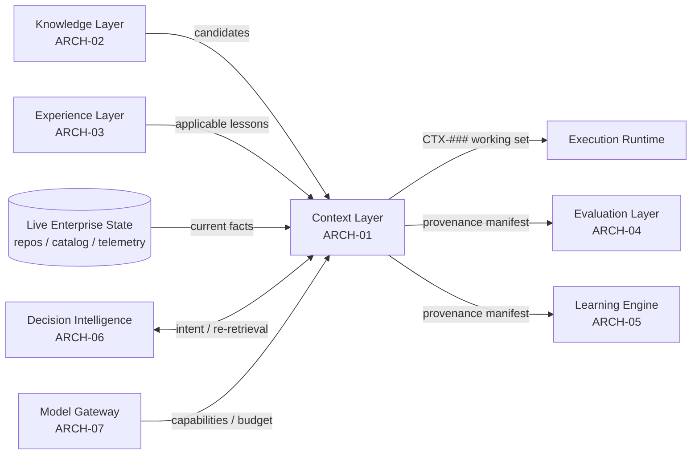

# Context Layer

> Part of the **Enterprise Cognitive Layer (ECL)** — the reusable intelligence
> architecture for Enterprise AI Workers in EnterpriseSim.

| Field | Value |
|---|---|
| Document | `ARCH-01` |
| Layer | **Context Layer** |
| Knowledge Class | `KN` (architecture knowledge) |
| Version | `1.0.0` |
| Status | Authoritative |
| Canon Reference | `CANON-001` §9 (Enterprise Worker Lifecycle, Stage 2) |
| Owner | Architecture Office (`TEAM-090`) |
| Contributors | AI Engineering (`TEAM-070`) |

---

## Purpose

The **Context Layer** assembles the *right, minimal, sufficient* working set of information
a Worker needs to perform **one specific task**, and holds it **only for the duration of
that task's execution**.

It exists because of a foundational ECL principle:

> **The LLM is stateless. Context exists only during execution.**

The reasoning engine (the LLM) remembers nothing between calls. Every unit of understanding
a Worker uses at runtime must be *deliberately assembled and injected*. The Context Layer is
the discipline and machinery of that assembly — what the industry calls **Context
Engineering**. It is the difference between a Worker that reasons over the correct three
knowledge documents, two prior experiences and the exact target file, and one that is
drowned in irrelevant tokens or starved of the fact that would have made it succeed.

The Context Layer is **ephemeral by design**. A context object (`CTX-###`) is born when a
task starts, is enriched as the Worker reasons, and is **discarded (archived, never
authoritative)** when the task ends. Nothing durable lives here — durability belongs to the
Knowledge Layer (`ARCH-02`) and the Experience Layer (`ARCH-03`).

---

## Responsibilities

1. **Interpret the task.** Turn the triggering artifact (a Jira issue, an incident, a review
   request) into a structured *task intent* the rest of the ECL can act on.
2. **Retrieve candidates.** Query the Knowledge Layer, Experience Layer, and live enterprise
   state (repos, service catalog, telemetry) for material that *might* be relevant.
3. **Rank and select.** Score candidates for relevance, authority and freshness, then select
   the subset that maximizes task success within the model's context budget.
4. **Compose the working set.** Structure the selected material into a coherent, ordered,
   token-budgeted context payload with explicit provenance for every item.
5. **Maintain provenance.** Record *what* was retrieved, *from where*, *why it was included*,
   and *what was dropped* — so evaluation and reflection can inspect the reasoning inputs.
6. **Track budget.** Enforce the token/window budget of the currently selected model,
   negotiated through the Model Gateway (see `ARCH-07`), independent of vendor.
7. **Expire cleanly.** Tear down the context object at task end, emitting signals and handing
   provenance to Evaluation (`ARCH-04`) and the Learning Engine (`ARCH-05`).

The Context Layer **does not** decide *what to do* (that is Decision Intelligence, `ARCH-06`)
and **does not** hold the organization's truth (that is Knowledge, `ARCH-02`). It is the
assembler and the short-term memory, nothing more.

---

## Inputs

| Input | Source | Description |
|---|---|---|
| Task trigger | Enterprise (Jira, incident, PR review request) | The unit of work, with its canonical ID (e.g., `CHK-1421`, `INC-2026-007`). |
| Task intent | Decision Intelligence (`ARCH-06`) | Structured interpretation of the goal, constraints and success criteria. |
| Knowledge candidates | Knowledge Layer (`ARCH-02`) | Retrieved `KN-###` documents, API specs, business rules, standards. |
| Experience candidates | Experience Layer (`ARCH-03`) | Retrieved `EXP-###` lessons applicable to the situation. |
| Live enterprise state | Repos / service catalog / telemetry | Target code, service ownership, dependency graph, current SLO status. |
| Model capabilities | Model Gateway (`ARCH-07`) | Context window size, tool-calling support, structured-output mode. |
| Policy constraints | Decision Intelligence / Security (`SEC`) | Data-handling rules, PCI boundaries, redaction requirements. |

---

## Outputs

| Output | Consumer | Description |
|---|---|---|
| Context object `CTX-###` | Decision Intelligence, Execution | The assembled, ordered, budgeted working set. |
| Provenance manifest | Evaluation (`ARCH-04`), Learning Engine (`ARCH-05`) | Every included/excluded item with source, score and rationale. |
| Coverage & sufficiency estimate | Decision Intelligence | Confidence that context is adequate for the task. |
| Retrieval signals | Signals bus (see below) | Hit/miss ratios, budget utilization, staleness of included items. |

A context object is a structured document (JSON/YAML in the ECL schemas), **not** a raw
prompt string. Rendering it into a provider-specific prompt is the Model Gateway's job,
which is how the Context Layer stays model-agnostic.

---

## Signals

Signals are the telemetry the Context Layer emits so that Decision Intelligence and the
Learning Engine can reason about and improve context assembly over time.

- **Retrieval hit ratio** — fraction of task-relevant material actually found and included.
- **Budget utilization** — tokens consumed vs. model window; over-budget triggers eviction.
- **Staleness index** — age/authority-weighted freshness of included knowledge.
- **Experience-applied count** — number of `EXP-###` objects injected and their scores.
- **Context churn** — how much the working set changed across reasoning iterations.
- **Dropped-candidate log** — high-scoring items excluded for budget, later inspected by
  reflection when a task fails (a common root cause: "the fix was in a doc we dropped").

---

## Lifecycle

A context object is short-lived and traverses a strict state machine.



The **Active** self-loop is important: context is not assembled once and frozen. As the
Worker reasons and acts, Decision Intelligence may request additional retrieval (e.g., after
reading a file it discovers a new dependency), and the Context Layer re-ranks and re-composes
within budget. This is *iterative context engineering*.

---

## Relationships



- **Consumes from** Knowledge (`ARCH-02`), Experience (`ARCH-03`), live state.
- **Orchestrated by** Decision Intelligence (`ARCH-06`).
- **Feeds** Execution, Evaluation (`ARCH-04`) and the Learning Engine (`ARCH-05`).
- **Constrained by** the Model Gateway (`ARCH-07`) for budget and capability.

---

## Confidence

The Context Layer expresses a **coverage/sufficiency confidence** — an estimate of whether
the assembled working set is adequate for the task. It is computed from:

- **Retrieval confidence** — did high-authority knowledge match the intent strongly, or were
  matches weak/ambiguous?
- **Coverage** — are all *facets* of the task represented (target code, relevant rules,
  applicable experience, dependency context)?
- **Freshness** — is included knowledge current, or is the staleness index high?
- **Budget pressure** — were high-value candidates dropped for budget? Drops lower confidence.

Low confidence is a first-class signal: Decision Intelligence may respond by re-retrieving,
narrowing the task, requesting a larger-window model via the Gateway, or escalating to a
human. **Context confidence is never silently ignored.**

---

## Failure Modes

| Failure | Symptom | Mitigation |
|---|---|---|
| **Context starvation** | The decisive fact was never retrieved; Worker guesses. | Multi-strategy retrieval (semantic + keyword + graph); low-coverage escalation. |
| **Context flooding** | Window filled with low-relevance material; signal lost in noise. | Strict ranking + budget; drop below a relevance floor; measure churn. |
| **Stale context** | Included knowledge contradicts current reality (post-change). | Staleness index; prefer live state over cached knowledge for volatile facts. |
| **Provenance loss** | Cannot explain why the Worker acted; evaluation can't diagnose. | Provenance is mandatory and immutable; no item enters context without a source. |
| **Budget thrash** | Repeated evict/re-add cycles waste calls. | Hysteresis in eviction; cache candidate scores within a task. |
| **Silent truncation** | Provider truncates an over-budget prompt, dropping the tail. | Budget enforced *before* the Gateway call; never rely on provider truncation. |
| **Leaky context** | Sensitive data (PCI, PII) enters context against policy. | Policy-aware redaction at composition; `SEC` review of context templates. |

---

## Future Evolution

- **Learned retrieval policies.** The Learning Engine promotes retrieval strategies that
  historically produced high-scoring executions into default context templates per task type.
- **Predictive pre-fetch.** For recurring task shapes, pre-assemble likely context to reduce
  latency, validated against live state at task start.
- **Hierarchical / streaming context** for very large tasks that exceed any single window —
  summarize-and-drill rather than truncate.
- **Cross-Worker context reuse.** Where a QA Worker and a Support Worker touch the same
  incident, share a validated context fragment (with provenance) rather than re-retrieving.
- **Confidence-calibrated budgets.** Allocate more window to facets the Evaluation Layer has
  shown to be decisive for a given task type.

---

## Best Practices

1. **Minimal-sufficient, not maximal.** More context is not better; the *right* context is.
2. **Everything has provenance.** No item enters a context object without a citable source.
3. **Prefer live state for volatile facts.** Code, inventory, SLO status change; read them
   fresh rather than trusting cached knowledge.
4. **Budget before the model, never after.** Enforce the window in the ECL; treat provider
   truncation as a bug, not a feature.
5. **Make sufficiency explicit.** Emit coverage confidence; let Decision Intelligence act on
   it instead of assuming context is fine.
6. **Keep context model-agnostic.** Store structured context; let the Gateway render prompts.
7. **Archive, then forget.** Persist provenance for learning; never let ephemeral context
   masquerade as durable truth.

---

## Examples

### Example A — Context assembly for a Jira story

**Task trigger:** `CHK-1421` — "Support guest checkout in the Checkout Service."

The Context Layer produces `CTX-0118`:

```yaml
context:
  id: CTX-0118
  task: { type: jira_story, ref: CHK-1421, app: APP-003, repo: mcg-checkout-service }
  intent_ref: PLAN-0072            # from Decision Intelligence
  model_budget: { window_tokens: 200000, reserved_output: 8000 }
  included:
    - { kind: knowledge,  ref: KN-045, title: "Checkout domain rules", score: 0.94, reason: "defines order-placement invariants" }
    - { kind: knowledge,  ref: KN-052, title: "API standards (idempotency)", score: 0.88, reason: "guest orders need idempotency keys" }
    - { kind: experience, ref: EXP-090, title: "Guest carts must not create loyalty accounts", score: 0.91, reason: "prior regression on APP-015" }
    - { kind: code,       ref: "mcg-checkout-service/src/checkout/PlaceOrder.java", score: 0.97, reason: "primary change site" }
    - { kind: state,      ref: "service-catalog:APP-003", score: 0.70, reason: "dependency graph -> APP-012, APP-010" }
  excluded:
    - { kind: knowledge, ref: KN-101, title: "Marketplace seller onboarding", score: 0.22, reason: "out of scope" }
    - { kind: knowledge, ref: KN-047, title: "Legacy monolith checkout", score: 0.61, reason: "dropped for budget; flagged" }
  coverage_confidence: 0.86
  signals: { hit_ratio: 0.83, budget_utilization: 0.41, staleness_index: 0.12 }
```

Note `KN-047` was *dropped for budget but flagged*. If the resulting execution later fails,
reflection (`ARCH-05`) will inspect the dropped-candidate log first.

### Example B — Iterative re-retrieval

While reasoning, the Worker reads `PlaceOrder.java` and discovers a call into the Promotions
Engine (`APP-008`). Decision Intelligence requests re-retrieval; the Context Layer adds
`KN-063` ("Promotions cache invalidation") and `EXP-055` ("pricing changes during promo
windows require APP-008 cache flush"), re-ranks, evicts a now-lower-value item to stay within
budget, and updates `CTX-0118`'s provenance — all without a durable write anywhere.

### Example C — Domain-agnostic reuse

A **Privacy Worker** handling a data-subject-access request assembles a completely different
`CTX` — pulling `KN` privacy policies, `EXP` lessons about PII in `APP-014`, and live state
from the identity service — using the **same Context Layer** with no architectural change.
This is the reusability the ECL guarantees (see `ARCH-07`).
