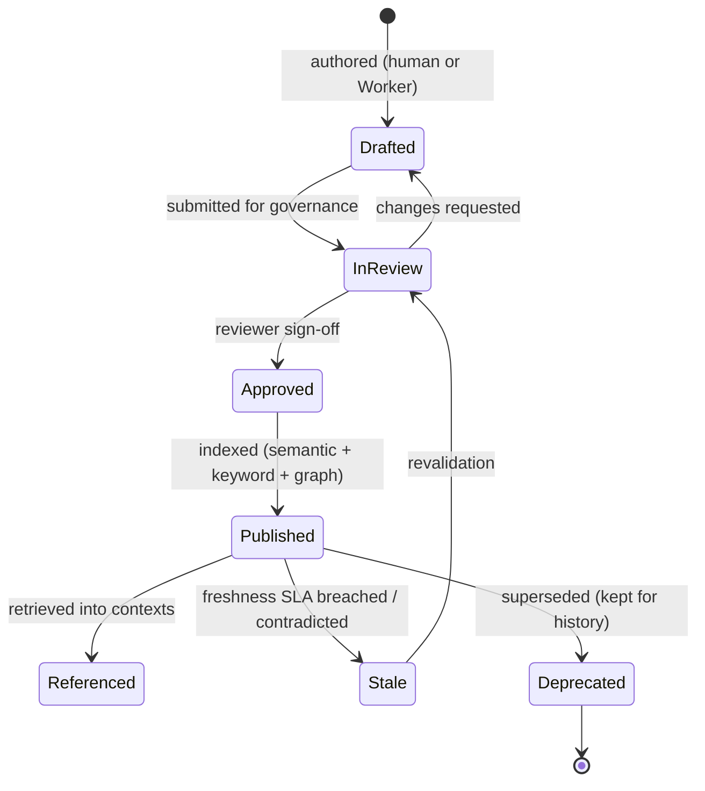
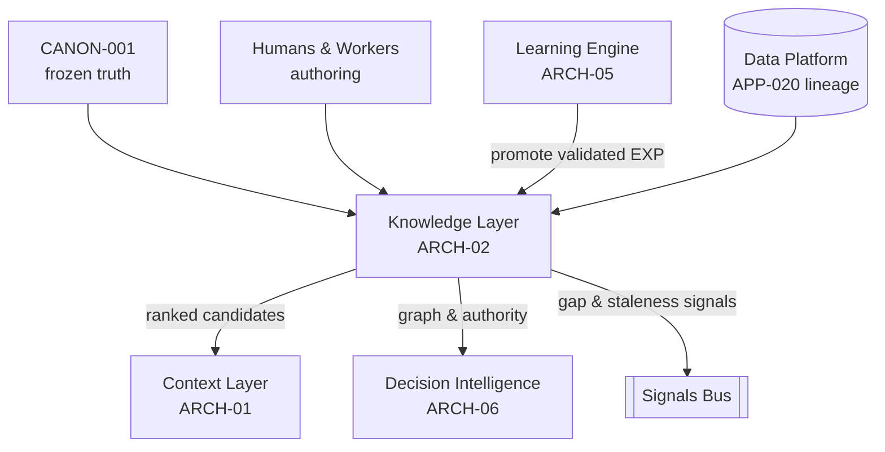

# Knowledge Layer

> Part of the **Enterprise Cognitive Layer (ECL)** — the reusable intelligence
> architecture for Enterprise AI Workers in EnterpriseSim.

| Field | Value |
|---|---|
| Document | `ARCH-02` |
| Layer | **Knowledge Layer** |
| Knowledge Class | `KN` (architecture knowledge) |
| Version | `1.0.0` |
| Status | Authoritative |
| Canon Reference | `CANON-001` §9 (Enterprise Worker Lifecycle, Stage 1) |
| Owner | Architecture Office (`TEAM-090`) |
| Contributors | AI Engineering (`TEAM-070`), Data Platform (`TEAM-060`) |

---

## Purpose

The **Knowledge Layer** is the enterprise's durable, curated, authoritative understanding of
itself. It is the answer to *"what is true about Meridian Commerce Group and how it works?"*

It embodies the ECL principle:

> **Knowledge is enterprise truth.**

Where the Context Layer (`ARCH-01`) is ephemeral and the Experience Layer (`ARCH-03`) is
accumulated lessons, the Knowledge Layer is **governed truth**: architecture documents,
business rules, runbooks, engineering standards (including `CANON.md` itself), API contracts,
domain models and validated post-incident learnings. Every fact here is **versioned, sourced,
reviewed and retrievable**.

Knowledge is what makes a Worker *knowledgeable* rather than merely clever. A stateless LLM
knows generic software engineering; it does not know that at MCG, guest checkout must not
create a loyalty account, that `APP-012` is the PCI boundary, or that the Rails monolith
survives as `APP-018`. That is enterprise knowledge, and it lives here.

---

## Responsibilities

1. **Store enterprise truth** as identified, versioned `KN-###` documents with strict
   provenance and ownership.
2. **Govern quality** — every knowledge item is reviewed and approved before it becomes
   authoritative; nothing enters canon-adjacent knowledge unvetted.
3. **Index for retrieval** across three complementary modes: **semantic** (vector),
   **keyword/lexical**, and **graph** (relationships between apps, teams, services, rules).
4. **Serve candidates** to the Context Layer with relevance, authority and freshness scores.
5. **Track freshness & lineage** — when did a fact last change, what does it depend on, and
   what is downstream if it changes.
6. **Absorb promoted learning** — accept validated experience (`EXP-###`) promoted by the
   Learning Engine (`ARCH-05`) into durable knowledge, closing the improvement loop.
7. **Enforce classification** — mark sensitivity (public/internal/PCI/PII) so downstream
   layers handle data per policy.

---

## Inputs

| Input | Source | Description |
|---|---|---|
| Authored documents | Humans & Workers | Architecture, runbooks, business rules, standards. |
| Canon | `CANON-001` | The frozen source of truth; the root of the knowledge graph. |
| API & event contracts | Services (`mcg-*` repos) | OpenAPI/protobuf/SDL specs, schema registry entries. |
| Promoted experience | Learning Engine (`ARCH-05`) | Validated `EXP-###` lessons elevated to durable knowledge. |
| Data-platform metadata | `TEAM-060` (APP-020) | Lineage, ownership, data contracts, semantic layer. |
| Retrieval queries | Context Layer (`ARCH-01`) | Task-driven requests for candidate knowledge. |

---

## Outputs

| Output | Consumer | Description |
|---|---|---|
| Ranked knowledge candidates | Context Layer (`ARCH-01`) | `KN-###` items with score, authority, freshness. |
| Knowledge graph views | Context Layer, Decision Intelligence | Relationships (app→dependency, rule→app, incident→cause). |
| Authority & freshness metadata | Context Layer, Evaluation | Signals for context confidence and evaluation. |
| Governance events | Learning Engine, Signals bus | Approvals, deprecations, staleness alarms. |

---

## Signals

- **Retrieval coverage** — how often knowledge queries return high-authority matches.
- **Knowledge gap events** — tasks where no adequate knowledge existed (drives authoring).
- **Staleness alarms** — knowledge older than its domain's freshness SLA or contradicted by
  live state.
- **Citation frequency** — which `KN-###` items are actually used in successful executions
  (high-value knowledge) vs. never cited (candidate for pruning).
- **Contradiction detections** — two knowledge items that disagree (governance must resolve).
- **Promotion rate** — how much new knowledge arrives via the Learning Engine.

---

## Lifecycle

Knowledge is durable but not static; each item has a governed lifecycle.



Knowledge is **never hard-deleted**; deprecated items are retained for historical and
audit fidelity (mirroring CANON's "IDs are never reused" rule).

---

## Relationships



- **Rooted in** `CANON-001`.
- **Fed by** human/Worker authoring, contracts, and the Learning Engine's promotions.
- **Serves** the Context Layer and Decision Intelligence.
- **Distinct from** Experience (`ARCH-03`): knowledge is *governed truth*; experience is
  *accumulated lessons* awaiting (or graduated to) promotion.

---

## Confidence

Every knowledge item carries a confidence composed of:

- **Authority** — is this canon-derived, owner-approved, or provisional? Canon = highest.
- **Freshness** — time since last validation vs. the domain's freshness SLA.
- **Corroboration** — is the fact supported by multiple sources or a lone assertion?
- **Usage evidence** — has it contributed to successful executions (citation frequency)?

The Context Layer weights candidates by this confidence; low-authority or stale knowledge is
included only with an explicit caveat, and contradictions are surfaced rather than silently
resolved.

---

## Failure Modes

| Failure | Symptom | Mitigation |
|---|---|---|
| **Knowledge gap** | No knowledge exists for a real task; Worker improvises. | Gap events drive authoring; Learning Engine backfills from experience. |
| **Stale truth** | Approved knowledge contradicts current reality. | Freshness SLAs, staleness alarms, live-state cross-checks. |
| **Contradiction** | Two items disagree; Worker gets conflicting facts. | Contradiction detection + governance resolution; canon breaks ties. |
| **Retrieval blindness** | Relevant knowledge exists but isn't found (semantic-only miss). | Hybrid retrieval (semantic + keyword + graph). |
| **Poisoning** | Low-quality or wrong knowledge promoted without review. | Governed promotion; the Learning Engine proposes, governance approves. |
| **Over-retention** | Deprecated knowledge keeps surfacing. | Deprecation excludes from default retrieval; history preserved separately. |
| **Classification leak** | Sensitive knowledge served without policy handling. | Mandatory sensitivity labels; policy-aware retrieval. |

---

## Future Evolution

- **Active knowledge curation** — Workers propose edits when they detect staleness during
  execution, routed through governance automatically.
- **Graph-native reasoning** — richer typed relationships (causes, mitigates, depends-on,
  supersedes) enabling multi-hop retrieval ("what breaks if `APP-007` changes?").
- **Freshness automation** — contracts and lineage from the Data Platform auto-flag stale
  knowledge the moment an upstream schema or service changes.
- **Federated knowledge** — per-domain knowledge stores (QA, Finance, Security) sharing a
  common index and governance, supporting future Workers without central bottlenecks.
- **Confidence-calibrated retrieval** — retrieval tuned by which knowledge historically led
  to high `EVAL-###` scores.

---

## Best Practices

1. **Canon is the root.** All knowledge must be consistent with `CANON-001`; conflicts are
   resolved in canon's favor or via an ADR.
2. **Everything is sourced and versioned.** No anonymous, unversioned "facts."
3. **Govern before you trust.** Promotion into knowledge is a reviewed act, especially for
   Worker-proposed or experience-promoted items.
4. **Retrieve three ways.** Semantic finds meaning, keyword finds exact terms/IDs, graph
   finds relationships — use all three.
5. **Freshness is a first-class property.** Treat stale truth as a defect with an owner.
6. **Label sensitivity always.** Classification travels with the fact into context.
7. **Measure what's used.** Prune never-cited knowledge; invest in high-citation domains.

---

## Examples

### Example A — A governed knowledge document

```yaml
knowledge:
  id: KN-045
  title: "Checkout domain rules"
  owner_team: TEAM-004            # Cart & Checkout
  app: APP-003
  canon_refs: [CANON-001#3, CANON-001#8]
  sensitivity: internal
  version: 4
  status: published
  authority: owner-approved
  freshness: { last_validated: 2026-06-30, sla_days: 180, index: 0.12 }
  relations:
    depends_on: [KN-052, KN-063]   # API standards, promotions rules
    referenced_by_incidents: [INC-2026-007]
  body: |
    Order placement invariants for APP-003 (Checkout Service):
    1. A guest checkout MUST NOT create a Loyalty (APP-015) account.
    2. Payment authorization (APP-012) precedes inventory commitment (APP-010).
    3. All order-placement calls carry an idempotency key (see KN-052).
    ...
```

### Example B — Promotion from experience to knowledge

`EXP-090` ("guest carts must not create loyalty accounts") is cited in three successful
executions and one prevented regression. The Learning Engine (`ARCH-05`) proposes promoting
it. Governance (`TEAM-004` owner + `TEAM-090`) approves, and the lesson is folded into
`KN-045` rule #1 above — graduating a *lesson* into *truth*. Experience remains in the
Experience Layer for traceability; knowledge now carries the rule authoritatively.

### Example C — Hybrid retrieval avoiding a miss

A Security Worker queries "PCI cardholder data boundary." Semantic search surfaces general
security docs; **keyword** search catches the exact token `APP-012`; **graph** traversal
adds the `SEC`-owned threat model related to that app. The union — impossible from semantic
search alone — is handed to the Context Layer, which is why hybrid retrieval is canon.
