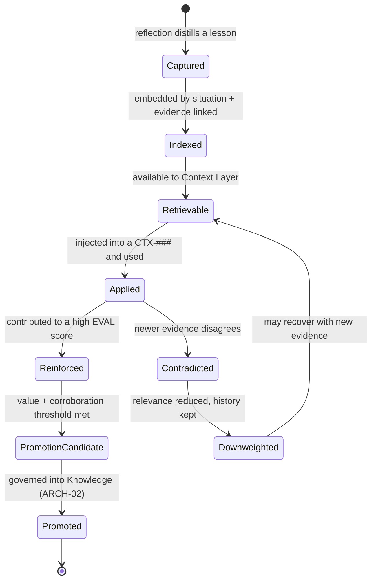
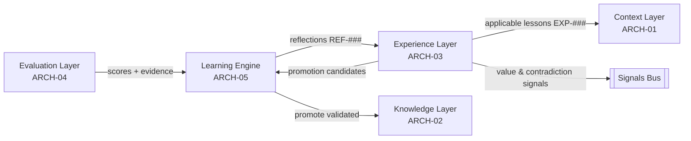

# Experience Layer

> Part of the **Enterprise Cognitive Layer (ECL)** — the reusable intelligence
> architecture for Enterprise AI Workers in EnterpriseSim.

| Field | Value |
|---|---|
| Document | `ARCH-03` |
| Layer | **Experience Layer** |
| Knowledge Class | `KN` (architecture knowledge) |
| Version | `1.0.0` |
| Status | Authoritative |
| Canon Reference | `CANON-001` §9 (Enterprise Worker Lifecycle, Stage 7) |
| Owner | Architecture Office (`TEAM-090`) |
| Contributors | AI Engineering (`TEAM-070`) |

---

## Purpose

The **Experience Layer** is the enterprise's ever-growing memory of *what it has learned by
doing*. It answers *"what has MCG learned from performing this kind of work before?"*

It embodies the ECL principle:

> **Experience accumulates forever.**

A stateless LLM cannot remember that last quarter a pricing change during a promotion window
caused a cache-invalidation incident. The Experience Layer can. It stores **distilled,
reusable, situation-linked lessons** (`EXP-###`) produced by the Learning Engine (`ARCH-05`)
from real executions, and serves them back into future context assembly (`ARCH-01`), closing
the improvement loop.

Experience is the difference between an organization that repeats its mistakes and one that
compounds its competence. Unlike Knowledge (`ARCH-02`), which is *governed truth authored
deliberately*, Experience is *earned* — it is the sediment of execution, evaluation and
reflection. High-value experiences may eventually be **promoted into Knowledge**; the rest
remain available as retrievable, evidence-linked lessons.

---

## Responsibilities

1. **Persist lessons** as identified, immutable `EXP-###` objects, each tied to the
   situation that produced it and the evidence that supports it.
2. **Preserve traceability** — every experience links to its originating execution
   (`PR-####`, `INC-####`), evaluation (`EVAL-###`) and reflection (`REF-###`).
3. **Index for situational retrieval** — make experiences findable by *situation similarity*
   (this task resembles that past task), not just keyword.
4. **Score applicability** — estimate how relevant a past lesson is to a current situation.
5. **Accumulate monotonically** — experience is append-only; lessons are refined by adding
   new evidence, never silently erased.
6. **Surface promotion candidates** — flag high-value, repeatedly-validated experiences to
   the Learning Engine for promotion into Knowledge (`ARCH-02`).
7. **Decay gracefully** — down-weight (never delete) experiences contradicted by newer
   evidence, preserving the full learning history.

---

## Inputs

| Input | Source | Description |
|---|---|---|
| Reflections | Learning Engine (`ARCH-05`) | `REF-###` reasoning about why an outcome occurred. |
| Evaluation results | Evaluation Layer (`ARCH-04`) | `EVAL-###` scores and evidence that ground a lesson. |
| Execution artifacts | Execution runtime | The `PR-####` / `INC-####` / `TR-####` the lesson came from. |
| Retrieval queries | Context Layer (`ARCH-01`) | Situation descriptors seeking applicable lessons. |
| Contradiction signals | Knowledge Layer / live state | Evidence that an old lesson no longer holds. |

---

## Outputs

| Output | Consumer | Description |
|---|---|---|
| Applicable experiences | Context Layer (`ARCH-01`) | Ranked `EXP-###` lessons for the current situation. |
| Promotion candidates | Learning Engine (`ARCH-05`) → Knowledge | High-value lessons ready to become truth. |
| Experience signals | Signals bus | Applied-count, hit rate, contradiction rate, value scores. |
| Lineage | Evaluation, audit | Full trace from lesson back to the execution that produced it. |

---

## Signals

- **Application frequency** — how often each experience is injected into contexts.
- **Outcome lift** — do executions that used an experience score higher on `EVAL-###` than
  comparable ones that did not? (The core measure of an experience's *value*.)
- **Contradiction rate** — how often newer evidence disagrees with a stored lesson.
- **Promotion readiness** — lessons whose value and corroboration cross the promotion bar.
- **Coverage of situations** — which recurring task shapes have (or lack) accumulated
  experience, guiding where the organization is still naïve.

---

## Lifecycle



Note the two "forever" guarantees: **Downweighted** experiences are retained (never deleted),
and **Promoted** experiences remain in the Experience Layer for traceability even after their
lesson is folded into Knowledge.

---

## Relationships



- **Fed by** the Learning Engine (which distills reflections into experiences).
- **Serves** the Context Layer with situationally-relevant lessons.
- **Graduates into** Knowledge via governed promotion.
- **Complements** Knowledge: experience is *what worked/failed*; knowledge is *what is true*.

---

## Confidence

Each experience carries an **applicability confidence** for a given situation and an
intrinsic **value confidence**:

- **Situation similarity** — how closely the current task matches the situation that
  produced the lesson (semantic + structural: same app? same task type? same failure class?).
- **Evidence strength** — number and quality of executions/evaluations backing the lesson.
- **Recency & non-contradiction** — recent corroboration raises confidence; contradictions
  lower it.
- **Outcome lift** — measured improvement when applied.

The Context Layer includes only experiences above an applicability floor and passes their
confidence forward so Decision Intelligence can weigh them appropriately.

---

## Failure Modes

| Failure | Symptom | Mitigation |
|---|---|---|
| **Overfitting to the past** | A narrow lesson applied to a superficially-similar but different situation. | Structural similarity, not just semantic; applicability floor; confidence caveats. |
| **Stale lesson** | An experience that no longer holds keeps being applied. | Contradiction detection → down-weighting; recency in scoring. |
| **Lesson sprawl** | Thousands of near-duplicate low-value lessons dilute retrieval. | Consolidation during reflection; value-based ranking; promotion prunes duplicates. |
| **Traceability loss** | A lesson with no link to its origin cannot be trusted or audited. | Lineage is mandatory at capture; no orphan experiences. |
| **Promotion without proof** | A lucky one-off becomes "knowledge." | Promotion requires repeated corroboration + governance (`ARCH-02`). |
| **Cold start** | New task type has zero experience; Worker has no memory to draw on. | Fall back to Knowledge; capture aggressively so the corpus warms up. |

---

## Future Evolution

- **Counterfactual experiences** — capture not only what happened but what *would* have
  prevented a failure (already hinted by dropped-context analysis in `ARCH-01`).
- **Cross-domain transfer** — recognize that a lesson learned by a QA Worker (flaky async
  tests) transfers to a Support Worker's tooling, enabling reuse across Worker types.
- **Experience clustering** — group lessons into higher-order "playbooks" that Decision
  Intelligence can invoke wholesale for recurring situations.
- **Decay models** — principled, domain-specific decay so fast-moving areas forget quickly
  and stable areas retain longer.
- **Value-weighted retrieval** — prioritize experiences with proven outcome lift.

---

## Best Practices

1. **Distill, don't dump.** An experience is a *lesson* ("when X, also do Y, because Z"),
   not a transcript.
2. **Link everything.** Every `EXP-###` traces to its execution, evaluation and reflection.
3. **Append, never erase.** Contradicted lessons are down-weighted with history intact.
4. **Score by value, not volume.** Rank by measured outcome lift, not recency alone.
5. **Match situations structurally.** "Same app + same failure class" beats "sounds similar."
6. **Promote with proof.** Only repeatedly-validated lessons graduate to Knowledge.
7. **Warm the cold start.** For new task types, capture generously; a young corpus is fragile.

---

## Examples

### Example A — A captured experience

```yaml
experience:
  id: EXP-090
  title: "Guest carts must not create loyalty accounts"
  situation:
    task_type: feature_change
    apps: [APP-003, APP-015]
    failure_class: unintended_side_effect
  lesson: >
    When implementing guest flows in Checkout (APP-003), ensure no code path
    provisions a Loyalty (APP-015) account. A prior change created orphaned
    loyalty accounts for guests, triggering a data-cleanup incident.
  evidence:
    origin_execution: PR-0207
    evaluation: EVAL-0044
    reflection: REF-0019
    prevented_regressions: [PR-0312]     # later reused to catch the same mistake
  value:
    application_frequency: 4
    outcome_lift: 0.23
    corroboration: strong
    contradiction_rate: 0.0
  status: promotion_candidate            # later folded into KN-045 rule #1
```

### Example B — Retrieval into context

For `CHK-1421` (guest checkout), the Context Layer queries the Experience Layer with the
situation `{task_type: feature_change, apps: [APP-003, APP-015]}`. `EXP-090` scores 0.91 on
applicability and is injected into `CTX-0118` (see `ARCH-01`, Example A). The Worker
consequently adds a test asserting no loyalty account is created for guests — *learning from
a mistake it never personally made*.

### Example C — Cross-domain transfer

A QA Worker's experience `EXP-142` ("async webhook tests need deterministic clocks or they
flake") is later retrieved by a **Support Worker** building automated case-triage tests over
`APP-017`. The situation similarity is structural (async + test determinism), and the lesson
transfers across Worker types with no change to the Experience Layer — an example of the
ECL's reusability guarantee (`ARCH-07`).
