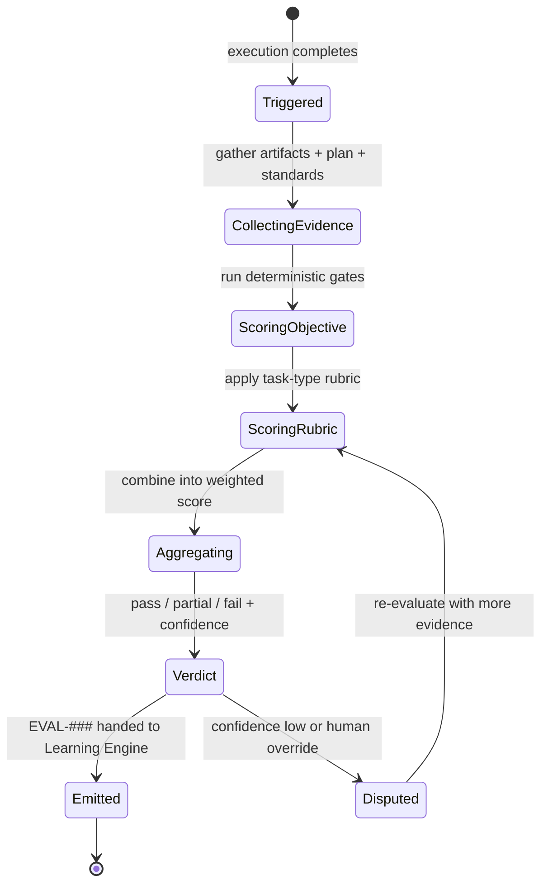
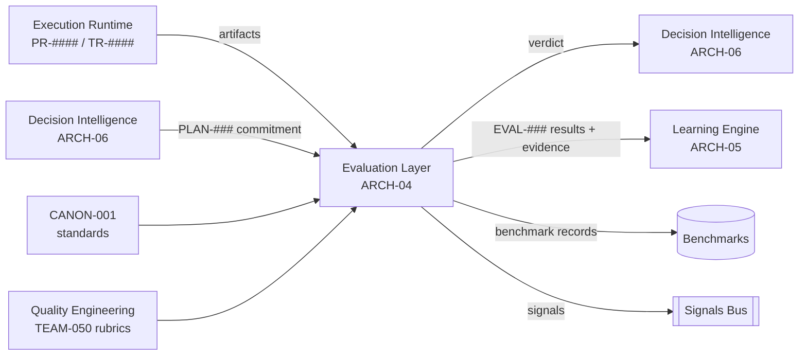

# Evaluation Layer

> Part of the **Enterprise Cognitive Layer (ECL)** — the reusable intelligence
> architecture for Enterprise AI Workers in EnterpriseSim.

| Field | Value |
|---|---|
| Document | `ARCH-04` |
| Layer | **Evaluation Layer** |
| Knowledge Class | `KN` (architecture knowledge) |
| Version | `1.0.0` |
| Status | Authoritative |
| Canon Reference | `CANON-001` §9 (Enterprise Worker Lifecycle, Stage 5) |
| Owner | Architecture Office (`TEAM-090`) |
| Contributors | AI Engineering (`TEAM-070`), Quality Engineering (`TEAM-050`) |

---

## Purpose

The **Evaluation Layer** renders structured, evidence-linked judgment on a Worker's work. It
answers *"how good was this execution, by objective, repeatable criteria?"*

It embodies the ECL principle:

> **Evaluation measures Worker quality.**

Evaluation is what makes EnterpriseSim a *benchmark* rather than a demo. It compares what the
Worker actually did (`Execution`) against what it committed to do (`PLAN-###`) and against
MCG's standards (`CANON-001`), and produces a scored verdict (`EVAL-###`) with evidence. That
verdict is the substrate for two things: **benchmarking** Workers against each other and over
time, and **learning** — every reflection and experience is grounded in an evaluation.

Crucially, evaluation is **multi-signal and largely deterministic**. It leans on objective
gates (tests passed, CI green, coverage met, dependency graph respected) before it leans on
subjective or model-assisted judgment, and every subjective judgment is evidence-linked and
reproducible.

---

## Responsibilities

1. **Score executions** against the plan (`PLAN-###`) and MCG standards (`CANON-001` §4, §8).
2. **Aggregate objective signals** — test pass/fail (`TR-####`), coverage, CI gate results,
   security findings, performance budgets, contract compatibility.
3. **Apply rubrics** — per-task-type scoring rubrics owned with Quality Engineering,
   producing comparable, repeatable scores.
4. **Attach evidence** — every score line links to the concrete artifact that justifies it.
5. **Emit verdicts with confidence** — pass / partial / fail, plus a confidence in the
   judgment itself.
6. **Feed learning** — hand results to the Learning Engine (`ARCH-05`) so reflections and
   experiences are grounded in measured outcomes.
7. **Support benchmarking** — persist results so Worker quality can be tracked across tasks,
   versions and Worker implementations.

---

## Inputs

| Input | Source | Description |
|---|---|---|
| Execution artifacts | Execution runtime | `PR-####`, diffs, commits, `TR-####` test runs, incident actions. |
| Plan | Decision Intelligence (`ARCH-06`) | `PLAN-###` — the commitment being evaluated. |
| Context provenance | Context Layer (`ARCH-01`) | What the Worker was given to reason over. |
| Standards & rubrics | `CANON-001`, Quality Engineering (`TEAM-050`) | The bar the work is measured against. |
| Objective gate results | CI/CD, TestRail, security scanners | Deterministic pass/fail signals. |
| Model-assisted judgments | Model Gateway (`ARCH-07`) | For rubric items requiring qualitative assessment (evidence-linked). |

---

## Outputs

| Output | Consumer | Description |
|---|---|---|
| Evaluation object `EVAL-###` | Learning Engine (`ARCH-05`), benchmarks | Scored, evidence-linked verdict. |
| Pass/partial/fail verdict | Decision Intelligence (`ARCH-06`) | Drives retry / escalate / accept decisions. |
| Benchmark records | `benchmarks/` (future folder) | Comparable scores across Workers and time. |
| Evaluation signals | Signals bus | Score distributions, gate failure rates, rubric coverage. |

---

## Signals

- **Gate failure rate** — which objective gates most often fail (tests, coverage, security).
- **Plan adherence** — how closely execution matched the committed plan.
- **Standards violations** — dependency-direction breaks, missing rollback plans, API-rule
  breaches, PCI-boundary violations.
- **Score distribution** — per task type, over time, per Worker implementation.
- **Judgment confidence** — how certain the evaluation is (objective-heavy = high).
- **Regression detection** — did this execution reintroduce a previously-fixed defect?

---

## Lifecycle



---

## Relationships



- **Judges** execution against the plan and standards.
- **Informs** Decision Intelligence (retry/accept) in-loop.
- **Grounds** the Learning Engine's reflections and experiences.
- **Enables** benchmarking across Workers and time.

---

## Confidence

The Evaluation Layer reports **two** confidences that must not be conflated:

1. **Outcome confidence** — how good the work is (the score itself: did it pass gates and
   rubric?).
2. **Judgment confidence** — how *certain the evaluation is* about that score. Objective,
   deterministic gates yield high judgment confidence; model-assisted qualitative rubric
   items yield lower judgment confidence and always carry linked evidence.

When judgment confidence is low (e.g., a subjective "is this well-designed?" item), the
verdict is marked *provisional* and may be routed to human review. **Evaluation never
launders a low-confidence guess as a high-confidence score.**

---

## Failure Modes

| Failure | Symptom | Mitigation |
|---|---|---|
| **Gaming the metric** | Worker optimizes the score, not the outcome (e.g., trivial tests for coverage). | Multi-signal rubrics; mutation/contract tests; human spot-audits. |
| **Rubric drift** | Rubrics diverge from real quality over time. | Rubrics owned by QE, versioned, reviewed against incidents. |
| **Judge bias / hallucination** | Model-assisted judgments are inconsistent or fabricated. | Evidence-linking mandatory; deterministic gates weighted first; low judgment-confidence flagged. |
| **Evidence gaps** | A score with no linked artifact — unauditable. | No score without evidence; missing evidence lowers judgment confidence. |
| **False pass** | Passes gates but is wrong (missed a standard). | Standards checks explicit (dependency graph, rollback, PCI); regression checks. |
| **Non-reproducibility** | Same execution scores differently on re-run. | Deterministic gates; fixed rubric versions; seed control for model-assisted steps. |

---

## Future Evolution

- **Adversarial evaluation** — a "red-team" evaluator that actively tries to break the
  Worker's output, hardening the benchmark.
- **Comparative benchmarking harness** — standardized task suites (`benchmarks/`) scoring
  many Worker implementations on identical MCG tasks, model-agnostically.
- **Calibrated judges** — track model-assisted judgment accuracy against human ground truth
  and re-weight accordingly.
- **Continuous quality baselines** — per-task-type score baselines that ratchet upward as the
  organization (and its Workers) improve, per CANON's continuous-improvement flywheel.
- **Cost- and latency-aware scoring** — evaluate not just correctness but efficiency of the
  Worker's reasoning (calls, tokens, time).

---

## Best Practices

1. **Objective first, subjective last.** Weight deterministic gates above model judgments.
2. **No score without evidence.** Every line item links to the artifact that proves it.
3. **Separate the two confidences.** Outcome quality ≠ certainty of the judgment.
4. **Version the rubric.** Comparable benchmarking requires stable, versioned criteria.
5. **Check standards explicitly.** Dependency direction, rollback, API rules, PCI — these are
   canon and must be evaluated, not assumed.
6. **Guard against gaming.** Assume the metric will be optimized; design multi-signal rubrics.
7. **Make it reproducible.** A benchmark that isn't reproducible isn't a benchmark.

---

## Examples

### Example A — An evaluation object

```yaml
evaluation:
  id: EVAL-0061
  execution: PR-0312               # mcg-checkout-service#312
  plan: PLAN-0072
  task: CHK-1421
  rubric: { id: RUBRIC-feature-change, version: 3 }
  objective:
    - { gate: unit_tests,      result: pass,  evidence: TR-0442, weight: 0.25 }
    - { gate: coverage,        result: pass,  value: 0.84, threshold: 0.80, evidence: TR-0442, weight: 0.15 }
    - { gate: contract_tests,  result: pass,  evidence: TR-0443, weight: 0.15 }
    - { gate: security_scan,   result: pass,  evidence: "scan-9f2", weight: 0.15 }
    - { gate: dependency_rule, result: pass,  note: "no reverse dep APP-012->APP-003", weight: 0.10 }
    - { gate: rollback_plan,   result: pass,  evidence: "PR body", weight: 0.05 }
  rubric_items:
    - { item: "guest flow avoids APP-015 side effect", result: pass, evidence: "test GuestNoLoyaltyTest", judgment_confidence: 0.98 }
    - { item: "code clarity / maintainability", result: partial, evidence: "reviewer notes", judgment_confidence: 0.62 }
  verdict: { outcome: pass, score: 0.91, outcome_confidence: 0.90, judgment_confidence: 0.88 }
  regression_check: { reintroduced_defect: false, checked_against: [EXP-090] }
```

### Example B — Catching a standards violation

A Worker's PR passes all tests but introduces a call from Payments (`APP-012`) into Checkout
(`APP-003`) — a **reverse dependency** forbidden by `CANON-001` §3. The objective
`dependency_rule` gate fails; the verdict is `fail` despite green tests. Decision Intelligence
(`ARCH-06`) routes it back for rework. This is why standards are evaluated explicitly.

### Example C — Domain-agnostic rubric

A **Finance Worker** reconciling ledger entries is scored by `RUBRIC-reconciliation` (balance
correctness, audit-trail completeness, policy adherence) using the **same Evaluation Layer**.
Only the rubric differs; the machinery — objective-first, evidence-linked, dual-confidence —
is identical. This reusability is what lets EnterpriseSim benchmark *any* Worker type
(`ARCH-07`).
