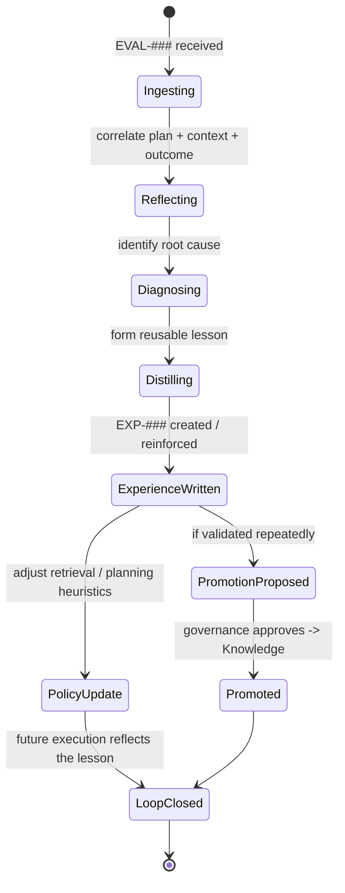
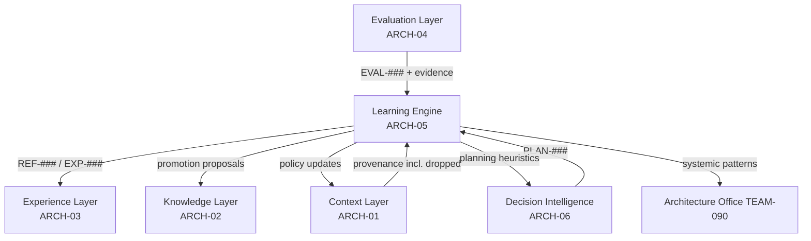

# Learning Engine

> Part of the **Enterprise Cognitive Layer (ECL)** — the reusable intelligence
> architecture for Enterprise AI Workers in EnterpriseSim.

| Field | Value |
|---|---|
| Document | `ARCH-05` |
| Layer | **Learning Engine** (Reflection + Learning) |
| Knowledge Class | `KN` (architecture knowledge) |
| Version | `1.0.0` |
| Status | Authoritative |
| Canon Reference | `CANON-001` §9 (Enterprise Worker Lifecycle, Stages 6 & 8) |
| Owner | Architecture Office (`TEAM-090`) |
| Contributors | AI Engineering (`TEAM-070`) |

---

## Purpose

The **Learning Engine** is the machinery of improvement. It turns *outcomes* into *lessons*
and *lessons* into *better future behavior*. It answers two questions:
*"why did this happen?"* (Reflection) and *"what should change so we do better next time?"*
(Learning).

It embodies two ECL principles:

> **Reflection improves future planning.**
>
> **Learning exists outside the model.**

This second principle is the architectural crux of EnterpriseSim. The LLM's weights do not
change. Improvement does **not** come from fine-tuning; it comes from the Learning Engine
converting evaluated executions into durable artifacts — reflections (`REF-###`),
experiences (`EXP-###`), and promoted knowledge (`KN-###`) — that reshape *what future
Workers are given to reason over*. A better Worker tomorrow is the same stateless model with
a better Context assembled from a richer Knowledge and Experience base. That is why the
architecture is **model-agnostic and improves anyway** (see `ARCH-07`).

The Learning Engine is the hinge of CANON's **Continuous Improvement** flywheel: it takes
Evaluation output and feeds Experience and Knowledge, raising the baseline for every future
task.

---

## Responsibilities

1. **Reflect** — reason over an evaluated execution to explain *why* the outcome occurred:
   what worked, what failed, what context was missing, where the plan was wrong.
2. **Distill experiences** — convert reflections into reusable, situation-linked `EXP-###`
   lessons for the Experience Layer (`ARCH-03`).
3. **Diagnose root causes** — connect failures to their true origin (missing knowledge,
   dropped context, flawed plan, tool error) rather than surface symptoms.
4. **Propose promotions** — surface repeatedly-validated experiences for governed promotion
   into Knowledge (`ARCH-02`).
5. **Improve policies** — update retrieval strategies, planning heuristics and context
   templates that Decision Intelligence (`ARCH-06`) and the Context Layer (`ARCH-01`) use.
6. **Detect systemic patterns** — aggregate across many executions to find organization-level
   lessons (e.g., "promotion-window changes repeatedly cause cache incidents").
7. **Close the loop** — ensure every lesson actually changes a future execution, or it is not
   learning.

---

## Inputs

| Input | Source | Description |
|---|---|---|
| Evaluation results | Evaluation Layer (`ARCH-04`) | `EVAL-###` verdicts + evidence — the grounding for all learning. |
| Execution artifacts | Execution runtime | The `PR-####` / `INC-####` / `TR-####` under reflection. |
| Context provenance | Context Layer (`ARCH-01`) | What was retrieved, and critically, what was *dropped*. |
| Plans | Decision Intelligence (`ARCH-06`) | `PLAN-###` — to compare intent vs. outcome. |
| Prior experience | Experience Layer (`ARCH-03`) | Existing lessons to reinforce, refine or contradict. |
| Signals | Signals bus | Cross-cutting telemetry from every layer. |

---

## Outputs

| Output | Consumer | Description |
|---|---|---|
| Reflection object `REF-###` | Experience Layer, audit | Structured "why" analysis of an execution. |
| Experience object `EXP-###` | Experience Layer (`ARCH-03`) | Distilled, reusable lesson. |
| Promotion proposals | Knowledge Layer governance (`ARCH-02`) | Lessons ready to become durable truth. |
| Policy updates | Context Layer, Decision Intelligence | Improved retrieval templates & planning heuristics. |
| Systemic-pattern reports | Architecture Office (`TEAM-090`) | Organization-level lessons and standards proposals. |

---

## Signals

- **Loop-closure rate** — fraction of lessons that measurably changed a later execution.
- **Root-cause accuracy** — do fixes derived from reflections prevent recurrence?
- **Reflection latency** — how quickly outcomes become available lessons.
- **Promotion throughput** — lessons graduating to Knowledge per period.
- **Regression prevention** — recurrences avoided because an experience was applied.
- **Policy-improvement lift** — measured `EVAL-###` improvement after a policy update.

---

## Lifecycle



The terminal state is **LoopClosed**, not "lesson written." A lesson that never changes
future behavior is, by definition, not learning — the Learning Engine measures itself on
loop closure.

---

## Relationships



The Learning Engine touches **every other layer** — it is the ECL's mechanism of change. It
reads Evaluation and Context provenance; it writes Experience and (via governance) Knowledge;
and it tunes the Context and Decision Intelligence policies.

---

## Confidence

The Learning Engine expresses confidence at two points:

- **Root-cause confidence** — how certain the diagnosis is. A failure with a single clear
  cause (a dropped context item that contained the answer) is high-confidence; a diffuse
  failure is low, and produces a *hypothesis* lesson flagged for corroboration.
- **Lesson confidence** — how broadly a distilled lesson should apply. New lessons start
  narrow and low-confidence; they gain confidence only through repeated corroboration in the
  Experience Layer (`ARCH-03`) before promotion is proposed.

Low-confidence lessons are still captured — but they are marked provisional and are **not**
promoted to Knowledge until proven. This prevents one-off luck or coincidence from becoming
enterprise truth.

---

## Failure Modes

| Failure | Symptom | Mitigation |
|---|---|---|
| **Hindsight bias** | Reflection rationalizes the outcome instead of finding the real cause. | Ground every claim in evaluation evidence and context provenance. |
| **Symptom fixation** | Fixes the surface error, not the root cause; failure recurs. | Root-cause discipline; measure regression prevention. |
| **Over-generalization** | A narrow lesson promoted as broad truth. | Narrow-start lessons; corroboration bar before promotion. |
| **Open loop** | Lessons written but never applied; no improvement. | Loop-closure metric; policy updates that actually alter retrieval/planning. |
| **Learning lag** | Reflection too slow to help near-term tasks. | Reflection latency signal; asynchronous but bounded. |
| **Feedback poisoning** | Bad evaluations produce bad lessons. | Depends on Evaluation integrity (`ARCH-04`); low judgment-confidence inputs discounted. |
| **Catastrophic forgetting avoided** | (Non-failure) unlike fine-tuning, learning here is additive and reversible. | Append-only experience; governed promotion; full lineage. |

---

## Future Evolution

- **Automated policy search** — systematically trial retrieval/planning variations and keep
  those with proven `EVAL-###` lift (offline, evidence-grounded — not weight updates).
- **Meta-learning** — learn *how to learn faster*: which reflection strategies most reliably
  find root causes.
- **Cross-Worker curriculum** — sequence lessons so new Worker types warm-start from the
  accumulated experience of others.
- **Causal graphs of incidents** — link `INC-####` → cause → lesson → prevention, making the
  organization's failure memory queryable.
- **Human-in-the-loop reflection** for high-stakes lessons before promotion.

---

## Best Practices

1. **Learning lives outside the model.** Improve the inputs (Knowledge, Experience, Context,
   policies), never rely on retraining the LLM.
2. **Root cause, not symptom.** A lesson that fixes the symptom guarantees a recurrence.
3. **Close the loop or it isn't learning.** Measure whether lessons change future executions.
4. **Start narrow, promote on proof.** Confidence is earned through corroboration.
5. **Inspect what was dropped.** The most common failure cause is a context item that was
   available but excluded — always check the dropped-candidate log (`ARCH-01`).
6. **Keep full lineage.** Reflection → experience → knowledge must be traceable end to end.
7. **Additive and reversible.** Because learning is data, not weights, it can be audited,
   corrected and rolled back — a core safety property.

---

## Examples

### Example A — A reflection object

```yaml
reflection:
  id: REF-0019
  evaluation: EVAL-0044            # a FAILED earlier attempt at guest checkout
  execution: PR-0207
  plan: PLAN-0051
  what_happened: >
    Guest checkout implementation created a Loyalty (APP-015) account for every
    guest order, producing orphaned accounts. Tests passed because none asserted
    the negative case.
  root_cause:
    category: missing_experience_and_test_gap
    detail: >
      No prior experience warned about the APP-003 -> APP-015 side effect, and
      the plan did not include a negative assertion. Context CTX-0091 did NOT
      include the loyalty domain rules (dropped for budget).
    confidence: 0.88
  lessons:
    - create_experience: EXP-090   # "guest carts must not create loyalty accounts"
  policy_updates:
    - context: "for APP-003 feature changes, always retrieve APP-015 domain rules (raise priority)"
    - planning: "feature-change plans must include negative-side-effect assertions"
  loop_closed_by: PR-0312          # later guest-checkout attempt applied EXP-090 and passed
```

### Example B — Closing the flywheel

The reflection above produced `EXP-090` and two policy updates. On the *next* guest-checkout
task (`CHK-1421`), the Context Layer — following the new policy — retrieved the loyalty rules
and injected `EXP-090`; the plan included the negative assertion; the execution (`PR-0312`)
passed with `EVAL-0061` = 0.91. **The same stateless model succeeded where it had failed,
purely because the ECL had learned.** This is the entire thesis of EnterpriseSim in one loop.

### Example C — Systemic pattern

Across a quarter, the Learning Engine notices three incidents (`INC-2026-007`, `-011`,
`-018`) all trace to promotion-window pricing changes not flushing the `APP-008` cache. It
raises a systemic-pattern report to the Architecture Office, which results in a new
`KN-###` runbook and a standing pre-release check — an organization-level improvement, not
just a per-task one.
