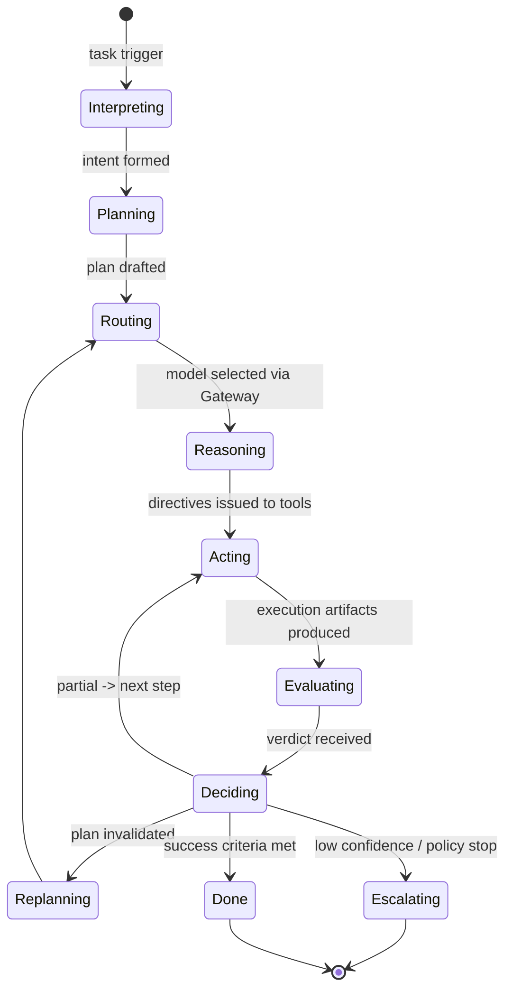
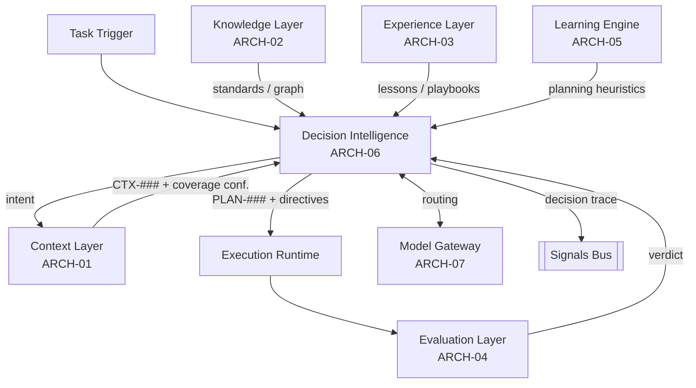

# Decision Intelligence

> Part of the **Enterprise Cognitive Layer (ECL)** — the reusable intelligence
> architecture for Enterprise AI Workers in EnterpriseSim.

| Field | Value |
|---|---|
| Document | `ARCH-06` |
| Layer | **Decision Intelligence** (orchestration + planning) |
| Knowledge Class | `KN` (architecture knowledge) |
| Version | `1.0.0` |
| Status | Authoritative |
| Canon Reference | `CANON-001` §9 (Enterprise Worker Lifecycle, Stages 3 & orchestration) |
| Owner | Architecture Office (`TEAM-090`) |
| Contributors | AI Engineering (`TEAM-070`) |

---

## Purpose

**Decision Intelligence (DI)** is the orchestrator of the ECL — the control plane that
sequences every other layer into a coherent act of work. It answers *"given the goal and
what we know, what should the Worker do next, and are we done?"*

It embodies the ECL principle:

> **Decision Intelligence orchestrates reasoning.**

If the LLM is the *reasoning engine* and the other layers are *memory and judgment*, DI is
the *executive function*. It interprets the task into intent, requests context, forms plans
(`PLAN-###`), routes reasoning to a model through the Gateway, drives execution through
tools, consumes evaluation, and decides whether to continue, retry, escalate, or stop. It is
also where **model routing** and **confidence-based control** live — the components that keep
the architecture model-agnostic and safe.

DI is deliberately the *only* layer that "decides." The Context Layer assembles, the
Knowledge Layer knows, the Evaluation Layer judges, the Learning Engine improves — but DI
**chooses**. Concentrating agency in one inspectable orchestrator is what makes Worker
behavior auditable and benchmarkable.

---

## Responsibilities

1. **Interpret intent** — turn a task trigger (`CHK-1421`, `INC-2026-007`) into a structured
   goal with constraints and success criteria.
2. **Plan** — produce an explicit, ordered `PLAN-###`: steps, target artifacts, tests, and a
   rollback strategy, consistent with `CANON-001`.
3. **Orchestrate the loop** — sequence Context → (reason) → Execute → Evaluate, iterating
   until success criteria are met or a stop condition fires.
4. **Route models** — select an appropriate model/provider via the Model Gateway (`ARCH-07`)
   based on task difficulty, cost, latency and capability — without any provider-specific
   logic leaking into the layers.
5. **Manage confidence & control** — decide, from layer confidences, whether to proceed,
   re-retrieve, replan, retry, escalate to a human, or abort.
6. **Enforce policy** — apply guardrails: approval requirements, PCI boundaries, change-risk
   tiers (`CANON-001` §4, §7) before allowing execution.
7. **Emit the decision trace** — record every choice and its rationale for evaluation,
   reflection and audit.

---

## Inputs

| Input | Source | Description |
|---|---|---|
| Task trigger | Enterprise (Jira / incident / review) | The unit of work with its canonical ID. |
| Context object | Context Layer (`ARCH-01`) | `CTX-###` working set + coverage confidence. |
| Knowledge graph views | Knowledge Layer (`ARCH-02`) | Standards, dependency graph, policies. |
| Applicable experience | Experience Layer (`ARCH-03`) | Lessons and playbooks for the situation. |
| Evaluation verdicts | Evaluation Layer (`ARCH-04`) | In-loop pass/partial/fail to steer next step. |
| Planning heuristics | Learning Engine (`ARCH-05`) | Improved planning policies from past reflection. |
| Model capabilities | Model Gateway (`ARCH-07`) | Available models, windows, tool-calling, cost/latency. |

---

## Outputs

| Output | Consumer | Description |
|---|---|---|
| Task intent | Context Layer (`ARCH-01`) | Structured goal driving retrieval. |
| Plan `PLAN-###` | Execution, Evaluation (`ARCH-04`) | The commitment to be executed and judged. |
| Execution directives | Execution runtime | Which tool actions to take, in order. |
| Control decisions | All layers | Proceed / re-retrieve / replan / retry / escalate / abort. |
| Model-routing decisions | Model Gateway (`ARCH-07`) | Which model handles which reasoning step. |
| Decision trace | Evaluation, Learning Engine, audit | Every choice + rationale + confidence. |

---

## Signals

- **Plan quality** — downstream `EVAL-###` scores of executions from each plan shape.
- **Replan rate** — how often plans are revised mid-task (high = poor initial planning or
  volatile context).
- **Escalation rate** — how often DI hands off to humans, and why.
- **Routing efficiency** — cost/latency/quality trade-off achieved by model selection.
- **Control-decision accuracy** — were proceed/retry/abort calls vindicated by outcomes?
- **Guardrail activations** — how often policy stopped an unsafe action.

---

## Lifecycle



---

## Relationships



DI sits at the center: it pulls from Context, Knowledge and Experience; pushes to Execution;
consumes Evaluation; is tuned by the Learning Engine; and brokers all model access through
the Gateway. It is the **only** layer with agency.

---

## Confidence

DI computes an **overall decision confidence** by fusing the confidences reported by every
layer:

- **Context coverage confidence** (`ARCH-01`) — is the working set sufficient?
- **Knowledge authority** (`ARCH-02`) — is the guiding truth solid or provisional?
- **Experience applicability** (`ARCH-03`) — do proven lessons apply?
- **Evaluation confidence** (`ARCH-04`) — how certain is the in-loop judgment?

This fused confidence drives **control**:

| Confidence | Action |
|---|---|
| High | Proceed autonomously. |
| Medium | Re-retrieve / replan to raise confidence before acting. |
| Low | Escalate to a human, or abort with a clear explanation. |
| Policy-blocked | Stop regardless of confidence (e.g., PCI boundary, missing required approval). |

**DI never acts on high-stakes changes at low confidence.** Confidence-gated autonomy is the
safety backbone of the ECL.

---

## Failure Modes

| Failure | Symptom | Mitigation |
|---|---|---|
| **Overconfident autonomy** | Acts on a bad plan without escalating. | Fused confidence gating; hard policy stops; human-in-the-loop thresholds. |
| **Analysis paralysis** | Endless re-retrieval/replanning, never acts. | Iteration budgets; diminishing-returns detection; escalate on stall. |
| **Plan/execution divergence** | Executes something other than the plan. | Evaluation checks plan adherence (`ARCH-04`); DI reconciles or replans. |
| **Poor routing** | Uses an over-powered/expensive model for trivial work, or vice-versa. | Difficulty estimation; routing signals; cost/latency-aware policy. |
| **Guardrail bypass** | High-risk change proceeds without required approval. | Policy enforced *before* execution; approvals from `CANON-001` §7 mandatory. |
| **Opaque decisions** | Cannot explain why the Worker did what it did. | Mandatory decision trace with rationale + confidence for every choice. |
| **Provider coupling** | Routing logic leaks vendor specifics into the loop. | All model access via the Gateway's stable contract (`ARCH-07`). |

---

## Future Evolution

- **Learned planners** — planning heuristics continuously improved by the Learning Engine,
  specialized per task type.
- **Playbook invocation** — recognize a recurring situation and invoke a validated
  experience-cluster playbook (`ARCH-03`) instead of planning from scratch.
- **Multi-Worker orchestration** — DI coordinating several specialized Workers (e.g., a
  Security Worker and a QA Worker) on one complex task, with hand-offs and shared context.
- **Risk-adaptive autonomy** — autonomy thresholds that tighten for Tier 0/PCI changes and
  relax for low-risk internal ones, per `CANON-001` criticality tiers.
- **Cost-aware reasoning budgets** — plan the *reasoning* itself (how many calls/tokens a task
  merits) as an explicit optimization.

---

## Best Practices

1. **Concentrate agency.** Only DI decides; every other layer serves. This keeps behavior
   auditable.
2. **Plan explicitly, then evaluate against the plan.** A plan is a testable commitment.
3. **Gate autonomy on fused confidence.** Never take high-stakes action at low confidence.
4. **Enforce policy before acting.** Approvals, PCI boundaries and risk tiers are hard gates,
   not suggestions.
5. **Route, don't couple.** Choose models by capability/cost/latency through the Gateway;
   keep vendor specifics out of the loop.
6. **Trace every decision.** No unexplained actions — reflection and audit depend on it.
7. **Budget the loop.** Bound iterations and reasoning cost; escalate on diminishing returns.

---

## Examples

### Example A — A plan object

```yaml
plan:
  id: PLAN-0072
  task: CHK-1421
  app: APP-003
  intent: "Add guest checkout without creating a Loyalty (APP-015) account."
  success_criteria:
    - "Guest can place an order end to end."
    - "No APP-015 account created for guests (negative test)."
    - "Idempotency preserved (KN-052)."
  steps:
    - { n: 1, action: "read PlaceOrder.java + guest-flow tests", tool: repo }
    - { n: 2, action: "implement guest path; guard APP-015 provisioning", tool: repo }
    - { n: 3, action: "add GuestNoLoyaltyTest (negative assertion)", tool: repo }
    - { n: 4, action: "run unit + contract tests", tool: ci, expect: TR-#### pass }
    - { n: 5, action: "open PR with rollback plan", tool: github }
  rollback: "Feature-flag guest checkout; disable flag to revert with no schema change."
  risk_tier: 0                       # Tier 0 service -> 2 approvals (CANON-001 §7)
  applied_experience: [EXP-090]
  routing: { model_class: "high-reasoning", reason: "Tier 0 change with subtle side-effect risk" }
```

### Example B — Confidence-gated control

Mid-task, the Evaluation Layer returns `partial` on step 4 (contract test fail against
`APP-012`). DI's fused confidence drops. Rather than force a fix blindly, DI requests
re-retrieval (Context adds the payments contract `KN-052`), replans step 2, and re-routes.
Only when fused confidence returns to *high* does it proceed to open the PR. Had confidence
stayed low on a PCI-adjacent change, DI would have **escalated to a human** per policy.

### Example C — Reusability across Workers

A **Recruitment Worker** screening candidates uses the *same* Decision Intelligence: it forms
a plan (source → screen → score → schedule), gates on confidence, enforces policy (bias/fairness
guardrails instead of PCI), and routes models by difficulty. Only the intent, tools, policies
and rubrics differ; the orchestration architecture is unchanged (`ARCH-07`).
