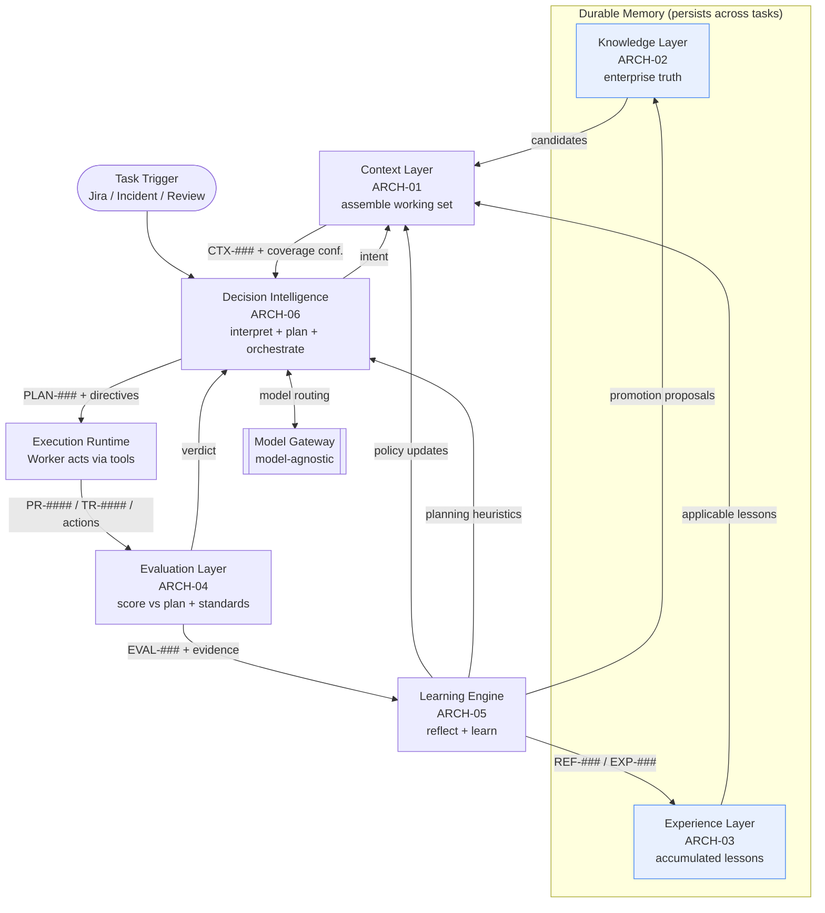
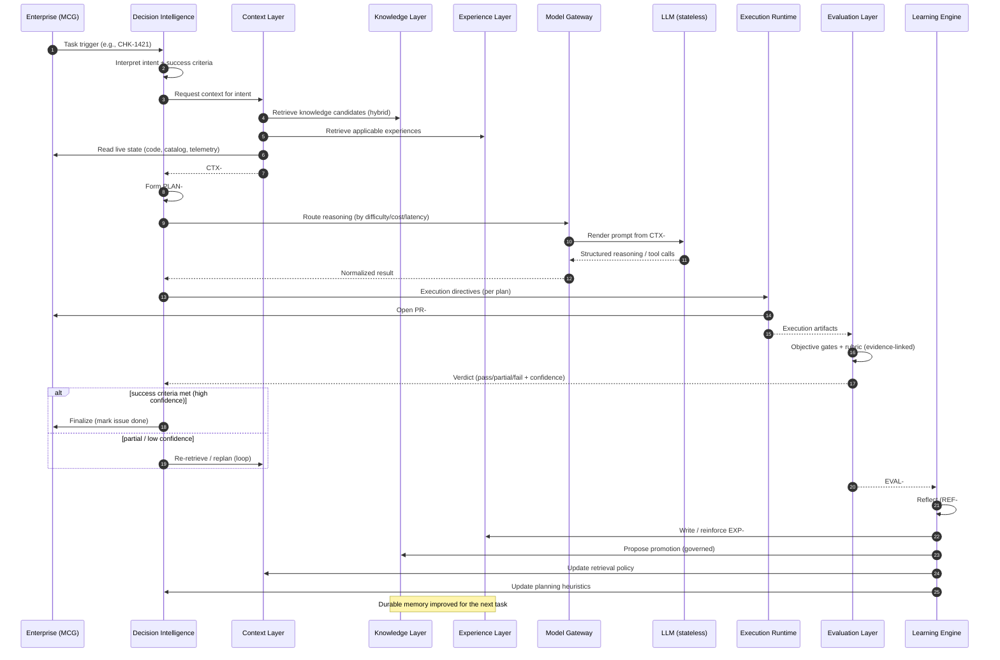
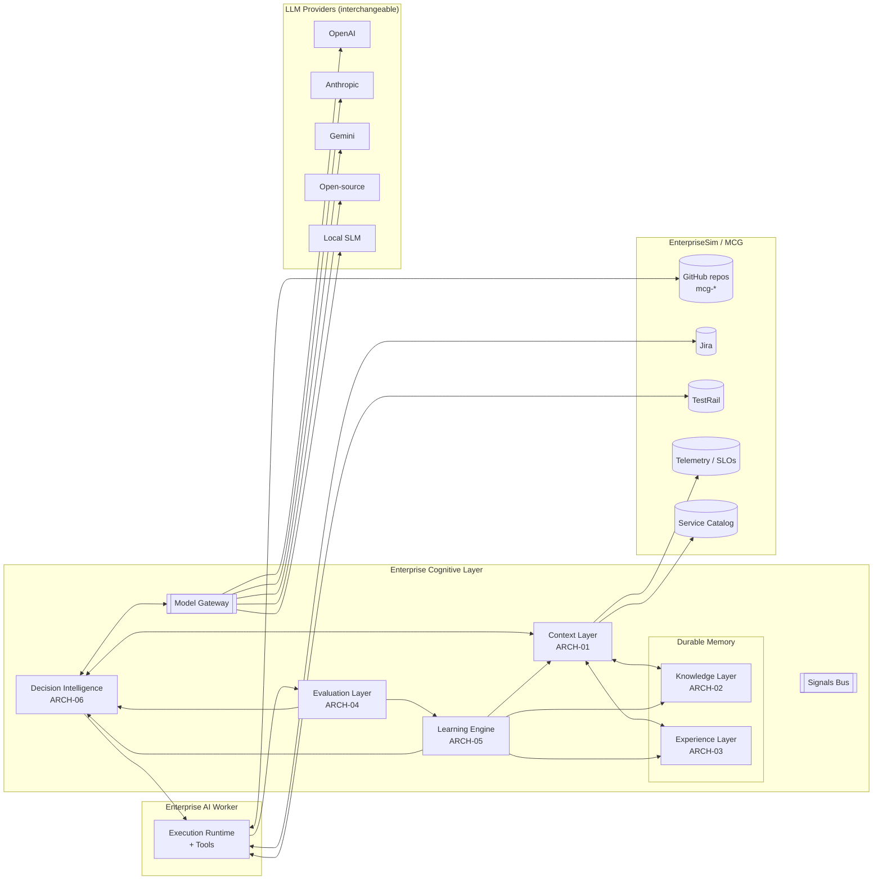
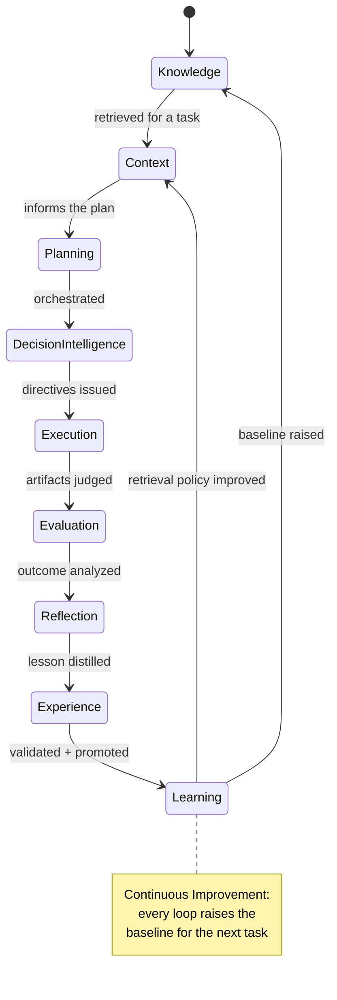
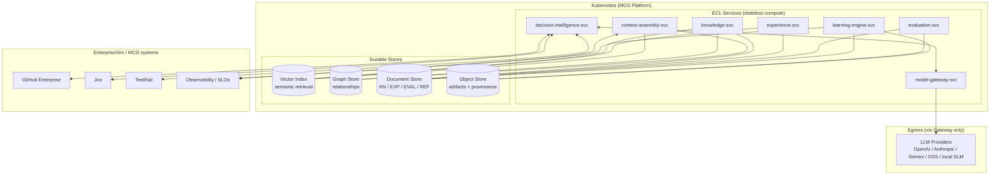
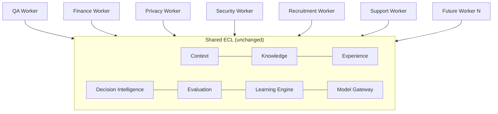

# Enterprise Cognitive Layer — Master Architecture

> The permanent architecture of **EnterpriseSim**. This document integrates the six ECL
> components (`ARCH-01`…`ARCH-06`) into one coherent system, defines the end-to-end
> information flow, proves the architecture's independence from any LLM vendor, and shows how
> it supports any future Enterprise Worker.

| Field | Value |
|---|---|
| Document | `ARCH-07` |
| Scope | **Enterprise Cognitive Layer (ECL) — whole system** |
| Knowledge Class | `KN` (architecture knowledge) |
| Version | `1.0.0` |
| Status | Authoritative |
| Canon Reference | `CANON-001` §8 (Architecture Principles), §9 (Enterprise Worker Lifecycle) |
| Owner | Architecture Office (`TEAM-090`) |
| Contributors | AI Engineering (`TEAM-070`), Platform Engineering (`PLAT`) |

---

## Purpose

The **Enterprise Cognitive Layer (ECL)** is the reusable intelligence architecture that every
Enterprise AI Worker in EnterpriseSim runs on. EnterpriseSim provides the *enterprise*
(Meridian Commerce Group, `CANON-001`); the ECL provides the *intelligence*.

The ECL exists to resolve a single hard fact:

> **The LLM is stateless.** It has no memory, no enterprise knowledge, no accumulated
> experience, and no ability to improve itself between calls.

Everything that makes a Worker *enterprise-grade* — knowing MCG's truth, remembering past
work, planning, being judged, and getting better — must therefore live **outside the model**.
The ECL is that "outside." It is the durable cognitive substrate around a stateless reasoning
engine.

This document is the canonical, permanent description of that substrate.

---

## The Six Components (and where each concept lives)

`CANON-001` §9 names nine concepts. The ECL realizes them across six components. This mapping
is authoritative:

| Concept (CANON §9) | ECL Home | Document | Nature |
|---|---|---|---|
| **Knowledge** | Knowledge Layer | `ARCH-02` | Durable enterprise truth |
| **Context** | Context Layer | `ARCH-01` | Ephemeral, per-execution |
| **Planning** | Decision Intelligence | `ARCH-06` | Produced per task (`PLAN-###`) |
| **Decision Intelligence** | Decision Intelligence | `ARCH-06` | Orchestration / control |
| **Execution** | Execution Runtime (Worker + tools) | *cross-cutting* | Acts on the enterprise |
| **Evaluation** | Evaluation Layer | `ARCH-04` | Measures quality |
| **Reflection** | Learning Engine | `ARCH-05` | Explains outcomes |
| **Experience** | Experience Layer | `ARCH-03` | Accumulates forever |
| **Learning** | Learning Engine | `ARCH-05` | Closes the improvement loop |

Two components are **durable memory** (Knowledge, Experience). One is **ephemeral memory**
(Context). Two are **judgment and improvement** (Evaluation, Learning Engine). One is the
**orchestrator** (Decision Intelligence). Execution is the Worker acting through real tools on
real MCG artifacts.

---

## Responsibilities (of the architecture as a whole)

1. Provide **durable enterprise memory** (Knowledge + Experience) independent of the model.
2. Assemble **the right context** for each task, and only for that task's duration.
3. **Orchestrate** the reasoning loop with confidence-gated, policy-enforced control.
4. **Measure** Worker quality objectively and reproducibly (benchmarking substrate).
5. **Learn** from every execution, improving future work without touching model weights.
6. Remain **completely model-agnostic** behind a single Model Gateway.
7. Be **domain-agnostic**, so any Enterprise Worker type reuses the same architecture.

---

## Inputs & Outputs (system boundary)

| System input | From | System output | To |
|---|---|---|---|
| Task trigger | MCG (Jira, incidents, reviews) | Executed artifacts (`PR-####`, `TR-####`, comments) | MCG repositories & tools |
| Enterprise state | Repos, service catalog, telemetry | Evaluation records (`EVAL-###`) | Benchmarks |
| Model capabilities | LLM providers (via Gateway) | Accumulated knowledge & experience | ECL durable stores |
| Human guidance | Engineers (on escalation) | Decision traces & signals | Audit & observability |

---

## Signals (system-level observability)

The ECL emits a unified **signals bus** consumed by observability and the Learning Engine:

- **Per-layer signals** as defined in `ARCH-01`…`ARCH-06` (coverage, staleness, gate
  failures, replan rate, loop-closure, etc.).
- **End-to-end task signals** — success rate, time-to-completion, reasoning cost (calls +
  tokens), escalation rate, autonomy rate.
- **Improvement signals** — the trend of `EVAL-###` scores over time per task type: the
  direct measurement of CANON's continuous-improvement flywheel.

---

## Lifecycle — the ECL loop end to end

This is the concrete realization of CANON §9's lifecycle. Every task traverses it.



The loop's defining property: **the durable memory (Knowledge + Experience) is richer at the
end of every task than at the start**, so the *next* task starts from a higher baseline —
without any change to the model.

---

## Detailed information flow

### End-to-end sequence (one task)



### Component view



### Concept lifecycle (state view)



### Deployment view

The ECL deploys as cloud-native services on the MCG platform (`CANON-001` §8, principle 4),
each independently scalable, with durable memory in managed stores. The model providers sit
**outside** the trust and architecture boundary, reached only through the Gateway.



---

## Relationships (how the components depend on each other)

- **Decision Intelligence** is the hub; it is the only component with agency.
- **Context Layer** depends on Knowledge and Experience (reads), and on the Model Gateway
  (budget); it is orchestrated by DI.
- **Knowledge** and **Experience** are the durable memory; the Learning Engine writes to both
  (Knowledge only via governance).
- **Evaluation** depends on Execution artifacts and the plan; it feeds DI (in-loop) and the
  Learning Engine (post-loop).
- **Learning Engine** touches every component — it is the mechanism of change.
- **Model Gateway** is depended upon by DI (routing) and Context (budget/rendering) and by
  nothing else — the single point of provider contact.

No component depends on a specific LLM provider. This is enforced structurally: only the
Model Gateway imports provider SDKs (see next section).

---

## How the architecture stays independent of any LLM vendor

Model-agnosticism is not a feature bolted on; it is a structural invariant. Four mechanisms
guarantee it:

1. **Single point of contact — the Model Gateway.** Every model call in the entire ECL goes
   through one component. No layer imports a provider SDK. Swapping OpenAI for Anthropic,
   Gemini, an open-source model, or a **local SLM** changes only a Gateway adapter — never a
   layer.

2. **Stable internal contract.** Layers speak the ECL's own vocabulary: *structured context
   in, structured result out*. The Context Layer stores a **structured context object**
   (`CTX-###`), not a provider prompt string. The Gateway *renders* that object into whatever
   prompt format a provider needs and *normalizes* the response back. Providers change; the
   contract does not.

   ```mermaid
   flowchart LR
       CTX[CTX-### structured context] --> MG{Model Gateway}
       MG -->|render + call| A[OpenAI adapter]
       MG -->|render + call| B[Anthropic adapter]
       MG -->|render + call| C[Gemini adapter]
       MG -->|render + call| D[OSS / vLLM adapter]
       MG -->|render + call| E[Local SLM adapter]
       A & B & C & D & E -->|normalized result| MG
       MG --> DI[Decision Intelligence]
   ```

3. **Capability negotiation, not assumption.** The Gateway publishes a **capability
   descriptor** per model (context window, tool-calling, structured-output, cost, latency).
   Decision Intelligence and the Context Layer adapt to capabilities (e.g., budget, whether to
   emulate tool-calling) rather than hard-coding any provider's behavior.

4. **Learning lives outside the model.** Because improvement is realized as data (Knowledge,
   Experience, policies) and never as weight updates (`ARCH-05`), the *same accumulated
   intelligence works with any model*. You can change providers on Monday and every lesson MCG
   ever learned still applies on Tuesday. This is the deepest form of vendor independence: the
   organization's competence is not trapped in a vendor's weights.

**Consequence for benchmarking:** because the model is swappable behind a stable contract,
EnterpriseSim can run the *identical* task suite against different providers and Worker
implementations and compare them fairly (`ARCH-04`) — which is the project's core purpose.

---

## How the architecture supports future Enterprise Workers

The ECL is **domain-agnostic**. A Worker type is defined not by new architecture but by four
pluggable specializations over the *same* six components:

| Specialization | What changes | What stays identical |
|---|---|---|
| **Knowledge domains** | Which `KN-###` corpora are in scope | Knowledge Layer, retrieval, governance |
| **Tools** (Execution) | Which enterprise tools the Worker may act through | Execution runtime interface, directives |
| **Rubrics** (Evaluation) | Task-type scoring criteria | Objective-first, evidence-linked engine |
| **Policies** (Decision Intelligence) | Guardrails (PCI vs. bias/fairness vs. SoD) | Orchestration, confidence gating, routing |

Everything else — context assembly, experience accumulation, reflection, learning, model
routing — is shared, unchanged.



Worked micro-examples (each reuses the whole ECL):

- **QA Worker** — Knowledge: test standards, `APP-*` contracts. Tools: TestRail, CI. Rubric:
  coverage, flake-rate, defect-escape. Policy: quality gates.
- **Finance Worker** — Knowledge: accounting rules, ledgers. Tools: ERP/reporting. Rubric:
  balance correctness, audit trail. Policy: segregation-of-duties.
- **Privacy Worker** — Knowledge: privacy policies, data lineage (`APP-020`). Tools: identity
  (`APP-014`), DSAR workflows. Rubric: completeness, lawful basis. Policy: data minimization.
- **Security Worker** — Knowledge: threat models, `SEC` standards. Tools: scanners, IAM.
  Rubric: finding accuracy, remediation quality. Policy: least privilege, PCI boundary.

Adding "Future Worker N" requires **zero architectural change** — only its four
specializations. That is the reusability guarantee the ECL is designed to deliver.

---

## Confidence (architecture-level)

The ECL treats confidence as a first-class, *composable* property that flows upward:

```
Knowledge authority ─┐
Context coverage    ─┤
Experience applic.  ─┼──▶ Decision Intelligence fuses ──▶ autonomy decision
Evaluation judgment ─┘         (proceed / re-retrieve / escalate / abort)
```

The system is **confidence-honest end to end**: no layer launders uncertainty as certainty,
and Decision Intelligence never takes high-stakes autonomous action at low fused confidence
(`ARCH-06`). This is the architecture's primary safety property.

---

## Failure Modes (system-level)

| Failure | Cross-layer cause | Mitigation |
|---|---|---|
| **Silent regression** | Lesson not learned or not applied | Loop-closure metric (`ARCH-05`); regression checks in Evaluation. |
| **Confidence collapse** | One layer's low confidence ignored by others | Composable confidence fused in DI; hard gates. |
| **Memory rot** | Knowledge stale / experience overfit | Freshness SLAs (`ARCH-02`); decay + contradiction handling (`ARCH-03`). |
| **Provider outage** | Single-provider dependency | Gateway multi-provider routing + fallback; local SLM as floor. |
| **Unauditable behavior** | Missing provenance/traces | Provenance (`ARCH-01`) + decision traces (`ARCH-06`) mandatory. |
| **Benchmark drift** | Rubrics change silently | Versioned rubrics (`ARCH-04`); reproducibility requirement. |
| **Runaway cost** | Unbounded reasoning loops | Iteration + reasoning-cost budgets in DI. |

---

## Future Evolution (architecture-level)

- **Multi-Worker collaboration** orchestrated by Decision Intelligence across specialized
  Workers with shared context and hand-offs.
- **Federated durable memory** — per-domain Knowledge/Experience stores on a common index and
  governance, scaling to many Worker types.
- **Self-improving policies** — the Learning Engine continuously tuning retrieval, planning
  and routing against measured `EVAL-###` lift.
- **Standardized benchmark suites** in `benchmarks/` for cross-provider, cross-Worker
  comparison.
- **Richer causal memory** — queryable incident→cause→lesson→prevention graphs.

---

## Best Practices (architecture-level)

1. **Keep the model stateless and swappable.** All memory and learning live in the ECL,
   behind one Gateway.
2. **Durable vs. ephemeral is sacred.** Knowledge/Experience persist; Context never does.
3. **One orchestrator, many services.** Concentrate agency in Decision Intelligence for
   auditability.
4. **Confidence is composable and honest.** Fuse it; gate autonomy on it.
5. **Learn outside the weights.** Improvement is data, so it is auditable, reversible, and
   provider-portable.
6. **Specialize at the edges, share the core.** New Workers plug in knowledge, tools, rubrics
   and policies — never new architecture.
7. **Everything is provenanced and benchmarkable.** If you cannot trace it or score it, it
   does not belong in the ECL.

---

## Examples

### Example A — The full loop, end to end (`CHK-1421`)

1. **Trigger:** Jira `CHK-1421` ("guest checkout") arrives at Decision Intelligence.
2. **Context:** DI requests context; the Context Layer assembles `CTX-0118` — `KN-045`
   (checkout rules), `KN-052` (idempotency), `EXP-090` (no loyalty side effect), the target
   code, and the dependency graph (`ARCH-01`, Example A).
3. **Plan:** DI forms `PLAN-0072` including a *negative* test and a feature-flag rollback,
   risk tier 0 → 2 approvals (`ARCH-06`, Example A).
4. **Route + Execute:** DI routes to a high-reasoning model via the Gateway; the Worker opens
   `PR-0312`, adds `GuestNoLoyaltyTest`, runs `TR-0442`/`TR-0443`.
5. **Evaluate:** `EVAL-0061` scores 0.91 — objective gates pass, dependency rule respected,
   negative side-effect guarded (`ARCH-04`, Example A).
6. **Learn:** The prior failure's reflection `REF-0019` had produced `EXP-090` and the
   retrieval policy that surfaced it; this success **closes that loop** (`ARCH-05`, Example B).
7. **Baseline raised:** `EXP-090` gains corroboration and becomes a promotion candidate into
   `KN-045`. The next guest-flow task starts smarter — with the *same model*.

### Example B — Swapping the model, keeping the intelligence

MCG migrates the "high-reasoning" model class from Provider A to Provider B. Only the
Gateway's routing config and adapter change. `CTX-0118`, `PLAN-0072`, `EXP-090`, every rubric
and every lesson are untouched and fully effective under the new provider. Benchmarks
(`ARCH-04`) then quantify the quality/cost/latency difference on identical MCG tasks — the
entire reason the architecture is model-agnostic.

### Example C — Standing up a new Worker in a day

To add a **Support Worker**: register its knowledge domains (support runbooks, `APP-017`
contracts), grant its tools (case system, `APP-009` order lookups), define
`RUBRIC-case-resolution`, and set its policies (PII handling, no destructive account
actions). It immediately inherits context assembly, experience accumulation, reflection,
learning, confidence gating and model routing. **No architectural change** — the ECL's
promise, delivered.

---

*End of `ARCH-07`. Together, `ARCH-01`…`ARCH-07` constitute the permanent architecture of
EnterpriseSim's Enterprise Cognitive Layer, consistent with `CANON-001`.*
