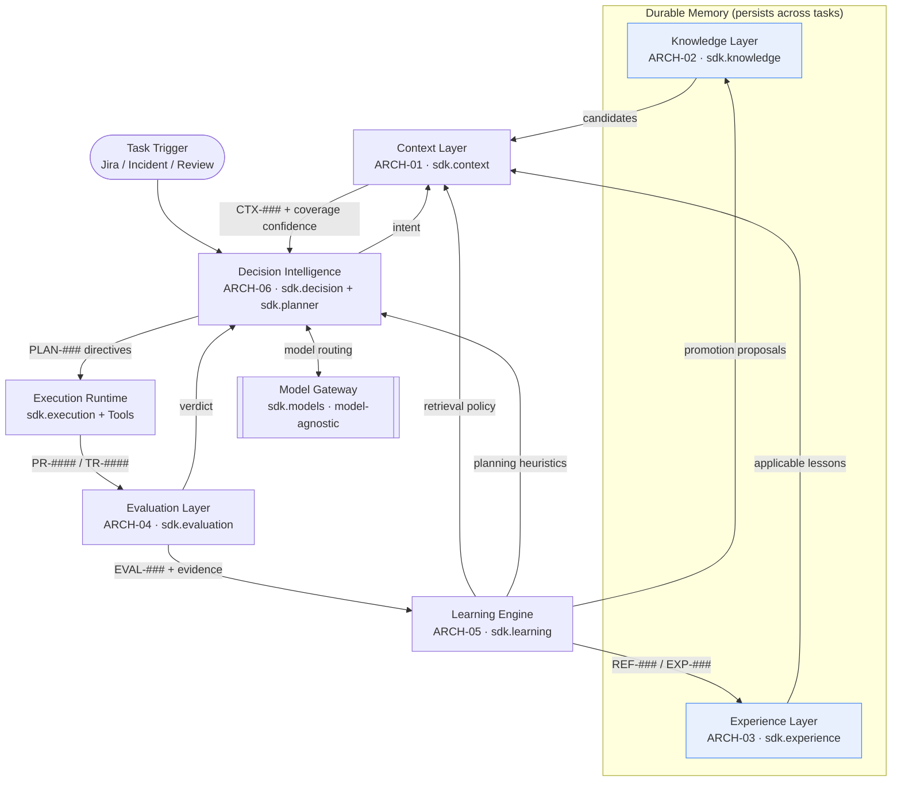
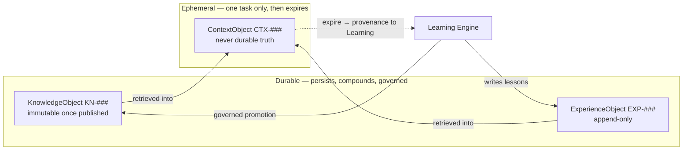

# Architecture Guide — The Enterprise Cognitive Layer (ECL)

> A readable synthesis of the ECL for a newcomer. For depth and authority, read the frozen
> architecture in [`../architecture/`](../architecture/) — the master document
> [`07_architecture.md`](../architecture/07_architecture.md) (`ARCH-07`) first, then the six
> layer documents. This guide orients; it does not replace them, and it never contradicts
> `CANON-001`.

## The one idea everything follows from

> **The LLM is stateless.** It has no memory, no enterprise knowledge, no accumulated
> experience, and no way to improve itself between calls.

Therefore all knowledge, memory, orchestration and learning live **outside the model**, in the
ECL. That single decision is what makes the architecture both **model-agnostic** (any provider
behind one gateway) and **domain-agnostic** (any Worker type over one shared core). Improvement
is realized as *data* — knowledge, experience, policies — never as weight updates (`ADR-0003`).
Change providers on Monday and every lesson MCG learned still applies on Tuesday.

---

## The six components (plus the Gateway)

`CANON-001` §9 names nine concepts; the ECL realizes them across six components and the Model
Gateway. This mapping is authoritative (`ARCH-07`):

| Concept (`CANON-001` §9) | ECL component | Doc | SDK module | Nature |
|---|---|---|---|---|
| Knowledge | Knowledge Layer | `ARCH-02` | `sdk.knowledge` | Durable memory |
| Context | Context Layer | `ARCH-01` | `sdk.context` | Ephemeral memory |
| Planning | Decision Intelligence | `ARCH-06` | `sdk.planner` | Per-task artifact |
| Decision Intelligence | Decision Intelligence | `ARCH-06` | `sdk.decision` | Orchestrator |
| Execution | Execution Runtime | *cross-cutting* | `sdk.execution` | Side effects |
| Evaluation | Evaluation Layer | `ARCH-04` | `sdk.evaluation` | Judgment |
| Reflection | Learning Engine | `ARCH-05` | `sdk.learning` | Improvement |
| Experience | Experience Layer | `ARCH-03` | `sdk.experience` | Durable memory |
| Learning / Continuous Improvement | Learning Engine | `ARCH-05` | `sdk.learning` | Improvement |
| *(model access)* | Model Gateway | `ARCH-07` | `sdk.models` | Model-agnostic seam |

Grouped by role:

- **Durable memory** — Knowledge + Experience. Persists across tasks. This is the asset that
  compounds.
- **Ephemeral memory** — Context. Exists only for the duration of one task, then expires.
- **Orchestration** — Decision Intelligence (with Planning as its output). The only component
  with agency.
- **Judgment & improvement** — Evaluation + Learning Engine.
- **The provider seam** — the Model Gateway, the only module that imports a vendor SDK.

---

## The loop, as a system



The defining property: **durable memory is richer at the end of every task than at the start**,
so the next task begins from a higher baseline — with the *same* model. That is CANON's
continuous-improvement flywheel, realized.

---

## Walking each component

### Knowledge Layer (`ARCH-02`, `sdk.knowledge`)
The system of record for durable, governed enterprise truth — `KnowledgeObject` (`KN-###`):
architecture docs, business rules, runbooks, standards (including `CANON-001` itself), API
contracts, and validated learnings. Knowledge is **immutable once published** (`ADR-0004`): new
facts are new versions; deprecation retains history. Retrieval is **hybrid** — semantic +
keyword + graph — behind a pluggable `KnowledgeIndex`. A `KnowledgeGovernance` gate decides what
becomes truth, and canon breaks ties.

### Context Layer (`ARCH-01`, `sdk.context`)
Assembles the *right, minimal, sufficient* working set (`ContextObject`, `CTX-###`) for exactly
one task, then throws it away (`ADR-0006`: ephemeral — **never** persisted as durable truth). It
composes `Retriever`s (knowledge, experience, live state), ranks and selects **within the
model's token budget** (`BudgetPolicy`, enforced *before* the Gateway — never rely on provider
truncation), and records full provenance including a **dropped-candidate log** that reflection
later inspects. Assembly is iterative: `enrich()` supports re-retrieval when reasoning surfaces
a new need.

### Planning (`ARCH-06`, `sdk.planner`)
A `PlanningObject` (`PLAN-###`) is a *commitment*: ordered steps, success criteria, tests to
run, a rollback strategy, a risk tier, and the experiences applied. It is what Execution carries
out and what Evaluation scores against. A `PlanValidator` enforces `CANON-001` standards
*before* execution — rollback present, risk-tier approvals (§7), dependency direction (§3),
coverage (§4).

### Decision Intelligence (`ARCH-06`, `sdk.decision`)
The **only** component with agency (`ADR-0008`). It interprets the trigger into intent, drives
the Context → Plan → Execute → Evaluate loop, routes models through the Gateway, and records an
immutable **decision trace** (`ADR-0021`). Autonomy is **gated on fused confidence** and enforced
by guardrails — see below.

### Execution Runtime (`sdk.execution`)
Where the Worker *does the work*: it invokes `Tool`s (GitHub, Jira, CI, TestRail, runbooks) per
plan directives, producing concrete, inspectable `WorkerArtifact`s (`PR-####`, `TR-####`,
comments) and `ExecutionObject` records. Tools declare side-effects and a **least-privilege
scope** (`ADR-0042`); execution is **idempotent** and every plan carries a rollback (`ADR-0045`).

### Evaluation Layer (`ARCH-04`, `sdk.evaluation`)
Renders a scored, evidence-linked verdict (`EvaluationObject`, `EVAL-###`). It is
**objective-first** (`ADR-0015`): deterministic `ObjectiveGate`s (tests, coverage, security,
dependency rule) outweigh model-assisted `rubric_items`. **No score without linked evidence**
(`ADR-0016`), and it reports **two** confidences — outcome vs. judgment (`ADR-0017`). Rubrics are
versioned (`ADR-0018`) so benchmarking is reproducible; this layer is the substrate for
[`../../benchmarks/`](../../benchmarks/).

### Learning Engine (`ARCH-05`, `sdk.learning`)
Turns evaluated outcomes into improvement, **outside the model**. A `Reflector` produces
root-cause `ReflectionObject`s (`REF-###`), always inspecting the dropped-candidate log first
(no hindsight bias, no symptom fixation — `RFC-0016`). The engine `distill()`s reusable
`ExperienceObject`s, `emit()`s `LearningEvent`s, and tracks **loop closure** — the definition of
learning (`ADR-0034`): a lesson that never changes a later execution is not learning.

### Model Gateway (`ARCH-07`, `sdk.models`)
The single entry point for every model call (`RFC-0011`). Layers pass a provider-agnostic
`ModelRequest` built from a `ContextObject` (structured context, **not** a prompt string —
`ADR-0011`); a `ModelProvider` adapter renders it into the vendor format and normalizes the
response. A `ModelRouter` picks a model by difficulty/cost/latency and negotiated
`CapabilityDescriptor`, with fallback to a **local SLM as availability floor** (`ADR-0044`).

---

## Durable vs. ephemeral memory (the sacred distinction)



- **Knowledge** is immutable and governed; corrections are new versions (`ADR-0004`).
- **Experience** is append-only; contradicted lessons are **down-weighted, never deleted**
  (`ADR-0047`).
- **Context** is disposable working memory; persisting it as truth is a category error
  (`ADR-0006`). What survives a task is *provenance* handed to Evaluation and Learning.

---

## Confidence is first-class, composable, and honest

The ECL never launders uncertainty as certainty. Every layer emits a confidence; Decision
Intelligence *fuses* them and gates autonomy on the result (`RFC-0009`):

```
Knowledge authority ─┐
Context coverage    ─┤
Experience applic.  ─┼──▶ ConfidencePolicy.fuse() ──▶ Control decision
Evaluation judgment ─┘        + risk_tier            (proceed | re-retrieve | replan |
                                                      retry | escalate | abort)
```

The `Control` enum lives in `sdk.decision`. A `ConfidencePolicy` maps fused confidence + risk
tier to a control decision (**risk-adaptive autonomy**: the higher the risk tier, the higher the
confidence bar). A separate `PolicyGuard` enforces hard guardrails *before* any execution
(`ADR-0041`) — approvals, PCI boundaries, segregation-of-duties, fairness. Low fused confidence
on a Tier 0 change never proceeds autonomously; it escalates. This is the architecture's primary
safety property.

---

## Model-agnosticism, structurally

Four mechanisms make provider-independence an invariant, not a feature (`ARCH-07`):

1. **Single point of contact** — every call goes through `ModelGateway.call()`; no other module
   imports a provider SDK (`ADR-0009/0010`).
2. **Stable internal contract** — layers speak *structured context in, structured result out*.
   The Gateway renders `CTX-###` into whatever a provider needs and normalizes the response.
3. **Capability negotiation, not assumption** — each model advertises a `CapabilityDescriptor`
   (window, tool-calling, structured output, cost, latency); Context and Decision adapt to it.
4. **Learning lives outside the weights** — accumulated intelligence is data, so it is portable
   across providers.

The payoff for the project: run the *identical* MCG task suite against different providers and
Worker implementations and compare them fairly. That fair comparison is EnterpriseSim's reason
to exist.

---

## Domain-agnosticism: specialize at the edges, share the core

A Worker type is defined by **four** pluggable specializations over the *same* six components
(`ADR-0024/0025`):

| Specialization | What changes | What stays identical |
|---|---|---|
| Knowledge domains | Which `KN-###` corpora are in scope | Knowledge Layer, retrieval, governance |
| Tools | Which enterprise tools it may act through | Execution runtime, directives |
| Rubrics | Task-type scoring criteria | Objective-first, evidence-linked engine |
| Policies | Guardrails (PCI vs. fairness vs. SoD) | Orchestration, confidence gating, routing |

Adding a QA, Finance, Privacy, Security, Recruitment or Support Worker requires **zero
architectural change** — only a `WorkerSpec`. See [`worker-guide.md`](worker-guide.md).

---

## System-level failure modes (and the mitigations built in)

| Failure | Cross-layer cause | Mitigation |
|---|---|---|
| Silent regression | Lesson not learned or not applied | Loop-closure metric (`ARCH-05`); regression checks in Evaluation |
| Confidence collapse | One layer's low confidence ignored | Composable confidence fused in DI; hard gates |
| Memory rot | Knowledge stale / experience overfit | Freshness SLAs (`ARCH-02`); decay + contradiction handling (`ARCH-03`) |
| Provider outage | Single-provider dependency | Multi-provider routing + fallback; local SLM floor |
| Unauditable behavior | Missing provenance/traces | Provenance (`ARCH-01`) + decision traces (`ARCH-06`) mandatory |
| Benchmark drift | Rubrics change silently | Versioned rubrics (`ARCH-04`) |
| Runaway cost | Unbounded reasoning loops | Iteration + reasoning-cost budgets in DI |

---

## The seven best practices to internalize

1. Keep the model stateless and swappable — all memory and learning live in the ECL.
2. Durable vs. ephemeral is sacred — Knowledge/Experience persist; Context never does.
3. One orchestrator, many services — concentrate agency in Decision Intelligence for
   auditability.
4. Confidence is composable and honest — fuse it, gate autonomy on it.
5. Learn outside the weights — improvement is data, so it is auditable, reversible, portable.
6. Specialize at the edges, share the core.
7. Everything is provenanced and benchmarkable — if you cannot trace it or score it, it does
   not belong in the ECL.

Next: [`extension-guide.md`](extension-guide.md) to implement a layer, or
[`worker-guide.md`](worker-guide.md) to build a Worker.
