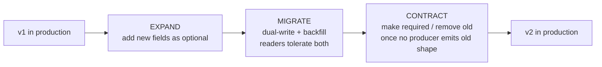

# Schema Guide — Using and Validating the JSON Schemas

> The [`../../schemas/`](../../schemas/) directory holds **JSON Schema (Draft 2020-12)**
> contracts for every ECL object. They are the **authoritative shape** of the artifacts the SDK
> exchanges and that Workers produce. The Protocols in
> [`../../sdk/objects.py`](../../sdk/objects.py) are the in-code mirror; the schema is the source
> of truth for shape. Everything here is subordinate to `CANON-001`.

---

## The object model

Twelve object schemas plus one shared definitions file:

| Schema | `$id` basename | ECL object | Mirrors `sdk.objects` |
|---|---|---|---|
| `common.schema.json` | `common` | shared `$defs` (IDs, confidence, provenance, base) | value aliases |
| `knowledge_object.schema.json` | `knowledge_object` | `KnowledgeObject` (`KN-###`) | `KnowledgeObject` |
| `context_object.schema.json` | `context_object` | `ContextObject` (`CTX-###`) | `ContextObject` |
| `planning_object.schema.json` | `planning_object` | `PlanningObject` (`PLAN-###`) | `PlanningObject` |
| `decision_object.schema.json` | `decision_object` | `DecisionObject` | `DecisionObject` |
| `execution_object.schema.json` | `execution_object` | `ExecutionObject` | `ExecutionObject` |
| `evaluation_object.schema.json` | `evaluation_object` | `EvaluationObject` (`EVAL-###`) | `EvaluationObject` |
| `reflection_object.schema.json` | `reflection_object` | `ReflectionObject` (`REF-###`) | `ReflectionObject` |
| `experience_object.schema.json` | `experience_object` | `ExperienceObject` (`EXP-###`) | `ExperienceObject` |
| `learning_event.schema.json` | `learning_event` | `LearningEvent` | `LearningEvent` |
| `worker_decision.schema.json` | `worker_decision` | `WorkerDecision` | `WorkerDecision` |
| `worker_execution.schema.json` | `worker_execution` | `WorkerExecution` | `WorkerExecution` |
| `worker_artifact.schema.json` | `worker_artifact` | `WorkerArtifact` | `WorkerArtifact` |

Worked, cross-referenced instances (the `CHK-1421` loop) live in
[`../../schemas/examples/`](../../schemas/examples/).

### The shared base

Every object schema composes a common base and closes itself:

```json
{
  "allOf": [{ "$ref": "common.schema.json#/$defs/eclObjectBase" }],
  "unevaluatedProperties": false
}
```

`eclObjectBase` (in `common.schema.json`) requires `id`, `schema_version`, `created_at`, and
allows an open `metadata` object. Note `unevaluatedProperties: false` — **not**
`additionalProperties: false`. This is deliberate: `additionalProperties` cannot see fields
contributed across an `allOf`, so it would wrongly reject the inherited base fields;
`unevaluatedProperties` sees across the composition and correctly forbids only *stray* fields.
Remember this when you author a new schema.

### Shared `$defs` you will reuse

From `common.schema.json`:

- `canonicalId` — any ECL id **or** a Jira project-key reference. Its pattern admits ECL
  prefixes (`CANON|BU|TEAM|APP|SVC|REPO|ADR|RFC|PR|REL|INC|TC|TS|TR|KN|CTX|PLAN|EXP|EVAL|REF`)
  and per-project Jira keys like `CHK-1421` (`CANON-001` §5/§6).
- Typed id refs: `knowledgeId`, `contextId`, `planId`, `experienceId`, `evaluationId`,
  `reflectionId`, `appId`, `teamId`, `prId`, `testRunId`, `incidentId`, `releaseId`.
- `confidence` — number in `[0.0, 1.0]` (`RFC-0009`).
- `sensitivity` — `public | internal | pci | pii` (`ADR-0043`).
- `provenance` — `{ source, kind, reason, score, tokens? }` used by `ContextObject`.
- `timestamp` — ISO-8601 / RFC-3339.
- `metadata` — open object for additive annotations (see below).

---

## Referential integrity — the backbone

Objects reference one another **by canonical ID** (`ADR-0023`); IDs are globally unique and never
reused (`CANON-001` §6). The `CHK-1421` example set demonstrates a full loop:

```
KN-045 ──cited by──▶ CTX-0118 ──intent_ref──▶ PLAN-0072
  ▲                     ▲                          │
  │ promoted_from       │ applied_experience        │ executed as
  │                     │                           ▼
EXP-090 ◀─create_experience─ REF-0019 ◀─reflects── EVAL-0061 ◀─scores── PR-0312
   │                                                   ▲
   └──────────── prevented_regressions ────────────────┘
```

The load-bearing references:

- `ContextObject.included[].source` → `KN-###` / `EXP-###` (provenance).
- `PlanningObject.applied_experience` → `EXP-###`.
- `EvaluationObject.execution` → `PR-####`; `.plan` → `PLAN-###`;
  `.regression_check.checked_against` → `EXP-###`.
- `ReflectionObject` → `EVAL-###`, `PLAN-###`, execution; `.lessons[].create_experience` →
  `EXP-###`; `.loop_closed_by` → the later execution that proved the lesson.
- `ExperienceObject.evidence` → origin execution, `EVAL-###`, `REF-###`;
  `.promoted_to_knowledge` → `KN-###`.
- `LearningEvent.source_reflection` → `REF-###`; `.target` → the `KN`/`EXP`/policy affected.

Referential integrity is invariant across schema versions: a change that would break a reference
requires an ADR (`ADR-0022`).

---

## Validating instances

All schemas are **Draft 2020-12** and use relative `$ref`s, so you must load them into a
**registry keyed by `$id`** for references to resolve. Recommended stack: `jsonschema >= 4.18` +
`referencing` (from [`../../schemas/README.md`](../../schemas/README.md)):

```python
import json, glob
from referencing import Registry, Resource
from jsonschema import Draft202012Validator

resources = []
for path in glob.glob("schemas/*.schema.json"):
    doc = json.load(open(path))
    resources.append((doc["$id"], Resource.from_contents(doc)))
registry = Registry().with_resources(resources)

schema = json.load(open("schemas/context_object.schema.json"))
instance = json.load(open("schemas/examples/context_object.example.json"))
Draft202012Validator(schema, registry=registry).validate(instance)   # raises on failure
```

For CI environments without network access, a **dependency-free structural validator** is kept
in the test suite. Validation confirms shape only; referential integrity (do the referenced IDs
resolve to real objects of the right type?) and the domain invariants below are checked
separately, in tests.

Beyond shape, assert the canonical invariants (`sdk/objects.py`):

- `KnowledgeObject` immutable once `status: published` — corrections are new `version`s.
- `ExperienceObject` append-only — contradicted lessons are `downweighted`, never removed.
- `ContextObject` is ephemeral — it must never appear in a durable store.

---

## Authoring a new object instance

Walk the `KnowledgeObject` example
([`knowledge_object.example.json`](../../schemas/examples/knowledge_object.example.json)) as a
template:

```json
{
  "id": "KN-045",
  "schema_version": "2020-12.v1",
  "created_at": "2026-01-15T09:00:00Z",
  "title": "Checkout domain rules",
  "body": "Order placement invariants for APP-003 ...",
  "owner_team": "TEAM-004",
  "app": "APP-003",
  "canon_refs": ["CANON-001#3", "CANON-001#8"],
  "sensitivity": "internal",
  "authority": "owner-approved",
  "version": 4,
  "status": "published",
  "freshness": { "last_validated": "2026-06-30T12:00:00Z", "sla_days": 180, "index": 0.12 },
  "relations": { "depends_on": ["KN-052"], "referenced_by_incidents": ["INC-2026-007"] },
  "promoted_from_experience": "EXP-090"
}
```

Rules for a valid instance:
1. Set the three base fields: a unique `id` matching its typed pattern (`KN-\d{3,}`),
   `schema_version` matching `^2020-12\.v\d+$`, and an ISO-8601 `created_at`.
2. Provide all `required` fields; keep enum-constrained fields (`authority`, `status`,
   `sensitivity`) in range.
3. Reference other objects by canonical ID only; do not invent free-form links.
4. Add no stray top-level fields — `unevaluatedProperties: false` will reject them. Put additive
   annotations under `metadata` (next section).
5. Keep it consistent with `CANON-001` (e.g. dependency direction, ownership) and with the rest
   of the object graph.

To author a whole **new object type** (a new schema), copy the base-composition boilerplate,
give it a versioned `$id` under `https://enterprisesim.dev/schemas/2020-12/`, add a typed id
`$def` in `common.schema.json` if it needs one, mirror it as a Protocol in `sdk/objects.py`, and
record the contract change with an RFC (`RFC-0021`) — and an ADR if it alters an invariant.

---

## The `metadata` extension field

Every object carries an open `metadata` object (`additionalProperties: true`). It is the
**sanctioned place for extension fields**, so core validation stays strict while leaving room
for additive, non-semantic annotations:

```json
"metadata": { "generated_by": "support-worker", "run_id": "...", "trace_seq": 7 }
```

Two rules (`schemas/README.md`): `metadata` is **never** used to carry required meaning — if a
consumer must rely on it, it belongs in the typed schema instead — and readers must **tolerate
unknown `metadata`** keys (important during migrations).

---

## Schema versioning & migration (`RFC-0021`, `ADR-0033`)

The schema family is versioned (`2020-12.v1`, `.v2`, …), surfaced in every instance's
`schema_version` and tracked by `sdk.SCHEMA_VERSION`. SemVer semantics (`ADR-0032`):
additive/optional changes are **minor**; required-field or type changes are **major**.

Evolution follows **expand → migrate → contract** (`ADR-0033`):



1. **Expand.** Add new fields as *optional* first; nothing breaks.
2. **Migrate.** Dual-write and backfill; validators accept the current **and** previous major
   version during the window; readers tolerate unknown `metadata`.
3. **Contract.** Only after no producer emits the old shape, make fields required or remove old
   ones. Instances are **never rewritten in place** — a new version is a new record.

Invariants that survive every migration:

- **Referential integrity.** IDs never change meaning across versions (`ADR-0022`);
  cross-references stay resolvable. Breaking a reference requires an ADR.
- **Provenance of change.** Every schema change is recorded via an RFC (contract change) and,
  where it alters an invariant, an ADR — consistent with canon supremacy (`ADR-0050`).

---

## Quick reference

- Validate with any Draft 2020-12 validator; load all schemas into a registry keyed by `$id`.
- Close objects with `unevaluatedProperties: false`, not `additionalProperties: false`.
- Reference everything by canonical ID; keep IDs unique and immutable.
- Extend through `metadata`, migrate through expand-contract, and never contradict `CANON-001`.

See [`extension-guide.md`](extension-guide.md) for validating the objects your *implementation*
emits, and [`../../schemas/README.md`](../../schemas/README.md) for the authoritative schema
reference.
