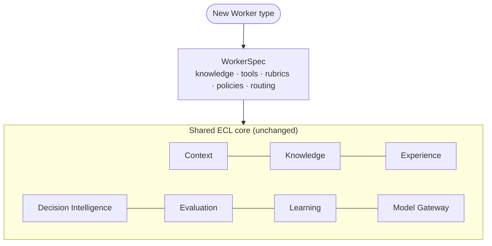

# Worker Guide — Building a New Enterprise AI Worker

> An **Enterprise AI Worker** is a domain-agnostic agent that reuses the *entire* ECL core
> unchanged and is specialized only at four edges. Adding a new Worker type — QA, Finance,
> Privacy, Security, Recruitment, Support — requires **zero architectural change** (`ADR-0024`),
> only a `WorkerSpec`. This guide takes you from the four axes to a fully worked, running new
> Worker.

Prerequisites: skim [`architecture-guide.md`](architecture-guide.md) (the loop) and
[`plugin-guide.md`](plugin-guide.md) (how tools/rubrics/backends get registered).

---

## The four specialization axes

A Worker type is defined by binding four things over the shared core (`ADR-0025`, `ARCH-07`):

| Axis | What it selects | Shared core it does **not** change |
|---|---|---|
| **Knowledge domains** | Which `KN-###` corpora are in scope | Knowledge Layer, retrieval, governance |
| **Tools** | Which enterprise capabilities it may act through (least-privilege) | Execution runtime, directives |
| **Rubrics** | How its work is scored, per task type | Objective-first, evidence-linked engine |
| **Policies** | Its guardrails (PCI, PII, fairness, segregation-of-duties) | Orchestration, confidence gating, routing |

Everything else — context assembly, experience accumulation, reflection, learning, confidence
fusion, model routing — is inherited exactly as-is. That is the reusability guarantee.



---

## Anatomy of a `WorkerSpec`

`WorkerSpec` is a frozen dataclass in [`../../sdk/workers/interfaces.py`](../../sdk/workers/interfaces.py):

```python
from sdk.workers.interfaces import WorkerSpec

spec = WorkerSpec(
    name="support-worker",                       # Worker type identifier
    knowledge_domains=["support-runbooks", "order-domain"],   # KN corpora in scope
    tools=["support-case", "order-lookup"],       # names resolved from the tool registry
    rubrics=["RUBRIC-case-resolution"],           # versioned evaluation rubric ids
    policies=["pii-handling", "no-destructive-account-actions"],  # guardrail ids
    default_routing={"difficulty": "medium"},     # model-routing hints for the Gateway
)
```

Each string is a **stable name** the runtime resolves via plugin entry points
([`plugin-guide.md`](plugin-guide.md)): tool names → `Tool`s, rubric ids → `Rubric`s, policy ids
→ `PolicyGuard`s, knowledge domains → `KN` corpora filters. Nothing here is a class — the spec is
pure configuration, which is why a new Worker needs no new architecture.

---

## Wiring via `WorkerRuntime`

`WorkerRuntime.bind(spec)` resolves the four axes against the shared components and returns a
ready `Orchestrator`; `Worker.run(trigger)` then drives the full ECL loop:

```python
from sdk.workers.interfaces import Worker, WorkerRuntime, RunResult
from sdk.objects import CanonicalId

def launch(runtime: WorkerRuntime, worker: Worker, spec) -> RunResult:
    orchestrator = runtime.bind(spec)            # binds knowledge/tools/rubrics/policies
    return worker.run(trigger="SUP-1187")        # one task, end to end through the loop
```

`bind()` is where **least privilege** is enforced (`ADR-0042`): a tool that is installed but not
named in `spec.tools` is simply not available to this Worker, and a `PolicyGuard` from
`spec.policies` will veto any plan that violates it *before* execution.

---

## Running and replaying (`RFC-0019`, `RFC-0024`)

- **Run.** `Worker.run(trigger)` executes one task through Context → Plan → Execute → Evaluate →
  Learn and returns a `RunResult(run_id, status, execution, evaluation)` where `status ∈
  {completed, escalated, aborted}`. The worker lifecycle is specified in `RFC-0019`.
- **Replay.** `Worker.replay(run_id)` deterministically re-executes a past run for debugging and
  benchmarking (`RFC-0024`). Determinism is what lets EnterpriseSim compare Worker
  implementations and model providers on identical tasks (`ARCH-04`).

```python
result = worker.run(trigger="SUP-1187")
if result.status == "escalated":
    # low fused confidence on a risky action -> handed to a human (ARCH-06 safety property)
    ...
audit = worker.replay(result.run_id)             # reproduce the exact loop for review
```

---

## Fully worked example — a new **Support Worker**

Goal: a Worker that resolves customer support cases against MCG's Customer Support Platform
(`APP-017`), reads order state (`APP-009`), and never takes destructive account actions or leaks
PII. This mirrors `ARCH-07` Example C — standing up a Worker in a day, no architectural change.

### Step 1 — choose the four axes

| Axis | Binding | Rationale |
|---|---|---|
| Knowledge | `support-runbooks`, `order-domain` (`KN-###` about `APP-017`/`APP-009`) | what a support engineer must know |
| Tools | `support-case` (`APP-017` console), `order-lookup` (`APP-009`) | act on cases; read orders |
| Rubrics | `RUBRIC-case-resolution` | score resolution quality + correctness |
| Policies | `pii-handling`, `no-destructive-account-actions` | PII travels with data (`ADR-0043`); no irreversible ops |

### Step 2 — register the specialized pieces as plugins

Only the *tools* and *rubric* are code; register them via entry points (see
[`plugin-guide.md`](plugin-guide.md)). A read-only order-lookup tool:

```python
from typing import Mapping
from sdk.execution.interfaces import Tool, ToolSpec, ToolResult

class OrderLookupTool:                           # satisfies the Tool Protocol
    spec = ToolSpec(
        name="order-lookup",
        description="Read order status/history from OMS (APP-009).",
        input_schema={"type": "object", "required": ["order_id"]},
        side_effects="read",                     # never mutates -> safe for autonomy
        least_privilege_scope="app:APP-009:read",
    )
    def invoke(self, args: Mapping[str, object]) -> ToolResult:
        raise NotImplementedError
```

The case-resolution rubric is objective-first and evidence-linked:

```python
from typing import Mapping, Sequence
from sdk.evaluation.interfaces import Rubric, ObjectiveGate

class CaseResolutionRubric(Rubric):
    id = "RUBRIC-case-resolution"
    version = 1                                  # versioned for reproducible benchmarking (ADR-0018)
    def objective_gates(self) -> Sequence[ObjectiveGate]:
        raise NotImplementedError                # e.g. case_closed, sla_met, no_pii_in_reply
    def rubric_items(self) -> Sequence[str]:
        raise NotImplementedError                # e.g. "response empathy/clarity"
    def weights(self) -> Mapping[str, float]:
        raise NotImplementedError                # objective gates weighted above model items
```

A `PolicyGuard` implements `no-destructive-account-actions` and vetoes any plan step whose tool
`side_effects` is `irreversible` (or that touches account deletion) *before* execution.

### Step 3 — author the spec and bind

```python
from sdk.workers.interfaces import WorkerSpec

support_spec = WorkerSpec(
    name="support-worker",
    knowledge_domains=["support-runbooks", "order-domain"],
    tools=["support-case", "order-lookup"],
    rubrics=["RUBRIC-case-resolution"],
    policies=["pii-handling", "no-destructive-account-actions"],
    default_routing={"difficulty": "medium"},
)
orchestrator = runtime.bind(support_spec)        # inherits the entire shared core
```

### Step 4 — run one task through the loop

Trigger `SUP-1187` ("customer reports a missing delivery; wants a refund status update"):

1. **Interpret** — `Orchestrator.interpret("SUP-1187", ...)` → `TaskIntent(goal="resolve missing
   delivery inquiry", apps=["APP-017","APP-009"])`.
2. **Context** — `ContextAssembler.assemble(...)` pulls support runbooks and the relevant order
   rules from the *support* knowledge domains, plus any applicable `EXP-###` (e.g. "for
   missing-delivery cases, confirm carrier scan before promising a refund"), within budget →
   `CTX-###` with `coverage_confidence`.
3. **Plan** — `Planner.plan(...)` → ordered steps (look up order via `order-lookup`, draft
   reply, update case via `support-case`), success criteria, rollback, and a **risk tier**;
   `PlanValidator.validate(...)` confirms no destructive action and required approvals.
4. **Guard + route + execute** — `PolicyGuard.check(...)` clears the plan (read + case-comment
   only, no irreversible ops); the Gateway routes a `medium`-difficulty model; `ExecutionRuntime`
   invokes the tools, producing `WorkerArtifact`s (a case comment, a status update).
5. **Evaluate** — `Evaluator.evaluate(...)` scores objective gates (`case_closed`, `sla_met`,
   `no_pii_in_reply`) first, then model-assisted items, with evidence and dual confidence →
   `EVAL-###`.
6. **Learn** — `Reflector`/`LearningEngine` reflect on the outcome, `distill()` any new lesson
   into an `EXP-###`, and track loop closure — improving the *next* support case with the same
   model.

If confidence is low on a risky step (say, issuing a refund the policy doesn't clearly permit),
`ConfidencePolicy.control_for(...)` returns `ESCALATE` and `RunResult.status == "escalated"` —
the human takes over. This is the same safety property every Worker inherits.

### What you did *not* have to build

Context assembly, experience retrieval/accumulation, reflection, learning, confidence fusion,
model routing, the decision trace, and replay — all inherited unchanged. You wrote one tool, one
rubric, one policy, and one `WorkerSpec`.

---

## Comparing Worker types (the specialization is just the spec)

| Worker | Knowledge | Tools | Rubric | Policy |
|---|---|---|---|---|
| **QA** | test standards, `APP-*` contracts | TestRail, CI | coverage, flake-rate, defect-escape | quality gates |
| **Finance** | accounting rules, ledgers | ERP/reporting | balance correctness, audit trail | segregation-of-duties |
| **Privacy** | privacy policy, data lineage (`APP-020`) | identity (`APP-014`), DSAR workflow | completeness, lawful basis | PII handling, data minimization |
| **Support** | support runbooks, `APP-017`/`APP-009` | case system, order lookup | case resolution | PII handling, no destructive actions |

Same six components. Different four bindings. That is the whole design.

---

## Checklist

- [ ] Four axes chosen and justified; each name resolves via an entry point
      ([`plugin-guide.md`](plugin-guide.md)).
- [ ] Tools declare honest `side_effects` and least-privilege scopes (`ADR-0042`).
- [ ] Rubric is versioned and objective-first with evidence links (`ADR-0015/0016/0018`).
- [ ] Policies cover the Worker's real risks; `PolicyGuard` vetoes *before* execution.
- [ ] `WorkerSpec` authored; `WorkerRuntime.bind()` returns a working `Orchestrator`.
- [ ] `Worker.run()` completes the `SUP-1187`-style loop; `Worker.replay()` is deterministic.
- [ ] No change to any shared ECL component was required.
