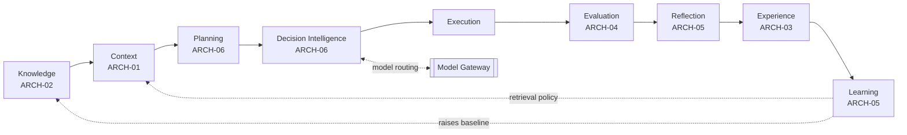

# RFC-0001 — ECL Architecture Overview & RFC Process

| Field | Value |
|---|---|
| RFC | `RFC-0001` |
| Title | ECL Architecture Overview & RFC Process |
| Status | **Accepted** |
| Authors | Architecture Office (`TEAM-090`) |
| Created | 2026-02-03 |
| Related | `CANON-001` §8/§9; `ARCH-01`…`ARCH-07`; `ADR-0003`, `ADR-0008`, `ADR-0009`, `ADR-0010`, `ADR-0021`; all subsequent `RFC-0002`…`RFC-0030` |

---

## 1. Summary

This RFC is the root of the EnterpriseSim RFC series. It does two things. First, it gives a
single, navigable overview of the **Enterprise Cognitive Layer (ECL)** — the reusable,
model-agnostic, domain-agnostic intelligence architecture that every Enterprise AI Worker at
Meridian Commerce Group (MCG) runs on — and maps every downstream RFC onto the frozen
architecture (`ARCH-01`…`ARCH-07`). Second, it defines the **RFC process** itself: what an RFC
is for, how it relates to CANON and to Architecture Decision Records (ADRs), the required
document structure, the lifecycle and states, and the rules of referential integrity that keep
thirty (and eventually many more) RFCs mutually consistent.

RFC-0001 is deliberately broader than the RFCs that follow. Every other RFC in the series
inherits its format, its cross-referencing discipline, and its subordination to `CANON-001`
from here.

## 2. Motivation

`CANON-001` §4.7 mandates that "significant decisions are recorded as ADRs; cross-team
proposals as RFCs," and §2.2/§2.3 place the **Architecture Office (`TEAM-090`)** in charge of
CANON, ADRs and RFCs, coordinating cross-cutting change through RFCs rather than tickets. The
ECL is exactly such a cross-cutting concern: it spans Knowledge, Context, Decision
Intelligence, Execution, Evaluation and Learning, is consumed by every Worker type, and is
implemented against the `sdk/` contract and `schemas/` object definitions.

Without a disciplined RFC process, three failure modes are inevitable:

- **Contract drift.** Two RFCs describe the same interface differently, and implementers pick
  one arbitrarily. The `sdk.*` Protocols and `schemas/*` objects become ambiguous.
- **Canon violation.** An RFC proposes something that quietly contradicts `CANON-001`
  (e.g., a reverse dependency, an unowned service, a second model gateway).
- **Unresolvable cross-references.** RFC-0007 cites "the planner contract" but no RFC owns it,
  or cites `RFC-00XX` that never lands.

The RFC process defined here exists to make all three impossible by construction.

## 3. Guide-level explanation

### 3.1 What the ECL is (in one paragraph)

The founding constraint of EnterpriseSim is that **the LLM is stateless** (`ARCH-07`). It has
no memory, no MCG knowledge, no accumulated experience, and cannot improve itself between
calls. Everything that makes a Worker *enterprise-grade* therefore lives **outside the model**,
in the ECL. The ECL is the durable cognitive substrate around a stateless reasoning engine.
Because all memory, learning and orchestration live outside the model, the architecture is both
**model-agnostic** (any provider behind one Gateway) and **domain-agnostic** (any Worker type
over the same six components).

### 3.2 The ECL loop

Every task traverses one loop, and every loop leaves durable memory richer than it found it:



### 3.3 How the RFC series is organised

The thirty RFCs are grouped by the ECL component they refine. Each cites the frozen `ARCH-`
document(s) it elaborates and the `sdk/` module(s) and `schemas/*` objects it constrains:

| Band | RFCs | ECL home | Frozen source |
|---|---|---|---|
| Foundations & process | 0001 | Whole system | `ARCH-07` |
| Context & Knowledge | 0002, 0003, 0004, 0005, 0006 | Context/Knowledge/Experience | `ARCH-01`, `ARCH-02`, `ARCH-03` |
| Decision & Models | 0007, 0008, 0009, 0010, 0011 | Decision Intelligence, Model Gateway | `ARCH-06`, `ARCH-07` |
| Execution | 0012, 0013 | Execution Runtime | `ARCH-07` (cross-cutting) |
| Evaluation | 0014, 0015 | Evaluation | `ARCH-04` |
| Learning & governance | 0016, 0017, 0018 | Learning Engine | `ARCH-05` |
| Worker lifecycle | 0019, 0020 | Worker | `ARCH-07` |
| Schema & identity | 0021, 0022, 0023, 0024 | Cross-cutting | `CANON-001` §5/§6 |
| Benchmarking | 0025, 0026 | Evaluation | `ARCH-04` |
| Platform concerns | 0027, 0028, 0029, 0030 | Cross-cutting | `ARCH-07` |

The full index with titles and status is maintained in [`README.md`](README.md).

### 3.4 RFC vs. ADR vs. CANON

These three artifact types form a strict hierarchy of authority:

- **`CANON-001`** is the frozen, authoritative enterprise truth. It wins every conflict
  (`ADR-0050`). It is changed only through its own versioned change log.
- **ADRs (`ADR-###`)** record a single, load-bearing *decision* and its consequences —
  typically an **invariant** ("Learning Lives Outside the Model", `ADR-0003`; "DI is the Sole
  Orchestrator", `ADR-0008`). ADRs are short and rarely change once accepted.
- **RFCs (`RFC-###`)** are the *design* documents that realise those invariants as concrete,
  reviewable contracts against the `sdk/` and `schemas/`. An RFC may cite many ADRs; where an
  RFC would alter an invariant, it must be accompanied by a new or superseding ADR.

Rule of thumb: *a decision is an ADR; the design that implements the decision is an RFC.*

## 4. Reference-level explanation

### 4.1 Mandatory RFC structure

Every RFC in this repository **must** use the following structure, exactly. Deviation is a
review-blocking defect.

1. A **header table** with fields: `RFC`, `Title`, `Status`, `Authors`, `Created`, `Related`.
2. Numbered sections: **1. Summary**, **2. Motivation**, **3. Guide-level explanation**,
   **4. Reference-level explanation**, **5. Drawbacks**, **6. Rationale & alternatives**,
   **7. Prior art**, **8. Unresolved questions**, **9. Future possibilities**.

The **Reference-level explanation** is the substance. It must reference the relevant `sdk.*`
interfaces (by dotted path, e.g. `sdk.context.ContextAssembler`) and `schemas/*` objects (by
basename, e.g. `context_object.schema.json`) by name, so the design is anchored to the code and
schema contracts rather than floating in prose.

### 4.2 Header field contracts

| Field | Contract |
|---|---|
| `RFC` | Canonical zero-padded four-digit ID, `RFC-000N` (`CANON-001` §6). Immutable, never reused. |
| `Title` | Fixed at acceptance; matches the catalog in this RFC and in `README.md`. |
| `Status` | One of the lifecycle states in §4.3. The Foundation-phase series lands as **Accepted**. |
| `Authors` | Owning team; for this series, **Architecture Office (`TEAM-090`)**. |
| `Created` | ISO-8601 date in 2026, kept chronological with the RFC number. |
| `Related` | Canonical IDs of related `RFC-`, `ADR-`, and `ARCH-` artifacts; every ID must resolve. |

### 4.3 RFC lifecycle

```mermaid
stateDiagram-v2
    [*] --> Draft: authored (human or Worker) in TEAM-090
    Draft --> Review: submitted for cross-team review
    Review --> Draft: changes requested
    Review --> Accepted: reviewers sign off; contract frozen
    Accepted --> Superseded: a later RFC replaces it
    Accepted --> Deprecated: contract retired (kept for history)
    Superseded --> [*]
    Deprecated --> [*]
```



Consistent with `CANON-001` §6, an RFC ID is **never reused** and an accepted RFC is **never
hard-deleted**; superseded or deprecated RFCs are retained for historical and audit fidelity,
mirroring the Knowledge Layer's own lifecycle (`ARCH-02`). A **Superseded** RFC names its
successor in `Related`; the successor names the RFC it supersedes.

### 4.4 Authoring, review and ownership

- RFCs are authored in `docs/rfcs/RFC-000N.md` and owned by the **Architecture Office
  (`TEAM-090`)** per `CANON-001` §2.2.
- Cross-cutting RFCs require review by every ECL component owner they touch and, where a
  `CANON-001` boundary is implicated (PCI, dependency direction, ownership), by Security
  Engineering (`SEC`) or the relevant domain squad.
- An RFC that changes a `schemas/*` contract additionally follows `RFC-0021` (Schema Versioning
  & Compatibility); one that changes an invariant additionally requires an ADR.
- Enterprise AI Workers may *author* RFC drafts (a Documentation/Architecture Worker is a valid
  Worker type, `ARCH-07`), but acceptance is a governed human act — the same "propose, then
  govern" discipline the Knowledge Layer uses for promotion (`ARCH-02`, `RFC-0018`).

### 4.5 Referential-integrity rules

These rules are what make thirty RFCs behave as one coherent corpus (`CANON-001` §6, `ADR-0022`,
`RFC-0022`):

1. **Every ID resolves.** Any `RFC-`, `ADR-`, `ARCH-`, `KN-`, `APP-`, `TEAM-`, or Jira-key
   reference in an RFC must resolve to a real artifact (an accepted RFC, a real ADR, a canon
   `APP-`/`TEAM-`, or the running example set).
2. **No forward-dangling.** An RFC may *reference* a higher-numbered RFC (the catalog is fixed),
   but it must not *depend on* content that no RFC will ever define.
3. **One owner per contract.** Each `sdk.*` interface and each `schemas/*` object is *normatively
   owned* by exactly one RFC; others may cite but not redefine it. Ownership is recorded in
   [`README.md`](README.md) and summarised in §4.6.
4. **Canon supremacy.** If an RFC and `CANON-001` disagree, canon wins; the RFC is defective and
   must be revised (`ADR-0050`).

### 4.6 Normative ownership map (this band)

The RFCs in this deliverable normatively own the following contracts:

| RFC | Owns (normative) | Frozen source |
|---|---|---|
| 0002 | `sdk.context.ContextAssembler`, `context_object.schema.json` | `ARCH-01` |
| 0003 | `sdk.knowledge.KnowledgeRetriever` / `KnowledgeStore`, `knowledge_object.schema.json` | `ARCH-02` |
| 0004 | `sdk.experience.ExperienceRetriever` / `ExperienceStore`, `experience_object.schema.json` | `ARCH-03` |
| 0005 | `sdk.knowledge.KnowledgeIndex` (hybrid retrieval) | `ARCH-02` |
| 0006 | Knowledge-graph relations of `knowledge_object.schema.json` | `ARCH-02` |
| 0007 | `sdk.decision.Orchestrator`, `worker_decision.schema.json` | `ARCH-06` |
| 0008 | `sdk.planner.Planner` / `PlanValidator`, `planning_object.schema.json` | `ARCH-06` |
| 0009 | `sdk.decision.ConfidencePolicy`, the `Confidence` alias | `ARCH-06` |
| 0010 | `sdk.models.ModelRouter` | `ARCH-07` |
| 0011 | `sdk.models.ModelGateway` / `ModelProvider` / `CapabilityDescriptor` | `ARCH-07` |
| 0012 | `sdk.execution.ExecutionRuntime`, `execution_object.schema.json`, `worker_artifact.schema.json` | `ARCH-07` |
| 0013 | `sdk.execution.Tool` / `ToolRegistry` / `ToolSpec` | `ARCH-07` |
| 0014 | `sdk.evaluation.Evaluator` / `ObjectiveGate`, `evaluation_object.schema.json` | `ARCH-04` |
| 0015 | `sdk.evaluation.Rubric` (rubric definition language) | `ARCH-04` |

### 4.7 The running example (shared across the series)

To keep the series concrete and mutually consistent, every RFC that needs an example reuses the
canonical **`CHK-1421` guest-checkout loop** from `CANON-001` and `ARCH-01`…`ARCH-07`:

```
CHK-1421 (Jira story: guest checkout, APP-003)
  → KN-045 (checkout rules), KN-052 (idempotency)
  → CTX-0118 (assembled context) → PLAN-0072 (plan, risk tier 0)
  → PR-0312 (execution) → TR-0442/TR-0443 (test runs)
  → EVAL-0061 (score 0.91) → REF-0019 (reflection) → EXP-090 (lesson)
```

No RFC may contradict any fact in this loop (e.g., `EVAL-0061` scores `PR-0312`, not the
reverse; `EXP-090` concerns the `APP-003`→`APP-015` side effect).

## 5. Drawbacks

- **Process overhead.** Requiring a full nine-section RFC for every cross-cutting change is
  heavier than ad-hoc design notes; for genuinely small changes an ADR alone may suffice.
- **Rigidity.** A fixed structure and fixed titles reduce authorial freedom; some designs do not
  map cleanly onto "guide-level vs. reference-level."
- **Front-loading.** Landing fifteen RFCs as **Accepted** in the Foundation phase commits the
  project to contracts before every implementation lesson has been learned; revisions will need
  supersession rather than silent edits.

## 6. Rationale & alternatives

The nine-section structure is adopted from the widely used public RFC conventions (the "RFC
2119 keyword" tradition and the Rust/Rails-style guide-level/reference-level split) because it
separates *why* and *how-you-explain-it* from *the exact contract*, which suits a repository
whose whole purpose is inspectable, benchmarkable contracts.

Alternatives considered:

- **ADRs only.** Rejected: ADRs capture a decision, not a multi-page design with schemas and
  sequence diagrams. The ECL needs both.
- **Living wiki pages.** Rejected: mutable pages break `CANON-001` §6 immutability and destroy
  the audit trail the ECL depends on (`ADR-0021`).
- **One giant design document.** Rejected: it cannot be independently reviewed, versioned or
  superseded per component, and it would couple unrelated contracts.

## 7. Prior art

Generic, non-proprietary prior art only: the public **RFC** tradition of language- and
platform-design communities (numbered, immutable, status-tracked proposals with a fixed
template); **Architecture Decision Records** as popularised in the software-architecture
literature; and the general "docs-as-code / docs live with the code" practice (`CANON-001`
§4.7). No proprietary internal process, tool, or template is referenced or reproduced.

## 8. Unresolved questions

- Should Worker-authored RFC drafts carry a distinct provisional status before human review, or
  reuse **Draft**? (Leaning: reuse Draft; provenance recorded in metadata per `RFC-0023`.)
- What is the minimum review quorum for an RFC that touches a PCI boundary (`APP-012`)? Deferred
  to `RFC-0030` (Security, Policy Enforcement & Guardrails).
- How are RFC supersession chains surfaced in the benchmark harness so that a Worker evaluated
  against an old contract is scored fairly? Deferred to `RFC-0025`/`RFC-0026`.

## 9. Future possibilities

- **Machine-checkable RFCs.** A CI linter that verifies every RFC's header fields, section set,
  and that every canonical ID in `Related` resolves — turning §4.5 into an enforced gate.
- **RFC → benchmark linkage.** Tie each contract-defining RFC to the benchmark tasks that
  exercise it (`RFC-0025`), so a contract change automatically flags affected benchmarks.
- **Automated consistency proofs.** Generate the ownership map (§4.6) from the `sdk/` and
  `schemas/` sources so drift between prose and contract is detected mechanically.
- **Multi-Worker RFC review.** A Security Worker and an Architecture Worker co-reviewing a draft,
  each applying its own rubric (`ARCH-07` reusability).

---

*RFC-0001 is the root of the EnterpriseSim RFC series and is consistent with `CANON-001`
(`CANON-001`). All subsequent RFCs inherit its format and referential-integrity rules.*
