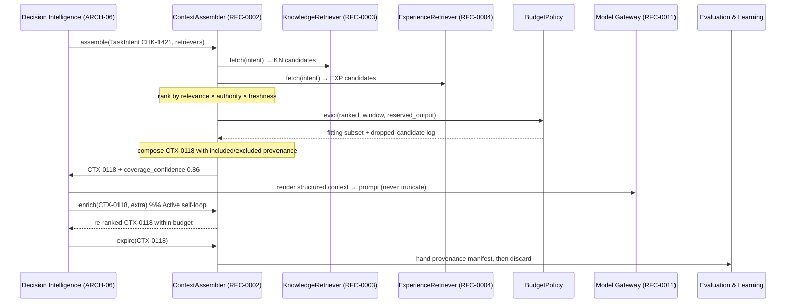

# RFC-0002 — Context Assembly Protocol

| Field | Value |
|---|---|
| RFC | `RFC-0002` |
| Title | Context Assembly Protocol |
| Status | **Accepted** |
| Authors | Architecture Office (`TEAM-090`) |
| Created | 2026-02-10 |
| Related | `ARCH-01`; `RFC-0003`, `RFC-0004`, `RFC-0005`, `RFC-0009`, `RFC-0011`; `ADR-0006`, `ADR-0011` |

---

## 1. Summary

This RFC defines the **Context Assembly Protocol**: the contract by which an Enterprise AI
Worker turns a structured task intent into the *right, minimal, sufficient* working set —
a context object (`CTX-###`) — and holds it only for the life of one task. It normatively
owns the `sdk.context.ContextAssembler` interface and the `context_object.schema.json`
contract, and it realizes the Context Layer frozen in `ARCH-01`.

The protocol covers the full assembly lifecycle: interpreting a `TaskIntent`, composing
candidates from multiple `Retriever` sources, ranking and selecting within the selected
model's token budget via a `BudgetPolicy`, composing an ordered payload with explicit
provenance for every included **and** excluded item, computing a coverage confidence,
iteratively re-retrieving during reasoning (the **Active** self-loop), and expiring cleanly
so provenance is handed to Evaluation (`ARCH-04`) and the Learning Engine (`ARCH-05`). Two
invariants are load-bearing throughout: context is **ephemeral** (`ADR-0006`) and context is
**structured, not a prompt string** (`ADR-0011`).

## 2. Motivation

`ARCH-01` establishes that the LLM is stateless and that everything a Worker reasons over at
runtime must be *deliberately assembled and injected*. The quality of that assembly is the
single largest lever on Worker performance: a Worker that reasons over the correct three
knowledge documents, two prior experiences and the exact target file succeeds where one
drowned in irrelevant tokens or starved of the decisive fact fails.

Without a precise protocol, three failure modes from `ARCH-01` become routine:

- **Context starvation and flooding.** Retrieval either misses the decisive fact or buries
  it under low-relevance material. A disciplined rank/select step with an explicit budget is
  the only defense.
- **Provenance loss.** If a Worker cannot say *why* each item entered its working set,
  Evaluation cannot diagnose a failure and Reflection cannot learn from it. Provenance must
  be mandatory and must record both inclusions and exclusions.
- **Silent truncation.** If the ECL over-fills the window and lets the provider truncate the
  tail, the most important instruction (often placed last) is silently dropped. Budget must
  be enforced **before** the Model Gateway call (`RFC-0011`), never after.

`ARCH-01` names the machinery but not the contract. This RFC fixes the contract so every
Worker type assembles context the same inspectable way.

## 3. Guide-level explanation

### 3.1 What context assembly is

Context assembly takes a `TaskIntent` — a structured statement of *what this task is, what
constrains it, and what success looks like* — and returns a `ContextObject`: an ordered,
budgeted, fully-attributed working set. It is emphatically **not** prompt-string
construction. The assembler produces a structured document; rendering it into a
provider-specific prompt is the Model Gateway's job (`RFC-0011`), which is exactly how the
Context Layer stays model-agnostic.

### 3.2 The running example

Throughout, we use the canonical `CHK-1421` guest-checkout loop. Decision Intelligence hands
the assembler a `TaskIntent` for `CHK-1421` (guest checkout in the Checkout Service,
`APP-003`). The assembler produces **`CTX-0118`**, which includes `KN-045` (checkout domain
rules), `KN-052` (idempotency standards), the experience `EXP-090` (guest carts must not
create `APP-015` loyalty accounts), the target file `PlaceOrder.java`, and the `APP-003`
service-catalog state. It records `KN-101` (out of scope) and `KN-047` (dropped for budget,
flagged) as excluded. Its `intent_ref` points at the plan `PLAN-0072`, and its
`coverage_confidence` is `0.86`.

### 3.3 The assembly lifecycle

### 3.4 Why ephemeral and structured

Two ADRs bound the protocol. `ADR-0006` (Context Ephemeral) means a `CTX-###` is archived
for audit, never treated as durable truth — durability belongs to Knowledge (`ARCH-02`) and
Experience (`ARCH-03`). `ADR-0011` (Structured Context Not Prompt Strings) means the working
set is a validated object, not free text, so it can be inspected, diffed, replayed
(`RFC-0024`) and scored independently of any provider.

## 4. Reference-level explanation

### 4.1 Interpreting the task intent

The assembler consumes a `sdk.context.TaskIntent`: `task_ref` (e.g. `CHK-1421`), `goal`,
`constraints`, `success_criteria`, and `apps` (e.g. `APP-003`). `TaskIntent` is produced by
Decision Intelligence (`ARCH-06`), not by the Context Layer — the Context Layer assembles,
it does not decide. The intent's `apps` and `constraints` seed retrieval filters (for
example, an `APP-012` intent carries a PCI constraint that flows into the sensitivity filter
of `RFC-0003`). The intent is the query the whole assembly step answers.

### 4.2 Multi-source retriever composition

Candidates arrive through the `sdk.context.Retriever` protocol, whose single method
`fetch(intent) -> Sequence[Candidate]` is deliberately uniform across sources. The assembler
is handed a `Sequence[Retriever]` and composes them without knowing their internals:

- a knowledge retriever backed by `sdk.knowledge.KnowledgeRetriever` (`RFC-0003`), itself
  using hybrid semantic + keyword + graph retrieval (`RFC-0005`, `ADR-0019`);
- an experience retriever backed by `sdk.experience.ExperienceRetriever` (`RFC-0004`);
- a live-state retriever over repos, the service catalog and telemetry.

Each returns `sdk.context.Candidate` records — `ref`, `kind`
(`knowledge | experience | code | state`), `score`, `tokens`, and an opaque `payload`. The
uniform `Candidate` shape is what lets the assembler rank heterogeneous sources on one scale
and lets new sources be added as plugins (`RFC-0027`) without changing the assembler.

### 4.3 Ranking and selecting within budget

`ContextAssembler.assemble(intent, retrievers)` gathers candidates, ranks them, and selects a
subset that fits the model's window. Ranking fuses per-candidate signals — relevance,
authority and freshness for knowledge (`RFC-0003`), applicability and measured value for
experience (`RFC-0004`) — into the comparable `Confidence` carried on `Candidate.score`,
consistent with the composable confidence model of `RFC-0009` (`ADR-0013`).

Selection is delegated to `sdk.context.BudgetPolicy`, which enforces the budget **before** the
Gateway call:

- `BudgetPolicy.fits(selected, window_tokens, reserved_output)` tests whether a selection fits
  the model window while reserving output headroom.
- `BudgetPolicy.evict(ranked, window_tokens, reserved_output)` returns the subset that fits,
  dropping lowest-value candidates first and **recording every drop in the dropped-candidate
  log**. High-scoring items evicted purely for budget (in the example, `KN-047` at `0.61`) are
  flagged so Reflection (`ARCH-05`) can inspect them first when an execution later fails — the
  common root cause "the fix was in a doc we dropped."

The `model_budget` object on `context_object.schema.json` records the `window_tokens` and
`reserved_output` the selection was made against (in `CTX-0118`, `200000` and `8000`).

### 4.4 Composition with provenance

The assembler composes the surviving candidates into a `ContextObject` conforming to
`context_object.schema.json`. Every item — included or excluded — is recorded as a
`common.schema.json#/$defs/provenance` entry (mirroring `sdk.objects.Provenance`): `source`
canonical ID, `kind`, human-readable `reason`, selection-time `score`, and `tokens`. The
schema requires `id`, `task`, `included` and `coverage_confidence`; the object also carries
`intent_ref` (here `PLAN-0072`), `model_budget`, `excluded` and `signals`. Recording
`excluded` provenance is not optional bookkeeping: the excluded set *is* the dropped-candidate
log, and it is the primary diagnostic surface for Evaluation and Reflection. No item may enter
`included` without a citable `source` — provenance is mandatory and immutable.

### 4.5 Coverage confidence

`ContextAssembler.coverage_confidence(context)` returns a `Confidence` in `[0.0, 1.0]`
(`RFC-0009`) estimating whether the working set is sufficient. Per `ARCH-01` it composes
retrieval confidence (did high-authority knowledge match strongly?), coverage (are all task
facets represented — target code, relevant rules, applicable experience, dependency context?),
freshness (`staleness_index`), and budget pressure (were high-value candidates dropped?).
`CTX-0118` reports `0.86`. This value is surfaced to Decision Intelligence, which may respond
by re-retrieving, narrowing the task, requesting a larger-window model via the Gateway, or
escalating to a human. Coverage confidence is a first-class signal and is **never silently
ignored**.

### 4.6 The Active re-retrieval self-loop

Context is not assembled once and frozen. `ContextAssembler.enrich(context, extra)`
implements the **Active** self-loop of the `ARCH-01` lifecycle: while reasoning, a Worker may
discover a new dependency (in the example, reading `PlaceOrder.java` reveals a call into the
Promotions Engine, `APP-008`), and Decision Intelligence requests additional retrieval.
`enrich` folds the new `Candidate`s in, re-ranks, re-applies the `BudgetPolicy` (evicting a
now-lower-value item to stay within budget), and updates the object's provenance — all with
**no durable write anywhere**. Enrichment uses eviction hysteresis to avoid budget thrash
(repeated evict/re-add cycles).

### 4.7 Ephemeral teardown

`ContextAssembler.expire(context)` tears the context object down at task end and returns the
`Sequence[Provenance]` manifest, handing it to Evaluation (`ARCH-04`) and the Learning Engine
(`ARCH-05`). This is where the ephemeral working set becomes durable *evidence about the
reasoning* without ever becoming durable *truth*: the manifest records what was in front of
the Worker and why, which Evaluation needs to score fairly and Reflection needs to diagnose.
Per `ADR-0006` the archived context is never authoritative and never re-served as knowledge.

### 4.8 Budget before the Gateway; structured, not prompt strings

Two rules are absolute. First, budget is enforced in the ECL by the `BudgetPolicy` **before**
the payload reaches the Model Gateway (`RFC-0011`); provider-side truncation is treated as a
bug, not a feature, because it silently drops the tail of an over-budget prompt. Second, the
`ContextObject` is a structured, schema-validated document, not a prompt string (`ADR-0011`):
the Gateway renders it into provider-specific form, which keeps the same `CTX-0118` usable
across any model the Router (`RFC-0010`) selects and makes it replayable (`RFC-0024`).

### 4.9 Owned contracts

This RFC normatively owns `sdk.context.ContextAssembler` and `context_object.schema.json`. It
references but does not redefine: `sdk.context.TaskIntent`, `sdk.context.Retriever`,
`sdk.context.Candidate`, and `sdk.context.BudgetPolicy` (all in the Context module and owned
here as its supporting types); `sdk.objects.Provenance` and `sdk.objects.ContextObject`;
`common.schema.json` (`provenance`, `confidence`, `eclObjectBase`); the knowledge contracts of
`RFC-0003`; and the experience contracts of `RFC-0004`.

## 5. Drawbacks

- **Ranking is the hard part.** The protocol fixes the *shape* of rank/select but not the
  ranking function; a weak ranker produces well-formed but poor contexts.
- **Provenance overhead.** Requiring a provenance entry for every included and excluded item
  adds bookkeeping and object size, especially for large candidate pools.
- **Re-retrieval cost.** The Active self-loop can trigger repeated retrieval and re-ranking,
  adding latency and token cost that must be governed by budget (`RFC-0029`).
- **Budget estimation error.** Token counting before the Gateway is model-family-specific;
  a mis-estimate risks either wasted headroom or a late rejection at the Gateway boundary.

## 6. Rationale & alternatives

The protocol deliberately separates *retrieval* (many composable `Retriever`s) from
*selection* (one `BudgetPolicy`) from *composition* (the assembler). This keeps each concern
independently testable and lets retrieval sources be added as plugins without touching budget
logic.

Alternatives considered:

- **Prompt-template assembly.** Rejected: violates `ADR-0011`, couples the working set to a
  provider, and destroys inspectability and replay.
- **Rely on provider truncation for budget.** Rejected: violates the `ARCH-01` "budget before
  the model" best practice and silently drops content (`ADR-0006` intent).
- **Assemble-once, no enrichment.** Rejected: real tasks discover dependencies mid-reasoning;
  a frozen context starves the Worker precisely when it learns what it needs.
- **Include-only provenance (no excluded set).** Rejected: the dropped-candidate log is the
  single most useful failure-diagnosis surface per `ARCH-01`.

## 7. Prior art

Generic, non-proprietary prior art only: the general **retrieval-augmented generation**
pattern of assembling external material for a stateless model; classic **information-retrieval
ranking** (relevance scoring, top-k selection, and cutoff below a relevance floor); the
**working-set / cache-eviction** tradition from operating systems (bounded capacity, evict the
least valuable, keep an eviction record); and **provenance/lineage tracking** from data
systems. No proprietary framework, product, or vendor context format is referenced.

## 8. Unresolved questions

- How is per-model token estimation kept accurate across providers without leaking
  provider-specific logic into the assembler? (Candidate: a capability-descriptor hint from
  the Gateway, `RFC-0011`.)
- What is the default relevance floor below which candidates are never selected, and is it per
  task type? (Interacts with `RFC-0005` scoring.)
- Should eviction hysteresis parameters be a fixed part of `BudgetPolicy` or a tunable learned
  by the Learning Engine per task type (`ARCH-01` "learned retrieval policies")?
- How much of the archived provenance manifest is retained, and for how long, given
  `ADR-0006`? Deferred in part to `RFC-0023` (Provenance & Decision Trace).

## 9. Future possibilities

- **Learned retrieval policies.** Promote retrieval strategies that historically produced
  high-`EVAL-###` executions into default context templates per task type (`RFC-0017`).
- **Predictive pre-fetch.** Pre-assemble likely context for recurring task shapes, validated
  against live state at task start, to cut latency.
- **Confidence-calibrated budgets.** Allocate more window to facets Evaluation has shown to be
  decisive for a task type.
- **Cross-Worker context reuse.** Share a validated, provenance-carrying context fragment
  between Workers touching the same incident rather than re-retrieving (`ARCH-07`).
- **Hierarchical / streaming context** for tasks exceeding any single window — summarize-and-
  drill rather than truncate.

---

*RFC-0002 is consistent with `CANON-001` and subordinate to it; where any statement here
conflicts with `CANON-001`, canon wins (`ADR-0050`).*
