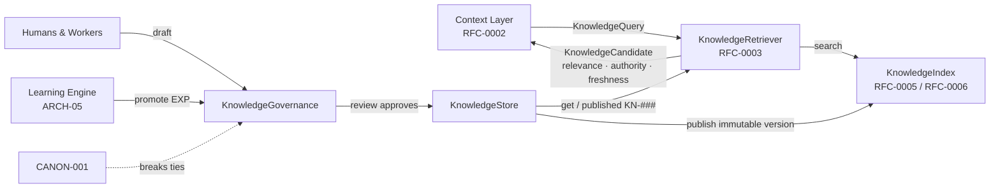

# RFC-0003 — Knowledge Retrieval Interface

| Field | Value |
|---|---|
| RFC | `RFC-0003` |
| Title | Knowledge Retrieval Interface |
| Status | **Accepted** |
| Authors | Architecture Office (`TEAM-090`) |
| Created | 2026-02-17 |
| Related | `ARCH-02`; `RFC-0002`, `RFC-0005`, `RFC-0006`, `RFC-0018`; `ADR-0004`, `ADR-0019` |

---

## 1. Summary

This RFC defines the **Knowledge Retrieval Interface**: the contract by which the Context
Layer (`ARCH-01`, `RFC-0002`) obtains scored candidates of governed enterprise truth from the
Knowledge Layer (`ARCH-02`), and by which knowledge is stored, published, deprecated and
governed. It normatively owns `sdk.knowledge.KnowledgeRetriever` and
`sdk.knowledge.KnowledgeStore`, together with the `knowledge_object.schema.json` contract.

The interface covers the query surface (`KnowledgeQuery` — text, filters, `top_k`, retrieval
`modes`), the scored result (`KnowledgeCandidate` — relevance, authority, freshness), the
store lifecycle (`get`, immutable `publish`, `deprecate`, `is_stale`), sensitivity
classification (`public`/`internal`/`pci`/`pii`), and governance (`review`,
`resolve_contradiction`, where canon breaks ties). Index internals are deferred to `RFC-0005`
(Semantic Search & Hybrid Retrieval) and graph relations to `RFC-0006` (Knowledge Graph
Model). Two invariants are load-bearing: knowledge is **immutable once published**
(`ADR-0004`) and retrieval is **hybrid** (`ADR-0019`).

## 2. Motivation

`ARCH-02` establishes that a stateless LLM knows generic software engineering but not that at
MCG a guest checkout must not create a loyalty account (`APP-015`), that `APP-012` is the PCI
boundary, or that the Rails monolith survives as `APP-018`. That enterprise truth is the
Knowledge Layer, and it is useless unless it can be **retrieved precisely, scored honestly,
and trusted**. A precise retrieval contract is what makes knowledge usable by every Worker
type without each reinventing query semantics.

Without this contract, the `ARCH-02` failure modes recur:

- **Retrieval blindness.** Relevant knowledge exists but a semantic-only search misses it
  (e.g. the exact token `APP-012`). The contract mandates hybrid modes (`ADR-0019`).
- **Stale truth.** Approved knowledge silently contradicts current reality. The contract
  exposes freshness scoring and an `is_stale` check (`ADR-0046`).
- **Contradiction.** Two knowledge items disagree and a Worker gets conflicting facts. The
  contract routes this to governance, where canon breaks ties.
- **Classification leak.** Sensitive knowledge served without policy handling. Sensitivity is
  a required, first-class field that travels with the candidate.

## 3. Guide-level explanation

### 3.1 What knowledge retrieval is

Knowledge retrieval answers a task-driven query with a ranked set of `KN-###` candidates, each
scored on three independent axes — how *relevant* it is to the query, how *authoritative* it
is (canon > owner-approved > provisional), and how *fresh* it is. The Context Layer fuses
these into its selection (`RFC-0002` §4.3); the Knowledge Layer's job is to return honest,
separable scores, not to decide inclusion.

### 3.2 The running example

For `CHK-1421` (guest checkout, `APP-003`), the Context Layer issues a `KnowledgeQuery` for
order-placement rules filtered to `APP-003`. The retriever returns **`KN-045`** ("Checkout
domain rules") with high relevance and `owner-approved` authority, and **`KN-052`** ("API
standards — idempotency") because guest orders require idempotency keys. `KN-045` is the
document whose rule #1 — *a guest checkout must not create a Loyalty (`APP-015`) account* —
is the canonical fact the whole `CHK-1421` loop turns on; it is later reinforced by promoting
the experience `EXP-090` into it (`RFC-0018`). Out-of-scope `KN-101` (marketplace seller
onboarding) scores low and is not selected.

### 3.3 Store and retriever are distinct

Two contracts, two jobs. `KnowledgeStore` is the **system of record** — it publishes
immutable versions, deprecates without deleting, and reports staleness. `KnowledgeRetriever`
is the **read path into context** — it returns scored candidates using hybrid retrieval. The
store guarantees the truth is durable and governed; the retriever guarantees it is findable.

## 4. Reference-level explanation

### 4.1 The query surface

Retrieval is driven by `sdk.knowledge.KnowledgeQuery`, a frozen record with: `text` (the
task-derived natural-language query); `filters`, a mapping such as
`{"app": "APP-003", "sensitivity": "internal"}` used to constrain candidates; `top_k`
(default `20`); and `modes`, defaulting to `("semantic", "keyword", "graph")`. The `modes`
field is the surface through which hybrid retrieval (`ADR-0019`) is requested, but *how* each
mode is executed — vector index, lexical index, graph traversal — is owned by `RFC-0005` and
`RFC-0006`, not here. This RFC fixes only the query shape and the guarantee that all requested
modes contribute to the returned candidate set.

### 4.2 The scored candidate

`sdk.knowledge.KnowledgeCandidate` wraps a `sdk.objects.KnowledgeObject` with three separate
`Confidence` scores:

- **relevance** — strength of match between the query and the object;
- **authority** — canon-derived (`canon`) ranks highest, then `owner-approved`, then
  `provisional`, read from the object's `authority` field;
- **freshness** — recency of validation against the domain freshness SLA, derived from the
  object's `freshness` block.

These are returned **separately and never pre-fused**, so the Context Layer can weight them
per task (`RFC-0002` §4.3) consistent with the composable-confidence model of `RFC-0009`
(`ADR-0013`). A stale or low-authority candidate is returned with honest low scores rather
than silently withheld, so the caller can include it with a caveat if nothing better exists.

### 4.3 Knowledge object shape

`knowledge_object.schema.json` (mirroring `sdk.objects.KnowledgeObject`) requires `id`,
`title`, `body`, `owner_team`, `sensitivity`, `authority`, `version` and `status`, over the
`common.schema.json#/$defs/eclObjectBase`. `status` is one of `drafted`, `in_review`,
`approved`, `published`, `stale`, `deprecated`. Optional blocks carry `app`, `canon_refs`
(pattern-checked `CANON-###` references), `freshness` (`last_validated`, `sla_days`, `index`),
`relations` (owned by `RFC-0006`), `superseded_by`, and `promoted_from_experience` (the
`EXP-###` that graduated into it, set by `RFC-0018`). `KN-045` carries `owner_team: TEAM-004`,
`app: APP-003`, `sensitivity: internal`, `authority: owner-approved`, and a `depends_on`
relation to `KN-052`.

### 4.4 Store lifecycle (immutable once published)

`sdk.knowledge.KnowledgeStore` is the abstract system of record:

- `get(knowledge_id)` returns a published object by ID. Per `ADR-0004` a published object is
  **immutable**; retrieval always returns exactly the bytes that were governed.
- `publish(draft)` publishes an approved draft, assigning it a `version`. It **never mutates a
  prior version** — a new fact is a new version, and old versions are retained. This is the
  expand-only discipline that keeps `RFC-0024` replay faithful.
- `deprecate(knowledge_id, superseded_by)` marks an item deprecated and records its successor
  (if any). Deprecated knowledge is **retained for history, never hard-deleted** (mirroring
  CANON's "IDs are never reused"), and is excluded from default retrieval.
- `is_stale(knowledge_id)` reports a freshness-SLA breach (`ADR-0046`), the signal that moves
  an item to `stale` and routes it for revalidation.

Because publication is immutable, "editing" `KN-045` means publishing `version: 5`; the
`version: 4` bytes that `EVAL-0061` was scored against remain retrievable forever.

### 4.5 The retrieval call

`sdk.knowledge.KnowledgeRetriever.retrieve(query)` returns a `Sequence[KnowledgeCandidate]`
scored on relevance, authority and freshness, using hybrid retrieval (`ADR-0019`). It reads
published objects from the store and searches them through the `sdk.knowledge.KnowledgeIndex`
(vector / lexical / graph) whose internals `RFC-0005` owns. The retriever applies `filters`
and `sensitivity` handling but **does not** select the final working set — that is the Context
Layer's `BudgetPolicy` (`RFC-0002`). Deprecated and drafted items are excluded from default
retrieval; only `published` (and, with a caveat, `stale`) objects are candidates.

### 4.6 Sensitivity classification

Every knowledge object carries a required `sensitivity` from `common.schema.json`:
`public`, `internal`, `pci`, or `pii` (`ADR-0043`). The classification **travels with the
fact into context**: `KnowledgeQuery.filters` may constrain by sensitivity, and the retriever
must honor policy constraints originating in `TaskIntent` (`RFC-0002` §4.1). Knowledge inside
the `APP-012` PCI boundary is classified `pci` and is never returned into a context lacking
the corresponding clearance. Fine-grained policy enforcement and redaction are elaborated in
`RFC-0030`; this RFC guarantees only that the label is mandatory, immutable, and carried on
every candidate.

### 4.7 Governance

`sdk.knowledge.KnowledgeGovernance` guards what becomes truth:

- `review(draft)` returns whether a draft may be published. Publication is a governed human
  act — nothing enters canon-adjacent knowledge unvetted, including Worker-authored and
  experience-promoted drafts.
- `resolve_contradiction(a, b)` returns the ID that wins when two items disagree. **Canon
  breaks ties** (`CANON-001`): a candidate whose `authority` is `canon` or whose `canon_refs`
  align with canon prevails over a `provisional` assertion. Contradictions are *surfaced and
  resolved*, never silently reconciled.

The promotion path — how a repeatedly-validated experience (`EXP-090`) is proposed by the
Learning Engine and folded into `KN-045` — is defined by `RFC-0018`; this RFC provides the
`review` gate and the `promoted_from_experience` field that record the graduation.

### 4.8 Owned contracts and deferrals

This RFC normatively owns `sdk.knowledge.KnowledgeRetriever`, `sdk.knowledge.KnowledgeStore`,
and `knowledge_object.schema.json`. It references but does not redefine
`sdk.knowledge.KnowledgeQuery`, `sdk.knowledge.KnowledgeCandidate` and
`sdk.knowledge.KnowledgeGovernance` (supporting types in the Knowledge module), and
`common.schema.json` (`sensitivity`, `confidence`, `eclObjectBase`). It **defers**:
`sdk.knowledge.KnowledgeIndex` and hybrid-mode mechanics to `RFC-0005`; the `relations` graph
model to `RFC-0006`; and the promotion governance workflow to `RFC-0018`.

## 5. Drawbacks

- **Three-axis scoring is more to compute** than a single relevance number, and requires each
  index backend to expose authority and freshness, not just similarity.
- **Immutability has a cost.** Every correction spawns a new version; consumers must track
  which version they read (mitigated by `RFC-0024`).
- **Governance is a bottleneck.** Requiring review before publication slows knowledge growth;
  the freshness SLA and staleness alarms partly automate the pressure.
- **Sensitivity is only as good as its labels.** A mislabeled object can leak; label
  correctness depends on authoring discipline and `SEC` review.

## 6. Rationale & alternatives

Separating `KnowledgeStore` (durable, immutable, governed) from `KnowledgeRetriever` (scored,
hybrid read path) mirrors the `ARCH-02` distinction between *holding truth* and *finding
truth*, and lets index technology evolve (`RFC-0005`) without touching the system of record.

Alternatives considered:

- **Mutable knowledge in place.** Rejected: violates `ADR-0004`, destroys the audit trail, and
  makes replay (`RFC-0024`) and fair evaluation impossible.
- **Single fused relevance score.** Rejected: collapses authority and freshness into relevance,
  hiding exactly the signals the Context Layer needs to weigh (`ADR-0013`).
- **Semantic-only retrieval.** Rejected: `ARCH-02` Example C shows a semantic-only search
  missing the exact token `APP-012`; hybrid is canon (`ADR-0019`).
- **Auto-resolve contradictions by recency.** Rejected: newest is not truest; canon and
  authority must arbitrate, with a human in the loop.

## 7. Prior art

Generic, non-proprietary prior art only: classic **information retrieval** (inverted indexes,
vector similarity, and the union of lexical and semantic recall); **content-management
versioning** with immutable published revisions and retained history; **data-classification /
labeling** practice where a sensitivity tag travels with the datum; and **editorial governance**
workflows (draft → review → publish → deprecate). No proprietary search engine, vector
database, or knowledge-base product is referenced.

## 8. Unresolved questions

- What is the default weighting of relevance vs. authority vs. freshness before the Context
  Layer re-weights, and should it be learned per task type (`RFC-0017`)?
- How are freshness SLAs sourced per domain — declared on the object, inherited from the owning
  team, or driven by Data Platform lineage (`ARCH-02` future evolution)?
- Should `is_stale` be a pull check or should staleness alarms push into the Signals Bus
  (`RFC-0028`) the moment an upstream contract changes?
- What quorum resolves a contradiction that canon does not directly settle? Deferred to
  `RFC-0018` and `RFC-0030`.

## 9. Future possibilities

- **Confidence-calibrated retrieval.** Tune ranking by which `KN-###` items historically led
  to high `EVAL-###` scores (`RFC-0017`).
- **Freshness automation.** Auto-flag stale knowledge the instant an upstream schema or service
  changes, using Data Platform lineage (`ARCH-02`).
- **Federated knowledge stores.** Per-domain stores (QA, Finance, Security) sharing one index
  and governance, supporting future Worker types without a central bottleneck.
- **Active curation.** Workers propose edits when they detect staleness during execution,
  routed automatically through the `review` gate.

---

*RFC-0003 is consistent with `CANON-001` and subordinate to it; where any statement here
conflicts with `CANON-001`, canon wins (`ADR-0050`).*
