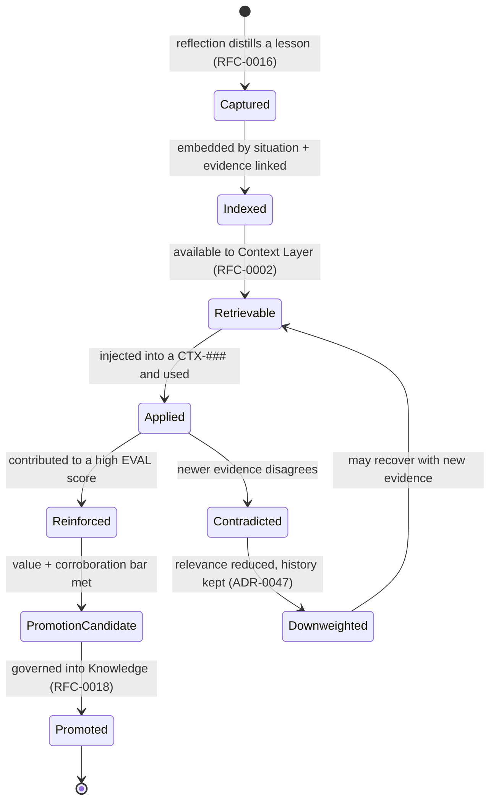

# RFC-0004 — Experience Retrieval Interface

| Field | Value |
|---|---|
| RFC | `RFC-0004` |
| Title | Experience Retrieval Interface |
| Status | **Accepted** |
| Authors | Architecture Office (`TEAM-090`) |
| Created | 2026-02-24 |
| Related | `ARCH-03`; `RFC-0002`, `RFC-0016`, `RFC-0018`; `ADR-0005`, `ADR-0047` |

---

## 1. Summary

This RFC defines the **Experience Retrieval Interface**: the contract by which the Context
Layer (`ARCH-01`, `RFC-0002`) obtains situationally-applicable lessons (`EXP-###`) from the
Experience Layer (`ARCH-03`), and by which experience is appended, reinforced, down-weighted
and surfaced for promotion. It normatively owns `sdk.experience.ExperienceRetriever` and
`sdk.experience.ExperienceStore`, together with the `experience_object.schema.json` contract.

The interface covers the query surface (`SituationDescriptor` — **structural**, not merely
semantic: `task_type`, `apps`, `failure_class`), the scored result (`ExperienceMatch` —
applicability + value), the append-only store lifecycle (`append`, `reinforce`, `downweight`,
`promotion_candidates`), retrieval ranked by structural applicability and measured value /
outcome lift above an applicability floor, decay and contradiction handling that **retains
history**, lineage back to the origin execution / `EVAL-###` / `REF-###`, and handoff of
promotion candidacy to `RFC-0018`. Two invariants are load-bearing: experience is
**append-only** (`ADR-0005`) and contradicted lessons are **down-weighted, never deleted**
(`ADR-0047`).

## 2. Motivation

`ARCH-03` establishes that a stateless LLM cannot remember that last quarter a pricing change
during a promotion window caused a cache-invalidation incident — but the Experience Layer can.
Experience is the difference between an organization that repeats its mistakes and one that
compounds its competence. That value is realized only if past lessons can be **retrieved for
the right situation, scored by proven value, and trusted not to overfit**.

Without a precise retrieval contract, the `ARCH-03` failure modes recur:

- **Overfitting to the past.** A narrow lesson gets applied to a superficially-similar but
  genuinely different situation. The contract makes matching **structural** (same app, same
  task type, same failure class), not merely semantic, and enforces an applicability floor.
- **Stale lesson.** An experience that no longer holds keeps being applied. The contract
  down-weights on contradiction while retaining history (`ADR-0047`).
- **Traceability loss.** A lesson with no link to its origin cannot be trusted or audited. The
  contract makes lineage mandatory at capture.
- **Promotion without proof.** A lucky one-off becomes "knowledge." The contract surfaces only
  repeatedly-validated candidates and hands the governed decision to `RFC-0018`.

## 3. Guide-level explanation

### 3.1 What experience retrieval is

Experience retrieval answers a **situation** — not a text query — with a ranked set of
`EXP-###` lessons, each scored on two axes: how *applicable* it is to the current situation
(structural similarity), and how much *value* it has demonstrated (measured outcome lift). The
Context Layer injects the survivors into a `CTX-###` (`RFC-0002`); the Experience Layer's job
is to match situations honestly and rank by proven value, not by recency or keyword overlap.

### 3.2 The running example

For `CHK-1421` (guest checkout), the Context Layer queries with the situation
`{task_type: feature_change, apps: [APP-003, APP-015]}`. The retriever returns **`EXP-090`**
("Guest carts must not create loyalty accounts"), which scores `0.91` on applicability and is
injected into `CTX-0118` (see `RFC-0002` and `ARCH-01` Example A). The Worker consequently
adds a test asserting no `APP-015` loyalty account is created for guests — *learning from a
mistake it never personally made*. `EXP-090`'s lineage traces to origin execution `PR-0207`,
evaluation `EVAL-0044` and reflection `REF-0019`, and it lists `PR-0312` among its prevented
regressions; its `status` is `promotion_candidate`, later folded into `KN-045` rule #1 via
`RFC-0018`.

### 3.3 Structural matching, and the append-only guarantee

The defining choice of this interface is **structural** matching. "Same app + same failure
class" beats "sounds similar," because semantic similarity alone is what causes a narrow lesson
to be misapplied. Alongside it sits the append-only guarantee: the store only ever grows.
Reinforcement adds evidence; contradiction reduces relevance; neither ever erases.

## 4. Reference-level explanation

### 4.1 The situation query surface

Retrieval is driven by `sdk.experience.SituationDescriptor`, a frozen record whose fields are
deliberately **structural**: `task_type` (e.g. `feature_change`), `apps` (e.g.
`[APP-003, APP-015]`), an optional `failure_class` (e.g. `unintended_side_effect`), and an
open `extra` mapping for additional structural facets. This is not a natural-language query —
it is a typed description of *the shape of the situation*, which is why the matching resists
the overfitting that pure semantic search invites (`ADR-0019` motivates structural similarity).
The descriptor mirrors the required `situation` block of `experience_object.schema.json`
(`task_type`, `apps`, `failure_class`), so a stored lesson and an incoming situation are
compared on the same structural keys.

### 4.2 The scored match

`sdk.experience.ExperienceRetriever.retrieve(situation, top_k=10)` returns a
`Sequence[ExperienceMatch]`. Each `sdk.experience.ExperienceMatch` wraps a
`sdk.objects.ExperienceObject` with two separate `Confidence` scores:

- **applicability** — how closely the current situation matches the situation that produced
  the lesson, composed structurally (same app? same task type? same failure class?) rather
  than by surface text similarity;
- **value** — the lesson's intrinsic worth, dominated by **measured outcome lift** (do
  executions that used it score higher on `EVAL-###` than comparable ones that did not?),
  together with evidence strength and non-contradiction.

Results are **ranked by structural applicability and measured value**, and only lessons above
an **applicability floor** are returned — below the floor a superficially-similar lesson is
excluded rather than risked. Both scores are passed forward, unfused, so the Context Layer and
Decision Intelligence can weigh them (`RFC-0002` §4.3, `RFC-0009`, `ADR-0013`).

### 4.3 Experience object shape

`experience_object.schema.json` (mirroring `sdk.objects.ExperienceObject`) requires `id`,
`title`, `situation`, `lesson`, `evidence` and `status`, over the
`common.schema.json#/$defs/eclObjectBase`. `status` is one of `captured`, `indexed`,
`retrievable`, `applied`, `reinforced`, `promotion_candidate`, `promoted`, `downweighted`.
The `value` block carries `application_frequency`, `outcome_lift`, `corroboration`
(`none`/`weak`/`moderate`/`strong`) and `contradiction_rate`. The `evidence` block and the
optional `promoted_to_knowledge` field are the lineage surface (§4.6). `EXP-090` carries
`situation: {task_type: feature_change, apps: [APP-003, APP-015], failure_class:
unintended_side_effect}`, `value: {application_frequency: 4, outcome_lift: 0.23, corroboration:
strong, contradiction_rate: 0.0}`, and `status: promotion_candidate`.

### 4.4 Append-only store lifecycle

`sdk.experience.ExperienceStore` is the abstract append-only system of record (`ADR-0005`):

- `append(experience)` adds a new lesson and returns it. It **never overwrites**; a refined
  lesson is expressed by adding evidence, not by mutation.
- `reinforce(experience_id, evidence)` attaches corroborating evidence (a new `EVAL-###` or
  `PR-####`) and updates the value scores — this is how `application_frequency` and
  `outcome_lift` grow and how a lesson moves toward `reinforced`.
- `downweight(experience_id, contradiction)` reduces relevance when newer evidence disagrees,
  **retaining the full history** (`ADR-0047`). A down-weighted lesson is not deleted and may
  recover to `retrievable` if later evidence corroborates it again.
- `promotion_candidates()` returns the lessons whose value and corroboration cross the
  promotion bar, for handoff to `RFC-0018`.

### 4.5 Decay and contradiction (retain history)

Decay is expressed purely through `downweight`, never deletion. When live state or the
Knowledge Layer signals that a lesson no longer holds, `downweight` lowers its relevance and
records the contradicting reference; the lesson's `contradiction_rate` rises and its ranking
falls, but the object and its evidence remain for audit and for possible recovery. This is the
`ARCH-03` "append, never erase" best practice made contractual (`ADR-0047`): the learning
history is a permanent, inspectable record, so Reflection (`RFC-0016`) can reason about *why*
a lesson stopped holding, not just that it did.

### 4.6 Lineage

Every experience must trace to its origin at capture — there are no orphan lessons. The
`evidence` block links `origin_execution` (e.g. `PR-0207`), `evaluation` (an `EVAL-###`, e.g.
`EVAL-0044`), `reflection` (a `REF-###`, e.g. `REF-0019`), and `prevented_regressions` (later
executions the lesson helped catch, e.g. `PR-0312`). This lineage is what makes a lesson
trustable and auditable: a retriever must not return a lesson whose lineage cannot resolve
(referential integrity, `ADR-0022`). The optional `promoted_to_knowledge` field completes the
trace forward to the `KN-###` the lesson graduated into.

### 4.7 Promotion candidacy handed to RFC-0018

The Experience Layer *identifies* promotion candidates but does **not** promote. When a lesson
accumulates enough measured value and corroboration (in the example, `EXP-090`:
`application_frequency: 4`, `outcome_lift: 0.23`, `corroboration: strong`), `status` moves to
`promotion_candidate` and it appears in `promotion_candidates()`. The governed decision to fold
it into Knowledge — proposed by the Learning Engine, approved by governance, folded into
`KN-045` rule #1 — belongs to `RFC-0018` and the Knowledge governance contract (`RFC-0003`
§4.7). Per `ARCH-03`, a promoted experience **remains in the Experience Layer for
traceability** even after its lesson becomes truth.

### 4.8 Owned contracts and deferrals

This RFC normatively owns `sdk.experience.ExperienceRetriever`,
`sdk.experience.ExperienceStore`, and `experience_object.schema.json`. It references but does
not redefine `sdk.experience.SituationDescriptor` and `sdk.experience.ExperienceMatch`
(supporting types in the Experience module), `sdk.objects.ExperienceObject`, and
`common.schema.json` (`confidence`, `eclObjectBase`, ID patterns). It **defers**: how
reflections distill lessons into `append` calls to `RFC-0016` (Reflection Pipeline); and the
governed promotion of candidates into Knowledge to `RFC-0018` (Experience Promotion to
Knowledge).

## 5. Drawbacks

- **Structural matching needs structured situations.** If reflections capture a weak or
  inconsistent `situation` block, structural applicability degrades toward semantic guessing.
- **Value scoring lags.** `outcome_lift` and `application_frequency` are only meaningful after
  a lesson has been applied several times; new lessons are hard to rank (cold start).
- **Append-only growth.** The store only grows; without consolidation during reflection,
  near-duplicate low-value lessons can dilute retrieval (mitigated by value-based ranking and
  promotion pruning).
- **Applicability floor tuning.** Set too high, useful lessons are missed; too low, overfitting
  returns.

## 6. Rationale & alternatives

Separating retrieval (situation → scored matches) from the append-only store mirrors the
`ARCH-03` distinction between *serving lessons* and *accumulating them*, and keeps the
"forever" guarantees (append-only, down-weight-not-delete) enforceable in one place.

Alternatives considered:

- **Semantic-only experience search.** Rejected: `ARCH-03` shows semantic similarity causes
  overfitting; structural matching is the mitigation.
- **Delete stale lessons.** Rejected: violates `ADR-0005`/`ADR-0047` and destroys the learning
  history Reflection depends on; down-weighting preserves recoverability.
- **Rank by recency.** Rejected: newest is not most valuable; ranking by measured outcome lift
  is the `ARCH-03` best practice.
- **Promote inside the Experience Layer.** Rejected: promotion is a governed act that changes
  enterprise truth and must go through `RFC-0018` and Knowledge governance.

## 7. Prior art

Generic, non-proprietary prior art only: **case-based reasoning** (retrieve past cases whose
situation resembles the current one, structurally indexed); **append-only / event-sourced
logs** (immutable, monotonically growing records with derived views); **relevance feedback and
value-weighted ranking** from information retrieval; and **provenance/lineage** practice from
data systems (every derived artifact links to its source). No proprietary memory framework,
agent product, or vector database is referenced.

## 8. Unresolved questions

- What is the default applicability floor, and should it vary by `task_type` or `failure_class`
  (learned via `RFC-0017`)?
- How is `outcome_lift` computed rigorously — matched-comparison against executions that did
  not use the lesson, or a simpler correlation — and where does that computation live?
- Should down-weighted lessons be excluded from default retrieval entirely below a threshold,
  or always returned with a low score and a caveat (as `RFC-0003` does for stale knowledge)?
- What decay model governs recovery from `downweighted` back to `retrievable`? Deferred in part
  to `RFC-0016`.

## 9. Future possibilities

- **Value-weighted retrieval** that prioritizes lessons with proven outcome lift over merely
  frequent ones.
- **Experience clustering** into higher-order "playbooks" Decision Intelligence can invoke
  wholesale for recurring situations.
- **Cross-domain transfer** — recognizing that a QA Worker's lesson (e.g. deterministic clocks
  for async tests) transfers structurally to a Support Worker (`ARCH-03` Example C, `ARCH-07`).
- **Counterfactual experiences** — capturing not only what happened but what *would* have
  prevented a failure, seeded by the dropped-candidate log of `RFC-0002`.
- **Principled decay models** so fast-moving areas forget quickly while stable areas retain
  longer.

---

*RFC-0004 is consistent with `CANON-001` and subordinate to it; where any statement here
conflicts with `CANON-001`, canon wins (`ADR-0050`).*
