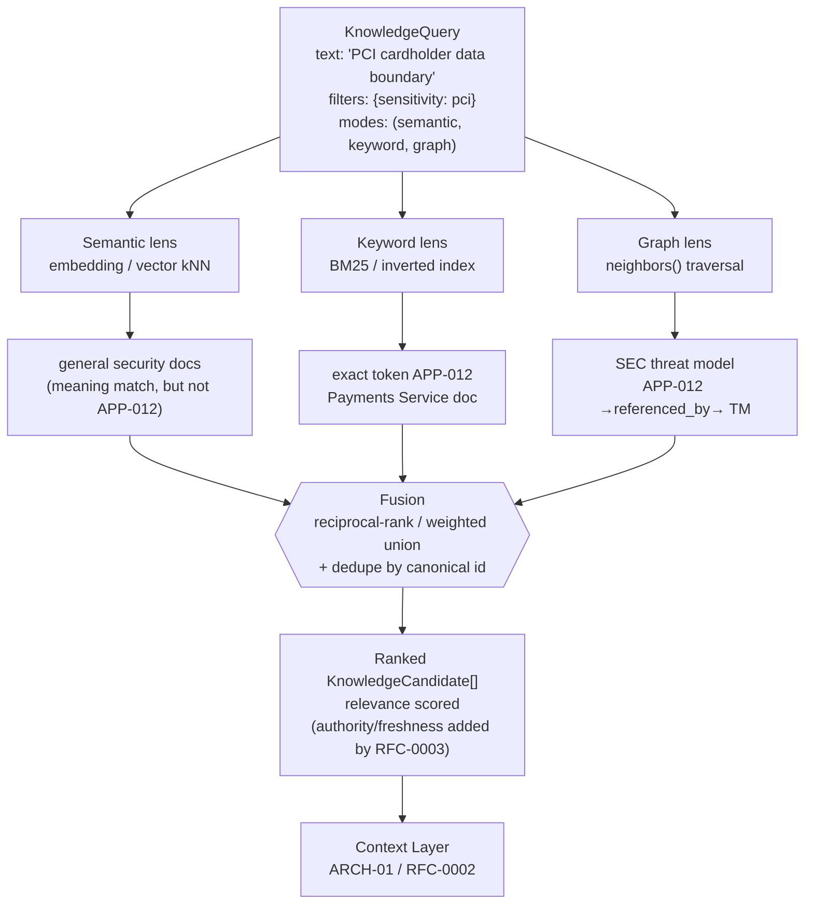

# RFC-0005 — Semantic Search & Hybrid Retrieval

| Field | Value |
|---|---|
| RFC | `RFC-0005` |
| Title | Semantic Search & Hybrid Retrieval |
| Status | **Accepted** |
| Authors | Architecture Office (`TEAM-090`) |
| Created | 2026-03-03 |
| Related | `ARCH-02`; `RFC-0003`, `RFC-0006`, `RFC-0002`, `RFC-0027`; `ADR-0019` |

---

## 1. Summary

This RFC defines **how the Knowledge Layer (`ARCH-02`) actually finds things**. It specifies the
retrieval mechanics beneath `sdk.knowledge.KnowledgeRetriever` (owned by `RFC-0003`) by
normatively owning `sdk.knowledge.KnowledgeIndex` — the pluggable backend that runs the three
retrieval modes declared in `KnowledgeQuery.modes`: **semantic** (embedding/vector),
**keyword/lexical**, and **graph** (relationship traversal). It defines how the three modes'
result sets are **fused** into a single ranked list of `KnowledgeCandidate` objects carrying a
`relevance` score, and it draws the boundary between **relevance** (owned here) and
**authority/freshness** (owned by `RFC-0003`).

The central claim, canonized by `ADR-0019`, is that **no single retrieval mode is sufficient**:
semantic search misses exact tokens (`APP-012`, `KN-052`), lexical search misses paraphrase, and
graph traversal finds neighbours neither of the other two can reach. Hybrid retrieval — running
all three and fusing the results — is therefore not an optimization but a correctness requirement,
and it is why the Knowledge Layer's "retrieval blindness" failure mode (`ARCH-02`) is designed out.

## 2. Motivation

`ARCH-02` lists retrieval blindness — "relevant knowledge exists but isn't found (semantic-only
miss)" — as a first-class failure mode, and its Best Practice #4 is blunt: *"Retrieve three ways.
Semantic finds meaning, keyword finds exact terms/IDs, graph finds relationships — use all
three."* `CANON-001` §9.1 likewise requires knowledge to be "retrievable (semantic + keyword
search)." A Worker that cannot reliably find the one document stating that *guest checkout must
not create a loyalty account* (`KN-045`, rule #1) will confidently reproduce a regression the
organization already learned to avoid (`EXP-090`).

Semantic-only retrieval fails in three recurring, demonstrable ways inside MCG:

- **Exact identifiers.** Embeddings smear `APP-012` toward a generic "payments service" region
  of vector space; a query that must land on *exactly* `APP-012` (the PCI boundary) may instead
  surface `APP-013` (Wallet) or `APP-009` (OMS) — semantically adjacent but wrong.
- **Rare tokens.** Idempotency-key header names, error codes, Kafka topic names and
  `INC-2026-007`-style identifiers occur too rarely to embed well; lexical match finds them
  deterministically.
- **Relationships.** "What threat model applies to the cardholder-data boundary?" is a
  *relationship* question — the answer is not textually similar to the query but one graph hop
  away (`APP-012 →referenced_by→ SEC threat model`). Only traversal reaches it.

`ADR-0019` (Hybrid Retrieval) resolves this by decision: the index MUST support all three modes
and MUST fuse them. This RFC is the design that realizes that decision against `sdk.knowledge`.

## 3. Guide-level explanation

### 3.1 One query, three lenses, one ranked list

A retrieval request is a `KnowledgeQuery` (a frozen dataclass in `sdk.knowledge`): a `text`
string, a `filters` map (e.g. `{"app": "APP-012", "sensitivity": "pci"}`), a `top_k`, and a
`modes` tuple defaulting to `("semantic", "keyword", "graph")`. The Context Layer (`ARCH-01`)
builds this query from task intent (`RFC-0002`). Each requested mode is a **lens** on the same
corpus — **semantic** finds *meaning* ("cardholder data boundary" ≈ "PCI scope isolation") even
with zero shared words; **keyword/lexical** finds *exact strings* (`APP-012`, header names, error
codes) that embeddings blur; **graph** finds *neighbours* (the `SEC` threat model that references
`APP-012`) by traversing typed relations (`RFC-0006`). Each lens produces a ranked list, and
**fusion** (§4.4) merges them into one ranked sequence of `KnowledgeCandidate` objects — each
carrying a `relevance` score — which `KnowledgeRetriever.retrieve` (`RFC-0003`) hands to the
Context Layer. The modes are specified in §4.2.

### 3.2 The canonical hybrid story (ARCH-02 Example C)

A **Security Worker** hardening the payments path queries *"PCI cardholder data boundary."*

Semantic search alone returns *general* security documentation and misses the exact token
`APP-012`; keyword catches it deterministically; graph traversal adds the `SEC`-owned threat model
one hop away. The union — impossible from any single lens — is why `ADR-0019` makes hybrid canon.

Relevance is only one of three scores a candidate carries: **authority** and **freshness** are
computed and owned by `RFC-0003`, and the index is deliberately blind to trust and currency (§4.5).

## 4. Reference-level explanation

### 4.1 `sdk.knowledge.KnowledgeIndex` (normatively owned here)

`KnowledgeIndex` is a `typing.Protocol` in `sdk/knowledge/interfaces.py`. This RFC is its sole
normative owner (`RFC-0001` §4.5); `RFC-0003` and `RFC-0006` cite it but must not redefine it.
Its three members:

| Member | Contract |
|---|---|
| `upsert(obj: KnowledgeObject) -> None` | Index a published object across all backing structures (§4.6). Idempotent by `obj.id` + `version`. |
| `search(query: KnowledgeQuery) -> Sequence[KnowledgeCandidate]` | Run the modes named in `query.modes`, fuse (§4.4), and return `top_k` candidates ranked by `relevance`. |
| `neighbors(node: CanonicalId, relation: str) -> Sequence[CanonicalId]` | Single-hop graph traversal over one relation type. This RFC owns the signature; `RFC-0006` owns the relation semantics and multi-hop composition. |

### 4.2 The three retrieval modes (`KnowledgeQuery.modes`)

`modes` is a `Sequence[str]` drawn from `{"semantic", "keyword", "graph"}`, defaulting to all
three. The index MUST honor exactly the modes requested (a lexical-only lookup for an exact ID
is legitimate and cheaper) and MUST NOT silently add a mode a caller excluded.

- **`semantic`** — Embedding-based dense retrieval: `text` is encoded into a query vector,
  knowledge bodies and titles are pre-embedded at `upsert`, and ranking is by vector similarity.
  Any embedding model behind the same contract works. Strength: paraphrase and meaning. Weakness:
  exact tokens, rare identifiers, negation.
- **`keyword`** — Sparse lexical retrieval over an inverted index with a BM25-family scoring
  function (term frequency × inverse document frequency, length-normalized). Strength: exact
  tokens (`APP-012`), operators, code symbols. Weakness: vocabulary mismatch / synonymy.
- **`graph`** — Relationship traversal seeded from anchor nodes (entities named in the query or
  surfaced by the other lenses), expanded via `neighbors(node, relation)` over the typed relations
  of `RFC-0006`. Strength: "related to" questions. Weakness: needs good anchors and bounded depth.

`query.filters` are applied as hard predicates *within* each mode before fusion, so a
`sensitivity: pci` filter never leaks a non-PCI document into any lens.

### 4.3 `KnowledgeCandidate` and the `relevance` score

`search` returns `KnowledgeCandidate` objects (frozen dataclass, `sdk.knowledge`): a
`KnowledgeObject` plus three `Confidence` scores — `relevance`, `authority`, `freshness`. **This
RFC populates `relevance`**; the fused rank position is normalized into `relevance ∈ [0,1]` per
`common.schema.json#/$defs/confidence` and `RFC-0009`. `authority` and `freshness` are populated
by `RFC-0003` (from `KnowledgeObject.authority` and its `freshness` block), which MAY overwrite
placeholder values the index emits before the candidate reaches the Context Layer.

### 4.4 Score fusion

Each active mode yields a ranked list; fusion combines them into one. Two generic, order-based
strategies are supported (order-based because vector cosine and BM25 are not on the same scale):

- **Reciprocal-rank fusion (RRF)** — the default. For a document `d` at rank `r_m` in mode `m`,
  the fused score is `Σ_m w_m / (k + r_m)` over the modes that returned it, with smoothing constant
  `k` and optional per-mode weights `w_m`. Robust, parameter-light, needs no cross-scale calibration.
- **Weighted union** — min-max normalize per-mode scores then weighted-sum; used when a deployment
  has calibrated weights (via the §4.7 plugin points).

Fusion MUST **deduplicate by canonical ID**: a document found by two lenses is one candidate
whose fused score reflects cross-mode agreement — items surfaced by multiple lenses rank higher,
the desired behaviour — and the fused list is truncated to `query.top_k`. In the Example C story,
`APP-012`'s Payments doc (keyword) and the threat model (graph) are distinct candidates; had
semantic *also* surfaced the doc, RRF would have boosted it for that agreement.

### 4.5 Separation of relevance, authority and freshness

The index ranks strictly on **relevance to the query**, deliberately ignorant of trust and
currency. This separation is load-bearing:

- **Relevance** (this RFC) — "does this text answer the query?" From fusion.
- **Authority** (`RFC-0003`) — "how much should we trust it?" From `KnowledgeObject.authority`
  (`canon` > `owner-approved` > `provisional`).
- **Freshness** (`RFC-0003`, `ADR-0046`) — "is it current?" From the `freshness` block and the
  domain SLA; a breach flips the object to `stale` (`ARCH-02` lifecycle).

Collapsing these would let a stale-but-textually-perfect document outrank a fresh canonical rule;
kept orthogonal, they let the Context Layer (`ARCH-01` "Confidence") weight each independently.

### 4.6 `upsert` on publish; deprecation excludes from default retrieval

The index is written **only on publish**: `sdk.knowledge.KnowledgeStore.publish` (owned by
`RFC-0003`) assigns a version to an approved draft and calls `KnowledgeIndex.upsert`. Because a
`KnowledgeObject` is immutable once published (`ADR-0004`), `upsert` for a new version indexes a
new record rather than mutating the prior one, and `search` returns the current published version
by default. Deprecated objects (`ARCH-02` lifecycle) are **excluded from default retrieval** but
retained for history (the "over-retention" failure mode), while `is_stale` (`ADR-0046`) governs
whether a still-published item is flagged. `upsert` consumes the exact shape of
`knowledge_object.schema.json`, whose `relations` map is what graph mode indexes (`RFC-0006`).

### 4.7 `KnowledgeIndex` as a pluggable backend (`RFC-0027`)

`KnowledgeIndex` is a `Protocol`, not a class, precisely so the vector, lexical and graph
substrates are **swappable** without touching `KnowledgeRetriever` or the Context Layer — any
embedding + ANN store, BM25-family engine and adjacency store will serve, provided the `upsert` /
`search` / `neighbors` contract holds. This is a `RFC-0027` extension point: the index, the
embedding function and the fusion strategy (RRF vs. weighted union, and the weights) are all
registered plug-ins. EnterpriseSim ships a dependency-free reference index for CI; production
deployments substitute their own. The contract is normative, not any one implementation.

## 5. Drawbacks

- **Cost and latency.** Three lenses per query cost more than one; §4.2's per-mode selection and
  `RFC-0029` (Cost & Latency Budgeting) bound this — not every query needs all three modes.
- **Fusion is a tuning surface.** RRF's `k`, per-mode weights and `top_k` are knobs; poor settings
  under- or over-weight a lens. Defaults are conservative and plugin-overridable.
- **Anchor dependence & embedding drift.** Graph mode is only as good as its seed nodes; and an
  embedding-model change forces a full re-`upsert` re-index (not a rewrite; `ADR-0004`).

## 6. Rationale & alternatives

Hybrid retrieval is mandated by `ADR-0019`; the design choices within it:

- **Semantic-only (rejected).** Simplest, but fails the exact-token and relationship cases §2
  documents — the precise failure `ARCH-02` Example C exists to refute; reintroduces "retrieval
  blindness."
- **Keyword-only (rejected).** Deterministic on IDs but brittle to paraphrase; a Worker rarely
  queries in the corpus's exact vocabulary.
- **Learned reranker instead of RRF (deferred).** A cross-encoder can beat RRF but needs training
  data, adds latency, and couples retrieval to a model; RRF is a strong default and a reranker is a
  natural `RFC-0027` plug-in (§9).
- **Raw-score-sum fusion (rejected as default).** Vector similarity and BM25 are not on comparable
  scales; rank-based RRF sidesteps calibration.

## 7. Prior art

Generic, non-proprietary only: **dense/embedding retrieval** with approximate-nearest-neighbour
search over a shared vector space; **sparse lexical retrieval** in the **BM25 / TF-IDF** family
over an inverted index; **reciprocal-rank fusion** as a standard, calibration-free method for
combining heterogeneous ranked lists; and **graph traversal** over a typed property graph — all
long-standing, widely published information-retrieval techniques. No proprietary vector database,
search engine, or embedding service is referenced as the design basis; the normative artifact is
the `sdk.knowledge.KnowledgeIndex` contract.

## 8. Unresolved questions

- **Per-mode weight defaults.** Should default fusion weights vary by Worker type (a Security
  Worker may want graph weighted higher)? Leaning: ship neutral defaults, expose weights as a
  `RFC-0027` plug-in, and let the Learning Engine tune them (`ARCH-05`).
- **Adaptive mode selection.** Should the index *infer* which modes to run from the query shape
  (e.g. skip semantic for a pure-ID lookup) rather than trusting `modes`? Deferred; `modes` is
  authoritative today.

## 9. Future possibilities

- **Learned reranking** as a post-fusion `RFC-0027` stage, trained on which candidates
  historically led to high `EVAL-###` scores (`ARCH-02` "confidence-calibrated retrieval").
- **Federated indices** — per-domain `KnowledgeIndex` instances behind one fused query surface
  (`ARCH-02` federated knowledge), each a `RFC-0027` plug-in.
- **Explainable fusion** — emit per-candidate provenance of *which lens found it and at what rank*,
  feeding the Context Layer's manifest (`ARCH-01`) and `RFC-0023` traces.

---

*RFC-0005 normatively owns `sdk.knowledge.KnowledgeIndex` and is consistent with `CANON-001`,
realizing `ADR-0019` and the `ARCH-02` hybrid-retrieval mandate without contradicting the
`CHK-1421` running example or the canon dependency graph.*
