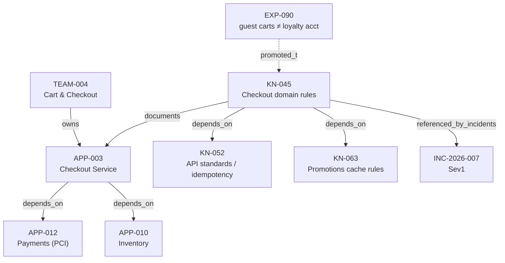

# RFC-0006 — Knowledge Graph Model

| Field | Value |
|---|---|
| RFC | `RFC-0006` |
| Title | Knowledge Graph Model |
| Status | **Accepted** |
| Authors | Architecture Office (`TEAM-090`) |
| Created | 2026-03-10 |
| Related | `ARCH-02`; `RFC-0003`, `RFC-0005`, `RFC-0022`, `RFC-0023`; `ADR-0022` |

---

## 1. Summary

This RFC defines the **knowledge graph** of the Knowledge Layer (`ARCH-02`): the typed network
of relationships that turns a bag of `KN-###` documents into a navigable model of how Meridian
Commerce Group actually fits together. It normatively owns the **`relations` field of
`knowledge_object.schema.json`** — `KnowledgeObject.relations: Mapping[str, Sequence[CanonicalId]]`
— which is the on-object representation of the graph's edges. **Nodes** are canonical entities
(`KN-`, `APP-`, `TEAM-`, `SVC-`, `INC-`, …); **edges** are typed relations
(`depends_on`, `referenced_by_incidents`, `supersedes`, `mitigates`, `causes`, `owns`, …).

The graph is what powers the **graph** retrieval mode of `RFC-0005` (via
`sdk.knowledge.KnowledgeIndex.neighbors`), what answers *relationship* and *blast-radius*
questions ("what breaks if `APP-007` changes?"), and what serves relationship views to the
Context Layer (`ARCH-01`) and Decision Intelligence (`ARCH-06`). Its integrity rests on one
rule from `ADR-0022`: **every edge endpoint must resolve to a real, canonical artifact.**

## 2. Motivation

`ARCH-02`'s "Future Evolution" names **graph-native reasoning** — "richer typed relationships
(causes, mitigates, depends-on, supersedes) enabling multi-hop retrieval ('what breaks if
`APP-007` changes?')" — as a core capability, and its Best Practice #4 makes graph one of the
three mandatory retrieval modes. Two forces make a formal graph model necessary rather than
optional:

- **Relationship questions are not text-similarity questions.** "Which threat model protects the
  cardholder-data boundary?" and "which incidents cite the checkout rules?" cannot be answered by
  semantic or lexical search (`RFC-0005` §2); the answer is a *traversal*, not a *match*.
- **The MCG dependency graph is canon.** `CANON-001` §3 fixes the application dependency
  direction — Checkout (`APP-003`) depends on Payments (`APP-012`), *and the reverse must never
  appear in any artifact*. The knowledge graph must encode that direction faithfully so that a
  Worker reasoning over relationships cannot invent a reverse edge that violates canon.

Without a typed, integrity-checked graph, relationships live only as prose inside document
bodies, invisible to traversal and impossible to validate. This RFC makes them first-class,
directional, and resolvable.

## 3. Guide-level explanation

### 3.1 Nodes and edges

A **node** is any canonical entity referenced by a knowledge object: another `KN-###` document,
an application (`APP-###`), a team (`TEAM-###`), a service (`SVC-####`), an incident
(`INC-YYYY-###`), and so on — the identifier namespaces of `CANON-001` §6. An **edge** is a
typed, directed relation from one node to a set of others, stored as an entry in the source
object's `relations` map: the *key* is the relation type, the *value* is the list of target IDs.

The canonical relation vocabulary (extensible — the `relations` map is open by schema, §4.2):

| Relation | Direction / meaning | Example |
|---|---|---|
| `depends_on` | source depends on target (mirrors `CANON-001` §3) | `KN-045 depends_on KN-052` |
| `referenced_by_incidents` | target incidents cite this knowledge | `KN-045 referenced_by_incidents INC-2026-007` |
| `supersedes` | source replaces a deprecated target | `KN-070 supersedes KN-047` (legacy) |
| `mitigates` | source (control/runbook) reduces a risk/incident | threat-model KN `mitigates INC-2026-007` |
| `causes` | source contributes to target failure | change KN `causes INC-2026-007` |
| `owns` | team owns an app/service | `TEAM-004 owns APP-003` |

### 3.2 A small MCG subgraph (Checkout)

Anchored on the checkout rules document `KN-045` and its application `APP-003`, reusing the
`ARCH-02` Example A relations (`KN-045.relations` = `depends_on: [KN-052, KN-063]`,
`referenced_by_incidents: [INC-2026-007]`):

The direction is load-bearing: `APP-003 →depends_on→ APP-012`, **never** the reverse
(`CANON-001` §3). A graph that carried the reverse edge would be a canon violation and a
review-blocking defect (`RFC-0001` §4.5).

### 3.3 What the graph is *for*

- **Graph retrieval (`RFC-0005`).** The graph lens seeds on anchor nodes named in a query and
  expands via `neighbors`. The `ARCH-02` Example C answer — the `SEC` threat model one hop from
  `APP-012` — *is* a graph traversal result.
- **Blast-radius / multi-hop.** "What breaks if `APP-007` (Pricing) changes?" is answered by
  following `depends_on` edges *inbound* to `APP-007`: Cart (`APP-004`), Checkout (`APP-003`),
  POS (`APP-019`) all depend on Pricing per `CANON-001` §3. This is the multi-hop reasoning
  `ARCH-02` calls for.
- **Context & Decision Intelligence views.** `ARCH-02` Outputs list "Knowledge graph views" to
  *both* the Context Layer and Decision Intelligence — dependency neighbourhoods for context
  assembly (`ARCH-01` Example A's `service-catalog:APP-003` state item), and impact/ownership
  views for control decisions (`ARCH-06`).

## 4. Reference-level explanation

### 4.1 Traversal primitive: `KnowledgeIndex.neighbors`

The graph's single traversal primitive is `sdk.knowledge.KnowledgeIndex.neighbors(node,
relation) -> Sequence[CanonicalId]` (the `Protocol` whose *signature* is owned by `RFC-0005`;
its *relation semantics* are owned here). It returns the one-hop targets of `node` along one
relation type. Everything richer is composed from it:

- **Multi-hop** is iterated `neighbors` with a bounded depth and a visited-set to prevent cycles
  (the graph is a DAG for `depends_on` by `CANON-001` §3, but `referenced_by_incidents` and
  friends can form cycles).
- **Inbound traversal** ("who depends on `APP-007`?") is `neighbors` over the reverse index the
  backend maintains for each relation; because edges are stored on the *source* object's
  `relations`, the index inverts them at `upsert` time (`RFC-0005` §4.6).
- **Filtered traversal** intersects results with `KnowledgeQuery.filters` (e.g. only `pci`
  neighbours), consistent with `RFC-0005` §4.2.

### 4.2 `KnowledgeObject.relations` (normatively owned here)

The edges of the graph are the `relations` field of `knowledge_object.schema.json`, mirrored by
`sdk.objects.KnowledgeObject.relations: Mapping[str, Sequence[CanonicalId]]`. This RFC is its
sole normative owner (`RFC-0001` §4.5). Its schema shape:

- An **object** whose `additionalProperties` is `{ "type": "array", "items": { "$ref":
  "common.schema.json#/$defs/canonicalId" } }` — i.e. relation-type *keys* map to arrays of
  canonical IDs. The vocabulary is **open** (any relation-type key is schema-valid) but the
  canonical types of §3.1 are the reviewed, recommended set; a new relation type is introduced by
  RFC amendment, not ad hoc, to keep traversal semantics shared.
- Each target ID MUST match the `canonicalId` pattern of `common.schema.json` — which is exactly
  how referential integrity is enforced structurally (§4.4).
- Relations are stored on the **source** object. `KN-045` carrying `depends_on: [KN-052, KN-063]`
  and `referenced_by_incidents: [INC-2026-007]` is the `ARCH-02` Example A object verbatim, and
  is the authoritative encoding of those edges.

Because a `KnowledgeObject` is immutable once published (`ADR-0004`), an edge change is a **new
version** of the source object, re-indexed by `KnowledgeIndex.upsert` (`RFC-0005` §4.6); the
graph therefore inherits the same versioned, append-only history as the documents themselves.

### 4.3 Node identity and the entities that participate

Nodes are identified by canonical ID (`sdk.objects.CanonicalId`; the `canonicalId` `$def` in
`common.schema.json`). A node need not be a `KN-###` document — `APP-`, `TEAM-`, `SVC-`, `INC-`,
`REL-`, `TC-` and Jira-key entities are all valid endpoints. The graph thus overlays the *whole*
canon (the application landscape of `CANON-001` §3, the team registry of §2.2), not merely the
knowledge corpus. This is why the graph can answer "who *owns* the thing that broke?" —
`owns`/ownership edges connect `TEAM-004 → APP-003` straight from canon.

### 4.4 Referential integrity (`ADR-0022`, `RFC-0022`)

**Every edge endpoint must resolve.** A `relations` value that names `KN-999` where no such
object exists, or `APP-999` outside the `CANON-001` §3 landscape, is a dangling edge and a
defect. Enforcement is layered:

1. **Structural.** The `canonicalId` pattern rejects malformed IDs at schema-validation time.
2. **Referential.** `RFC-0022` (Object Identity & Referential Integrity) requires that each ID
   resolve to a real artifact; a graph load MUST reject or quarantine dangling edges rather than
   silently traverse into the void.
3. **Directional / canon.** Edges that would contradict `CANON-001` §3 (a reverse `depends_on`,
   e.g. `APP-012 depends_on APP-003`) are canon violations (`RFC-0001` §4.5, canon supremacy).

Integrity is what lets Decision Intelligence trust a traversal result; a blast-radius answer is
only as sound as the resolvability of the edges it walked. `RFC-0023` (Provenance & Decision
Trace) records *which* edges a decision traversed, so a control choice grounded in the graph is
auditable after the fact.

### 4.5 Serving graph views to Context and Decision Intelligence

Per `ARCH-02` Outputs, the graph serves two consumers with two view shapes:

- **Context Layer (`ARCH-01`).** A *dependency neighbourhood* — the anchor node plus its one-to-
  two-hop `depends_on`/`documents`/`owns` neighbours — is assembled as a `state` provenance item
  (see `ARCH-01` Example A: `service-catalog:APP-003` → dependency graph → `APP-012`, `APP-010`).
  The Context Layer selects which neighbours to include within budget (`RFC-0002`).
- **Decision Intelligence (`ARCH-06`).** An *impact / ownership view* — inbound `depends_on`
  closure (blast radius) and `owns` edges (who to escalate to) — informs risk-tiering and
  routing decisions. "Changing `APP-007` affects three Tier-0 apps" is a graph-derived input to a
  control decision.

Both are read-only projections; neither consumer writes edges. Edge authorship happens only via
governed knowledge publication (`RFC-0003`, `RFC-0018`).

## 5. Drawbacks

- **Maintenance burden.** Edges must be kept current as the landscape evolves; a stale
  `depends_on` misleads blast-radius reasoning. Freshness SLAs (`ADR-0046`) and Data-Platform
  lineage auto-flagging (`ARCH-02`) mitigate this.
- **Open vocabulary risk.** A schema-open `relations` map permits typos (`depend_on`) that fragment
  traversal. The recommended-vocabulary discipline (§4.2) and lint tooling (§9) counter it.
- **Traversal fan-out.** Unbounded multi-hop traversal on a dense node explodes; depth limits and
  filters (§4.1) are mandatory in practice, at some recall cost.
- **Dual sourcing.** Some edges (`owns`, app `depends_on`) originate in `CANON-001` §3, others in
  authored knowledge; reconciling the two without contradiction requires governance.

## 6. Rationale & alternatives

- **Edges-on-object (chosen).** Storing `relations` on the source `KnowledgeObject` keeps the edge
  inside the same immutable, versioned, governed unit as the document — history and provenance come
  for free (`ADR-0004`), and the schema already carries the field; the backend inverts edges for
  inbound queries at index time.
- **Separate edge store (rejected as the model of record).** A standalone edge table decouples
  edges from document versioning and reopens integrity gaps; it is fine as a *derived* index but
  not as the source of truth.
- **Untyped links (rejected).** A single generic "related" edge cannot answer
  `depends_on`-vs-`causes` questions and cannot enforce the `CANON-001` §3 direction rule.
- **Full ontology / RDF-style triples (deferred).** Richer than needed today; the typed
  adjacency model covers the `ARCH-02` use cases without the tooling weight.

## 7. Prior art

Generic, non-proprietary only: the **typed property-graph** model (directed, labelled edges
between identified nodes) as used across dependency and impact analysis; **adjacency-list** graph
representation; and **breadth-first / depth-bounded traversal** for blast-radius and reachability
queries — all standard graph-theory and software-dependency techniques. No proprietary graph
database or query language is named as the design basis; the normative artifact is the `relations`
contract of `knowledge_object.schema.json` and the `neighbors` primitive.

## 8. Unresolved questions

- **Edge attributes.** Should edges carry their own metadata (weight, confidence, validity window)
  rather than being bare ID lists? Leaning: keep edges thin; attach edge-level provenance via
  `RFC-0023` and object `metadata` rather than complicating `relations`.
- **Canon-sourced vs. authored edges.** Should app `depends_on`/`owns` edges be *generated* from
  `CANON-001` §3/§2.2 and treated as read-only, distinct from authored knowledge edges? Deferred
  to a `RFC-0022` reconciliation note.
- **Contradiction between edges and bodies.** If a body implies an edge its `relations` omits or
  contradicts, which wins? Governance/contradiction handling (`ARCH-02`) applies; canon breaks ties.

## 9. Future possibilities

- **Graph-native multi-hop retrieval** as a first-class `KnowledgeQuery` capability (bounded
  path queries, not just single-hop `neighbors`), feeding `RFC-0005` fusion.
- **Lineage-driven freshness.** Data-Platform lineage (`APP-020`) auto-emits `causes`/`depends_on`
  edges and flags stale knowledge the instant an upstream schema changes (`ARCH-02`).
- **Edge lint in CI.** A checker that verifies every `relations` endpoint resolves and no reverse
  `depends_on` violates `CANON-001` §3 — turning §4.4 into an enforced gate (`RFC-0001` §9).
- **Blast-radius signals** published to the Signals Bus (`ARCH-02` Signals) so that a high-fan-in
  change (e.g. to `APP-007`) automatically raises a risk signal to Decision Intelligence.

---

*RFC-0006 normatively owns the knowledge-graph `relations` of `knowledge_object.schema.json` and
is consistent with `CANON-001` — encoding the §3 dependency direction faithfully (`APP-003 →
APP-012`, never the reverse) and preserving referential integrity (`ADR-0022`).*
