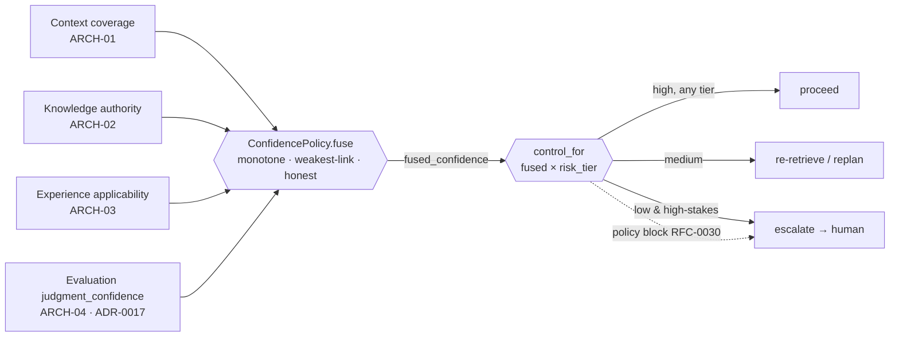

# RFC-0009 — Confidence Scoring Model

| Field | Value |
|---|---|
| RFC | `RFC-0009` |
| Title | Confidence Scoring Model |
| Status | Accepted |
| Authors | Architecture Office (`TEAM-090`) |
| Created | 2026-03-31 |
| Related | `ARCH-06`, `ARCH-04`; `RFC-0007` (DI Control Loop), `RFC-0014` (Evaluation Framework); `ADR-0013` (Confidence Composable), `ADR-0014` (Autonomy Gated on Confidence), `ADR-0017` (Dual Confidence) |

## 1. Summary

This RFC specifies the **Confidence Scoring Model** — how the ECL turns the confidences
reported by its layers into a single fused value, and how that value plus a change's risk tier
determines whether a Worker may act autonomously. It normatively owns
`sdk.decision.ConfidencePolicy` and the `Confidence` type alias (a float in the closed interval
`[0.0, 1.0]`, defined in `sdk.objects` and `common.schema.json`). It defines the four composable
inputs, the required properties of the `fuse` combiner (monotone, honesty-preserving,
weakest-link-sensitive, bounded), the risk-adaptive threshold mapping of `control_for`, the
crucial distinction between Evaluation's *outcome* and *judgment* confidences (`ADR-0017`), and
why confidence must remain honest and calibrated end to end.

## 2. Motivation

`ADR-0014` makes autonomy conditional on confidence: "DI never acts on high-stakes changes at
low confidence." That invariant is only as good as the number it gates on. If confidence could
be inflated — a low-coverage context laundered into a high fused score — the safety backbone of
the ECL would be hollow. `ADR-0013` therefore makes confidence *composable*: a single fused
value assembled from named, inspectable layer inputs, not an opaque model self-report. `ARCH-06`
already sketches the fusion ("DI computes an overall decision confidence by fusing the
confidences reported by every layer") and the control table (High → proceed, Medium →
re-retrieve/replan, Low → escalate/abort). This RFC makes that math a contract: what the inputs
are, what properties the combiner must satisfy, and how thresholds tighten for risk.

The second motivation is `ADR-0017`: Evaluation reports *two* confidences that must never be
conflated. DI must consume the right one. Getting this wrong — gating autonomy on how *good* the
work looks rather than how *sure* the evaluator is — would defeat the whole model.

## 3. Guide-level explanation

### 3.1 Four composable inputs

Fusion draws on one confidence from each memory-and-judgment layer:

- **Context coverage** (`ARCH-01`) — is the assembled working set sufficient? Surfaced as
  `ContextObject.coverage_confidence`.
- **Knowledge authority** (`ARCH-02`) — is the guiding truth canonical/owner-approved, or
  merely provisional?
- **Experience applicability** (`ARCH-03`) — do proven lessons genuinely apply to this
  situation, or is the match weak?
- **Evaluation confidence** (`ARCH-04`) — how certain is the in-loop judgment? DI consumes the
  **judgment** confidence, not the raw score (§4.5).

These arrive as the `inputs` map on every `DecisionObject` (`RFC-0007`), so the exact numbers
that produced a control decision are always on the trace.

### 3.2 Fusing without laundering

`fuse` combines the inputs into one `Confidence`. Its defining property is **honesty**: it may
never report more confidence than its weakest decisive input justifies. A run with excellent
knowledge and experience but *poor context coverage* must not fuse to "high" — the missing
context is exactly the blind spot that causes silent failure (`ARCH-01` context starvation).
Fusion is therefore **weakest-link-sensitive**, not a simple average that lets strong inputs
mask a weak one.

### 3.3 Risk-adaptive control

The same fused value means different things for a Tier 0 checkout change than for a Tier 3
internal tweak. `control_for(fused, risk_tier)` applies **tighter thresholds for Tier 0 and PCI
work and looser thresholds for Tier 2/3**. A fused 0.80 may authorize `proceed` on a Tier 3
task but only `re-retrieve` on a Tier 0 one; the same 0.80 on a PCI-adjacent change may
`escalate`. This is the "risk-adaptive autonomy" of `ARCH-06`: autonomy is earned in proportion
to the stakes.

## 4. Reference-level explanation

### 4.1 The `Confidence` type

This RFC owns the `Confidence` alias: a real number in `[0.0, 1.0]`. It is defined in
`sdk/objects.py` ("A confidence value in the closed interval [0.0, 1.0]") and enforced by the
`confidence` `$def` in `common.schema.json` (`minimum: 0.0`, `maximum: 1.0`). Every confidence
in the ECL — layer inputs, `fused_confidence`, `coverage_confidence`, evaluation
`outcome_confidence` and `judgment_confidence` — is this single bounded type. 0 means "no
confidence," 1 means "certain"; the interval is closed and values are never clamped silently
(an out-of-range value is a defect, not something to saturate).

### 4.2 `sdk.decision.ConfidencePolicy`

This RFC owns the `ConfidencePolicy` abstract base class in `sdk/decision/interfaces.py`, with
two methods:

- `fuse(inputs: Mapping[str, Confidence]) -> Confidence` — "combine
  context/knowledge/experience/evaluation confidences into one value."
- `control_for(fused: Confidence, risk_tier: int) -> Control` — "map fused confidence + risk
  tier to a control decision (risk-adaptive autonomy)."

Decision Intelligence (`RFC-0007`) *calls* both inside `Orchestrator.decide`; it does not
implement them. `Control` is owned by `RFC-0007`; `ConfidencePolicy` selects among its members.

### 4.3 Required properties of `fuse`

`fuse` is not a free choice of formula; any conforming implementation MUST satisfy:

1. **Bounded.** The output is in `[0.0, 1.0]` for all valid inputs.
2. **Monotone.** Raising any single input (holding others fixed) never lowers the fused value;
   lowering any input never raises it. Improving a layer can only help.
3. **Weakest-link-sensitive.** A single low decisive input caps the fused value; strong inputs
   cannot fully compensate for a weak one. (A product-like or minimum-dominated combiner
   satisfies this; a plain arithmetic mean does not and is non-conforming.)
4. **Honesty-preserving (no laundering).** The fused value never exceeds what the inputs
   jointly justify; in particular `fuse` never returns *high* when any decisive input is *low*.
5. **Degenerate-input honesty.** A missing or zero input is treated as low confidence, not
   silently dropped — absence of evidence lowers confidence.

These properties, not a specific equation, are the contract; they operationalize `ADR-0013`
(composable) and `ADR-0014` (safe gating).

### 4.4 `control_for` thresholds

`control_for` maps `(fused, risk_tier)` to a `Control`. Thresholds are **risk-adaptive**:
Tier 0 and PCI/auth scope demand a higher fused value for the same autonomy than Tier 2/3.
Below the proceed band, medium confidence returns a *confidence-raising* control
(`re-retrieve` or `replan`) rather than acting; low confidence on a high-stakes change returns
`escalate`; and `abort` is reserved for cases with no viable human path or an explicit
dead-end. Illustrative (not binding) mapping:

| Fused confidence | Tier 0 / PCI | Tier 1 | Tier 2 / 3 |
|---|---|---|---|
| ≥ 0.90 | `proceed` | `proceed` | `proceed` |
| 0.75 – 0.90 | `re-retrieve` / `replan` | `proceed` | `proceed` |
| 0.60 – 0.75 | `escalate` | `re-retrieve` / `replan` | `proceed` |
| < 0.60 | `escalate` (→ human) / `abort` | `escalate` | `re-retrieve` / `escalate` |

The bands are a `ConfidencePolicy` implementation detail and are expected to be tuned (and
eventually learned, `ARCH-06`); what is normative is the *shape* — monotone in confidence,
tighter as risk rises — and the hard rule that a high-stakes change never proceeds at low fused
confidence (`ADR-0014`). This mapping composes with, but never overrides, the `PolicyGuard`
(`RFC-0030`): a policy block forces escalation regardless of any `proceed` this table would
allow (`ADR-0041`).

### 4.5 Dual confidence: outcome vs. judgment (`ADR-0017`)

The Evaluation Layer reports **two** confidences that must not be conflated (`ARCH-04`):

- **Outcome confidence** — how good the work is (bound to the score itself: did it pass gates
  and rubric?).
- **Judgment confidence** — how *certain the evaluation is* about that score. Deterministic
  gates (tests, coverage, dependency checks) yield high judgment confidence; model-assisted
  qualitative rubric items yield lower judgment confidence and always carry linked evidence.

**Decision Intelligence fuses the evaluation's `judgment_confidence`, not its
`outcome_confidence`.** The reason is subtle but decisive: DI's question at each turn is "how
much can I trust this verdict enough to act on it?" — a question about the *reliability of the
judgment*, not the quality of the work. A `partial` verdict delivered with high judgment
confidence is trustworthy negative information (act on it: replan); a `pass` delivered with low
judgment confidence is not yet actionable (raise confidence first). Feeding outcome confidence
into `fuse` would let a shaky-but-flattering verdict authorize a high-stakes action — exactly
the laundering §4.3 forbids. For `EVAL-0061`, `judgment_confidence` is 0.88 (objective-heavy),
which is what enters `fuse`.

### 4.6 Calibration and end-to-end honesty

A confidence model is only useful if its numbers are **calibrated**: over many runs, decisions
made at fused 0.9 should succeed roughly 90% of the time. Miscalibration is a first-class
concern — an overconfident `fuse` re-creates the overconfident-autonomy failure of `ARCH-06`
even while nominally "gating." Every layer therefore reports honest confidence (Context never
hides dropped high-value candidates; Evaluation "never launders a low-confidence guess as a
high-confidence score," `ARCH-04`), and `fuse` preserves that honesty rather than eroding it.
Control-decision accuracy — were `proceed`/`escalate` calls vindicated by outcomes? — is an
`ARCH-06` signal, and the Learning Engine (`ARCH-05`) uses it to re-calibrate thresholds over
time. Honest confidence in every layer, preserved through fusion, is what makes gated autonomy
trustworthy end to end.

### 4.7 Confidence fusion (illustration)

## 5. Drawbacks

- **Calibration burden.** Honest thresholds require ongoing calibration against outcomes;
  a stale threshold set silently drifts toward over- or under-caution.
- **Conservatism cost.** Weakest-link fusion plus tight Tier 0 thresholds will sometimes
  escalate work a human would have let proceed, raising escalation rate (`ARCH-06`).
- **Input-quality dependence.** Fusion is only as honest as its inputs; a miscalibrated layer
  confidence (e.g., an over-optimistic coverage estimate) propagates. Mitigated by per-layer
  honesty rules and calibration tracking, not by `fuse` alone.

## 6. Rationale & alternatives

- **Single model self-reported confidence** — rejected by `ADR-0013`: opaque, uninspectable,
  and notoriously miscalibrated; composability requires named layer inputs.
- **Arithmetic mean of inputs** — rejected: not weakest-link-sensitive, so a strong knowledge
  score can mask starved context — precisely the laundering `ADR-0014` forbids.
- **Fixed thresholds independent of risk** — rejected: contradicts `ARCH-06` risk-adaptive
  autonomy; a Tier 0 change and a Tier 3 change cannot share an autonomy bar.
- **Fusing outcome confidence** — rejected by `ADR-0017`: DI needs the reliability of the
  judgment, not the flattery of the score (§4.5).

## 7. Prior art

Generic, non-proprietary inspirations: **probabilistic sensor fusion** (combining noisy
estimators, weighted by reliability); **calibration** and reliability diagrams from forecasting
and machine-learning evaluation; and **weakest-link / conjunctive reliability** models from
systems safety, where a chain is only as strong as its least reliable component. The
risk-adaptive-threshold idea mirrors graduated authorization in safety-critical control. No
proprietary scoring system is referenced.

## 8. Unresolved questions

- Should `fuse` accept per-input *weights* (some tasks are more context-sensitive, others more
  experience-sensitive), and if so are weights learned per task type (`ARCH-05`)?
- What is the right treatment of a *missing* layer (e.g., no applicable experience at all) —
  a neutral prior, or a confidence penalty? (Leaning: mild penalty, per §4.3 property 5.)
- How should the illustrative bands in §4.4 be formally validated against realized outcomes
  before a threshold change is accepted? Overlaps with `RFC-0025`/`RFC-0026` benchmarking.

## 9. Future possibilities

- **Learned, per-task-type thresholds** — the Learning Engine tunes `control_for` bands from
  control-decision accuracy, ratcheting toward calibrated autonomy (`ARCH-06` future).
- **Confidence intervals, not point estimates** — carrying uncertainty on the confidence itself,
  so DI can distinguish "confidently medium" from "unsure."
- **Counterfactual confidence** — estimating how much a proposed re-retrieval would raise fused
  confidence, to choose the *cheapest* confidence-raising control under `RFC-0029`.
- **Cross-Worker calibration** — sharing calibration curves across Worker types that reuse the
  same layers, since the confidence model is domain-agnostic (`ARCH-07`).

---

*RFC-0009 is consistent with `CANON-001`: confidence is a single bounded, composable value
(`ADR-0013`) fused honestly from named layer inputs; autonomy is gated on that fused value with
risk-adaptive thresholds so a high-stakes Tier 0/PCI change never proceeds at low confidence
(`ADR-0014`); and Decision Intelligence consumes Evaluation's judgment — not outcome —
confidence (`ADR-0017`).*
