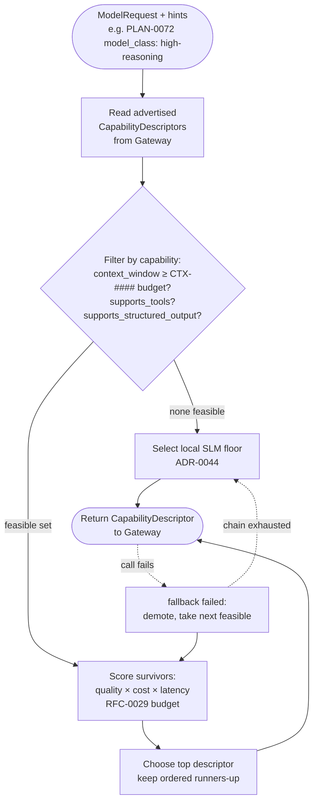

# RFC-0010 — Model Router

| Field | Value |
|---|---|
| RFC | `RFC-0010` |
| Title | Model Router |
| Status | **Accepted** |
| Authors | Architecture Office (`TEAM-090`) |
| Created | 2026-04-07 |
| Related | `ARCH-07`; `RFC-0007`, `RFC-0011`, `RFC-0029`; `ADR-0010`, `ADR-0012`, `ADR-0044` |

---

## 1. Summary

This RFC specifies the **Model Router** — the component that, given a reasoning request and a
set of hints, selects the concrete provider/model a call should run against. It normatively
owns `sdk.models.ModelRouter` and its two operations: `route(request, hints) ->
CapabilityDescriptor`, which chooses a model by matching task difficulty, cost, latency and
*required capabilities* against the descriptors the Gateway advertises; and
`fallback(failed) -> CapabilityDescriptor`, which selects an alternate when a chosen model is
unavailable, with the **local SLM as the guaranteed availability floor** (`ADR-0044`).

The Router is a pure selection function. It never imports a provider SDK, never renders a
prompt, and never makes a network call — those belong to the Gateway and its adapters
(`RFC-0011`, `ADR-0009`). Its entire job is to turn *"what does this task need?"* into *"which
advertised model best satisfies it, within budget?"* and to keep that decision honest, auditable
and free of any hard-coded provider assumption (`ADR-0010`, `ADR-0012`).

## 2. Motivation

`ARCH-07` establishes that the ECL is model-agnostic **by structural invariant**: model choice
must be a data-driven decision over published capabilities, not a constant baked into a layer.
Decision Intelligence (`RFC-0007`) already emits a plan (`PLAN-###`) with a `routing` directive
such as `{model_class: high-reasoning}`; something must translate that intent, together with the
task's real constraints, into a concrete model — *without* letting any provider's name or wire
quirk leak into DI.

Concretely, three constraints must be reconciled on every call:

- **Capability sufficiency.** The chosen model's `context_window` must be large enough for the
  assembled `CTX-###` budget; if the plan needs tool-calling or structured output, the model
  must advertise `supports_tools` / `supports_structured_output`. Assuming these and discovering
  the gap at call time is exactly the failure `ADR-0012` forbids.
- **Cost and latency.** Every call spends the task's reasoning budget (`RFC-0029`). A trivial
  step routed to the most expensive frontier model is waste; a hard step routed to a cheap model
  that cannot reason well enough is a quality failure.
- **Availability.** Providers fail, rate-limit and go dark. A single-provider dependency is a
  system-level failure mode (`ARCH-07`, "Provider outage"); the Router must always have a next
  option, ending at a floor that is under MCG's own control.

Without a dedicated, contract-bound Router these decisions scatter into DI and Context as ad-hoc
conditionals, and the model-agnostic invariant erodes one shortcut at a time. This RFC
concentrates them behind one interface so the policy is inspectable and swappable.

## 3. Guide-level explanation

### 3.1 Where the Router sits

The Router is invoked **inside** the Gateway's `call` path (`RFC-0011`), not by the layers
directly. Decision Intelligence hands the Gateway a `ModelRequest` plus `hints`; the Gateway asks
the Router to `route`, then renders and calls the chosen model. This keeps the Router a
side-effect-free advisor: it reads capabilities, reads hints, and returns a
`CapabilityDescriptor`. Nothing downstream can be surprised by *how* it chose.

### 3.2 The routing decision, informally

Think of routing as a three-stage funnel:

1. **Filter to the feasible.** Discard every advertised model that *cannot* do the job:
   window too small for the `CTX-###` budget, or missing a required capability (tools /
   structured output). Feasibility is a hard constraint, never traded away for price.
2. **Score the survivors.** Among feasible models, score each on a weighted blend of expected
   quality (does its class match the plan's `model_class`?), cost (`cost_per_1k_input` /
   `cost_per_1k_output` against the remaining budget) and latency (`typical_latency_ms` against
   the task's urgency).
3. **Choose, and remember the runners-up.** Return the top-scoring descriptor. The ordered
   remainder is the natural fallback chain (§3.4).

### 3.3 Hints from the plan

`hints` is the Router's contract with the rest of the ECL. It carries, at minimum, the plan's
`model_class` (e.g. `high-reasoning`, `fast-draft`, `cheap-bulk`), the required capabilities
implied by the plan's steps, and the cost/latency envelope from `RFC-0029`. Hints are *advisory
intent expressed in ECL vocabulary* — never a provider name. `{model_class: high-reasoning}` says
"this needs strong reasoning"; it is the Router's job, not DI's, to know which advertised model
currently fills that class.

### 3.4 Fallback and the availability floor

When the selected model fails (outage, timeout, rate limit, capability mismatch surfaced at call
time), the Gateway calls `fallback(failed)`. The Router returns the next feasible descriptor,
demoting the failed one. As the chain is walked, the last resort is always the **local SLM**
(`ADR-0044`) — a small model MCG runs itself. It may be slower or less capable, but it is always
reachable, so the ECL degrades rather than stops. Because all intelligence lives outside the
model (`ARCH-07`), a task completed on the SLM floor still uses the same `CTX-###`, `PLAN-###`
and lessons as one completed on a frontier model.

### 3.5 Routing decision flow

## 4. Reference-level explanation

### 4.1 Contract owned

This RFC normatively owns `sdk.models.ModelRouter` (`RFC-0001` §4.6). It does **not** own
`CapabilityDescriptor`, `ModelRequest`, `ModelResponse`, `ModelGateway` or `ModelProvider` —
those are owned by `RFC-0011` and are cited here as the Router's inputs and outputs.

### 4.2 `route(request, hints) -> CapabilityDescriptor`

`route` consumes a `sdk.models.ModelRequest` and a `Mapping[str, object]` of hints, and returns
the `sdk.models.CapabilityDescriptor` of the chosen model. Its behavior is defined over the
descriptor fields exactly as declared in `sdk/models/interfaces.py`:

- **Budget derivation.** The required input window is derived from `request.context` — a
  `sdk.objects.ContextObject` (`CTX-###`) whose `model_budget` (`context_object.schema.json`,
  `window_tokens` / `reserved_output`) states how many tokens the assembled working set occupies
  and reserves for output — plus `request.max_output_tokens`. A model is feasible only if
  `CapabilityDescriptor.context_window` covers that sum.
- **Capability match.** If `request.tools` is non-empty, feasibility requires
  `supports_tools`. If `request.response_format` is `json` or `tool_calls`, feasibility requires
  `supports_structured_output`. These are hard filters (`ADR-0012`): a capability is negotiated
  from the descriptor, never presumed from a provider's reputation.
- **Class match.** `hints["model_class"]` (from `PlanningObject.routing`,
  `planning_object.schema.json`) partitions the feasible set by intended quality tier. The Router
  maps classes to descriptors via its configured policy; the mapping is data, reloadable without
  code change, and is the *only* place a class is bound to concrete models.
- **Cost/latency scoring.** Remaining feasible candidates are ranked using
  `cost_per_1k_input`, `cost_per_1k_output` and `typical_latency_ms` against the budget envelope
  supplied in hints from `RFC-0029`. The Router returns the highest-scoring descriptor.

`route` is deterministic given identical descriptors, hints and policy — a requirement for the
Replay Engine (`RFC-0024`) and for fair benchmarking (`ARCH-04`). The chosen descriptor and the
losing candidates are surfaced on the decision trace (`RFC-0023`) so the choice is auditable.

### 4.3 `fallback(failed) -> CapabilityDescriptor`

`fallback` takes the `CapabilityDescriptor` that just failed and returns the next feasible
alternative under the same filters and scoring, with the failed descriptor demoted. The contract
guarantees termination: the candidate ordering always ends at the **local SLM** descriptor
(`ADR-0044`), which is treated as feasible for any in-scope task because it is the floor by
definition. The Gateway (`RFC-0011`) is responsible for *invoking* `fallback` on error; the
Router only decides *what comes next*. Repeated fallback within one call is bounded by the
Gateway's retry budget (`RFC-0029`) so a flapping provider cannot spin the loop.

### 4.4 Interaction with cost & latency budgeting (`RFC-0029`)

The Router is the enforcement point where a budget becomes a model choice. `RFC-0029` owns the
budget accounting (per-task token and call ceilings, urgency class); the Router *reads* that
envelope through hints and *respects* it in scoring. It does not itself debit budgets — that is
the Gateway's post-call responsibility using `ModelResponse.usage`. This split keeps the Router a
pure function of its inputs.

### 4.5 Interaction with the Gateway (`RFC-0011`)

The Router never touches a provider. `ModelGateway.call` (`RFC-0011`) is the sole caller of
`route` and `fallback`; the Gateway then renders the `ModelRequest` and invokes the adapter. This
is the concrete realization of `ADR-0009` (single Gateway) and `ADR-0010` (model-agnostic): the
Router selects, the Gateway acts, and no other layer does either. `ModelGateway.capabilities()`
is the descriptor source the Router filters over, so Router and Gateway always agree on the
feasible universe.

### 4.6 No provider specifics in Decision Intelligence

DI (`RFC-0007`) emits only `model_class` and capability *needs*; it receives only normalized
`ModelResponse`. It never names a provider, never sees a `CapabilityDescriptor` unless it asks
the Gateway for advertised capabilities to plan budgets, and never branches on provider identity.
Every provider-specific fact is confined to the Gateway's adapters (`RFC-0011`).

### 4.7 Worked example — `CHK-1421`

For the guest-checkout task, DI forms `PLAN-0072` with `routing = {model_class: high-reasoning}`
and risk tier 0. Context assembles `CTX-0118`, whose `model_budget` requires a window large enough
for `KN-045`, `KN-052`, `EXP-090`, the target `APP-003` code and the dependency graph, with output
reserved for a plan plus tool calls (`response_format = tool_calls`, so `supports_tools` and
`supports_structured_output` are required). The Router filters the advertised descriptors to those
whose `context_window` covers the `CTX-0118` budget and that support tools, then selects the
`high-reasoning`-class survivor with the best cost/latency score under the `RFC-0029` envelope and
returns its `CapabilityDescriptor`. If that provider is unavailable, `fallback` yields the next
feasible high-reasoning model, and — only if the chain is exhausted — the local SLM floor, on which
`CHK-1421` still completes using the identical `CTX-0118`, `PLAN-0072` and `EXP-090`.

## 5. Drawbacks

- **Policy maintenance.** The class→model mapping and scoring weights are live configuration that
  must be curated as providers and prices change; a stale mapping silently degrades quality or
  cost. Mitigated by making the policy data (auditable, versioned) rather than code.
- **Scoring is a heuristic.** A weighted blend of quality/cost/latency cannot be provably optimal;
  a genuinely hard task may occasionally be routed to a too-cheap model, caught only by Evaluation
  (`ARCH-04`) and corrected by learned heuristics (`RFC-0017`).
- **Floor quality.** Guaranteeing availability via the local SLM means some fallback completions
  are lower quality; this is an intentional trade of quality for liveness, made visible on the
  trace so benchmarks account for it.

## 6. Rationale & alternatives

Making routing a **pure, contract-bound selection function** separated from the Gateway's I/O is
what lets EnterpriseSim replay and benchmark model choice deterministically and swap routing
policy without touching provider code. Alternatives considered:

- **Route inside Decision Intelligence.** Rejected: it would pull capability and cost logic into
  DI and tempt provider-specific branches there, violating `ADR-0010`.
- **Static per-task-type model map.** Rejected: it ignores the live `CTX-###` budget and current
  capability descriptors, so it breaks the moment a task's context outgrows a window or a provider
  changes — exactly the assumption `ADR-0012` forbids.
- **Cheapest-model-first with escalation on failure.** Rejected as the *default*: it wastes a call
  and needs the same feasibility filter, which capability-filtered scoring already subsumes.
- **No floor; fail fast on total outage.** Rejected: it reintroduces the single point of failure
  the `ADR-0044` local SLM floor exists to eliminate.

## 7. Prior art

Generic, non-proprietary prior art only: the general pattern of **load balancers and service
meshes** selecting a backend by health and cost; **compiler instruction selection** choosing an
implementation that satisfies constraints at least cost; and the widely used practice of a
**capability/feature-negotiation** handshake before committing to a transport. No provider's
proprietary routing product, SDK or API shape is referenced or reproduced.

## 8. Unresolved questions

- Should the Router expose the *ordered* candidate list to DI for planning, or keep it internal and surface only via the trace? (Leaning: internal, trace-only, to preserve the thin interface.)
- How should learned routing heuristics from `RFC-0017` update the scoring policy without becoming an opaque model of their own? Deferred to `RFC-0017`.
- What urgency taxonomy should the Router share with `RFC-0029` — discrete classes vs. a continuous latency SLO? Deferred to `RFC-0029`.

## 9. Future possibilities

- **Speculative dual-routing** for tier-0 tasks: a cheap draft plus a high-reasoning verification, reconciled by DI, still behind one Gateway.
- **Cost-aware learning loop**: the Learning Engine (`ARCH-05`) tunes scoring weights against measured `EVAL-###` lift per model class, so routing improves without code change.
- **Residency-aware routing** for data-sensitive tasks (`APP-012` PCI, PII), adding a residency filter to the feasibility stage with `RFC-0030`.

---

*RFC-0010 normatively owns `sdk.models.ModelRouter` and is consistent with `CANON-001`. It
subordinates to `ARCH-07` and upholds the model-agnostic (`ADR-0010`), capability-negotiation
(`ADR-0012`) and local-SLM-fallback (`ADR-0044`) invariants.*
