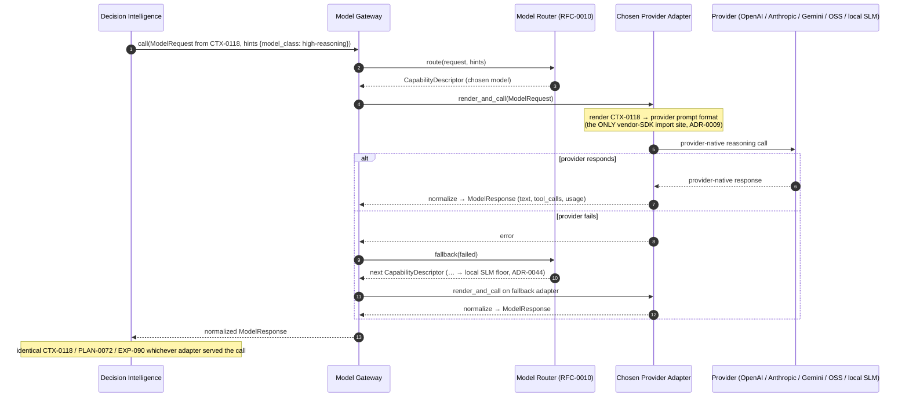

# RFC-0011 — Model Gateway & Provider Adapter Contract

| Field | Value |
|---|---|
| RFC | `RFC-0011` |
| Title | Model Gateway & Provider Adapter Contract |
| Status | **Accepted** |
| Authors | Architecture Office (`TEAM-090`) |
| Created | 2026-04-14 |
| Related | `ARCH-07`; `RFC-0002`, `RFC-0010`, `RFC-0012`, `RFC-0013`, `RFC-0027`; `ADR-0009`, `ADR-0010`, `ADR-0011`, `ADR-0012` |

---

## 1. Summary

This RFC specifies the **Model Gateway** — the single component through which every model call in
the entire ECL passes — and the **provider adapter contract** that makes any LLM interchangeable
behind it. It normatively owns `sdk.models.ModelGateway`, `sdk.models.ModelProvider` and
`sdk.models.CapabilityDescriptor`.

The Gateway is the only choke point for reasoning: `ModelGateway.call` **routes** (via `RFC-0010`),
**renders** the structured request into a provider's format, **calls** the provider, and
**normalizes** the response back — with fallback on failure, and no layer bypassing it (`ADR-0009`).
Each provider is an adapter implementing two methods — `capabilities()` and `render_and_call()` —
and the adapter is the **only place in the codebase a vendor SDK is imported** (`ADR-0009`,
`ADR-0010`). Because the Gateway renders a structured `ContextObject` (`CTX-###`) rather than
storing provider prompt strings (`ADR-0011`), and capabilities are negotiated per model
(`ADR-0012`), swapping OpenAI for Anthropic, Gemini, an open-source/vLLM model or the local SLM
changes exactly one adapter and leaves every layer, object and lesson untouched.

## 2. Motivation

`ARCH-07` proves the ECL's independence from any LLM vendor through four mechanisms: a single
point of contact, a stable internal contract of *structured context in / structured result out*,
capability negotiation, and learning that lives outside the model. The Gateway makes the first
three true in code. Without it, three failures are inevitable: provider SDKs leak into layers and
the model-agnostic invariant (`ADR-0010`) breaks on the first provider-specific branch; provider
prompt strings get stored on layers or a `CTX-###`, so changing providers means rewriting durable
artifacts (`ADR-0011`); and response shapes get assumed rather than negotiated, so a swap silently
breaks tool-calling or structured output (`ADR-0012`).

The Gateway concentrates provider awareness behind one narrow, stable contract, so the ECL speaks
only its own vocabulary and `ARCH-07`'s vendor-independence promise holds by construction.

## 3. Guide-level explanation

### 3.1 One door for all reasoning

Every model call — from Decision Intelligence forming a plan, from the Context Layer estimating a
budget, from any Worker step — goes through `ModelGateway.call`. There is exactly one Gateway
(`ADR-0009`); there is no side path. This is what lets the ECL reason about cost, latency,
provenance and provider health in one place, and it is why the deployment view in `ARCH-07` shows
`model-gateway-svc` as the sole egress to providers.

### 3.2 What `call` does, in order

`ModelGateway.call(request, hints)` performs four steps and returns a normalized `ModelResponse`:

1. **Route.** Ask the Router (`RFC-0010`) which `CapabilityDescriptor` best fits the request and
   hints. The Gateway decides nothing about the model itself beyond delegating selection.
2. **Render.** Hand the `ModelRequest` — built from a structured `CTX-###` — to the chosen adapter,
   which renders it into that provider's wire format.
3. **Call.** The adapter invokes the provider (the only network egress) and returns.
4. **Normalize.** The adapter maps the provider's response back into a provider-agnostic
   `ModelResponse` (`text`, `tool_calls`, `usage`). On failure, the Gateway asks the Router for a
   `fallback` descriptor and retries, ending at the local SLM floor (`ADR-0044`, `RFC-0010`).

### 3.3 The adapter contract, structured in and out

A provider adapter implements `sdk.models.ModelProvider`: `capabilities()` returns the model's
`CapabilityDescriptor`, and `render_and_call()` does the render→call→normalize. Everything
provider-specific — auth, wire schema, prompt shape, tool-call encoding, token accounting — is
sealed inside the adapter, the only module permitted to import a vendor SDK. Crucially, the Gateway
renders a **structured `ContextObject`**, never a stored prompt string (`ADR-0011`): the `CTX-###`
(`context_object.schema.json`) carries the included provenance, task, intent reference and
`model_budget`, and the adapter turns *that structure* into the provider's prompt format at call
time and discards the rendered string. Nothing durable in the ECL is provider-shaped, and the
normalized `ModelResponse` means no layer ever parses a provider wire format. Adapters are
registered via `ModelGateway.register(provider)` — a primary use of the plugin architecture
(`RFC-0027`): adding a provider is installing an adapter plugin and registering it, no core change,
after which `ModelGateway.capabilities()` advertises the new model to the Router and to any layer
that plans budgets.

### 3.4 Render / call / normalize across interchangeable adapters

## 4. Reference-level explanation

### 4.1 Contracts owned

This RFC normatively owns `sdk.models.ModelGateway`, `sdk.models.ModelProvider` and
`sdk.models.CapabilityDescriptor` (`RFC-0001` §4.6). It cites `sdk.models.ModelRouter` (owned by
`RFC-0010`), `sdk.models.ModelRequest`/`ModelResponse` (defined alongside in
`sdk/models/interfaces.py`), and `sdk.objects.ContextObject` / `context_object.schema.json`
(owned by `RFC-0002`).

### 4.2 `ModelGateway`

`ModelGateway` (an `abc.ABC` in `sdk/models/interfaces.py`) declares three operations:

- **`register(provider: ModelProvider) -> None`.** Admits an adapter into the Gateway's provider
  set (§4.4, `RFC-0027`). Registration is the only way a provider becomes callable.
- **`call(request: ModelRequest, hints: Mapping[str, object]) -> ModelResponse`.** The sole entry
  point for reasoning. It routes (`RFC-0010`), renders and calls the chosen adapter, normalizes
  the reply, and applies fallback on failure. **No layer bypasses this method** (`ADR-0009`) — the
  docstring of `call` states this as a contract, not a guideline. After a successful call the
  Gateway debits the `RFC-0029` budget using `ModelResponse.usage`.
- **`capabilities() -> Sequence[CapabilityDescriptor]`.** Advertises every registered model so the
  Context Layer (`RFC-0002`) can size `model_budget` and Decision Intelligence (`RFC-0007`) can
  plan `model_class` — capability negotiation, not assumption (`ADR-0012`).

### 4.3 `ModelProvider` — the adapter contract

`ModelProvider` is a `typing.Protocol` with two methods; conforming to it is all it takes to make
a new LLM usable, and it is the **only** place a vendor SDK is imported (`ADR-0009`):

- **`capabilities() -> CapabilityDescriptor`.** Returns the model's negotiated capabilities.
- **`render_and_call(request: ModelRequest) -> ModelResponse`.** Renders the structured request
  into the provider's format, calls the provider, and normalizes the reply back. Rendering and
  normalization are abstract here on purpose: the contract is *structure in, structure out*, and no
  provider's proprietary API shape is part of it. Two adapters are interchangeable precisely because
  they share this signature and nothing else.

### 4.4 `CapabilityDescriptor`

`CapabilityDescriptor` is a frozen dataclass with exactly the fields declared in
`sdk/models/interfaces.py`: `provider`, `model`, `context_window`, `supports_tools`,
`supports_structured_output`, `cost_per_1k_input`, `cost_per_1k_output`, `typical_latency_ms`. It
is the *lingua franca* of capability negotiation (`ADR-0012`): the Router filters and scores over it
(`RFC-0010`), the Context Layer reads `context_window` to bound `model_budget`, and `RFC-0029` reads
the cost and latency fields. Descriptors are produced only by adapters, so the advertised universe
always reflects real, registered models.

### 4.5 Rendering `CTX-###`, normalizing back, and negotiation (`ADR-0011`, `ADR-0012`)

`ModelRequest` is built from a `sdk.objects.ContextObject`: its `context` field *is* the `CTX-###`,
with an `instruction`, optional `tools` schemas, `max_output_tokens` and a `response_format`
(`text` | `json` | `tool_calls`). The adapter renders the `CTX-###`'s provenance and task into the
provider's prompt **at call time** and does not persist it — layers store the structured object,
never the prompt (`ADR-0011`). Normalization is the mirror: the reply maps into `ModelResponse`
with `text`, `tool_calls`, a `usage` mapping (`input_tokens`, `output_tokens`) and `raw_provider_id`
for provenance (`RFC-0023`), so two providers with different wire formats produce identical
`ModelResponse` shapes. Because `capabilities()` is published, the Context Layer sizes the working
set to the target `context_window` (`context_object.schema.json` `model_budget`) and DI chooses
native versus emulated tool-calling from `supports_tools` / `supports_structured_output` —
negotiation, not assumption (`ADR-0012`).

### 4.6 How `tool_calls` connect to execution (`RFC-0012` / `RFC-0013`)

When `response_format` is `tool_calls`, the normalized `ModelResponse.tool_calls` is a
provider-agnostic list the Execution Runtime consumes: `RFC-0013` resolves each call against the
`ToolRegistry` under least-privilege negotiation, and `RFC-0012` executes it, producing
`WorkerArtifact`s (`PR-####`, `TR-####`). Normalization lets execution be written once against one
tool-call shape regardless of which provider emitted it.

### 4.7 Fallback, the floor, and Example B (model swap)

On adapter error the Gateway calls `ModelRouter.fallback` (`RFC-0010`) and retries on the next
descriptor, bounded by the `RFC-0029` retry budget; the chain terminates at the local SLM
(`ADR-0044`), so `call` always returns a `ModelResponse` or exhausts a bounded budget rather than
hanging on a dead provider. This is also what makes model swaps free: to migrate the
`high-reasoning` class from Provider A to Provider B (`ARCH-07`, Example B), MCG registers Provider
B's adapter and updates the Router's class mapping. For `CHK-1421`, the Gateway then renders the
**same** `CTX-0118` through Provider B's adapter and normalizes B's reply into the same
`ModelResponse`; `PLAN-0072`, `EXP-090`, every rubric and every lesson are untouched. Benchmarks
(`ARCH-04`) quantify the A-vs-B quality/cost/latency difference on the identical task — the entire
point of concentrating provider contact behind one Gateway.

## 5. Drawbacks

- **Single point of failure and contention.** One Gateway is one thing to keep highly available;
  mitigated by horizontal scaling of the stateless `model-gateway-svc` (`ARCH-07`) and the fallback
  chain, but it remains an architectural bottleneck by design.
- **Contract rigidity.** A provider with a genuinely novel capability cannot express it without a
  `CapabilityDescriptor` change — an intentional cost of a stable contract, handled through
  `RFC-0021` schema evolution.
- **Rendering fidelity.** Collapsing a rich `CTX-###` into a flat prompt is lossy and
  adapter-specific; a poor renderer wastes a capable model. Rendering quality is itself measurable
  via `EVAL-###` and improvable through learning (`ARCH-05`).

## 6. Rationale & alternatives

Concentrating **all** provider contact in one Gateway with a two-method adapter contract is what
makes `ARCH-07`'s model-agnostic invariant enforceable rather than aspirational. Alternatives:

- **Per-layer provider clients.** Rejected: violates `ADR-0009`/`ADR-0010` and scatters provider
  quirks across the ECL.
- **A thin passthrough forwarding provider-native prompts.** Rejected: storing or forwarding
  provider prompt strings breaks `ADR-0011` and defeats vendor portability.
- **A fat Gateway that also selects models.** Rejected: routing is a separable, replayable pure
  function (`RFC-0010`); fusing it in would make selection untestable in isolation.
- **A lowest-common-denominator API with no capability descriptor.** Rejected: it forces every
  model to the weakest one's abilities and makes negotiation (`ADR-0012`) impossible.

## 7. Prior art

Generic, non-proprietary prior art only: the **adapter / hexagonal (ports-and-adapters)** pattern
from the software-architecture literature; **device-driver models** where a stable OS interface
hides heterogeneous hardware; and **database-driver abstractions** (a common connection/cursor
interface over many engines). No provider's proprietary SDK, API shape, or client library is
reproduced; the adapter contract is described purely in the ECL's own `ModelRequest`/`ModelResponse`
terms.

## 8. Unresolved questions

- Should streaming be a base-contract feature or a negotiated capability? Leaning: negotiated via
  `RFC-0021`. And should prompt-caching hints live in the Gateway per adapter, or be advertised as
  a capability the Router reasons about with `RFC-0029`? Open.

## 9. Future possibilities

- **Multi-modal requests** as additional `ModelRequest` fields and negotiated capabilities.
- **Shadow evaluation**: the Gateway mirrors a fraction of calls to a candidate adapter for
  comparative `EVAL-###` data before a routing switch, and a **conformance test kit** every adapter
  plugin (`RFC-0027`) must pass — rendering a `CTX-###` and normalizing a `ModelResponse` — as a CI gate.

---

*RFC-0011 normatively owns `sdk.models.ModelGateway`, `sdk.models.ModelProvider` and
`sdk.models.CapabilityDescriptor`, and is consistent with `CANON-001`. It realizes the single
Gateway (`ADR-0009`), model-agnostic (`ADR-0010`), structured-context (`ADR-0011`) and
capability-negotiation (`ADR-0012`) invariants of `ARCH-07`.*
