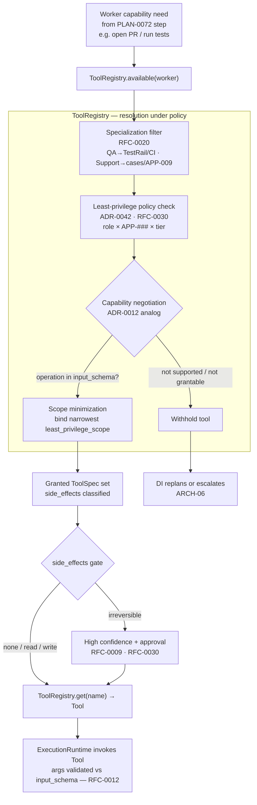

# RFC-0013 — Tool Selection & Capability Negotiation

| Field | Value |
|---|---|
| RFC | `RFC-0013` |
| Title | Tool Selection & Capability Negotiation |
| Status | **Accepted** |
| Authors | Architecture Office (`TEAM-090`) |
| Created | 2026-04-28 |
| Related | `ARCH-07`; `RFC-0012`, `RFC-0011`, `RFC-0020`, `RFC-0027`, `RFC-0030`, `RFC-0009`; `ADR-0042`, `ADR-0012` |

---

## 1. Summary

This RFC specifies **how an Enterprise AI Worker acquires the tools it may act through**, before
the Execution Runtime (`RFC-0012`) invokes any of them. It normatively owns
`sdk.execution.Tool`, `sdk.execution.ToolRegistry`, and `sdk.execution.ToolSpec`.

Tool acquisition is a *negotiation under policy*, not a lookup. A Worker declares the
capabilities it needs to satisfy a plan step; the `ToolRegistry` checks those needs against the
Worker's specialization (`RFC-0020`) and least-privilege policy (`ADR-0042`), and grants the
**minimal** set of `ToolSpec`s — each carrying the narrowest `least_privilege_scope` sufficient
for the task. Every `ToolSpec` also declares a `side_effects` class (`none | read | write |
irreversible`); the more dangerous the class, the higher the confidence and approval required
(`RFC-0009`, `RFC-0030`). Tools are pluggable (`RFC-0027`), and *which* tools a Worker may hold
is a property of its specialization (`RFC-0020`) — a QA Worker gets TestRail and CI, a Support
Worker the case system and `APP-009` order lookups. This is the tool-side analog of model
**capability negotiation** (`ADR-0012`): *does this tool support the operation the Worker needs,
at a scope policy will allow?*

## 2. Motivation

`ARCH-07` names **Tools** as one of the four pluggable Worker specializations — "which
enterprise tools the Worker may act through" — over an otherwise-shared ECL. `CANON-001` §9.1
requires Workers to use the *same* systems as engineers, and `CANON-001` §4.6 / principle 7
mandate **least privilege** for every workload identity. Two failure modes follow if tool access
is implicit:

- **Over-grant.** A Worker holding a broad `write` credential to `mcg-checkout-service`
  (`APP-003`, Tier 0) can act far outside its task. Least-privilege (`ADR-0042`) must be
  *resolved per task*, not configured once and forgotten.
- **Silent capability mismatch.** DI plans a step ("run contract tests") assuming a tool can do
  it; the tool cannot; the failure surfaces only at invocation. Just as the Model Gateway
  negotiates model capabilities rather than assuming them (`ADR-0012`, `ARCH-07`), tool
  capabilities must be *negotiated and asserted up front*.

Concentrating this in one owned `ToolRegistry` contract means every Worker type acquires tools
the same auditable way, and adding a new tool or a new Worker changes data, not architecture.

## 3. Guide-level explanation

### 3.1 Capabilities, not tool names

A plan step expresses *intent* — "open a PR", "run the contract suite", "comment on the issue" —
which DI records as a required **capability**. The Worker does not hard-code a vendor tool; it
asks the registry for something that satisfies the capability at an allowed scope. This keeps
plans portable across tool implementations (`RFC-0027`) and vendor specifics out of the loop,
mirroring how DI routes reasoning by *capability* through the Gateway (`RFC-0011`).

### 3.2 The registry grants the minimum

`ToolRegistry.available(worker)` returns the `ToolSpec`s a given Worker *may* use — the set
already narrowed by its specialization and least-privilege policy. For the guest-checkout task
`CHK-1421` on `PLAN-0072`, a QA/engineering Worker's grant includes:

| Capability need | Granted tool | `side_effects` | `least_privilege_scope` (illustrative) |
|---|---|---|---|
| Read/modify code | `repo` | `write` | `repo:mcg-checkout-service:contents` |
| Run tests | `ci` | `write` | `ci:mcg-checkout-service:run` |
| Record test runs | `testrail` | `write` | `testrail:APP-003:runs` |
| Open PR | `github` | `write` | `github:mcg-checkout-service:pull_request` |
| Comment on issue | `jira` | `write` | `jira:CHK-1421:comment` |

The same registry, asked for a **Support Worker**, returns a *different* set — case-system tools
and `APP-009` (OMS) order lookups, mostly `read` — because its specialization binds a different
tool set (`RFC-0020`, `ARCH-07` Example C). Neither Worker is granted more than its task needs.

### 3.3 Dangerous tools cost more confidence

`ToolSpec.side_effects` is a four-level taxonomy. A `none`/`read` tool (e.g. an order lookup) is
low-stakes and freely usable; a `write` tool (open PR, run CI) is normal engineering action; an
`irreversible` tool (force-delete, non-reversible mutation) is gated — DI may invoke it only at
high fused confidence and, per `CANON-001` §7 and `RFC-0030`, often with human approval.
Confidence thresholds scale with the side-effect class (`RFC-0009`).

## 4. Reference-level explanation

### 4.1 Owned contracts

RFC-0013 normatively owns (per `RFC-0001` §4.6):

- `sdk.execution.ToolSpec` — `name`, `description`, `input_schema`, `side_effects`,
  `least_privilege_scope`.
- `sdk.execution.Tool` — the `spec` attribute and `invoke(args) -> ToolResult`.
- `sdk.execution.ToolRegistry` — `available(worker)` and `get(name)`.

`sdk.execution.ExecutionRuntime` and the `ExecutionObject` / `WorkerArtifact` records it produces
are cited here but **owned by `RFC-0012`**. The registry resolves tools; the runtime invokes
them.

### 4.2 `ToolSpec` — the declarative contract

`ToolSpec` (frozen, declarative) is the unit of negotiation. `input_schema` is a JSON Schema the
Execution Runtime validates `args` against before any invocation (`RFC-0012` §4.3), catching a
capability mismatch structurally rather than at side-effect time. `side_effects` classifies the
action; `least_privilege_scope` names the *narrowest* authority for the tool's declared operation
(`ADR-0042`), expressed against `CANON-001` resources (`APP-###`, `mcg-*` repos, Jira keys). Two
`ToolSpec`s may wrap the same system at different scopes (read-only `jira` vs. comment-capable
`jira`); the registry grants the smaller whenever the capability allows.

### 4.3 `ToolRegistry.available(worker)` — resolution under policy

`available(worker)` is where least-privilege is *enforced*, not merely declared. Resolution:

1. **Specialization filter.** Look up the Worker's specialization (`RFC-0020`) to get its
   candidate tool set — the QA Worker's TestRail/CI, the Support Worker's case system, etc.
2. **Policy check.** Intersect candidates with least-privilege policy (`ADR-0042`, `RFC-0030`):
   remove any tool whose scope exceeds what the Worker's role and the task's `APP-`/tier permit.
3. **Scope minimization.** For each surviving tool, bind the narrowest `least_privilege_scope`
   that still satisfies the declared capability.
4. **Grant.** Return the resulting `ToolSpec` set. `get(name)` then returns a concrete `Tool`
   bound to that granted scope; a `get` for a tool not in the grant is refused.

The registry never returns a tool the Worker may not use, so the Execution Runtime cannot invoke
one — least-privilege is guaranteed by construction.

### 4.4 Capability negotiation (the `ADR-0012` analog)

`ADR-0012` established capability negotiation for **models**: the Gateway publishes a capability
descriptor per model and callers adapt rather than assume (`ARCH-07`; `RFC-0011`). This RFC
applies the same principle to **tools**. A Worker's declared capability need is matched against
each candidate `ToolSpec` on two axes:

- **Operation support** — does the tool's `input_schema` accept the operation the step needs
  (e.g. does the `github` tool support `open pull request` with a rollback-plan field)? A tool
  that cannot express the operation is not a candidate.
- **Scope grantability** — can policy grant a `least_privilege_scope` that covers the operation
  on the target resource? If not, the tool is withheld and DI must replan or escalate.

Negotiation is resolved **at plan/execution time**, not baked in: the same Worker acquires a
different granted set for a Tier 0 `APP-003` change than for a low-risk internal one, because
the policy check in §4.3 is task-aware.

### 4.5 Side-effects taxonomy and confidence gating

| `side_effects` | Meaning | Gate |
|---|---|---|
| `none` | Pure computation, no external effect | Freely usable. |
| `read` | Observes state (order lookup, read file) | Freely usable; low confidence floor. |
| `write` | Reversible mutation (PR, CI run, comment) | Normal action; standard `CANON-001` §7 approvals by tier. |
| `irreversible` | Cannot be safely undone | High fused confidence **and** approval (`RFC-0009`, `RFC-0030`). |

This ties tool acquisition to the ECL's safety backbone: DI never takes a high-stakes action at
low confidence (`ARCH-06`), and the *stakes* are read directly off `ToolSpec.side_effects`.
`RFC-0030` owns approval enforcement; this RFC owns the classification it reads. A `write` tool
made safely re-drivable by idempotency key (`RFC-0012` §4.4) is far cheaper to grant than an
`irreversible` one — why the taxonomy is load-bearing.

### 4.6 Tools are pluggable

A `Tool` is any object satisfying the `sdk.execution.Tool` protocol — `spec` plus `invoke`. New
tools register as plugins (`RFC-0027`) without changing the registry, the runtime, or any
Worker's code: the extension point is "publish a `ToolSpec` and an `invoke`". This is what makes
"stand up a new Worker in a day" (`ARCH-07`, Example C) true — a Support Worker's case-system
tool is a plugin, not a fork of Execution.

### 4.7 Resolution and invocation flow

## 5. Drawbacks

- **Policy authoring burden.** Least-privilege scopes and per-specialization tool sets must be
  maintained; too-tight policy blocks legitimate work and forces replans, too-loose erodes the
  guarantee the RFC exists to provide.
- **Negotiation latency.** Resolving and scope-minimizing per task costs a step before any
  action. For hot paths this is overhead, though it is cheap relative to a wrongful side effect.
- **Taxonomy coarseness.** Four `side_effects` classes cannot capture every risk nuance (a
  `write` that touches PCI scope is riskier than one that does not); finer risk lives in
  `RFC-0030` policy, not in the taxonomy.

## 6. Rationale & alternatives

Resolving tools through a registry that *enforces* least-privilege (rather than trusting Workers
to self-limit) follows `ADR-0042` and mirrors `ADR-0008`'s concentration of control: one place
decides what a Worker may touch, so one place is audited. Treating tool acquisition as capability
negotiation reuses the `ADR-0012` model pattern, giving tools and models a single shape across
the ECL. Alternatives considered:

- **Static per-Worker tool config.** Rejected: it cannot make grants task-aware (Tier 0 vs.
  internal), so it over-grants by construction (`ADR-0042`).
- **Runtime capability discovery only.** Rejected: discovering at invocation surfaces mismatches
  too late, after partial side effects; negotiation must precede action.
- **Fold tool policy into `RFC-0030` alone.** Rejected: `RFC-0030` owns *enforcement*; the
  *contract* Workers negotiate against (`ToolSpec`, `ToolRegistry`) needs a single owner — this
  RFC.

## 7. Prior art

Generic, non-proprietary prior art only: **capability-based security** and least privilege
(grant the minimal authority sufficient for a task); **OAuth-style scopes** for narrow,
resource-bound grants; **service discovery / capability advertisement** in distributed systems;
and the **tool/function schema** convention in agent frameworks (a declared input schema a caller
validates against). No proprietary internal registry or policy engine is referenced.

## 8. Unresolved questions

- Should a granted `ToolSpec` set be *pinned* for the duration of a run (so replans reuse it) or
  re-negotiated per step? Leaning pinned-per-run with re-negotiation on replan, recorded in the
  decision trace (`RFC-0023`).
- How are cross-service scopes expressed when a step spans repos (e.g. a consumer-driven
  contract change touching `APP-003` and `APP-012`), and what is the minimum approval quorum for
  an `irreversible` tool on that PCI-adjacent path? Deferred to `RFC-0030` (`CANON-001` §7.5).

## 9. Future possibilities

- **Capability descriptors for tools**, published like the Gateway's model descriptors
  (`RFC-0011`), so DI can plan against advertised tool capabilities before resolution.
- **Just-in-time scope escalation** — a Worker requests a temporary scope widening for one step,
  granted under approval and auto-revoked, tightening steady-state least privilege further.
- **Learned tool selection** — the Learning Engine (`ARCH-05`) tuning which tool best satisfies
  a recurring capability based on measured `EVAL-###` outcomes.

---

*RFC-0013 elaborates the **Tools** specialization of `ARCH-07`, enforces least privilege
(`ADR-0042`) and the tool analog of capability negotiation (`ADR-0012`), and is consistent with
`CANON-001` (`ADR-0050`).*
