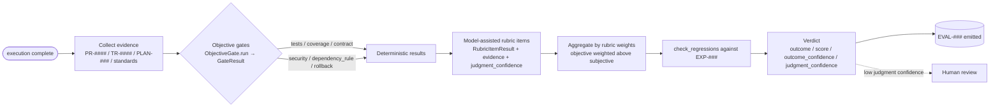

# RFC-0014 — Evaluation Framework

| Field | Value |
|---|---|
| RFC | `RFC-0014` |
| Title | Evaluation Framework |
| Status | **Accepted** |
| Authors | Architecture Office (`TEAM-090`) |
| Created | 2026-05-05 |
| Related | `ARCH-04`; `RFC-0007`, `RFC-0008`, `RFC-0009`, `RFC-0015`, `RFC-0025`, `RFC-0026`; `ADR-0015`, `ADR-0016`, `ADR-0017` |

---

## 1. Summary

This RFC defines the **Evaluation Framework** — the contract by which the Enterprise Cognitive
Layer (ECL) renders a structured, evidence-linked judgment on what a Worker actually did. It
normatively owns `sdk.evaluation.Evaluator` and `sdk.evaluation.ObjectiveGate`, and the
`evaluation_object.schema.json` object shape, realising the Evaluation Layer (`ARCH-04`) as a
reviewable interface.

The framework is **objective-first**: deterministic gates (tests, coverage, contract tests,
security scan, dependency rule, rollback plan) run and are weighted *above* any model-assisted
rubric item (`ADR-0015`). Every score line — objective or subjective — carries linked evidence;
there is **no score without evidence** (`ADR-0016`). The verdict reports **two** confidences
that must never be conflated: how good the work is (`outcome_confidence`) and how certain the
evaluation is about that judgment (`judgment_confidence`) (`ADR-0017`). The result is an
`EVAL-###` object that is reproducible, auditable, and comparable across Workers and time.

Evaluation is what makes EnterpriseSim a **benchmark rather than a demo**: its verdicts feed the
Decision Intelligence control loop in-flight (`RFC-0007`), ground reflection and experience in the
Learning Engine (`ARCH-05`, `RFC-0016`), and supply the scored records the benchmarking harness
(`RFC-0025`) and leaderboards (`RFC-0026`) consume.

## 2. Motivation

`CANON-001` §9.2 makes Evaluation (Stage 5) a first-class, identified artifact type precisely so
that "the entire reasoning process is inspectable and benchmarkable." Without a rigorous
evaluation contract, three failure modes — all catalogued in `ARCH-04` — are inevitable:

- **False pass.** Work passes every test yet violates a standard the tests never encoded — a
  reverse dependency, a missing rollback, a PCI breach. Green CI is not correctness.
- **Metric gaming.** A Worker optimizes the *score*, not the *outcome* (trivial tests for
  coverage, assertions that never fail); a single-signal evaluator is trivially gamed.
- **Judge laundering.** A model-assisted "is this well-designed?" guess is recorded as a
  high-confidence fact, corrupting the benchmark with unauditable opinion.

The framework closes all three by construction: standards are checked *explicitly* as objective
gates; scoring is multi-signal with deterministic gates weighted first; and the dual-confidence
verdict refuses to launder a low-confidence judgment as a high-confidence score. Because the
same machinery scores any Worker type (only the rubric differs, `RFC-0015`), evaluation is the
comparability layer beneath the whole benchmark.

## 3. Guide-level explanation

### 3.1 What an evaluation is

An evaluation compares three things and emits a scored verdict with evidence:

1. **Execution** — what the Worker produced (`PR-####`, `TR-####`, diffs, incident actions).
2. **Plan** — what the Worker committed to (`PLAN-###`, its success criteria and rollback).
3. **Standards** — MCG's canon (`CANON-001` §3 dependency graph, §4 testing/security, §8
   principles), encoded as gates and rubric items.

The output is an `EVAL-###` object: objective gate results, rubric-item results, and a verdict
`{ outcome, score, outcome_confidence, judgment_confidence }`.

### 3.2 Objective first; two confidences

The core discipline is ordering. Deterministic gates run first and carry the majority of the
weight; model-assisted rubric items run second and are bounded in influence. A Worker cannot
"talk its way" past a failed gate: if `dependency_rule` fails, the verdict is `fail` even when
every test is green (`ARCH-04` Example B). Separately, the verdict reports two confidences —
`outcome_confidence` ("how good is the work?", moving with the score) and `judgment_confidence`
("how sure are we?", high on deterministic gates, lower on model-assisted judgment). A low
`judgment_confidence` verdict is provisional and may be routed to human review; it is never
promoted to a confident score.

### 3.3 The evaluation pipeline



## 4. Reference-level explanation

### 4.1 The `Evaluator` contract

`sdk.evaluation.Evaluator` (this RFC's normatively owned interface) exposes two abstract methods:

- `evaluate(execution, plan, rubric) -> EvaluationObject` — objective-first, evidence-linked
  scoring with dual confidence (`ADR-0015`/`ADR-0017`). Inputs are `sdk.objects.ExecutionObject`,
  `sdk.objects.PlanningObject`, and a `sdk.evaluation.Rubric` (owned by `RFC-0015`). The output
  conforms to `evaluation_object.schema.json`.
- `check_regressions(execution, against) -> bool` — returns `True` if the execution reintroduced
  a previously-fixed defect, where `against` is a sequence of `CanonicalId` referencing `EXP-###`
  (see §4.5).

The `Evaluator` is a pure judge: it neither retries nor accepts work. Acting on a verdict is the
sole prerogative of Decision Intelligence (`RFC-0007`, `ADR-0008`).

### 4.2 Objective gates

An `sdk.evaluation.ObjectiveGate` has a `name` and a `run(execution) -> GateResult`. A
`GateResult` (frozen) carries `gate`, `passed`, `evidence` (a `CanonicalId`), and optional
`value`/`threshold`. Gates are **deterministic**: given the same execution artifacts they return
the same result, which is what makes re-runs reproducible (§4.6). The canonical gate set for a
feature change is:

| Gate | Result basis | Evidence | Standard |
|---|---|---|---|
| `unit_tests` | TestRail run pass/fail | `TR-####` | `CANON-001` §4.4 |
| `coverage` | measured vs. threshold | `TR-####` | ≥ 0.80 for Tier 0/1 (§4.4) |
| `contract_tests` | consumer-driven contracts | `TR-####` | §4.4 |
| `security_scan` | SAST/DAST/SCA findings | scan ref | §4.6 |
| `dependency_rule` | dependency-direction check | note | §3 (canon) |
| `rollback_plan` | plan/PR body present | `PR` body | §4.3, §7.4 |

The `dependency_rule` gate is where standards become executable: it asserts that no artifact
introduces a forbidden reverse dependency (e.g. Payments `APP-012` → Checkout `APP-003`). When
that gate fails, the verdict is `fail` regardless of test results — the fail-despite-green case
in `ARCH-04` Example B — and Decision Intelligence routes the work back for rework.

### 4.3 Rubric items and the objective-first weighting

Model-assisted judgment is expressed as `RubricItemResult` records: `item`, `result`
(`pass | partial | fail`), `evidence` (mandatory, `ADR-0016`), and `judgment_confidence`. The
rubric (`RFC-0015`) supplies `weights()`; the framework enforces that the aggregate weight of
objective gates dominates that of subjective items, so a strong model opinion can never outweigh
a failed deterministic gate. This ordering is `ADR-0015` made mechanical.

### 4.4 The verdict and dual confidence

The `verdict` block of `evaluation_object.schema.json` requires `outcome`
(`pass | partial | fail`), `score` (a `confidence` in [0,1]), `outcome_confidence`, and
`judgment_confidence`. Per `ADR-0017` the last two are distinct axes: objective-heavy evaluations
carry high `judgment_confidence`; those resting on subjective items carry lower confidence and are
flagged provisional. The schema forbids stray fields (`unevaluatedProperties: false`), so a
verdict cannot silently omit either confidence.

### 4.5 Regression checking against experience

`check_regressions(execution, against=[EXP-###])` guards the flywheel: it verifies the execution
did not reintroduce a defect a prior experience captured. The result is recorded in the
`regression_check` block (`reintroduced_defect`, `checked_against`). For the running example the
check is against `EXP-090` — the lesson that a guest checkout must not trigger a Loyalty
(`APP-015`) side effect. This links evaluation to the Learning Engine's accumulated memory
(`ARCH-03`, `ARCH-05`) and to hybrid retrieval of prior lessons (`ADR-0019`).

### 4.6 Reproducibility

A benchmark that is not reproducible is not a benchmark (`ARCH-04`). Reproducibility rests on
three rules: deterministic gates (§4.2); a **fixed rubric version** pinned in the `rubric` block
(`{ id, version }`, `ADR-0018`, `RFC-0015`); and **seed control** for any model-assisted item, so
a re-scored execution yields the same verdict. Non-determinism in a gate is a defect.

### 4.7 The running example

`EVAL-0061` scores `PR-0312` against `PLAN-0072` for `CHK-1421` using `RUBRIC-feature-change` v3,
conforming to `evaluation_object.schema.json`:

```yaml
evaluation:
  id: EVAL-0061
  schema_version: "2020-12.v1"
  execution: PR-0312                 # mcg-checkout-service#312
  plan: PLAN-0072
  task: CHK-1421
  rubric: { id: RUBRIC-feature-change, version: 3 }
  objective:
    - { gate: unit_tests,      result: pass, evidence: TR-0442, weight: 0.25 }
    - { gate: coverage,        result: pass, value: 0.84, threshold: 0.80, evidence: TR-0442, weight: 0.15 }
    - { gate: contract_tests,  result: pass, evidence: TR-0443, weight: 0.15 }
    - { gate: security_scan,   result: pass, evidence: "scan-9f2", weight: 0.15 }
    - { gate: dependency_rule, result: pass, note: "no reverse dep APP-012->APP-003", weight: 0.10 }
    - { gate: rollback_plan,   result: pass, evidence: "PR body", weight: 0.05 }
  rubric_items:
    - { item: "guest flow avoids APP-015 side effect", result: pass, evidence: "test GuestNoLoyaltyTest", judgment_confidence: 0.98 }
    - { item: "code clarity / maintainability", result: partial, evidence: "reviewer notes", judgment_confidence: 0.62 }
  verdict: { outcome: pass, score: 0.91, outcome_confidence: 0.90, judgment_confidence: 0.88 }
  regression_check: { reintroduced_defect: false, checked_against: [EXP-090] }
```

### 4.8 Downstream consumers

The `EVAL-###` object is a hinge in the ECL loop. Decision Intelligence (`RFC-0007`) reads the
verdict to choose retry / escalate / accept in-flight; the Reflection Pipeline (`RFC-0016`)
consumes it to produce a `REF-###` and then an `EXP-###`; and the benchmarking harness
(`RFC-0025`) persists it as a comparable record that leaderboards (`RFC-0026`) aggregate — keyed
by pinned rubric version so comparisons are fair.

## 5. Drawbacks

- **Cost of rigor.** Requiring linked evidence for every line and separating two confidences is
  heavier than a single numeric score; for trivial tasks the ceremony may feel disproportionate.
- **Gate authorship burden.** Encoding standards as deterministic gates (especially dependency
  direction and PCI) is real engineering owned with QE (`TEAM-050`) and SEC.

## 6. Rationale & alternatives

Objective-first weighting (`ADR-0015`) reflects a hard-won principle: deterministic signals are
cheaper, more reproducible, and less gameable than model judgment, so they must dominate.
Mandatory evidence (`ADR-0016`) makes every score auditable. Dual confidence (`ADR-0017`) is the
antidote to judge laundering. Alternatives considered and rejected:

- **A single scalar score.** Rejected: it hides whether a pass rests on gates or opinion, and it
  cannot express low judgment confidence — the exact laundering `ADR-0017` forbids.
- **LLM-as-sole-judge.** Rejected: non-reproducible, gameable, and unauditable; it would make
  EnterpriseSim a demo, not a benchmark (`ARCH-04`).
- **Gates only, no rubric.** Rejected: deterministic gates cannot assess design quality or
  situational judgment; a bounded, evidence-linked rubric captures what gates cannot.

## 7. Prior art

Generic, non-proprietary prior art only: continuous-integration quality gates and coverage
thresholds; consumer-driven contract testing; mutation testing as a guard against vacuous tests;
the "definition of done" separation of objective acceptance criteria from subjective review; and
separating a measurement from the confidence around it. No proprietary evaluation product or
internal tool is referenced or reproduced.

## 8. Unresolved questions

- How should partial-credit aggregation combine a `partial` rubric item with a fully passing
  gate set — linear weight, or a capped contribution? (Leaning: capped; deferred to `RFC-0015`.)
- What review quorum overrides a low-`judgment_confidence` verdict, and does a PCI (`APP-012`)
  evaluation demand a stricter one? Deferred to `RFC-0030`.
## 9. Future possibilities

- **Adversarial evaluation.** A red-team evaluator that actively tries to break a Worker's
  output, hardening the benchmark (`ARCH-04` Future Evolution).
- **Calibrated judges.** Track model-assisted judgment accuracy against human ground truth and
  re-weight `judgment_confidence` accordingly.
- **Cost- and latency-aware scoring.** Evaluate reasoning efficiency (calls, tokens, time)
  alongside correctness, with `RFC-0029`, and ratchet per-task-type baselines upward over time.

---

*RFC-0014 realises the Evaluation Layer (`ARCH-04`) and is consistent with `CANON-001`. Where it
and canon disagree, canon wins (`ADR-0050`); the RFC is defective and must be revised.*
