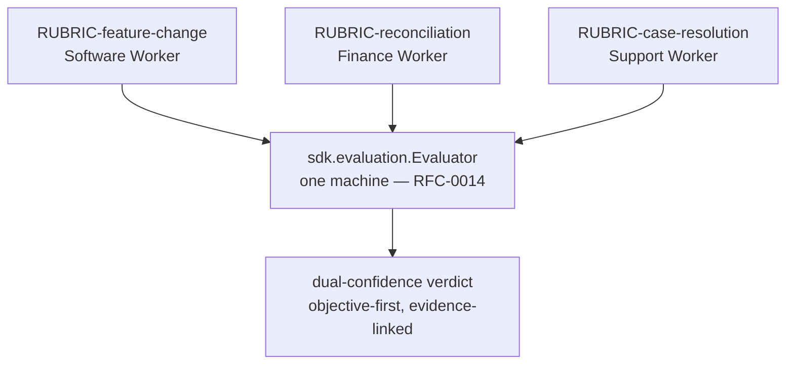

# RFC-0015 — Rubric Definition Language

| Field | Value |
|---|---|
| RFC | `RFC-0015` |
| Title | Rubric Definition Language |
| Status | **Accepted** |
| Authors | Architecture Office (`TEAM-090`) |
| Created | 2026-05-12 |
| Related | `ARCH-04`; `RFC-0014`, `RFC-0020`, `RFC-0021`, `RFC-0026`; `ADR-0018` |

---

## 1. Summary

This RFC defines the **Rubric Definition Language (RDL)** — the declarative, versioned data
format in which a scoring rubric is expressed. It normatively owns `sdk.evaluation.Rubric`, the
abstract surface that the Evaluation Framework (`RFC-0014`) consumes through `objective_gates()`,
`rubric_items()`, and `weights()`.

A rubric is **not code**: it is a document (YAML or JSON) that declares an `id`, an integer
`version`, the task type it binds, the ordered set of objective gates, the model-assisted rubric
items, the weight of each signal, and the evidence each item must produce. Because the machinery
that scores an execution is identical for every Worker type (`ARCH-04`, `ARCH-07`), **only the
rubric differs** between a Software Worker and a Finance Worker — the rubric is the single point
of domain specialization (`RFC-0020`).

Rubrics are versioned (`ADR-0018`) so that benchmarking is comparable over time and across Worker
implementations: a score is only meaningful relative to a fixed rubric version. The language is
designed to resist metric-gaming (multi-signal, mutation/contract gates), to enforce evidence per
item (`ADR-0016`), and to evolve under schema-versioning discipline (`RFC-0021`). Leaderboards
(`RFC-0026`) consume rubrics strictly by `{ id, version }`.

## 2. Motivation

`ARCH-04` names two failure modes the rubric layer must prevent: **rubric drift** (rubrics
diverge from real quality over time) and **gaming the metric** (a Worker optimizes the score, not
the outcome). Both are governance problems, and both demand that rubrics be *explicit, versioned
artifacts* owned with Quality Engineering (`TEAM-050`) rather than logic buried in an evaluator.

Three requirements follow. RDL must be **declarative** — reviewable and diffable by QE and domain
squads without reading evaluator internals (a data document, not a subclass); **versioned** —
because comparable benchmarking (`RFC-0026`) is impossible if the bar moves silently, so a score
must always name the rubric version it was measured against (`ADR-0018`); and **domain-agnostic
by construction** — the same machinery scores any Worker type (`ARCH-07`), and the only thing that
changes per domain is which rubric is bound. RDL makes rubrics first-class governed documents.

## 3. Guide-level explanation

### 3.1 A rubric is a bound, versioned document

Every rubric declares four things: **identity** — `id` (e.g. `RUBRIC-feature-change`) and integer
`version`, mirroring `Rubric.id` / `Rubric.version` in `sdk.evaluation.Rubric`; **binding** — the
`task_type` it applies to, so the framework resolves the right rubric for the work; **signals** —
an ordered list of objective gates and a list of rubric items; and **weights** — the contribution
of each signal, which must sum consistently (§4.4).

### 3.2 One machine, many rubrics

The reusability principle (`ARCH-07`, `ARCH-04` Example C) is realised entirely through binding:



A Finance Worker reconciling ledgers is scored by `RUBRIC-reconciliation` (balance correctness,
audit-trail completeness, policy adherence); a Support Worker resolving a case is scored by
`RUBRIC-case-resolution`. The objective-first, evidence-linked, dual-confidence machinery is
identical — only the rubric changes. This is what lets EnterpriseSim benchmark *any* Worker type.

A rubric version is also the comparability contract: it is immutable once published, so
tightening a threshold, adding a gate, or re-weighting a signal produces a **new version**
(`v3` → `v4`), never an in-place edit (`ADR-0018`). Scores carry the version they were measured
against, so a leaderboard never compares a `v3` score to a `v4` score as if the bar were the same.

## 4. Reference-level explanation

### 4.1 The `Rubric` surface

`sdk.evaluation.Rubric` (this RFC's normatively owned interface) is an abstract class exposing
`id: str`, `version: int`, and three abstract methods that RDL populates:

- `objective_gates() -> Sequence[ObjectiveGate]` — the deterministic gates (owned by `RFC-0014`),
  in evaluation order.
- `rubric_items() -> Sequence[str]` — the model-assisted item identifiers.
- `weights() -> Mapping[str, float]` — the weight of every gate and item, keyed by name.

RDL is the serialized form from which a `Rubric` is constructed: the document is the source of
truth, the class its in-code projection.

### 4.2 The RDL document shape

A rubric document has the following schema-like shape (illustrative, not normative code):

```yaml
rubric:
  id: string                 # e.g. RUBRIC-feature-change
  version: integer           # >= 1, immutable once published (ADR-0018)
  schema_version: string     # RDL family version, tracks RFC-0021
  task_type: string          # binding key: feature_change | reconciliation | case_resolution
  description: string
  objective_gates:           # deterministic, evidence-bearing, weighted first
    - gate: string           # unit_tests | coverage | contract_tests | security_scan | dependency_rule | rollback_plan
      weight: number         # [0,1]
      threshold: number?     # required for gates with a numeric bar (e.g. coverage)
      evidence: string       # kind of artifact that justifies the result (TR-#### / scan / PR body)
      standard_ref: string   # the CANON-001 clause this gate enforces
  rubric_items:              # model-assisted, evidence-linked (ADR-0016)
    - item: string
      weight: number
      evidence_required: true
      seed_controlled: true  # reproducibility for model-assisted scoring (RFC-0014 §4.6)
  weights_policy:
    objective_floor: number  # minimum total weight reserved for objective gates
```

### 4.3 Binding to a task type

The `task_type` field is the resolution key. When the Evaluation Framework evaluates an execution
whose plan targets a feature change, it resolves `RUBRIC-feature-change`; a reconciliation task
resolves `RUBRIC-reconciliation`; a support case resolves `RUBRIC-case-resolution`. The Worker
Specialization Model (`RFC-0020`) defines which rubric a Worker type binds by default. No Worker
carries its own scoring logic — specialization lives in the bound rubric, not the evaluator.

### 4.4 Weights must sum consistently

`weights()` must satisfy the objective-first invariant (`ADR-0015`): every gate and item has a
weight in [0, 1]; the weights sum to 1.0 within a fixed tolerance; and the total objective-gate
weight is **at least** `weights_policy.objective_floor`, guaranteeing deterministic signals
dominate model-assisted ones (for `RUBRIC-feature-change` v3 the floor is 0.80 and gates carry
0.85). A rubric that violates these rules is malformed and rejected at load time, mirroring the
strictness of the `schemas/` contracts (`RFC-0021`).

### 4.5 Guarding against metric-gaming

RDL encodes the anti-gaming discipline of `ARCH-04` directly. It is **multi-signal** — no single
gate carries enough weight to pass a rubric alone, so correctness, contract compatibility,
security and standards each contribute. It pairs coverage with **mutation/contract** signals so
trivial tests cannot lift a score without exercising behaviour. It expresses **standards as
gates** — dependency direction, rollback and PCI boundary are objective gates (`RFC-0014` §4.2),
so a Worker cannot ignore canon to chase a subjective score. And it requires **evidence per
item** — every item sets `evidence_required: true` (`ADR-0016`); an item with no linked artifact
cannot contribute a passing result.

### 4.6 Versioning and schema evolution

Rubric versioning (`ADR-0018`) and RDL-format versioning are distinct axes. The `version` integer
is the *content* version of a specific rubric; `schema_version` tracks the *RDL family* under
`RFC-0021` (expand → migrate → contract, `ADR-0033`). Additive, optional RDL fields are a minor
change; adding a required field or a new mandatory gate class is a major change and opens a
compatibility window. A published rubric version is never rewritten in place — a new content
version is a new record, exactly as `KnowledgeObject`s are immutable once published (`ADR-0004`).

### 4.7 Worked example — `RUBRIC-feature-change` v3

The rubric that scores `EVAL-0061` (`RFC-0014` §4.7). Its gates and weights match `ARCH-04`
Example A exactly; objective gates total 0.85, rubric items total 0.15, summing to 1.0:

```yaml
rubric:
  id: RUBRIC-feature-change
  version: 3
  schema_version: "2020-12.v1"
  task_type: feature_change
  description: "Scores a software feature change (PR vs. mcg-* repo) against its plan and CANON-001 standards."
  objective_gates:
    - { gate: unit_tests,      weight: 0.25, evidence: TR-####,  standard_ref: "CANON-001 §4.4" }
    - { gate: coverage,        weight: 0.15, threshold: 0.80, evidence: TR-####, standard_ref: "CANON-001 §4.4" }
    - { gate: contract_tests,  weight: 0.15, evidence: TR-####,  standard_ref: "CANON-001 §4.4" }
    - { gate: security_scan,   weight: 0.15, evidence: scan-ref, standard_ref: "CANON-001 §4.6" }
    - { gate: dependency_rule, weight: 0.10, evidence: note,     standard_ref: "CANON-001 §3" }
    - { gate: rollback_plan,   weight: 0.05, evidence: "PR body", standard_ref: "CANON-001 §4.3/§7.4" }
  rubric_items:
    - { item: "guest flow avoids APP-015 side effect", weight: 0.10, evidence_required: true, seed_controlled: true }
    - { item: "code clarity / maintainability",        weight: 0.05, evidence_required: true, seed_controlled: true }
  weights_policy:
    objective_floor: 0.80
```

When bound to `PR-0312`/`PLAN-0072`, this rubric yields the objective gate results and rubric
items recorded in `EVAL-0061` (`RFC-0014` §4.7), including the `dependency_rule` gate that asserts
no reverse dependency `APP-012` → `APP-003`, and the item that verifies a guest checkout avoids
the `APP-015` Loyalty side effect captured in `EXP-090`.

### 4.8 Leaderboard consumption

The benchmarking layer (`RFC-0026`) keys every score by `{ rubric.id, rubric.version }`, so a
leaderboard never mixes versions: comparing Worker A (under `v3`) to Worker B (under `v4`) is a
category error the harness refuses. Supersession chains are surfaced so a Worker evaluated under
an older rubric is compared fairly.

## 5. Drawbacks

- **Version proliferation.** Immutability plus frequent tuning produces many rubric versions;
  leaderboards must track supersession to keep comparisons honest.
- **Expressiveness ceiling.** A declarative format cannot capture every scoring nuance; genuinely
  novel logic may need a new gate type (a `RFC-0014` change), not just RDL.
- **Governance cost.** Every rubric and version is a QE-owned artifact requiring review —
  deliberate but real friction.

## 6. Rationale & alternatives

A declarative, versioned document is chosen because rubrics are governance artifacts that must be
diffed, reviewed and compared — properties code subclasses lack. Alternatives considered and
rejected: **rubrics as evaluator subclasses** (scoring logic buried in code is neither reviewable
by QE nor comparable across versions, and invites silent drift); **unversioned rubrics** (makes
benchmarking meaningless per `ADR-0018` — a score with no fixed bar cannot be compared over time);
and **a single universal rubric** (breaks domain-agnostic reuse per `ARCH-07` — a ledger
reconciliation and a feature change are not comparable on one set of criteria).

## 7. Prior art

Generic, non-proprietary prior art only: scoring rubrics from assessment and education practice
(criteria with weighted levels); declarative CI quality-gate configuration; policy-as-data
systems that separate declarative rules from the engine that evaluates them; and semantic
versioning of published contracts. No proprietary rubric product or internal template is
referenced or reproduced.

## 8. Unresolved questions

- Should partial-credit levels per rubric item (e.g. 0 / 0.5 / 1.0) be first-class in RDL, or is
  the `pass | partial | fail` triad sufficient? (Leaning: keep the triad; revisit with `RFC-0026`.)
- How should a rubric express *conditional* gates (one applying only to PCI-scoped changes,
  `APP-012`)? Deferred to `RFC-0030`. And what deprecation window applies to a superseded rubric
  version still referenced by historical `EVAL-###` records? Deferred to `RFC-0021`/`RFC-0026`.

## 9. Future possibilities

- **Rubric linting.** A CI check validating weight sums, the objective floor, evidence
  requirements, and that every `standard_ref` resolves to a real `CANON-001` clause.
- **Rubric inheritance.** A base rubric of shared gates extended per Worker type, reducing
  duplication across the `RUBRIC-*` family.
- **Data-driven re-weighting.** Calibrate item weights against human ground truth over time
  (`ARCH-04`), producing new auditable versions; and offer community rubrics for new Worker types
  via the plugin architecture (`RFC-0027`), each versioned and benchmarkable.

---

*RFC-0015 realises the rubric surface of the Evaluation Layer (`ARCH-04`) and is consistent with
`CANON-001`. Where it and canon disagree, canon wins (`ADR-0050`); the RFC is defective and must
be revised.*
