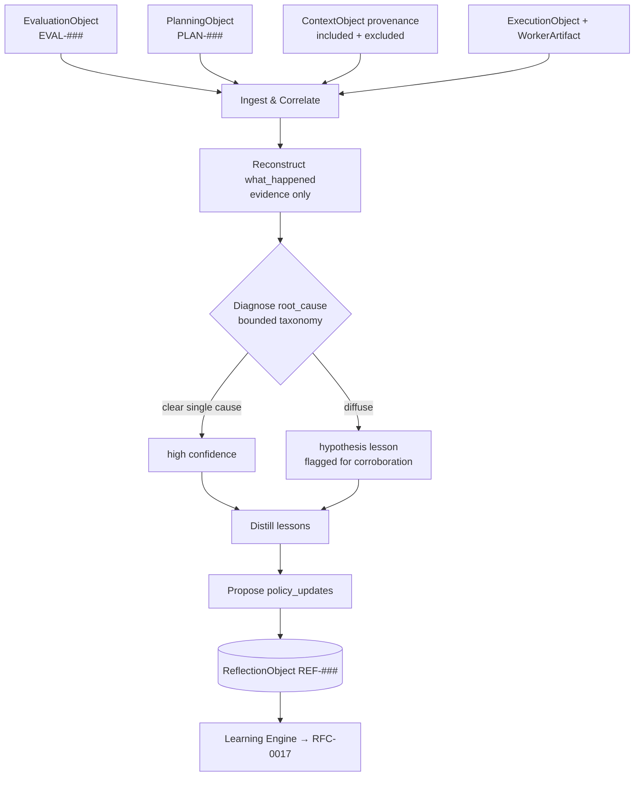

# RFC-0016 — Reflection Pipeline

| Field | Value |
|---|---|
| RFC | `RFC-0016` |
| Title | Reflection Pipeline |
| Status | Accepted |
| Authors | Architecture Office (`TEAM-090`) |
| Created | 2026-03-02 |
| Related | `ARCH-05`, `ARCH-04`, `RFC-0014` (Evaluation Framework), `RFC-0017` (Learning Event Propagation), `RFC-0018` (Experience Promotion), `RFC-0023` (Provenance & Decision Trace), `ADR-0034` (Loop Closure Defines Learning), `ADR-0035` (Root-Cause Reflection) |

## 1. Summary

This RFC specifies the **Reflection Pipeline**: the deterministic, evidence-grounded process
that converts an evaluated execution (`EVAL-###`) into a root-cause explanation and a set of
transferable lessons, materialized as a `ReflectionObject` (`REF-###`). It defines the
pipeline stages, the inputs each stage may read, the shape of the produced reflection, and the
rules that keep reflection honest (no hindsight rationalization, no symptom fixation). It is
the first half of the Learning Engine (`ARCH-05`); `RFC-0017` covers what happens to a
reflection once produced.

## 2. Motivation

CANON-001 §9 (Stage 6) makes reflection a first-class, identified artifact type precisely so
that *why* an outcome occurred is inspectable, not folded into an opaque model call. A stateless
LLM cannot explain a failure it does not remember; the ECL must reconstruct causation from
durable evidence — the plan (`PLAN-###`), the context provenance (`CTX-###`), the execution
artifacts (`PR-####`, `TR-####`), and the evaluation (`EVAL-###`). Without a disciplined
pipeline, reflection degrades into two well-known pathologies documented in `ARCH-05`:
**hindsight bias** (the reflection simply narrates the known outcome) and **symptom fixation**
(it fixes the visible error, guaranteeing recurrence). The Reflection Pipeline exists to make
root-cause analysis (`ADR-0035`) repeatable and grounded so that the lessons it emits are worth
propagating.

## 3. Guide-level explanation

When an execution finishes and the Evaluation Layer emits an `EVAL-###`, the Learning Engine's
`Reflector` (see `sdk.learning.Reflector`) runs a fixed pipeline:

1. **Ingest & correlate.** Gather the full loop: `PLAN-###`, the `ContextObject` provenance
   (crucially its `excluded[]` — the dropped-candidate log), the `ExecutionObject`/`WorkerExecution`
   and its `WorkerArtifact`s, and the `EvaluationObject` with its evidence links.
2. **Reconstruct the narrative** (`what_happened`) strictly from evidence — a factual account,
   not a judgment.
3. **Diagnose root cause** into a bounded taxonomy (missing knowledge, dropped context, flawed
   plan, tool error, model error, standards gap, evaluation defect), with a `confidence`.
4. **Distill lessons** — each a reusable "when *situation*, do *action*, because *reason*"
   statement, tagged for whether it should become an `ExperienceObject`.
5. **Propose policy updates** — concrete adjustments to retrieval, planning, or routing.
6. **Record loop-closure intent** — the pipeline does not close the loop itself; it names what
   *would* close it (`loop_closed_by` is filled later, per `ADR-0034`).

The result is a `REF-###` conforming to `schemas/reflection_object.schema.json`.

## 4. Reference-level explanation

### 4.1 Interfaces

The pipeline is expressed by `sdk.learning.Reflector`, invoked by `sdk.learning.LearningEngine`
after evaluation. It reads through the retrieval interfaces of adjacent layers
(`sdk.evaluation.Evaluator` outputs, `sdk.context` provenance, `sdk.experience.ExperienceRetriever`
for prior lessons to reinforce/contradict) but **writes nothing durable itself** beyond the
`ReflectionObject`; experience writes and policy updates are emitted as `LearningEvent`s handled
in `RFC-0017`.

### 4.2 The `ReflectionObject` contract

Per `sdk.objects.ReflectionObject` and `schemas/reflection_object.schema.json`, every `REF-###`
carries:

- `evaluation`, `execution`, `plan` — canonical back-references (`EVAL-###`, execution ref,
  `PLAN-###`), enforcing referential integrity (`RFC-0022`).
- `what_happened` — factual narrative, evidence-grounded.
- `root_cause` — `{ category, detail, confidence }`. `category` is drawn from the closed set
  in §4.3; `detail` must cite at least one evidence artifact; `confidence` is a `Confidence`
  in `[0.0, 1.0]`.
- `lessons[]` — each `{ statement, situation, create_experience? }`. `situation` mirrors the
  `ExperienceObject.situation` shape (`task_type`, `apps`, `failure_class`) so a distilled
  lesson can be indexed for situational retrieval (`ARCH-03`).
- `policy_updates[]` — each targets a layer (`context` | `planning` | `routing`) with a
  concrete directive (see `RFC-0017` §4 for how these are applied).
- `loop_closed_by` — nullable `CanonicalId`; set only when a later execution demonstrably
  applied the lesson (`ADR-0034`).

### 4.3 Root-cause taxonomy (bounded)

Reflection must classify into exactly one primary category (multi-cause failures record the
dominant cause plus contributing categories in `detail`):

| Category | Meaning | Primary evidence source |
|---|---|---|
| `missing_knowledge` | No `KN-###` existed for the decisive fact | Knowledge gap signal (`ARCH-02`) |
| `dropped_context` | Decisive item was retrieved but excluded for budget | `ContextObject.excluded[]` |
| `flawed_plan` | Plan omitted a step/test/side-effect guard | `PLAN-###` vs. outcome |
| `tool_error` | Execution tool failed or was misused | `WorkerArtifact` status |
| `model_error` | Reasoning defect despite adequate context | Decision trace (`RFC-0023`) |
| `standards_gap` | Violated a CANON standard not gated | `EvaluationObject` standards line |
| `evaluation_defect` | The verdict itself was wrong/low-confidence | `EVAL-###` judgment_confidence |

### 4.4 Honesty rules

1. **Evidence-first.** Every clause in `root_cause.detail` cites a concrete artifact ID; an
   unsourced claim is rejected by the pipeline's validator (mirrors the "no score without
   evidence" rule of `ARCH-04`).
2. **Inspect what was dropped.** The pipeline must examine `ContextObject.excluded[]` before
   concluding `missing_knowledge` — the most common true cause is `dropped_context`
   (`ARCH-05` Best Practice 5).
3. **Confidence honesty.** A diffuse failure yields a *hypothesis* lesson at low confidence,
   flagged for corroboration; it is never promoted (`RFC-0018`) on a single occurrence.
4. **Feedback-poisoning guard.** Reflections built on an `EVAL-###` with low
   `judgment_confidence` inherit a discount and are marked provisional.

### 4.5 Determinism & reproducibility

The correlation, taxonomy assignment from evidence, and validator are deterministic. Where a
model-assisted step is used to phrase `what_happened` or propose lessons, it runs under the
replay controls of `RFC-0024` (fixed seed, pinned model class via the Gateway) so a reflection
can be regenerated and audited. The reflection records the `rubric`/model context it relied on
in `metadata`.

### 4.6 Worked example (`CHK-1421` loop)

The earlier guest-checkout attempt failed (`EVAL-0044`): guest orders created Loyalty
(`APP-015`) accounts. The pipeline ingests `PLAN-0051`, `CTX-0091` (whose `excluded[]` shows the
loyalty domain rules were dropped for budget), `PR-0207`, and `EVAL-0044`. It reconstructs the
narrative, diagnoses `root_cause.category = dropped_context` (confidence 0.88), distills the
lesson that becomes `EXP-090`, and proposes two policy updates (raise retrieval priority of
`APP-015` rules for `APP-003` changes; require negative-side-effect assertions in feature
plans). The result is `REF-0019`; its `loop_closed_by` is later set to `PR-0312` when the next
attempt applies the lesson and passes (`EVAL-0061` = 0.91).

## 5. Drawbacks

- **Cost.** Running a full correlation + model-assisted reflection on every execution adds
  latency and reasoning cost (bounded by `RFC-0029`); low-value passing executions may not
  merit deep reflection.
- **Taxonomy rigidity.** A bounded root-cause set can force a mediocre fit for genuinely novel
  failures; mitigated by the `detail` free-text and an `other` escape hatch reviewed quarterly.
- **Garbage-in.** Reflection quality is capped by evaluation quality (`ARCH-04`); a wrong
  verdict can seed a wrong lesson despite the poisoning guard.

## 6. Rationale & alternatives

- **Inline reflection inside the model call** (rejected): produces no inspectable artifact,
  cannot be replayed or audited, and violates "learning lives outside the model" (`ARCH-05`).
- **Free-form reflection without a taxonomy** (rejected): defeats systemic-pattern detection
  (`RFC-0017` §4.5), which requires categorical aggregation across many `REF-###`.
- **Reflect only on failures** (rejected): successful executions carry reinforcing evidence
  (why an applied `EXP-###` worked) that feeds `outcome_lift` scoring in `ARCH-03`; we reflect
  on all, but at depth proportional to outcome and cost budget.

## 7. Prior art

Root-cause analysis practice (the "5 Whys", fault-tree analysis) and blameless post-incident
review are the generic inspirations: separate the factual timeline from the causal diagnosis,
require evidence, and target the systemic cause rather than the proximate symptom. Structured
retrospective formats in agile practice inform the fixed-section shape. No proprietary system
is referenced.

## 8. Unresolved questions

- What depth-of-reflection policy best trades cost against learning yield per outcome class?
- Should contributing (secondary) causes be first-class fields rather than free-text in
  `detail`, to sharpen systemic aggregation?
- How should multi-Worker executions (`ARCH-06` future) attribute root cause across Workers?

## 9. Future possibilities

- **Meta-reflection**: the Learning Engine learns which reflection strategies most reliably
  find true root causes (`ARCH-05` future evolution).
- **Counterfactual reflection**: record not only what happened but the minimal context change
  that would have prevented it, feeding counterfactual experiences (`ARCH-03`).
- **Causal incident graphs**: link `INC-####` → cause → `REF-###` → prevention into a queryable
  organizational failure memory.
