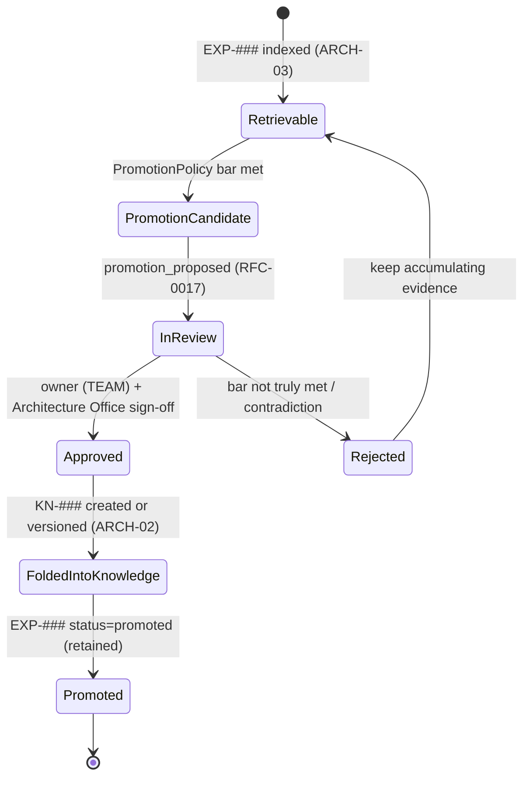

# RFC-0018 — Experience Promotion to Knowledge (Governance)

| Field | Value |
|---|---|
| RFC | `RFC-0018` |
| Title | Experience Promotion to Knowledge (Governance) |
| Status | Accepted |
| Authors | Architecture Office (`TEAM-090`) |
| Created | 2026-03-16 |
| Related | `ARCH-03`, `ARCH-02`, `RFC-0016` (Reflection Pipeline), `RFC-0017` (Learning Event Propagation), `RFC-0006` (Knowledge Graph Model), `RFC-0022` (Object Identity & Referential Integrity), `ADR-0036` (Governed Promotion) |

## 1. Summary

This RFC specifies the **governed promotion** of an accumulated experience (`EXP-###`) into
durable enterprise knowledge (`KN-###`). It defines the promotion bar (evidence, corroboration,
non-contradiction), the review workflow (owning team + Architecture Office), the state
transitions on both the Experience and Knowledge sides, and the referential-integrity guarantees
that keep the promoted lesson traceable to the executions that earned it. Promotion is how a
*lesson* becomes *truth* while preserving full lineage (`ADR-0036`).

## 2. Motivation

Experience and Knowledge are deliberately different (`ARCH-02` vs. `ARCH-03`): experience is
*earned* and situation-linked; knowledge is *governed truth* authored deliberately. The value of
the flywheel (CANON-001 §9 Stage 8) is that repeatedly-validated experience raises the durable
baseline — but only under governance, or the Knowledge Layer is **poisoned** by one-off luck
(`ARCH-02`/`ARCH-03` failure modes). This RFC makes promotion a disciplined, evidence-gated,
reviewed act rather than an automatic side effect of a high score.

## 3. Guide-level explanation

An `ExperienceObject` advances through the lifecycle in `ARCH-03`
(`captured → retrievable → promotion_candidate → promoted`). The Learning Engine's
`sdk.learning.PromotionPolicy` decides when an experience becomes a `promotion_candidate`; a
`promotion_proposed` `LearningEvent` (`RFC-0017`) then enters the promotion queue. Human/owner
governance reviews the candidate against the bar; on approval the lesson is folded into a
`KnowledgeObject` (new or new version), and the experience is marked `promoted` — but **remains**
in the Experience Layer for traceability (never deleted, per `ADR-0022`).

## 4. Reference-level explanation

### 4.1 The promotion bar

`sdk.learning.PromotionPolicy` evaluates a candidate against explicit, versioned thresholds read
from the `ExperienceObject.value` block (`application_frequency`, `outcome_lift`, `corroboration`,
`contradiction_rate`) plus lineage completeness:

| Criterion | Requirement (default) | Source field |
|---|---|---|
| Evidence completeness | origin execution + `EVAL-###` + `REF-###` all present | `ExperienceObject.evidence` |
| Application frequency | applied in ≥ N independent executions | `value.application_frequency` |
| Outcome lift | measured `EVAL-###` lift ≥ threshold when applied | `value.outcome_lift` |
| Corroboration | `strong` (multiple sources, not a lone assertion) | `value.corroboration` |
| Non-contradiction | `contradiction_rate` below ceiling | `value.contradiction_rate` |
| Situational clarity | `situation` is specific enough to author a rule | `situation` |

Thresholds are policy data (versioned, per `RFC-0017`), tunable per knowledge domain — a Tier 0
or PCI-adjacent domain sets a higher bar than an internal one.

### 4.2 Review workflow

Promotion is a **two-party governance** act mirroring CANON-001 §7 approval discipline:

1. The **owning team** of the target knowledge domain (e.g., `TEAM-004` for checkout) validates
   correctness and scope.
2. The **Architecture Office** (`TEAM-090`) validates canon consistency and that the rule does
   not contradict existing `KN-###` or CANON.
3. On approval, the lesson is authored into a `KnowledgeObject` via `sdk.knowledge.KnowledgeStore`
   — either a **new** `KN-###` or a **new version** of an existing one (Knowledge is immutable
   once published; new facts are new versions, per `sdk.objects` rules and `RFC-0021`).

High-stakes lessons (Tier 0 / PCI / auth) require human-in-the-loop review before promotion
(`ARCH-05` future evolution, now normative here).

### 4.3 Referential integrity on promotion

Per `RFC-0022` and `ADR-0023`, promotion preserves a bidirectional, resolvable link:

- `ExperienceObject.promoted_to_knowledge` → the `KN-###`.
- `KnowledgeObject.relations` gains a `promoted_from` → the `EXP-###` (and transitively its
  `REF-###`/`EVAL-###`/execution lineage).

No ID is reused or rewritten; the experience is retained with `status: promoted`. This means any
`KN-###` rule that originated from experience can be traced back to the exact executions that
justified it — the audit spine of the ECL.

### 4.4 Knowledge-side effects

The new/updated `KnowledgeObject` inherits `authority: owner-approved` (not `canon` — only CANON
itself is canon), a `sensitivity` label carried from the situation, and enters the Knowledge
lifecycle at `published` after indexing (semantic + keyword + graph, `RFC-0005`/`RFC-0006`).
Once a lesson is durable knowledge, the corresponding experience may be **down-weighted for
retrieval** to avoid double-injecting the same lesson (knowledge now carries it authoritatively),
while remaining available for lineage.

### 4.5 Worked example (`EXP-090` → `KN-045`)

`EXP-090` ("guest carts must not create loyalty accounts") accrues `application_frequency: 4`,
`outcome_lift: 0.23`, `corroboration: strong`, `contradiction_rate: 0.0`, with complete lineage
(`PR-0207`, `EVAL-0044`, `REF-0019`, prevented regression `PR-0312`). `PromotionPolicy` marks it
a candidate; a `promotion_proposed` event queues it. `TEAM-004` + `TEAM-090` approve. The lesson
is folded into `KN-045` as rule #1 (a new version of the checkout domain rules). `EXP-090.status`
becomes `promoted`; `KN-045.relations.promoted_from` gains `EXP-090`. The next guest-flow task
now retrieves the rule as authoritative knowledge.

## 5. Drawbacks

- **Governance latency.** Human review slows promotion; mitigated by domain-scoped auto-eligible
  thresholds for low-risk internal knowledge, with human review reserved for high-stakes domains.
- **Bar mis-calibration.** Too low poisons Knowledge; too high starves it and leaves lessons stuck
  in Experience. Thresholds are versioned and reviewed against measured false-promotion rate.
- **Duplicate-lesson risk.** A promoted lesson still living in Experience can double-count;
  addressed by post-promotion down-weighting (§4.4).

## 6. Rationale & alternatives

- **Automatic promotion on score threshold** (rejected): reintroduces poisoning; `ADR-0036`
  requires governance, especially for Worker-proposed knowledge.
- **Never promote; keep everything as experience** (rejected): Knowledge retrieval and graph
  reasoning (`RFC-0006`) need authoritative, deduplicated truth; unbounded experience dilutes
  retrieval (lesson sprawl, `ARCH-03`).
- **Deleting the experience after promotion** (rejected): breaks lineage and the never-reuse rule
  (`ADR-0022`); we retain and down-weight instead.

## 7. Prior art

Editorial/curatorial workflows (community-contributed content promoted to canonical status after
review), scientific evidence grading (a claim's strength rises with independent replication), and
staged configuration promotion (dev → staging → prod gates) are the generic analogues. No
proprietary system is referenced.

## 8. Unresolved questions

- Should promotion thresholds auto-tune from the observed false-promotion / stale-knowledge rate?
- How to handle a promoted rule later contradicted by new experience — deprecate the `KN-###`
  version and re-open the experience, or fast-path a governance revision?
- What is the right cross-domain policy when a lesson earned in one domain is proposed for another
  (`RFC-0020` cross-Worker transfer)?

## 9. Future possibilities

- **Promotion bundles** — consolidate a cluster of near-duplicate experiences into one
  higher-order `KN-###` "playbook" (`ARCH-03` experience clustering).
- **Auto-deprecation feedback** — when live state contradicts a promoted rule, auto-open a
  revalidation (`ARCH-02` freshness automation) and re-open the source experience.
- **Governance analytics** — dashboards of promotion throughput, false-promotion rate, and
  lineage depth on the Signals Bus (`RFC-0028`).
