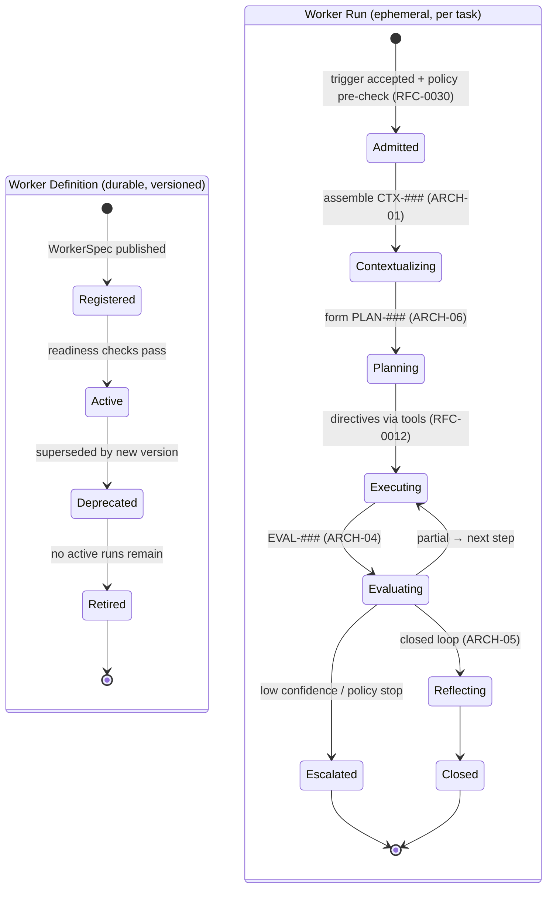

# RFC-0019 — Worker Lifecycle

| Field | Value |
|---|---|
| RFC | `RFC-0019` |
| Title | Worker Lifecycle |
| Status | Accepted |
| Authors | Architecture Office (`TEAM-090`) |
| Created | 2026-03-23 |
| Related | `ARCH-07`, `ARCH-06`, `RFC-0007` (Decision Intelligence Control Loop), `RFC-0012` (Execution Runtime), `RFC-0020` (Worker Specialization Model), `RFC-0023` (Provenance & Decision Trace), `RFC-0028` (Signals Bus), `ADR-0024` (Workers Domain-Agnostic) |

## 1. Summary

This RFC defines the **lifecycle of an Enterprise AI Worker** — from registration of a
`WorkerSpec`, through per-task run execution of the ECL loop, to retirement and versioning. It
specifies the run state machine, the identity and versioning of Workers and their runs, the
health/readiness model, and the concurrency and isolation guarantees. It draws the line between
the **durable, versioned Worker definition** and the **ephemeral run** that traverses the ECL
loop, so that Worker behavior is reproducible and benchmarkable (`RFC-0025`).

## 2. Motivation

CANON-001 §9 and `ARCH-07` describe *what* a Worker does (read context, plan, act, be evaluated,
reflect) but not the operational lifecycle that makes a Worker a managed, versioned, observable
entity in MCG's platform. Benchmarking (`RFC-0025`), leaderboards (`RFC-0026`), and replay
(`RFC-0024`) all require a precise notion of "this run, of this Worker version, on this task."
Without a defined lifecycle, runs cannot be compared fairly or reproduced, and the "you build it,
you run it" operational discipline (CANON-001 §2.3) cannot extend to Workers.

## 3. Guide-level explanation

A Worker exists at two levels:

- **Definition** — a `sdk.workers.WorkerSpec`: a durable, versioned binding of the four
  specialization axes (knowledge domains, tools, rubrics, policies — see `RFC-0020`) over the
  shared ECL. Registered once, versioned thereafter (SemVer, `ADR-0032`).
- **Run** — one execution of `sdk.workers.Worker.run(trigger)` against a single task trigger
  (e.g., `CHK-1421`). A run instantiates the ECL loop via `sdk.workers.WorkerRuntime` and
  `sdk.decision.Orchestrator`, and produces a decision trace, artifacts, and an `EVAL-###`.

The Worker definition moves through `Registered → Active → Deprecated → Retired`. Each run moves
through `Admitted → Contextualizing → Planning → Executing → Evaluating → (Reflecting) → Closed`
(or `Escalated`/`Aborted`).

## 4. Reference-level explanation

### 4.1 Identity & versioning

- A Worker has a stable **Worker ID** and a **version** (`WorkerSpec.version`, SemVer). The pair
  `(worker_id, version)` is what benchmarks and leaderboards compare (`RFC-0026`).
- Each run has a `run_id` (a `CanonicalId`, never reused per `ADR-0022`). The `run_id` is stamped
  onto every artifact of the run: `WorkerDecision.worker`/`trace_seq`, `WorkerExecution.worker`/
  `run_id`, and the produced `EVAL-###`/`REF-###` via `metadata`.
- Changing any specialization axis (`RFC-0020`) produces a new Worker version; the ECL core is
  unchanged, so a version bump reflects only specialization or policy deltas.

### 4.2 Registration & readiness

`WorkerRuntime` admits a `WorkerSpec` only if:

1. Every referenced knowledge domain resolves in the Knowledge Layer (`RFC-0003`).
2. Every declared tool resolves in the `sdk.execution.ToolRegistry` with a negotiated capability
   descriptor (`RFC-0013`).
3. Every rubric resolves and is versioned (`RFC-0015`).
4. Every policy resolves in `sdk.decision.PolicyGuard` (`RFC-0030`).

Failing any check leaves the definition `Registered` but not `Active` — it cannot accept runs.
This is the Worker analogue of CANON-001 §2.3: no unowned, unvalidated Worker runs in production.

### 4.3 The run and the ECL loop

`Worker.run(trigger)` delegates to the `Orchestrator` (`RFC-0007`), which drives Context →
Plan → Execute → Evaluate → (Reflect) exactly as `ARCH-07` specifies. The Worker layer adds only
**run identity, admission, budget, and lifecycle bookkeeping**; it holds no domain logic
(`ADR-0024`). Per-run resource envelopes (iteration cap, reasoning-cost/latency budget) come from
`RFC-0029` and are enforced by the Orchestrator; breaching them forces `Escalated`/`Aborted` with
a traced reason.

### 4.4 Concurrency, isolation & idempotency

- Runs are **isolated**: each has its own ephemeral `ContextObject` (never durable, `ARCH-01`) and
  its own decision trace. Two concurrent runs of the same Worker share only the durable memory
  (Knowledge, Experience) and the versioned policy stores.
- Durable memory writes from a run occur **only** post-loop via the Learning Engine
  (`RFC-0016`/`RFC-0017`), keeping runs free of mid-loop shared-state races.
- A run is **idempotent on its trigger + Worker version**: re-running the same trigger under
  replay controls (`RFC-0024`) reproduces the same decisions modulo pinned model nondeterminism.

### 4.5 Health, observability & retirement

Every state transition emits a signal to the Signals Bus (`RFC-0028`): admission rate, stage
latencies, escalation rate, autonomy rate, and cost per run. A Worker version is `Deprecated`
when a newer version supersedes it and `Retired` only when no active runs remain; retired
definitions are retained (never deleted, `ADR-0022`) so historical benchmark results remain
attributable.

## 5. Drawbacks

- **Version proliferation.** Frequent policy tweaks (`RFC-0017`) could churn Worker versions;
  mitigated by scoping automatic policy data outside the versioned `WorkerSpec` where it is
  shared, and bumping versions only on specialization changes.
- **Bookkeeping overhead.** Full run identity and per-transition signals add cost; justified by
  reproducibility and benchmarking requirements.
- **Isolation cost.** Strict per-run context isolation forgoes some cross-run caching; addressed
  by the shared candidate-score cache within (not across) a run (`ARCH-01`).

## 6. Rationale & alternatives

- **Stateful long-lived Worker processes** (rejected): conflicts with the stateless-model,
  ephemeral-context invariant (`ARCH-01`/`ARCH-07`); durable state belongs in Knowledge/Experience.
- **Conflating Worker definition and run** (rejected): destroys the ability to compare a fixed
  Worker version across tasks, the basis of benchmarking (`RFC-0025`).
- **Per-run Worker versions** (rejected): would make leaderboards meaningless; the definition must
  be stable across many runs.

## 7. Prior art

The definition-vs-instance split mirrors process/thread and class/object models, and
container-image-vs-container lifecycles (immutable, versioned image; ephemeral, isolated
instance). Kubernetes readiness/liveness gating and blue-green/versioned-deployment retirement
inform §4.2 and §4.5. No proprietary system is referenced.

## 8. Unresolved questions

- Should long-running or multi-step human-collaboration tasks introduce a `Suspended` run state
  with durable checkpointing, and how does that interact with ephemeral context?
- How are runs attributed and isolated in multi-Worker orchestration (`ARCH-06`/`RFC-0020` future)?
- What is the retirement policy for a Worker version still referenced by open leaderboards
  (`RFC-0026`)?

## 9. Future possibilities

- **Warm-start runs** using predictive context pre-fetch (`ARCH-01`) for recurring task shapes.
- **Multi-Worker runs** where one Orchestrator coordinates several specialized Workers with
  hand-offs and shared context fragments.
- **Canary Worker versions** — progressive rollout of a new `WorkerSpec` version against a task
  slice with automated rollback on `EVAL-###` regression, mirroring CANON-001 §7 progressive
  delivery.
