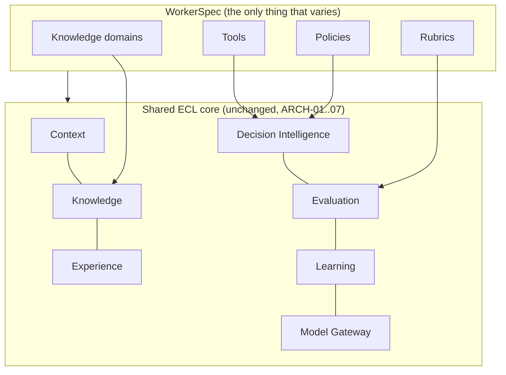

# RFC-0020 — Worker Specialization Model

| Field | Value |
|---|---|
| RFC | `RFC-0020` |
| Title | Worker Specialization Model |
| Status | Accepted |
| Authors | Architecture Office (`TEAM-090`) |
| Created | 2026-03-30 |
| Related | `ARCH-07`, `RFC-0019` (Worker Lifecycle), `RFC-0003` (Knowledge Retrieval), `RFC-0013` (Tool Selection & Capability Negotiation), `RFC-0015` (Rubric Definition Language), `RFC-0030` (Security, Policy Enforcement & Guardrails), `ADR-0024` (Workers Domain-Agnostic), `ADR-0025` (Four Specialization Axes) |

## 1. Summary

This RFC defines the **four-axis specialization model** by which any Enterprise Worker type is
created without changing ECL architecture: **knowledge domains**, **tools**, **rubrics**, and
**policies**. It specifies the `WorkerSpec` contract that binds these axes over the shared core,
the resolution and validation of each axis at registration, and the invariants that guarantee a
new Worker type is *only* a new specialization — never new architecture (`ADR-0024`,
`ADR-0025`).

## 2. Motivation

`ARCH-07` states the ECL's central reusability promise: adding "Future Worker N" requires zero
architectural change, only its four specializations. This promise is what lets EnterpriseSim
benchmark *any* Worker type on the same substrate and lets MCG stand up a new Worker "in a day".
But a promise needs a contract: exactly which four things vary, how they are declared and
validated, and what must remain identical. This RFC makes the four axes normative and precise so
that Worker authors cannot accidentally fork the architecture.

## 3. Guide-level explanation

Everything a Worker needs to be *itself* — and nothing more — lives in four pluggable axes over
the shared, unchanged ECL:

| Axis | What it binds | Consumed by | What stays identical |
|---|---|---|---|
| **Knowledge domains** | Which `KN-###` corpora are in scope | Knowledge/Context Layers | Retrieval, governance, indexing |
| **Tools** | Which enterprise tools the Worker may act through | Execution Runtime | Directive protocol, tool interface |
| **Rubrics** | Task-type scoring criteria | Evaluation Layer | Objective-first, evidence-linked engine |
| **Policies** | Guardrails (PCI vs. bias/fairness vs. SoD) | Decision Intelligence | Orchestration, confidence gating, routing |

A QA Worker, a Finance Worker, a Privacy Worker and a Security Worker differ *only* along these
four axes (`ARCH-07` worked micro-examples). Context assembly, experience accumulation,
reflection, learning, and model routing are shared and unchanged.

## 4. Reference-level explanation

### 4.1 The `WorkerSpec` contract

`sdk.workers.WorkerSpec` binds exactly the four axes plus Worker identity/version (`RFC-0019`).
It contains **no orchestration, retrieval, or scoring logic** — those are the shared core. The
runtime rejects a `WorkerSpec` that attempts to override core behavior (`ADR-0024` is enforced
structurally, not by convention).

### 4.2 Axis 1 — Knowledge domains

A list of knowledge-domain selectors resolved against `sdk.knowledge.KnowledgeStore` /
`KnowledgeRetriever` (`RFC-0003`). Selectors scope which `KN-###` corpora the Context Layer may
retrieve for this Worker; governance, versioning (`RFC-0021`) and hybrid retrieval
(`RFC-0005`/`RFC-0006`) are unchanged. Example — QA Worker: test standards + `APP-*` contracts;
Privacy Worker: privacy policies + data lineage (`APP-020`).

### 4.3 Axis 2 — Tools

A list of tool bindings resolved against `sdk.execution.ToolRegistry`; each undergoes capability
negotiation (`RFC-0013`) so the Execution Runtime knows the tool's operations, side-effects, and
risk. The **directive protocol and `Tool` interface are identical** across Workers (`RFC-0012`);
only the *set* of granted tools differs. A tool grant is also a security surface — see §4.6.

### 4.4 Axis 3 — Rubrics

A mapping from task type to a versioned rubric authored in the Rubric Definition Language
(`RFC-0015`) and applied by `sdk.evaluation.Evaluator` / `Rubric`. The Evaluation engine —
objective-first, evidence-linked, dual-confidence (`ARCH-04`) — is unchanged; only the scoring
criteria differ (e.g., `RUBRIC-feature-change` vs. `RUBRIC-reconciliation` vs.
`RUBRIC-case-resolution`). Rubric versions are pinned for reproducible benchmarking (`RFC-0025`).

### 4.5 Axis 4 — Policies

A set of guardrail policies resolved by `sdk.decision.PolicyGuard` and enforced *before*
execution (`RFC-0030`, `ADR-0041`). The confidence gating, routing, and orchestration of
Decision Intelligence are identical; only the guardrails differ — PCI boundary for a Security
Worker, segregation-of-duties for a Finance Worker, bias/fairness for a Recruitment Worker, data
minimization for a Privacy Worker (`ARCH-07`).

### 4.6 Validation & invariants at registration

At registration (`RFC-0019` §4.2) the runtime validates all four axes resolve and, critically,
enforces two invariants:

1. **Core-immutability invariant** — a `WorkerSpec` may only *select and configure*; it may not
   supply alternative implementations of core interfaces. New Worker types add specializations,
   not architecture (`ADR-0024`).
2. **Axis-completeness invariant** — a Worker must declare at least one knowledge domain, its
   tool set (possibly empty for a read-only Worker), a rubric per task type it accepts, and its
   policy set; missing axes block activation.

### 4.7 Cross-Worker transfer

Because axes are declarative and experience is situation-linked (`ARCH-03`), a lesson earned by
one Worker can be retrieved by another when the *situation* matches structurally — e.g., a QA
Worker's async-test-determinism experience (`EXP-142`) retrieved by a Support Worker (`ARCH-03`
Example C). Transfer happens through the shared Experience Layer, not through the `WorkerSpec`;
promotion across domains follows `RFC-0018` governance.

## 5. Drawbacks

- **Axis boundaries can blur.** Some capabilities feel like both "tool" and "policy" (e.g., a
  redaction step); this RFC assigns enforcement to policy and mechanism to tool, but authors may
  mis-model. Registration validation and review mitigate.
- **Expressiveness ceiling.** Truly novel Worker behavior that cannot be expressed as
  knowledge+tools+rubrics+policies would require an architecture change — deliberately a high bar
  (an ADR), by design.
- **Policy/rubric duplication** across similar Workers; addressed by shared, versioned policy and
  rubric libraries.

## 6. Rationale & alternatives

- **Subclassing the core per Worker** (rejected): forks architecture, defeats fair benchmarking
  and the reusability guarantee (`ADR-0024`).
- **More than four axes** (rejected): `ADR-0025` fixes four because they cleanly partition
  *what it knows / what it can do / how it's judged / what it may not do*; more axes add surface
  without expressive gain.
- **Fewer axes (e.g., fold policies into rubrics)** (rejected): conflates *judgment after the
  fact* with *guardrails before action* (`ADR-0041`), which must be enforced pre-execution.

## 7. Prior art

Dependency-injection and plugin/strategy patterns (behavior selected by configuration over a
fixed framework), capability-based security (tools as granted capabilities), and
policy-as-configuration separate from mechanism are the generic inspirations. The four-axis split
echoes role-based system design: knowledge, permissions, evaluation criteria, and constraints. No
proprietary system is referenced.

## 8. Unresolved questions

- Should there be a formal capability grammar for tool grants that composes with `RFC-0013`
  capability descriptors and `RFC-0030` policies?
- How are conflicting policies across composed Worker roles resolved in multi-Worker runs?
- Can rubric and policy libraries be versioned and shared independently of any single
  `WorkerSpec` without weakening reproducibility?

## 9. Future possibilities

- **Worker templates** — parameterized `WorkerSpec` archetypes (a "QA archetype") that new
  Workers instantiate, standardizing the four axes per family.
- **Composed / multi-role Workers** coordinated by Decision Intelligence (`ARCH-06` future),
  each contributing its axes to a shared run.
- **Marketplace of axes** — community-contributed, governed knowledge domains, tool bindings,
  rubrics and policies discoverable via the plugin architecture (`RFC-0027`).
