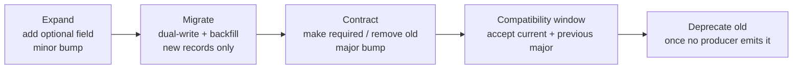

# RFC-0021 — Schema Versioning & Compatibility

| Field | Value |
|---|---|
| RFC | `RFC-0021` |
| Title | Schema Versioning & Compatibility |
| Status | Accepted |
| Authors | Architecture Office (`TEAM-090`) |
| Created | 2026-04-06 |
| Related | `schemas/README.md`, `sdk/README.md`, `RFC-0022` (Object Identity & Referential Integrity), `ADR-0032` (SemVer), `ADR-0033` (Expand-Contract Schema Evolution), `ADR-0050` (Canon Supremacy) |

## 1. Summary

This RFC defines how the ECL object schemas (`schemas/*.schema.json`) and their in-code mirror
(`sdk/objects.py`) evolve without breaking producers, consumers, or the referential integrity of
stored artifacts. It fixes the version identifier format, the SemVer semantics for schema change,
the **expand → migrate → contract** procedure (`ADR-0033`), the compatibility window validators
must honor, and the governance (RFC for every contract change; ADR when an invariant moves).

## 2. Motivation

Every ECL artifact — `KN-###`, `CTX-###`, `PLAN-###`, `EVAL-###`, `REF-###`, `EXP-###`,
`LearningEvent`, and the Worker-scoped decision/execution objects — is a long-lived, cross-
referenced record. Benchmarks (`RFC-0025`) and replay (`RFC-0024`) read artifacts produced
months earlier under older schemas. A naïve breaking change would strand historical data, break
cross-references (`RFC-0022`), and make reproducibility impossible. The schema family therefore
needs a disciplined, canon-consistent evolution policy, already sketched in `schemas/README.md`
and made normative here.

## 3. Guide-level explanation

Every instance carries a `schema_version` matching `^2020-12\.v\d+$` (e.g., `2020-12.v1`) and the
SDK tracks the current target as `sdk.SCHEMA_VERSION`. Change is classified by SemVer intent
(`ADR-0032`):

- **Minor** (backward-compatible): add an *optional* field, relax a constraint, add an enum value
  a reader can ignore. Producers may adopt immediately; older readers still validate.
- **Major** (breaking): make a field required, remove a field, tighten a type, or change meaning.
  Requires the full expand-contract dance and a compatibility window.

The rollout is always **expand → migrate → contract** — never a hard cutover — so that at no
point does a valid producer emit something a supported consumer cannot read.

## 4. Reference-level explanation

### 4.1 Version identifier & surfacing

- `schema_version` is a required base field on every object (`common.schema.json#/$defs/eclObjectBase`,
  mirrored by `sdk.objects.ECLObject.schema_version`).
- `sdk.SCHEMA_VERSION` names the current family version the SDK targets; `sdk.__version__`
  (SemVer, `ADR-0032`) versions the *interfaces*. A schema major bump implies an SDK bump.
- Instances are **never rewritten in place**; a new schema version means new records carry the new
  `schema_version` while old records keep theirs (consistent with `ADR-0022` immutability).

### 4.2 SemVer semantics for schemas

| Change | Classification | Rollout |
|---|---|---|
| Add optional field | minor | expand only |
| Add enum value (readers ignore unknown) | minor | expand only |
| Relax a constraint / widen a type | minor | expand only |
| Make an optional field required | major | expand → migrate → contract |
| Remove a field | major | contract after no producer emits it |
| Narrow a type / change field meaning | major | new field + migrate + contract |
| Change an ID pattern in `common.schema.json` | major + **ADR** | invariant change |

### 4.3 Expand → migrate → contract (`ADR-0033`)

1. **Expand.** Introduce the new shape as *optional* first (minor bump). Both old and new readers
   validate. This mirrors CANON-001 §7.4's backward-compatible DB migrations — rollback never
   needs a down-migration under fire.
2. **Migrate.** Producers **dual-write** (old + new fields) and historical data is backfilled
   where feasible; new records only — never rewrite existing instances.
3. **Contract.** Once no supported producer emits the old shape, make the new field required or
   remove the old (major bump). The `unevaluatedProperties: false` closure in each object schema
   (see `schemas/README.md`) now forbids the retired field.

### 4.4 Compatibility window & reader rules

- Validators **accept the current and previous major** schema version during a migration window
  (`schemas/README.md` §3).
- Readers **tolerate unknown `metadata`** — `metadata` is the sanctioned home for additive,
  non-semantic annotations and extension fields (`RFC-0027`), so it never triggers a version bump.
- Required, semantic fields are **never** carried in `metadata`; doing so is a review-blocking
  anti-pattern.

### 4.5 Referential integrity is invariant

Per `RFC-0022`/`ADR-0022`, IDs never change meaning across versions and cross-references stay
resolvable. A migration that would break a reference (e.g., re-pointing `EvaluationObject.execution`
from a `PR-####` to a new object type) is not a mere schema change — it requires an ADR and a
referential-integrity plan. The `CHK-1421` example graph (`schemas/README.md`) must remain
resolvable across any schema version.

### 4.6 Governance & provenance of change

Every schema change is recorded via an **RFC** (contract change); any change that alters an
invariant additionally requires an **ADR**, consistent with canon supremacy (`ADR-0050`). The
change RFC states the classification, the rollout plan, the compatibility window, and the
migration/backfill approach. CI runs the Draft 2020-12 registry validator (`schemas/README.md`)
plus the dependency-free structural validator against current and previous major versions.

## 5. Drawbacks

- **Migration overhead.** Dual-write and backfill are real engineering cost; the alternative
  (stranded data) is worse for a benchmark that depends on historical reproducibility.
- **Window management.** Supporting two majors simultaneously complicates validators and
  producers; bounded by keeping windows short and deprecating promptly.
- **Metadata as escape hatch** can be abused to smuggle semantics; mitigated by the strict
  review rule in §4.4.

## 6. Rationale & alternatives

- **Hard version cutover** (rejected): would strand historical artifacts and break replay/
  benchmarking; violates the backward-compatible-migration discipline of CANON-001 §7.4.
- **Unversioned, additive-only schemas** (rejected): forbids ever tightening or removing a field,
  accumulating cruft indefinitely; expand-contract lets us contract safely.
- **In-place rewrite of old instances** (rejected): breaks immutability (`ADR-0022`) and audit
  fidelity; new versions are new records.

## 7. Prior art

Semantic Versioning; Protobuf/Avro schema evolution rules (add optional, never renumber/retype);
the parallel-change ("expand and contract") refactoring pattern; and consumer-driven contract
testing (CANON-001 §4.4) are the generic inspirations. Kafka schema-registry backward-compatibility
modes inform the reader rules. No proprietary system is referenced.

## 8. Unresolved questions

- Should the compatibility window be a fixed duration or driven by observed producer telemetry
  ("last old-shape emission")?
- How should the SDK express *partial* forward-compatibility (readers that can degrade gracefully
  on a minor they don't fully understand)?
- Do cross-object composite changes (touching several schemas at once) need a bundled migration
  RFC with a single window?

## 9. Future possibilities

- **Automated migration tooling** that generates dual-write shims and backfill jobs from a schema
  diff.
- **Schema linting in CI** that classifies a proposed change as minor/major automatically and
  refuses an un-RFC'd major.
- **Version-aware retrieval** so the Context Layer can request artifacts at a specific schema
  version for deterministic replay (`RFC-0024`).
