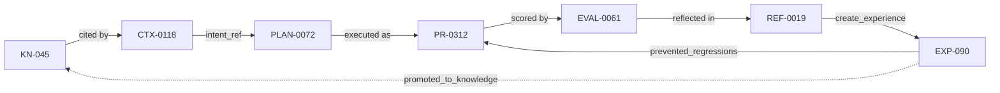

# RFC-0022 — Object Identity & Referential Integrity

| Field | Value |
|---|---|
| RFC | `RFC-0022` |
| Title | Object Identity & Referential Integrity |
| Status | Accepted |
| Authors | Architecture Office (`TEAM-090`) |
| Created | 2026-04-13 |
| Related | `CANON-001` §6, `schemas/common.schema.json`, `RFC-0021` (Schema Versioning), `RFC-0023` (Provenance & Decision Trace), `ADR-0022` (Globally Unique Never-Reused IDs), `ADR-0023` (Referential Integrity) |

## 1. Summary

This RFC specifies the **identity and referential-integrity contract** for every ECL object: the
canonical ID namespaces and formats (CANON-001 §6), the global-uniqueness and never-reuse rules
(`ADR-0022`), the constraint that all cross-object references use canonical IDs and remain
resolvable (`ADR-0023`), and the validation that enforces both. Referential integrity is
described in `schemas/README.md` as "the backbone of EnterpriseSim"; this RFC makes the backbone
normative and checkable.

## 2. Motivation

The entire ECL loop is a graph of cross-referenced artifacts — a `ReflectionObject` points at an
`EVAL-###`, a `PLAN-###`, and an execution; an `ExperienceObject` points at its origin execution,
evaluation, reflection, and (once promoted) a `KN-###`. Benchmarking, replay, provenance, and
audit all traverse these references. If an ID could be reused, or a reference could dangle or
change meaning, the graph would corrupt silently and no result could be trusted. CANON-001 §6
already declares IDs globally unique, zero-padded, and immutable; this RFC operationalizes that
declaration across the SDK and schemas.

## 3. Guide-level explanation

Two rules govern everything:

1. **Identity.** Every persisted object has a globally-unique, never-reused `id` in a typed
   namespace (`KN-`, `CTX-`, `PLAN-`, `EVAL-`, `REF-`, `EXP-`, `PR-`, `INC-`, `TR-`, Jira keys
   like `CHK-1421`, …). IDs are assigned by the authority named in CANON-001 §6, zero-padded for
   stable sort, and immutable once assigned — even after logical deletion.
2. **Referential integrity.** Any field that names another artifact holds its **canonical ID**,
   and that ID must resolve to a real object (possibly deprecated/retained, never absent).

Every edge above is a canonical-ID reference; every node is unique and permanent. Deleting the
loop is impossible — objects are retained; references never dangle.

## 4. Reference-level explanation

### 4.1 ID namespaces & formats

The canonical namespaces and formats are exactly CANON-001 §6 (`CANON-`, `BU-`, `TEAM-`, `APP-`,
`SVC-`, `REPO-`, `ADR-`, `RFC-`, Jira `<KEY>-<n>`, `PR-`, `REL-`, `INC-`, `TC-`, `TS-`, `TR-`,
`KN-`, `CTX-`, `PLAN-`, `EXP-`, `EVAL-`, `REF-`). The `canonicalId` pattern in
`schemas/common.schema.json` encodes these and additionally admits Jira project-key issue
references per CANON-001 §5. `sdk.objects.CanonicalId` is the typing alias; `ECLObject.id` carries
the value on every object.

### 4.2 Uniqueness & never-reuse (`ADR-0022`)

- IDs are unique **within their namespace** and **never reused**, even after an object is
  deprecated or logically deleted. This mirrors the Knowledge Layer's "never hard-deleted" rule
  (`ARCH-02`) and the Experience Layer's append-only, retain-on-downweight rule (`ARCH-03`).
- Assignment is monotonic and centralized per namespace by the authority in CANON-001 §6, so two
  objects can never collide and a retired ID is never resurrected with new meaning.
- The dual PR forms are reconciled: native `<repo>#<number>` and the global `PR-####` index must
  resolve to the same pull request (CANON-001 §5).

### 4.3 Reference discipline (`ADR-0023`)

Every cross-reference is a canonical ID, not an embedded copy or a free-text mention. The SDK's
object Protocols make this explicit — e.g., `EvaluationObject.execution`/`.plan`,
`ReflectionObject.evaluation`/`.execution`/`.plan`/`.loop_closed_by`,
`ExperienceObject.evidence`, `LearningEvent.source_reflection`/`.target`,
`ContextObject.included[].source`, `PlanningObject.applied_experience`. `Provenance.source` is
always a canonical ID. Copying content instead of referencing it is a review-blocking
anti-pattern: it breaks single-source-of-truth and lineage.

### 4.4 Resolvability & retention

A reference must always resolve. Because objects are retained (deprecated Knowledge kept for
history; down-weighted Experience retained; retired Worker versions kept for benchmark
attribution), a reference target is never absent — it may be flagged deprecated/superseded but is
always fetchable. A dangling reference is a **data-integrity defect**, detected in CI (§4.6) and
treated as a Sev-class bug, not tolerated.

### 4.5 Interaction with schema versioning

Per `RFC-0021`/`ADR-0033`, IDs never change meaning across schema versions and references remain
resolvable across a migration. A migration that would re-point or invalidate an existing reference
requires an ADR (`RFC-0021` §4.5). New versions of an object (e.g., a new `KnowledgeObject`
version) keep the same `id` where the object's identity is unchanged and use the `version` field
for revisions — identity and revision are distinct (see §4.7).

### 4.6 Validation

Two checks run in CI and at write time:

1. **Format validation** — `id` and every reference field match the `canonicalId` pattern
   (`schemas/common.schema.json`), via the Draft 2020-12 registry validator and the dependency-free
   structural validator (`schemas/README.md`).
2. **Referential validation** — every referenced ID resolves to an existing object of an allowed
   type for that field; uniqueness/never-reuse is enforced by the assigning authority's ledger.

### 4.7 Identity vs. revision

`id` is stable identity; it is **not** a version. Knowledge revisions use `KnowledgeObject.version`
(immutable-once-published, new facts are new versions per `sdk/objects.py`); ephemeral Context is
single-use; append-only Experience refines via added evidence, not new IDs for the same lesson.
Conflating identity with revision (minting a new ID per edit) would explode the reference graph and
is forbidden.

## 5. Drawbacks

- **Centralized ID assignment** per namespace is a coordination point; mitigated by per-namespace
  monotonic allocators and the fact that assignment is cheap and offline-tolerant.
- **Retention forever** grows storage; accepted as the cost of auditability and reproducibility,
  and bounded by cold-tiering retained-but-inactive objects.
- **Strict resolvability** makes bulk imports/edits stricter; this is intentional — integrity over
  convenience.

## 6. Rationale & alternatives

- **Reusing IDs after deletion** (rejected): would silently corrupt historical references and
  benchmarks; `ADR-0022` forbids it.
- **Embedding referenced content inline** (rejected): duplicates truth, drifts, and destroys
  lineage; references-by-ID keep a single source of truth (`ADR-0023`).
- **UUIDs everywhere** (rejected): opaque, unsorted, and unfriendly to the human-readable,
  cross-artifact linking CANON-001 §5–§6 mandates; typed zero-padded IDs are canon.

## 7. Prior art

Relational foreign-key integrity, URI/IRI stable-identifier practice ("cool URIs don't change"),
content-addressing vs. location-addressing trade-offs, and event-log immutability are the generic
inspirations. Persistent-identifier schemes (DOIs) inform the never-reuse and always-resolvable
guarantees. No proprietary system is referenced.

## 8. Unresolved questions

- Should there be a global, queryable resolver service exposing every ID → object, and how does it
  interact with per-domain federated stores (`ARCH-02` future)?
- How to represent soft "supersedes" chains (object A replaced by B) uniformly across namespaces?
- What is the cold-tiering policy for retained-but-inactive objects that keeps references O(1)
  resolvable?

## 9. Future possibilities

- **Integrity dashboards** on the Signals Bus (`RFC-0028`) tracking dangling-reference incidents
  (target: zero) and reference-graph health.
- **Graph-native store** for the reference graph enabling multi-hop lineage queries
  ("everything derived from `INC-2026-007`"), aligned with `RFC-0006`.
- **Signed IDs / provenance attestation** so an object's identity and lineage are
  cryptographically verifiable, extending `RFC-0023`.
