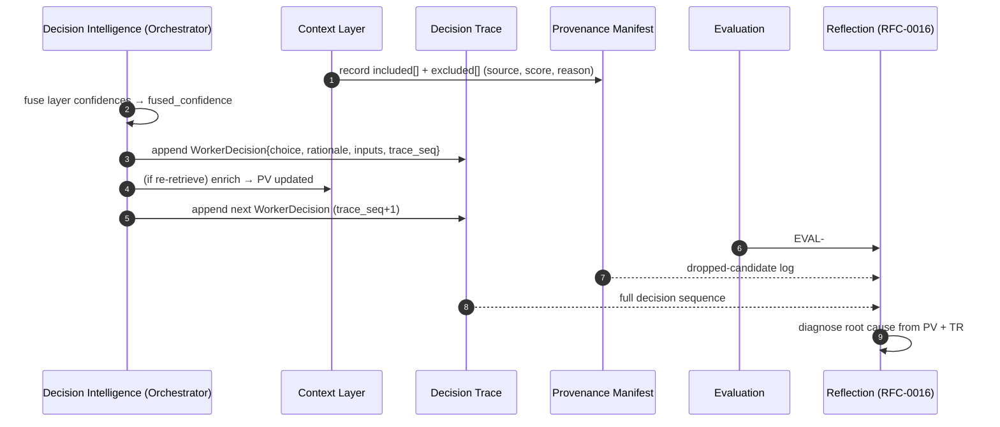

# RFC-0023 — Provenance & Decision Trace

| Field | Value |
|---|---|
| RFC | `RFC-0023` |
| Title | Provenance & Decision Trace |
| Status | Accepted |
| Authors | Architecture Office (`TEAM-090`) |
| Created | 2026-04-20 |
| Related | `ARCH-06`, `ARCH-01`, `RFC-0007` (Decision Intelligence Control Loop), `RFC-0016` (Reflection Pipeline), `RFC-0022` (Object Identity & Referential Integrity), `RFC-0024` (Replay Engine), `RFC-0028` (Signals Bus), `ADR-0037` (Deterministic Replay) |

## 1. Summary

This RFC defines the two traceability substrates of the ECL: **context provenance** (every item
that entered or was excluded from a `CTX-###`, with source, score and rationale) and the
**decision trace** (every control decision a Worker made, with rationale, fused confidence, and
inputs). Together they make Worker behavior fully explainable, auditable, and — combined with
`RFC-0024` — replayable. "If you cannot trace it, it does not belong in the ECL" (`ARCH-07`).

## 2. Motivation

Two of the ECL's non-negotiables depend on trace: **confidence-honest autonomy** (Decision
Intelligence never acts high-stakes at low confidence, and must be able to prove it did not) and
**learning** (reflection diagnoses root cause by inspecting what was retrieved, what was dropped,
and why each decision was made). `ARCH-01` makes provenance mandatory and immutable; `ARCH-06`
mandates a decision trace with rationale and confidence for every choice. Unauditable behavior is
a named system-level failure mode (`ARCH-07`). This RFC unifies both into one contract so that
audit, reflection (`RFC-0016`), and replay (`RFC-0024`) all read the same records.

## 3. Guide-level explanation

Two record types, produced during a run (`RFC-0019`):

- **Provenance manifest** — carried inside the `ContextObject`: `included[]` and `excluded[]`
  arrays of `Provenance` entries (`sdk.objects.Provenance`), each `{ source, kind, reason, score }`.
  The `excluded[]` list is the **dropped-candidate log** that reflection inspects first
  (`ARCH-01`/`ARCH-05`).
- **Decision trace** — an ordered sequence of `WorkerDecision` records
  (`sdk.objects.WorkerDecision`), each `{ choice, rationale, fused_confidence, inputs, worker,
  trace_seq }`, where `choice ∈ {proceed, re-retrieve, replan, retry, escalate, abort}` and
  `inputs` is the per-layer confidence map that was fused.

## 4. Reference-level explanation

### 4.1 Provenance contract

Per `sdk.objects.Provenance` and `schemas/context_object.schema.json`, every context entry
records:

- `source` — a canonical ID (`RFC-0022`): `KN-###`, `EXP-###`, a code path, or a live-state ref.
- `kind` — `knowledge | experience | code | state | ...`.
- `reason` — human-readable rationale for inclusion/exclusion.
- `score` — the relevance/authority `Confidence` at selection time.

`included[]` and `excluded[]` both use this shape; an excluded high-scoring item records *why* it
was dropped (typically "dropped for budget; flagged"). **No item may enter context without a
`Provenance` entry** (`ARCH-01` Best Practice 2) — enforced at composition by
`sdk.context.ContextAssembler`.

### 4.2 Decision-trace contract

Per `sdk.objects.DecisionObject`/`WorkerDecision` and `schemas/worker_decision.schema.json`:

- `plan` — the `PLAN-###` under control.
- `choice` — the control action taken.
- `rationale` — why, in words.
- `fused_confidence` — the composed confidence that drove the choice (`ARCH-06`/`ARCH-07`).
- `inputs` — the per-layer confidences fused: context coverage, knowledge authority, experience
  applicability, evaluation judgment.
- `worker`, `trace_seq` — run identity (`RFC-0019`) and monotonic ordering.

Every decision the Orchestrator (`sdk.decision.Orchestrator`) makes appends one record; the
sequence is gap-free and ordered by `trace_seq`. A high-stakes `proceed` at low `fused_confidence`
is impossible by construction — the `ConfidencePolicy`/`PolicyGuard` forces `escalate`/`abort` and
that decision is itself traced (`RFC-0030`).

### 4.3 Immutability & integrity

Both records are **write-once, append-only, immutable** and retained with the run (`RFC-0022`).
Provenance is handed to Evaluation and the Learning Engine at context expiry (`ARCH-01`); the
decision trace is handed to Evaluation, the Learning Engine, and audit (`ARCH-06`). Neither is
ever edited post-hoc — a correction is a new downstream artifact, never a rewrite, preserving the
audit spine.

### 4.4 What the trace enables

1. **Explainability** — any action reconstructs to "this context (with these sources), this fused
   confidence, this choice, for this reason."
2. **Reflection** (`RFC-0016`) — root-cause diagnosis reads `excluded[]` (dropped-context cause)
   and the decision sequence (model/plan-error cause) directly.
3. **Replay** (`RFC-0024`) — the trace plus pinned inputs lets a run be deterministically
   re-executed and compared (`ADR-0037`).
4. **Guardrail proof** (`RFC-0030`) — every policy stop is a traced decision, so compliance is
   demonstrable, not asserted.

### 4.5 Signals

Trace and provenance emit to the Signals Bus (`RFC-0028`): dropped-candidate rate, replan/retry
rates, escalation rate and reasons, fused-confidence distribution, and guardrail-activation
counts — the raw material for the improvement-trend metric (`ARCH-07`).

### 4.6 Sensitivity handling

Provenance may reference sensitive sources (PCI/PII). Entries carry the source's sensitivity
label (from `KnowledgeObject.sensitivity`), and the manifest is stored under the same policy-aware
handling as the content it references (`RFC-0030`); rationale text is redaction-checked so the
trace itself never leaks sensitive data (`ARCH-01` "leaky context" mitigation).

## 5. Drawbacks

- **Storage & write cost.** Full provenance + per-decision trace on every run is voluminous;
  bounded by cold-tiering (`RFC-0022`) and by recording references, not content copies.
- **Trace fidelity vs. model opacity.** The trace captures ECL *decisions* faithfully but cannot
  fully explain the LLM's internal reasoning; it captures the fused inputs and the rationale the
  model emitted, which is the auditable surface the ECL controls.
- **Redaction overhead** on rationale text adds latency; justified by the leak risk.

## 6. Rationale & alternatives

- **Log-only, unstructured tracing** (rejected): not queryable, not replayable, not usable by
  reflection; structured `Provenance`/`WorkerDecision` objects are.
- **Trace only on failure** (rejected): confidence-honesty and benchmarking need traces on all
  runs, including successes (to credit applied experience).
- **Editable traces** (rejected): destroys audit integrity; append-only immutability is required
  (`RFC-0022`).

## 7. Prior art

Distributed tracing and structured observability (OpenTelemetry spans with causal ordering,
CANON-001 §8 principle 6/9), audit logs and provenance standards (W3C PROV-style source/agent/
activity records), and decision logs in control systems are the generic inspirations. No
proprietary system is referenced.

## 8. Unresolved questions

- Should the decision trace and provenance manifest be one unified span tree or remain two linked
  record types?
- How much of the model's intermediate reasoning (tool-call arguments, scratch reasoning) should
  be captured versus referenced, given cost and sensitivity?
- What sampling, if any, is acceptable for very high-volume low-risk runs without harming
  benchmarking reproducibility?

## 9. Future possibilities

- **Provenance attestation** — cryptographically signed traces so a benchmark result's inputs are
  tamper-evident (extends `RFC-0022` future work).
- **Causal trace graphs** linking provenance → decision → outcome → reflection for one-click
  end-to-end explanation of any Worker action.
- **Interactive trace explorer** on the Signals Bus (`RFC-0028`) for auditors and Worker authors.
