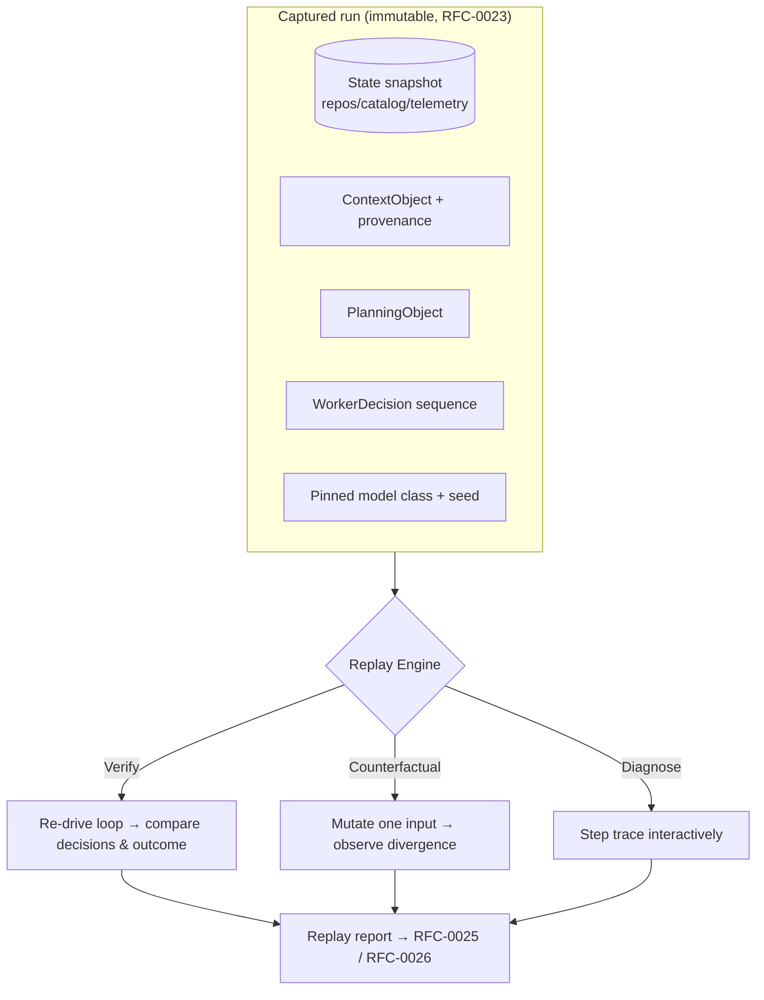

# RFC-0024 — Replay Engine

| Field | Value |
|---|---|
| RFC | `RFC-0024` |
| Title | Replay Engine |
| Status | Accepted |
| Authors | Architecture Office (`TEAM-090`) |
| Created | 2026-04-27 |
| Related | `ARCH-06`, `ARCH-07`, `RFC-0023` (Provenance & Decision Trace), `RFC-0010` (Model Router), `RFC-0011` (Model Gateway & Provider Adapter Contract), `RFC-0022` (Object Identity), `RFC-0025` (Benchmarking Harness), `ADR-0037` (Deterministic Replay) |

## 1. Summary

This RFC specifies the **Replay Engine**: the facility that re-executes a recorded Worker run
(`RFC-0019`) from its captured inputs — decision trace, context provenance, pinned model class,
and frozen enterprise state — to reproduce or deliberately vary the outcome. Replay underpins
debugging ("why did the Worker do that?"), regression testing of the ECL itself, counterfactual
analysis ("what if this context item had not been dropped?"), and reproducible benchmarking
(`RFC-0025`). Determinism is bounded by `ADR-0037`.

## 2. Motivation

A benchmark that is not reproducible is not a benchmark (`ARCH-04`). Yet Worker runs read
mutable enterprise state (repos, catalog, telemetry) and call non-deterministic models. To make
runs reproducible, the ECL must be able to reconstruct *exactly what a run saw and decided* and
re-drive the loop against a frozen snapshot. The trace and provenance substrates (`RFC-0023`)
capture the inputs; the Replay Engine consumes them. Replay also turns reflection's counterfactual
questions (`ARCH-05` future) into executable experiments.

## 3. Guide-level explanation

A run is replayable because everything that influenced it is captured as immutable, canonical-ID
artifacts (`RFC-0022`/`RFC-0023`): the `ContextObject` with full provenance, the `PlanningObject`,
the `WorkerDecision` sequence, the `WorkerExecution`/`WorkerArtifact`s, the pinned model class and
routing decision (`RFC-0010`), and a **state snapshot** of the enterprise inputs read during the
run. Replay reconstructs these and re-executes in one of three modes:

- **Verify** — reproduce the run and assert the decisions/outcome match (ECL regression testing).
- **Counterfactual** — change one captured input (e.g., un-drop an `excluded[]` item, swap the
  model class) and observe the divergence.
- **Diagnose** — step the decision trace interactively for debugging.

## 4. Reference-level explanation

### 4.1 Replay inputs (the capture set)

For a run to be replayable, the following must be captured and resolvable by canonical ID:

| Input | Source | Notes |
|---|---|---|
| State snapshot | Context Layer live-state reads | Content-addressed; frozen at run time |
| `ContextObject` + provenance | `ARCH-01` / `RFC-0023` | `included[]` + `excluded[]` |
| `PlanningObject` | `ARCH-06` | The committed plan |
| `WorkerDecision` sequence | Decision trace (`RFC-0023`) | Gap-free, ordered by `trace_seq` |
| `WorkerExecution` + artifacts | Execution Runtime | Tool directives + results |
| Model routing + pin | `RFC-0010` | Model class, provider adapter, seed/params |

Because context reads "prefer live state for volatile facts" (`ARCH-01`), replay **freezes** that
live state into a snapshot so the same facts are presented on re-run.

### 4.2 Determinism model (`ADR-0037`)

The ECL is deterministic *outside the model*: given identical inputs, the Context Layer,
Planner, Orchestrator, Execution Runtime and Evaluation produce identical results. The model call
is the only nondeterministic element, and it is bounded by:

1. **Pinning** the model class and provider adapter via the Gateway (`RFC-0011`) and recording the
   exact model identity used.
2. **Seed/param capture** where the provider supports it, replayed through the adapter.
3. **Response capture** — the normalized model result from the original run is stored, enabling a
   **record-replay** mode that substitutes the captured response for a live call, yielding *fully*
   deterministic replay of the ECL logic even against a nondeterministic provider.

Thus replay offers two fidelities: **logic-deterministic** (record-replay of model responses,
bit-for-bit ECL reproduction) and **model-live** (re-call the pinned model; ECL deterministic,
model may vary — used to test provider changes, `ARCH-07` Example B).

### 4.3 Modes

- **Verify** re-drives the loop and diffs the new decision trace against the captured one; any
  divergence in a logic-deterministic replay is an ECL regression and fails CI.
- **Counterfactual** mutates exactly one captured input and reports the outcome delta — the
  executable form of reflection's "the fix was in a doc we dropped" hypothesis (`ARCH-05`).
- **Diagnose** exposes the trace step-by-step with the provenance visible at each decision, for
  human debugging.

### 4.4 Interfaces & artifacts

Replay is driven by a `ReplayEngine` that consumes the capture set and re-instantiates a
`sdk.workers.WorkerRuntime` run (`RFC-0019`) in a sandbox that reads the snapshot instead of live
state and routes model calls through a replay-aware `sdk.models.ModelGateway` adapter
(record-replay or live-pinned). It produces a **replay report** (a first-class artifact with its
own canonical ID, `RFC-0022`) linking the original `run_id`, the replay `run_id`, the mode, and
the decision/outcome diff — consumed by the Benchmarking Harness (`RFC-0025`).

### 4.5 Isolation & safety

Replay never writes to real MCG systems: execution tools run against the frozen snapshot or in
dry-run, and no durable memory (Knowledge/Experience) is mutated (learning is suppressed during
replay). This keeps replay side-effect-free and repeatable, and prevents a counterfactual
experiment from polluting durable state.

## 5. Drawbacks

- **Snapshot cost.** Freezing enterprise state per run is storage-heavy; mitigated by
  content-addressed dedup and capturing only the state actually read (provenance-scoped).
- **Model-live nondeterminism.** True bit-for-bit replay requires record-replay of responses;
  model-live replay can diverge, which is a feature for provider comparison but a caveat for
  regression testing.
- **Capture completeness.** A run is only as replayable as its capture; any un-captured input
  (e.g., an untraced tool side-channel) breaks determinism — hence `RFC-0023`'s "everything
  traced" rule is a hard dependency.

## 6. Rationale & alternatives

- **Re-run against live state** (rejected): live state drifts, so results are not reproducible;
  benchmarking demands frozen inputs (`ADR-0048`).
- **Fully deterministic models only** (rejected): would forbid most providers and defeat
  model-agnostic benchmarking; record-replay achieves logic-determinism without constraining the
  provider.
- **No replay; trust logs** (rejected): logs explain but cannot re-execute counterfactuals or
  prove ECL regressions.

## 7. Prior art

Record-replay debugging (deterministic replay of nondeterministic executions), event-sourcing
rehydration (rebuild state by replaying an immutable event log), time-travel debugging, and
snapshot/restore in simulation are the generic inspirations. Seeded pseudo-randomness for
reproducible experiments informs §4.2. No proprietary system is referenced.

## 8. Unresolved questions

- What granularity of state snapshot balances fidelity against storage (per-read content-address
  vs. per-run repo snapshot)?
- How should replay handle captured tool responses whose real-world side effects cannot be
  meaningfully re-observed (e.g., an external notification)?
- Should counterfactual replays feed automatically into experience capture (`ARCH-03`
  counterfactual experiences), and under what governance?

## 9. Future possibilities

- **Batch counterfactual sweeps** — vary each dropped-context item across many runs to quantify
  which drops most often cause failure, feeding retrieval-policy learning (`RFC-0017`).
- **Cross-provider replay matrices** — replay a task suite model-live across providers for the
  benchmarking leaderboards (`RFC-0026`).
- **Continuous ECL regression suite** — nightly logic-deterministic verify-replays of a curated
  run set to catch ECL logic regressions before release.
