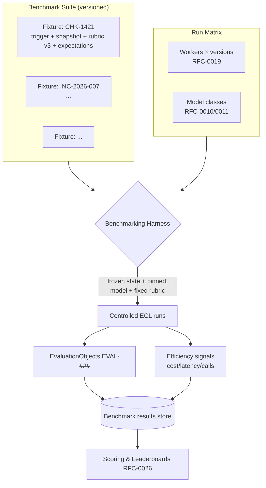

# RFC-0025 — Benchmarking Harness

| Field | Value |
|---|---|
| RFC | `RFC-0025` |
| Title | Benchmarking Harness |
| Status | Accepted |
| Authors | Architecture Office (`TEAM-090`) |
| Created | 2026-05-04 |
| Related | `ARCH-04`, `ARCH-07`, `RFC-0014` (Evaluation Framework), `RFC-0015` (Rubric Definition Language), `RFC-0019` (Worker Lifecycle), `RFC-0024` (Replay Engine), `RFC-0026` (Benchmark Scoring & Leaderboards), `ADR-0048` (Benchmark Reproducibility) |

## 1. Summary

This RFC specifies the **Benchmarking Harness**: the system that runs a fixed suite of MCG tasks
against one or more Worker implementations and model providers under controlled, reproducible
conditions, collecting `EVAL-###` results and efficiency signals for comparison. It defines the
task-suite structure, the fixtures/state-snapshot model, the run matrix (Worker × model ×
task), and the reproducibility guarantees (`ADR-0048`) that make cross-Worker and cross-provider
comparison fair. Scoring and ranking are deferred to `RFC-0026`.

## 2. Motivation

EnterpriseSim's core purpose (CANON-001 header; `ARCH-07`) is to be *the open benchmark for
Enterprise AI Workers*. The Evaluation Layer (`ARCH-04`) scores a single execution; benchmarking
scales that into a repeatable, apples-to-apples comparison across Workers, model providers, and
time. Because the ECL is model-agnostic behind one Gateway (`ARCH-07`), the *identical* task
suite can be run against different providers and Worker implementations — but only if the harness
controls state, rubric versions, and randomness rigorously. Without that control, comparisons are
noise.

## 3. Guide-level explanation

A **benchmark suite** is a curated, versioned set of MCG **task fixtures**. Each fixture bundles:
a task trigger (a Jira story, an incident, a review), a **frozen enterprise-state snapshot**
(`RFC-0024`), the applicable rubric version(s) (`RFC-0015`), and a set of **expectations** (the
objective gates and known-good outcome bounds). The harness executes the **run matrix** —
each fixture × each Worker version (`RFC-0019`) × each model class — under replay-grade control,
then persists results for scoring.

## 4. Reference-level explanation

### 4.1 Task fixtures

A fixture is an immutable, canonical-ID artifact (`RFC-0022`) containing:

- **Trigger** — the task's canonical ID and payload (e.g., `CHK-1421`).
- **State snapshot** — frozen repos/catalog/telemetry the run may read (`RFC-0024` §4.1);
  content-addressed for reproducibility.
- **Rubric binding** — the pinned rubric ID + version applied by `sdk.evaluation.Evaluator`
  (`RFC-0015`); rubric versions are frozen per suite version (`ARCH-04` Best Practice 4).
- **Expectations** — objective gate outcomes and outcome-score bounds used for sanity/plausibility
  checks and for detecting harness or Worker regressions.
- **Difficulty & tags** — task type, apps touched, tier, for stratified reporting (`RFC-0026`).

Fixtures live under a `benchmarks/` suite folder (the future folder named in `ARCH-04`/`ARCH-07`),
versioned as a whole so a suite version is a stable reference point.

### 4.2 The run matrix & isolation

The harness enumerates `fixtures × worker_versions × model_classes` and executes each cell as an
isolated Worker run (`RFC-0019`) with:

- **State** served from the fixture snapshot, not live MCG (via the replay-aware sandbox,
  `RFC-0024` §4.5).
- **Model** pinned to the cell's class and adapter through the Gateway (`RFC-0011`), with seed/
  params captured.
- **Learning suppressed** — benchmark runs must not mutate durable memory, or later cells would
  see a changed baseline and comparison would be unfair. (Learning *from* benchmark runs, if
  desired, happens in a separate governed pass, never inline.)
- **Budgets** applied per `RFC-0029` and recorded as efficiency signals.

### 4.3 Reproducibility guarantees (`ADR-0048`)

A benchmark result is reproducible iff re-running the same cell yields the same verdict. The
harness guarantees this via the same mechanisms as replay (`RFC-0024`): frozen state, pinned
rubric version, pinned model identity, and — for logic-deterministic mode — record-replay of
model responses. Every result records the **suite version, fixture ID, Worker version, model
identity, rubric version, and harness version**, so any published number is fully attributable
and re-runnable. Non-reproducibility is a harness defect, not an accepted variance.

### 4.4 What is measured per cell

Each cell produces an `EvaluationObject` (`EVAL-###`, `ARCH-04`) — objective gates + rubric items
+ dual confidences — plus **efficiency signals** from the Signals Bus (`RFC-0028`): reasoning
cost (calls + tokens), wall-clock latency, iteration count, escalation/abort, and autonomy rate.
Correctness *and* efficiency are both first-class, per `ARCH-04`'s cost/latency-aware scoring
direction; combining them into ranks is `RFC-0026`'s job.

### 4.5 Suite governance & anti-gaming

Suites are owned with Quality Engineering (`TEAM-050`) and the Architecture Office (`TEAM-090`),
versioned, and reviewed against real incidents so fixtures reflect genuine difficulty. To resist
metric-gaming (`ARCH-04`), suites include **held-out** fixtures not visible to Worker authors and
mix objective-heavy and judgment-heavy tasks; multi-signal rubrics and periodic fixture rotation
keep the benchmark honest.

### 4.6 Model-agnostic comparison

Because only the Gateway adapter changes across providers (`ARCH-07`), running the same suite
against Provider A vs. B changes nothing in the fixtures, rubrics, or ECL — isolating the
provider's contribution to quality/cost/latency. This is the concrete realization of `ARCH-07`
Example B and the reason the architecture is model-agnostic.

## 5. Drawbacks

- **Fixture maintenance.** Frozen snapshots age relative to live MCG; suites need periodic refresh
  and versioning, and stale fixtures can mis-estimate real difficulty.
- **Combinatorial cost.** The full matrix (fixtures × workers × models) is expensive; mitigated by
  sampling strategies and by record-replay for logic-only comparisons.
- **Snapshot realism gap.** A frozen snapshot cannot capture every emergent live-state
  interaction; accepted trade-off for reproducibility (`ADR-0048`).

## 6. Rationale & alternatives

- **Benchmark against live MCG state** (rejected): irreproducible; `ADR-0048` requires frozen
  inputs.
- **Score single executions only** (rejected): no cross-Worker/-time comparison, which is the
  project's purpose.
- **Correctness-only scoring** (rejected): a Worker that is correct but 10× more expensive is not
  clearly better; efficiency must be measured (deferred combination to `RFC-0026`).

## 7. Prior art

Standardized ML/software benchmark suites (fixed datasets/tasks, versioned, held-out splits),
reproducible-research practice (pinned environments, seeds, artifact capture), and
regression-test harnesses with golden fixtures are the generic inspirations. Consumer-driven
contract and end-to-end critical-journey suites (CANON-001 §4.4) inform fixture design. No
proprietary system is referenced.

## 8. Unresolved questions

- What sampling of the full matrix preserves ranking validity at acceptable cost?
- How frequently should suites rotate/refresh fixtures to stay difficult without breaking
  longitudinal comparability?
- Should there be separate suites per Worker family (QA, Finance, Security) with a shared core, and
  how do cross-family comparisons stay meaningful?

## 9. Future possibilities

- **Adversarial fixtures** authored by a red-team evaluator (`ARCH-04` future) to harden the
  benchmark.
- **Continuous benchmarking** — run the suite on every ECL/Worker release, feeding leaderboards
  (`RFC-0026`) and the improvement-trend metric (`ARCH-07`).
- **Public open suites** in `benchmarks/` enabling external Worker implementations to be compared
  on identical MCG tasks — the "open benchmark" promise, delivered.
