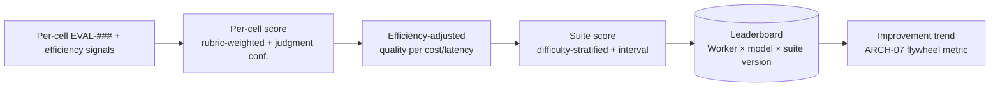

# RFC-0026 — Benchmark Scoring & Leaderboards

| Field | Value |
|---|---|
| RFC | `RFC-0026` |
| Title | Benchmark Scoring & Leaderboards |
| Status | Accepted |
| Authors | Architecture Office (`TEAM-090`) |
| Created | 2026-05-11 |
| Related | `ARCH-04`, `RFC-0014` (Evaluation Framework), `RFC-0015` (Rubric Definition Language), `RFC-0025` (Benchmarking Harness), `RFC-0009` (Confidence Scoring Model), `RFC-0028` (Signals Bus), `ADR-0048` (Benchmark Reproducibility) |

## 1. Summary

This RFC defines how the raw results from the Benchmarking Harness (`RFC-0025`) are aggregated
into **comparable scores and leaderboards** across Workers, model providers, and time. It
specifies the scoring model (how per-cell `EVAL-###` verdicts and efficiency signals combine into
a suite score), the stratification and normalization rules that keep comparisons fair, the
confidence/uncertainty reporting on ranks, and the governance of published leaderboards.

## 2. Motivation

Numbers without a fair aggregation invite exactly the failure `ARCH-04` warns about — gaming the
metric. A leaderboard that rewards a single headline score can be gamed by trivial-test coverage
or by ignoring cost. Scoring must therefore be multi-signal, stratified by difficulty, honest
about uncertainty, and reproducible (`ADR-0048`). This RFC turns the harness's per-cell results
into decisions MCG can trust: "is Worker v4 actually better than v3?", "does Provider B win on
quality-per-dollar?", "is the organization's Worker quality trending up?" (the flywheel metric,
`ARCH-07`).

## 3. Guide-level explanation

Scoring proceeds in layers:

1. **Per-cell score** — from one `EvaluationObject` (`RFC-0025` §4.4): the rubric-weighted
   outcome score, tagged with its judgment confidence.
2. **Efficiency-adjusted score** — combine correctness with cost/latency signals to reflect
   quality *per unit of resource*, not correctness alone.
3. **Suite score** — aggregate across fixtures with **difficulty stratification** so easy tasks
   don't drown out hard ones, reported with an uncertainty interval.
4. **Leaderboard** — rank Worker versions and/or model providers on a suite version, with the full
   attribution (`RFC-0025` §4.3) and confidence so ties and near-ties are visible.

## 4. Reference-level explanation

### 4.1 Per-cell score

Each cell's `EvaluationObject.verdict` already yields `{ outcome, score, outcome_confidence,
judgment_confidence }` (`ARCH-04`). The per-cell benchmark score is the rubric-weighted `score`
(objective gates weighted above rubric items, `ARCH-04` Best Practice 1), carried with its
`judgment_confidence`. Cells whose `outcome` is `fail` on a **standards** gate (dependency
direction, PCI boundary, rollback) are capped regardless of other gates — a false-pass on canon
is not a high score (`ARCH-04` Example B).

### 4.2 Efficiency adjustment

Correctness is combined with efficiency signals (reasoning cost = calls + tokens, latency,
iterations; `RFC-0028`/`RFC-0029`) into a **quality-per-resource** view. Correctness and
efficiency are reported both **separately** (so a consumer can prioritize) and as a combined
score with a **transparent, versioned weighting** — never a hidden single number. This directly
implements `ARCH-04`'s "cost- and latency-aware scoring" direction while resisting the gaming that
a single opaque metric invites.

### 4.3 Difficulty stratification & normalization

Suite scores stratify by fixture **difficulty and tags** (task type, tier, apps; `RFC-0025`
§4.1) so a Worker cannot inflate its score by acing many trivial fixtures. Aggregation reports
per-stratum scores and a normalized overall, and never compares across **different suite
versions** without re-running (rubric or fixture changes invalidate cross-version comparison,
`ADR-0048`). Held-out fixtures are scored separately to detect overfitting to visible fixtures
(`RFC-0025` §4.5).

### 4.4 Uncertainty on ranks

Following the ECL's confidence-honesty principle (`ARCH-07`; `RFC-0009`), ranks carry
uncertainty. Because model-live runs vary (`RFC-0024` §4.2), a leaderboard cell reports a score
**interval** (from repeated runs and/or judgment-confidence propagation), and two Workers whose
intervals overlap are reported as a **statistical tie**, not falsely ordered. A rank change is
"real" only when intervals separate. Low-`judgment_confidence` cells (model-assisted rubric items)
widen the interval, so subjective evaluation cannot masquerade as precise ranking.

### 4.5 Leaderboards & attribution

A leaderboard is a governed, versioned artifact (`RFC-0022`) ranking `(worker_id, version)` and/or
model provider on a named **suite version**, with every entry attributed by suite/fixture/Worker/
model/rubric/harness version (`RFC-0025` §4.3) so it is fully reproducible. Leaderboards are
published by Quality Engineering (`TEAM-050`) with the Architecture Office (`TEAM-090`); a result
that cannot be reproduced is not published (`ADR-0048`).

### 4.6 The improvement-trend metric

Aggregating suite scores for a fixed Worker family over successive suite/Worker versions yields
the **improvement trend** — the direct measurement of CANON-001 §9 Stage 8's continuous-improvement
flywheel (`ARCH-07` "improvement signals"). Because learning is data outside the model
(`ARCH-05`), an upward trend under a *fixed* model class is the clearest evidence that the ECL —
not the provider — is making Workers better.

## 5. Drawbacks

- **Weighting contention.** Any efficiency/correctness weighting encodes a value judgment;
  mitigated by versioning it, reporting components separately, and letting consumers re-weight.
- **Interval inflation.** Honest uncertainty can make many results "ties", frustrating a desire
  for crisp ranks; this is correct behavior, not a bug — false precision is worse.
- **Stratification complexity.** Difficulty tagging is subjective and can be gamed at the fixture
  level; governed by QE review and calibration against real incidents.

## 6. Rationale & alternatives

- **Single headline score** (rejected): maximally gameable and dishonest about cost and
  uncertainty (`ARCH-04`).
- **Correctness-only ranking** (rejected): ignores the resource dimension the project explicitly
  measures.
- **Point ranks without intervals** (rejected): violates confidence-honesty (`ARCH-07`) and
  over-claims tiny, noise-level differences.

## 7. Prior art

Multi-metric leaderboards with confidence intervals and held-out splits (mature ML benchmark
practice), quality-per-cost efficiency frontiers, stratified sampling in evaluation, and
statistical-significance reporting for ranked comparisons are the generic inspirations. Elo-style
uncertainty-aware ranking informs §4.4. No proprietary system is referenced.

## 8. Unresolved questions

- Should ranking use a Pareto frontier (quality vs. cost) rather than a single combined score, and
  present the frontier directly?
- How many repeated model-live runs are needed per cell for stable intervals without prohibitive
  cost?
- How to weight held-out vs. visible fixtures in the headline suite score to best detect overfitting?

## 9. Future possibilities

- **Pareto-frontier leaderboards** letting consumers pick their quality/cost operating point.
- **Regression alerts** on the Signals Bus (`RFC-0028`) when a new Worker/model version drops a
  suite score outside its interval.
- **Public leaderboards** for external Worker implementations on open suites (`RFC-0025` §9),
  fully attributed and reproducible — the open-benchmark promise realized.
