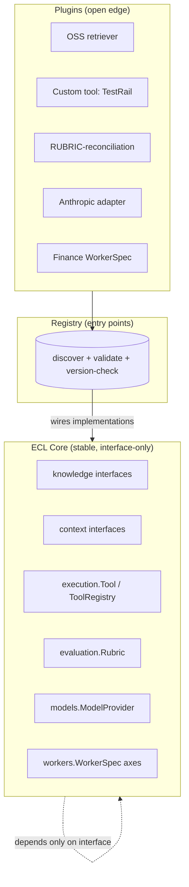

# RFC-0027 — Plugin Architecture & Extension Points

| Field | Value |
|---|---|
| RFC | `RFC-0027` |
| Title | Plugin Architecture & Extension Points |
| Status | Accepted |
| Authors | Architecture Office (`TEAM-090`) |
| Created | 2026-05-18 |
| Related | `sdk/README.md`, `ARCH-07`, `RFC-0011` (Model Gateway & Provider Adapter Contract), `RFC-0013` (Tool Selection & Capability Negotiation), `RFC-0020` (Worker Specialization Model), `RFC-0021` (Schema Versioning), `RFC-0030` (Security, Policy Enforcement & Guardrails) |

## 1. Summary

This RFC defines the **plugin architecture** of the ECL: the extension points at which
third-party or in-house implementations attach to the shared core, the registration mechanism
(entry points), the contract each plugin must honor, and the discovery/validation/isolation rules
that keep the core stable while the edges are open. It generalizes the recurring pattern already
stated in `sdk/README.md`: *implement the module's abstract interface, register it, and the ECL
runtime wires it in.*

## 2. Motivation

The ECL is Apache-2.0, model-agnostic, and domain-agnostic (`ARCH-07`). Its value depends on
being *extensible without being forked*: new model providers (`RFC-0011`), new tools (`RFC-0013`),
new retrievers, new rubrics, and whole new Worker types (`RFC-0020`) must plug in without touching
the shared architecture. A disciplined plugin architecture is what makes "add Future Worker N with
zero architectural change" (`ARCH-07`) and "swap the provider by changing one adapter" real,
commercially usable guarantees rather than aspirations.

## 3. Guide-level explanation

Every ECL module exposes one or more **abstract interfaces** (its extension points). A plugin is
a package that implements an interface and registers it under a named **entry-point group**; the
ECL runtime discovers registered plugins, validates them, and wires them in. The core never
imports a plugin directly — it depends only on the interface — which is how model-agnosticism and
domain-agnosticism are enforced *structurally*.

## 4. Reference-level explanation

### 4.1 Extension points (the sanctioned seams)

| Extension point | Interface (`sdk.*`) | Governed by |
|---|---|---|
| Knowledge store / retriever / index | `sdk.knowledge.KnowledgeStore`, `KnowledgeRetriever`, `KnowledgeIndex` | `RFC-0003`/`RFC-0005`/`RFC-0006` |
| Context retriever / budget policy | `sdk.context.Retriever`, `BudgetPolicy` | `RFC-0002` |
| Planner / validator | `sdk.planner.Planner`, `PlanValidator` | `RFC-0008` |
| Confidence / policy guard | `sdk.decision.ConfidencePolicy`, `PolicyGuard` | `RFC-0009`/`RFC-0030` |
| Tool | `sdk.execution.Tool` (+ `ToolRegistry`) | `RFC-0012`/`RFC-0013` |
| Rubric / objective gate | `sdk.evaluation.Rubric`, `ObjectiveGate` | `RFC-0014`/`RFC-0015` |
| Experience store / retriever | `sdk.experience.ExperienceStore`, `ExperienceRetriever` | `RFC-0004` |
| Reflector / promotion policy | `sdk.learning.Reflector`, `PromotionPolicy` | `RFC-0016`/`RFC-0018` |
| Model provider / router | `sdk.models.ModelProvider`, `ModelRouter` | `RFC-0010`/`RFC-0011` |
| Worker specialization | `sdk.workers.WorkerSpec` (four axes) | `RFC-0020` |

The **Orchestrator** (`sdk.decision.Orchestrator`) is deliberately **not** an extension point:
agency is concentrated and not pluggable (`ARCH-06`), so behavior stays auditable.

### 4.2 Registration & discovery

Plugins register via **entry points** under a stable group namespace (e.g.,
`enterprisesim.models`, `enterprisesim.tools`, `enterprisesim.rubrics`,
`enterprisesim.workers`) — the mechanism `sdk/README.md` names. At startup (or Worker
registration, `RFC-0019`), the runtime enumerates entry points, loads each, and validates it
before wiring. Discovery is declarative; the core holds no hard-coded plugin list.

### 4.3 Plugin contract & validation

A plugin is admitted only if it:

1. **Implements the interface** — passes the module's `Protocol`/`abc.ABC` conformance check
   (structural typing via the `runtime_checkable` Protocols in `sdk.objects`).
2. **Declares a target schema version** — compatible with `sdk.SCHEMA_VERSION` within the
   compatibility window (`RFC-0021`); a plugin emitting an unsupported object shape is rejected.
3. **Declares an SDK version constraint** — SemVer range against `sdk.__version__` (`ADR-0032`).
4. **Passes security review for its class** — provider adapters and tools are security surfaces
   and are subject to `RFC-0030` policy and sandboxing (§4.5).
5. **Produces only canonical, referentially-valid objects** (`RFC-0022`).

Validation failures leave the plugin unregistered with a traced reason; the core continues with
its remaining plugins.

### 4.4 Versioning & stability of the seams

Extension-point interfaces are versioned with the SDK (`sdk.__version__`, SemVer). A breaking
change to an interface is a **major** SDK bump accompanied by an RFC (`RFC-0021` §4.6); additive
changes are minor. Plugins pin an SDK range and a schema version so a core upgrade cannot silently
break them. The `metadata` escape hatch (`RFC-0021` §4.4) lets plugins carry additive annotations
without a schema change.

### 4.5 Isolation & trust

Plugins run under least-privilege (`CANON-001` §4.6): a tool plugin receives only the capabilities
negotiated for it (`RFC-0013`) and is bounded by the Worker's policies (`RFC-0020`/`RFC-0030`); a
model-provider adapter is the *only* code permitted to import a provider SDK and reach egress —
all provider contact is via the Gateway (`ARCH-07`, `RFC-0011`). Plugins cannot widen their own
permissions; the `PolicyGuard` enforces boundaries **before** execution (`ADR-0041`). Untrusted
plugins execute in a sandbox with no ambient enterprise credentials.

### 4.6 Worked example

A team adds Anthropic support by shipping a `ModelProvider` adapter plugin registered under
`enterprisesim.models`; nothing else in the ECL changes (`ARCH-07` Example B). A Finance Worker is
added by registering its four-axis `WorkerSpec` (`RFC-0020`) plus a `RUBRIC-reconciliation`
rubric plugin and an ERP `Tool` plugin — no core change, exactly the `ARCH-07` "new Worker in a
day" promise.

## 5. Drawbacks

- **Supply-chain risk.** Open extension points widen the attack surface; mitigated by mandatory
  security review, sandboxing, capability limits, and SBOM/provenance for plugin artifacts
  (`CANON-001` §4.5).
- **Interface rigidity.** Freezing seams to keep plugins stable can slow core evolution; managed
  by the SemVer + RFC discipline (`RFC-0021`).
- **Version-matrix complexity.** Many plugins × SDK/schema versions is a compatibility burden;
  bounded by declared constraints and CI conformance suites.

## 6. Rationale & alternatives

- **Fork-to-extend** (rejected): defeats reusability and fair benchmarking; the whole ECL thesis
  is extend-don't-fork (`ARCH-07`).
- **Making the Orchestrator pluggable** (rejected): distributes agency and destroys auditability
  (`ARCH-06`); the control plane is intentionally fixed.
- **Dynamic monkey-patching over declared entry points** (rejected): unauditable, unversioned, and
  a security hazard; explicit registration + validation is required.

## 7. Prior art

Entry-point/plugin registries (Python packaging entry points, OSGi service registries),
dependency-injection containers, capability-based security for extensions, and driver/adapter
models (a stable interface with swappable back-ends) are the generic inspirations. Open standards
for adapters (OpenAPI, OpenTelemetry exporters) inform the seam design (`CANON-001` §8 principle
9). No proprietary system is referenced.

## 8. Unresolved questions

- Should there be a signed plugin registry with provenance attestation for the open-source
  community, and who governs it?
- How are conformance test suites distributed so plugin authors can self-certify before
  submission?
- What is the deprecation policy for an extension-point interface with many downstream plugins?

## 9. Future possibilities

- **A governed marketplace** of knowledge domains, tools, rubrics, policies, and adapters
  discoverable and installable per Worker (`RFC-0020` §9).
- **Hot-reload of non-core plugins** (rubrics, retrieval policies) without a Worker restart, under
  governance.
- **Capability-grammar composition** unifying `RFC-0013` tool capabilities with `RFC-0030`
  policies for a single, verifiable permission model across all plugins.
