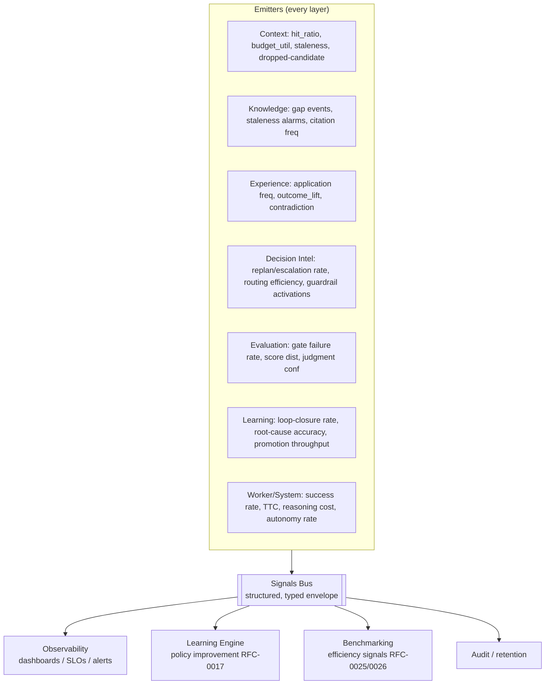

# RFC-0028 — Signals Bus & Observability

| Field | Value |
|---|---|
| RFC | `RFC-0028` |
| Title | Signals Bus & Observability |
| Status | Accepted |
| Authors | Architecture Office (`TEAM-090`) |
| Created | 2026-05-25 |
| Related | `ARCH-07`, `ARCH-01`…`ARCH-06`, `RFC-0017` (Learning Event Propagation), `RFC-0023` (Provenance & Decision Trace), `RFC-0029` (Cost & Latency Budgeting), `ADR-0038` (Signals Bus) |

## 1. Summary

This RFC specifies the **Signals Bus**: the unified, structured telemetry backbone every ECL
layer emits onto and that observability, the Learning Engine, and benchmarking consume. It
defines the signal envelope, the per-layer and end-to-end signal catalog, the two consumer classes
(human observability vs. machine learning-loop), and the delivery/retention guarantees. The Signals
Bus is how the ECL satisfies CANON-001 §8 principle 6 ("you cannot operate what you cannot
observe") and how the continuous-improvement flywheel is *measured* (`ARCH-07`).

## 2. Motivation

Signals are named as a first-class output of **every** ECL layer (`ARCH-01`…`ARCH-06` each has a
Signals section) and aggregated at the system level in `ARCH-07`. But those documents describe
*what* each layer emits, not the shared bus that carries it. Two very different consumers depend on
one coherent stream: **operators** (dashboards, SLOs, alerts) and the **Learning Engine**
(`RFC-0017`), which reasons over signals to improve retrieval/planning/routing policies. Without a
unified, structured bus, telemetry fragments, the improvement-trend metric cannot be computed, and
reflection loses the cross-cutting view it needs.

## 3. Guide-level explanation

Every layer emits **signals** — structured, typed telemetry events — onto a shared bus. A signal
is not a `LearningEvent` (`RFC-0017`, a durable change to memory/policy) nor a decision trace
(`RFC-0023`, the per-run audit record); it is observability telemetry. The bus fans out to
consumers:

## 4. Reference-level explanation

### 4.1 Signal envelope

Every signal is a structured event carrying, at minimum: a **name** (namespaced by emitting
layer, e.g., `context.dropped_candidate`, `learning.loop_closed`), a **value/measurement**, a
**timestamp** (`Timestamp`), the **run/worker identity** where applicable (`run_id`, `worker`,
`RFC-0019`), and canonical-ID references to the artifacts involved (`RFC-0022`). Signals are
additive-only telemetry; they never carry required *semantic* meaning that belongs in a durable
object (that separation mirrors the `metadata` rule of `RFC-0021`).

### 4.2 Signal catalog (authoritative aggregation)

The catalog unifies the per-layer signals already defined in the architecture:

| Source | Representative signals |
|---|---|
| Context (`ARCH-01`) | retrieval hit ratio, budget utilization, staleness index, experience-applied count, context churn, dropped-candidate log |
| Knowledge (`ARCH-02`) | retrieval coverage, knowledge-gap events, staleness alarms, citation frequency, contradiction detections, promotion rate |
| Experience (`ARCH-03`) | application frequency, outcome lift, contradiction rate, promotion readiness, situation coverage |
| Evaluation (`ARCH-04`) | gate failure rate, plan adherence, standards violations, score distribution, judgment confidence, regression detection |
| Learning (`ARCH-05`) | loop-closure rate, root-cause accuracy, reflection latency, promotion throughput, regression prevention, policy-improvement lift |
| Decision Intel (`ARCH-06`) | plan quality, replan rate, escalation rate, routing efficiency, control-decision accuracy, guardrail activations |
| System (`ARCH-07`) | success rate, time-to-completion, reasoning cost (calls+tokens), escalation/autonomy rate, **improvement trend** |

### 4.3 Two consumer classes

1. **Human observability** — metrics, structured logs, and distributed traces (CANON-001 §8
   principle 6, §2.4 SRE) feeding dashboards, SLOs and alerts. The decision trace and provenance
   (`RFC-0023`) are the trace dimension; signals are the metrics dimension.
2. **Machine / learning-loop** — the Learning Engine consumes signals to detect systemic patterns
   and measure policy-improvement lift (`RFC-0017` §4.5); benchmarking consumes efficiency signals
   (`RFC-0025` §4.4); budgeting consumes cost/latency signals (`RFC-0029`).

The same envelope serves both; consumers subscribe to the names they need.

### 4.4 Open standards & delivery

Signals follow open telemetry conventions (OpenTelemetry-style metrics/traces, CloudEvents-style
envelopes) per CANON-001 §8 principle 9 — no proprietary format. Delivery is asynchronous and
**must not block the ECL loop**: signal emission is best-effort for the hot path, while
durability-critical records (decision trace, `LearningEvent`) go through their own guaranteed
paths (`RFC-0023`/`RFC-0017`), not the observability bus. Signal loss degrades observability, never
correctness.

### 4.5 Retention & the improvement trend

Signals are retained at a resolution sufficient to compute the **improvement-trend** metric — the
trend of `EVAL-###` scores over time per task type (`ARCH-07`), the direct measurement of CANON's
flywheel. Long-horizon aggregates are downsampled; recent signals kept at full resolution.
Retention is policy-driven and cold-tiered, aligned with `RFC-0022` retention.

### 4.6 Sensitivity

Signals reference artifacts that may be sensitive; signal payloads carry references and
measurements, **not** sensitive content, and are redaction-checked (`RFC-0023` §4.6). This keeps
the observability plane free of PCI/PII while remaining fully useful.

## 5. Drawbacks

- **Volume & cost.** A signal-rich system generates high telemetry volume; mitigated by
  sampling on low-risk hot paths (never on durability-critical records) and downsampled retention.
- **Consumer coupling risk.** Many consumers on one bus can create implicit coupling to signal
  names; managed by namespacing and treating signal names as a versioned contract.
- **Best-effort delivery** means observability can have gaps under load; acceptable because
  correctness never depends on the observability bus.

## 6. Rationale & alternatives

- **Per-layer bespoke telemetry** (rejected): fragments the cross-cutting view the Learning Engine
  and benchmarking require (`ARCH-05`/`ARCH-07`).
- **Routing durable learning/audit records through the observability bus** (rejected): conflates
  best-effort telemetry with guaranteed durable records; `LearningEvent` and decision traces have
  their own guaranteed paths.
- **Proprietary APM only** (rejected): violates open-standards principle (CANON-001 §8) and the
  Apache-2.0, commercially-usable posture.

## 7. Prior art

OpenTelemetry (metrics/logs/traces), CloudEvents (typed event envelopes), the RED/USE metric
methodologies, and event-bus/pub-sub fan-out architectures are the generic inspirations. SRE SLO
practice (CANON-001 §2.4) informs the observability consumer. No proprietary system is referenced.

## 8. Unresolved questions

- Should signal names carry an explicit schema version like the object schemas (`RFC-0021`)?
- What sampling policy preserves the fidelity of the improvement-trend metric while cutting hot-path
  cost?
- How should multi-Worker runs (`ARCH-06` future) tag signals for correct per-Worker attribution?

## 9. Future possibilities

- **Real-time policy adaptation** — the Learning Engine reacting to signal streams to adjust
  retrieval/routing within tighter loops (`RFC-0017` future).
- **Anomaly detection** on signal streams to catch memory rot, benchmark drift, or runaway cost
  (`ARCH-07` failure modes) before they degrade outcomes.
- **Unified explainability console** joining signals, provenance, and decision traces (`RFC-0023`)
  for one-pane Worker observability.
