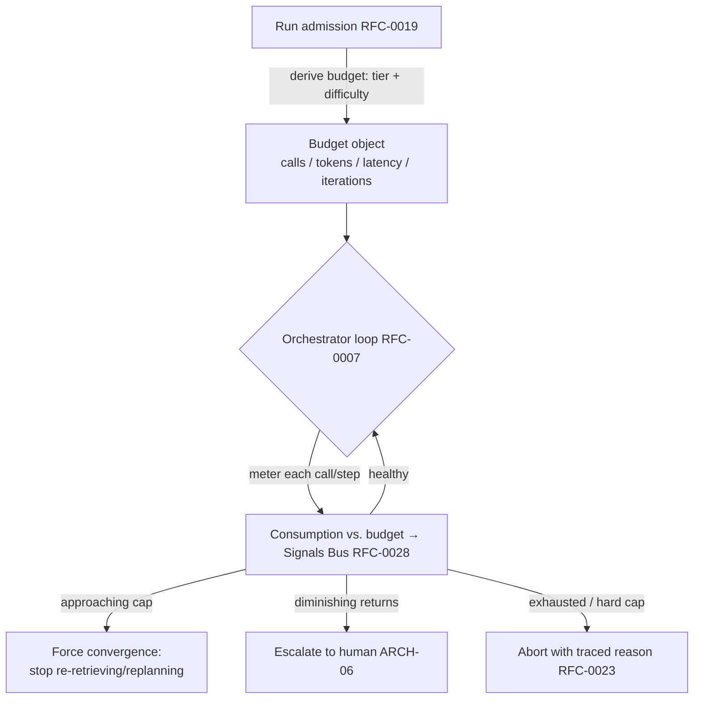

# RFC-0029 — Cost & Latency Budgeting

| Field | Value |
|---|---|
| RFC | `RFC-0029` |
| Title | Cost & Latency Budgeting |
| Status | Accepted |
| Authors | Architecture Office (`TEAM-090`) |
| Created | 2026-06-01 |
| Related | `ARCH-06`, `ARCH-01`, `RFC-0007` (Decision Intelligence Control Loop), `RFC-0010` (Model Router), `RFC-0011` (Model Gateway), `RFC-0026` (Benchmark Scoring), `RFC-0028` (Signals Bus), `ADR-0039` (Reasoning-Cost Budgets) |

## 1. Summary

This RFC specifies how the ECL **budgets the reasoning itself** — the calls, tokens, wall-clock
latency, and iteration count a task is permitted — and enforces those budgets in Decision
Intelligence and the Context Layer. It defines the budget object, where budgets come from (task
tier, difficulty, policy), how they are consumed and enforced across the loop, and how budget
pressure interacts with confidence-gated control (escalate/abort on diminishing returns). Runaway
reasoning cost is a named system-level failure mode (`ARCH-07`); this RFC is its mitigation
(`ADR-0039`).

## 2. Motivation

`ARCH-06` names "cost-aware reasoning budgets" as an explicit optimization and "analysis
paralysis" / "runaway cost" as failure modes; `ARCH-01` tracks a token budget; `ARCH-04`/`RFC-0026`
score efficiency alongside correctness. A Worker that loops indefinitely, re-retrieving and
replanning, is both expensive and a reliability risk. Budgeting turns "how much reasoning does this
task merit?" into a first-class, enforced constraint — so autonomy is bounded, cost is predictable,
and efficiency is comparable across Workers and providers (`RFC-0026`).

## 3. Guide-level explanation

Each Worker run (`RFC-0019`) is admitted with a **budget**: caps on reasoning cost (model calls +
tokens), latency, and loop iterations, derived from the task's risk tier and estimated difficulty.
The Context Layer already tracks a token/window budget (`ARCH-01`); this RFC generalizes budgeting
to the whole loop and makes the Orchestrator the enforcer. As the loop runs, consumption is
metered against the budget; when the budget nears exhaustion, Decision Intelligence must converge,
escalate, or abort — it may not silently overspend.

## 4. Reference-level explanation

### 4.1 The budget object

A run budget carries: `max_model_calls`, `max_tokens` (input+output), `max_latency`,
`max_iterations`, and an optional `cost_ceiling` (normalized currency/credits). It also references
the **context budget** (`ContextObject.model_budget` — `window_tokens`, `reserved_output`,
`ARCH-01`) so the token dimension is consistent between context assembly and the loop. Budgets are
policy data (versioned, `RFC-0017`), tunable per task type and tier.

### 4.2 Budget derivation

Budgets are derived at admission from:

- **Risk tier** (`CANON-001` §3 criticality tiers): Tier 0/PCI tasks may warrant a *larger*
  reasoning budget (correctness dominates) but also **tighter autonomy** (`RFC-0030`); Tier 2/3
  internal tasks get lean budgets.
- **Difficulty estimate** — Decision Intelligence's difficulty estimation (`ARCH-06`, used for
  routing) also sizes the budget.
- **Learned heuristics** — the Learning Engine can adjust budget policy from observed
  cost/quality outcomes (`RFC-0017`), e.g., "this task type rarely benefits from more than N
  iterations."

### 4.3 Enforcement in the loop

The `sdk.decision.Orchestrator` meters consumption at each model call (via the Gateway,
`RFC-0011`) and each loop iteration. Enforcement is graduated:

1. **Soft threshold** — on approaching a cap, DI stops discretionary re-retrieval/replanning and
   drives toward convergence (`ARCH-06` "diminishing-returns detection").
2. **Escalate** — if success criteria are unmet and returns are diminishing, DI escalates to a
   human rather than overspend (a traced decision, `RFC-0023`).
3. **Hard cap** — on exhaustion, DI aborts with a traced reason; a hard cap is never breached.

Budget interacts with **confidence-gated control** (`ARCH-06`): low fused confidence normally
triggers more retrieval/replanning, but budget bounds that — so a low-confidence, budget-exhausted
task escalates rather than looping. This resolves the tension between thoroughness and cost
explicitly.

### 4.4 Routing interaction

The `sdk.models.ModelRouter` (`RFC-0010`) chooses a model class partly by budget: a lean budget
biases toward cheaper/faster classes (including local SLMs, `ARCH-07`); a generous budget on a
subtle Tier 0 task permits a high-reasoning class (`PLAN-0072`'s `routing` field, `ARCH-06`
Example A). Routing decisions and their cost rationale are traced (`RFC-0023`) and their efficiency
measured (`RFC-0028`).

### 4.5 Signals & benchmarking

Consumption is emitted continuously to the Signals Bus (`RFC-0028`): calls, tokens, latency,
iterations, and budget-utilization ratio per run. These are exactly the **efficiency signals** the
Benchmarking Harness records (`RFC-0025` §4.4) and Scoring combines into quality-per-resource
(`RFC-0026` §4.2). Budgeting and benchmarking thus share one cost vocabulary.

### 4.6 Determinism & replay

Budgets are captured in the run's replay set (`RFC-0024`) so a replay honors the same caps and
reproduces the same convergence/escalation behavior. A budget change is a policy version change
(`RFC-0017`) and therefore a distinct, attributable input to any benchmark result (`RFC-0026`).

## 5. Drawbacks

- **Premature cutoff risk.** A too-tight budget can abort a task that would have succeeded with one
  more iteration; mitigated by learned, per-task-type budgets and by escalation (not silent
  failure) at the boundary.
- **Estimation error.** Difficulty estimation is imperfect, so budgets can be mis-sized; the soft/
  escalate/hard graduation limits the damage of either error.
- **Added metering overhead.** Per-call metering has a small cost; negligible relative to model
  spend and essential for predictability.

## 6. Rationale & alternatives

- **Unbounded loops with post-hoc cost reports** (rejected): the "runaway cost" failure mode
  (`ARCH-07`); cost must be bounded *before* it is incurred.
- **Fixed global budget for all tasks** (rejected): starves hard Tier 0 work and overspends on
  trivial tasks; budgets must be tier/difficulty-aware.
- **Optimizing cost inside the model** (rejected): impossible with a stateless, swappable model
  (`ARCH-07`); budgeting is an ECL-side control.

## 7. Prior art

Timeouts, circuit breakers, and rate/quota limiting in distributed systems; compute-budget and
early-stopping in iterative optimization; and cost-aware query planning are the generic
inspirations. Progressive-delivery guardrails with automated stop conditions (CANON-001 §7.4)
inform the graduated enforcement. No proprietary system is referenced.

## 8. Unresolved questions

- Should budgets be dynamically re-allocatable mid-run (borrow latency budget for more calls) under
  a fixed cost ceiling?
- How should multi-Worker runs (`ARCH-06` future) share and account a joint budget across Workers?
- What is the right default budget-derivation policy per Worker family before learned heuristics
  take over?

## 9. Future possibilities

- **Reasoning-budget planning as optimization** — DI explicitly plans how many calls/tokens a task
  merits, learned from `EVAL-###`/cost outcomes (`ARCH-06` future evolution).
- **Cost-adaptive routing frontiers** — pick the model class on the measured quality/cost Pareto
  frontier (`RFC-0026` §9) for the given budget.
- **Budget SLOs** — treat per-task-type cost/latency as SLOs with alerts on the Signals Bus
  (`RFC-0028`) when Workers drift over budget.
