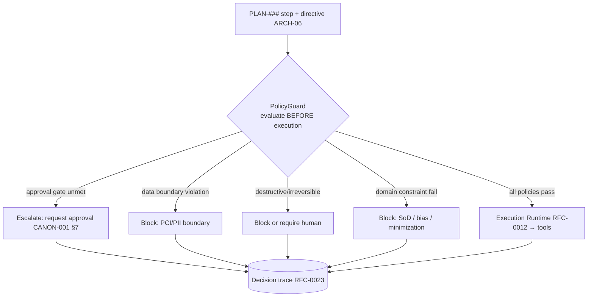

# RFC-0030 — Security, Policy Enforcement & Guardrails

| Field | Value |
|---|---|
| RFC | `RFC-0030` |
| Title | Security, Policy Enforcement & Guardrails |
| Status | Accepted |
| Authors | Architecture Office (`TEAM-090`) |
| Created | 2026-06-08 |
| Related | `ARCH-06`, `CANON-001` §4.6/§7, `RFC-0012` (Execution Runtime), `RFC-0013` (Tool Selection), `RFC-0020` (Worker Specialization Model), `RFC-0023` (Provenance & Decision Trace), `RFC-0027` (Plugin Architecture), `ADR-0041` (Policy Before Execution) |

## 1. Summary

This RFC specifies the ECL's **security and guardrail model**: how policies are declared, where
they are enforced (always *before* execution, `ADR-0041`), the guardrail taxonomy (approval gates,
data boundaries, destructive-action limits, domain-specific constraints), the sensitivity/
data-handling rules that travel with knowledge and context, and how every enforcement is traced
for provable compliance. Guardrails are the fourth Worker specialization axis (`RFC-0020`), but
the *enforcement machinery* is shared and non-negotiable across all Workers.

## 2. Motivation

An Enterprise AI Worker acts on real MCG systems with real consequences — opening PRs, running
tests, touching PCI-scoped payments code (`APP-012`), reading PII in identity (`APP-014`).
`ARCH-06` makes "enforce policy before acting" a core responsibility and names "guardrail bypass"
a failure mode; CANON-001 §4.6 and §7 mandate security-by-design, PCI isolation, and approval
gates. Confidence-gated autonomy (`ARCH-07`) is the safety backbone, but confidence is not enough:
some actions must be blocked *regardless* of confidence. This RFC makes policy enforcement a hard,
inspectable gate rather than a soft suggestion.

## 3. Guide-level explanation

Policies are declared per Worker (the policy axis, `RFC-0020`) and enforced by
`sdk.decision.PolicyGuard` inside Decision Intelligence, **before** any execution directive reaches
a tool. The guard evaluates the proposed action against the active policies; a violation produces a
hard stop (`escalate` or `abort`) that is itself a traced decision (`RFC-0023`). No confidence
level can override a policy stop.

## 4. Reference-level explanation

### 4.1 Policy-before-execution invariant (`ADR-0041`)

Enforcement happens at the **only** layer with agency (`ARCH-06`): the Orchestrator consults
`PolicyGuard` before issuing any directive to the Execution Runtime. Tools never self-authorize;
plugins cannot widen their permissions (`RFC-0027` §4.5). This places the gate structurally ahead
of any side effect — a Worker physically cannot act on a forbidden path.

### 4.2 Guardrail taxonomy

| Guardrail class | Enforces | Canon basis |
|---|---|---|
| **Approval gates** | Required reviews before a change lands (≥1, ≥2 for Tier 0/PCI/auth) | CANON-001 §4.2, §7.5 |
| **Data boundaries** | PCI cardholder data isolated to `APP-012`; PII handling in `APP-014`; no sensitive data in context/traces | CANON-001 §4.6; `ARCH-01` leaky-context |
| **Destructive-action limits** | No irreversible actions without human sign-off; prefer feature-flag/rollback-safe changes | CANON-001 §7.4 |
| **Dependency-direction** | No reverse dependencies (e.g., `APP-012 → APP-003`) | CANON-001 §3 |
| **Domain-specific** (per Worker) | SoD (Finance), bias/fairness (Recruitment), data minimization (Privacy), least privilege (Security) | `RFC-0020`; `ARCH-07` |

Approval and dependency-direction are also *evaluated* after the fact (`ARCH-04` Example B), but
they are *enforced* before the action — evaluation is the backstop, not the gate.

### 4.3 Sensitivity & data handling

Sensitivity labels (`KnowledgeObject.sensitivity` ∈ `public | internal | pci | pii`) travel with
knowledge into context and through provenance (`RFC-0023`). Policy-aware retrieval and composition
redact or exclude sensitive material per the Worker's policies (`ARCH-01`/`ARCH-02` classification
rules). The Model Gateway (`RFC-0011`) enforces that sensitive content is not sent to a provider
whose data-handling posture the policy disallows — critical for the model-agnostic, multi-provider
posture (`ARCH-07`): swapping providers must not silently change the data-egress boundary.

### 4.4 Least privilege & tool authorization

A Worker's tools are granted per the specialization model (`RFC-0020`) and negotiated via
capability descriptors (`RFC-0013`); the `PolicyGuard` checks each directive against the granted,
negotiated capabilities and the Worker's policies. Workload identity is least-privilege
(CANON-001 §4.6); service-to-service calls the Worker triggers are mutually authenticated. A tool
plugin runs sandboxed with no ambient credentials (`RFC-0027` §4.5).

### 4.5 Confidence vs. policy (two independent gates)

Autonomy has **two** independent gates, and an action proceeds only if **both** pass:

1. **Confidence gate** (`ARCH-06`/`RFC-0009`): fused confidence must be high enough for the
   stakes; low confidence → re-retrieve/replan/escalate.
2. **Policy gate** (this RFC): the action must violate no policy, *regardless of confidence*.

A high-confidence action that trips a policy is blocked; a policy-clean action at low confidence
still escalates. `ARCH-06`'s control table makes "policy-blocked → stop regardless of confidence"
explicit; this RFC formalizes it.

### 4.6 Traceability & provable compliance

Every guardrail evaluation — pass or block — is recorded as a `WorkerDecision` on the decision
trace (`RFC-0023`) with its `rationale`. "Guardrail activations" is a first-class signal
(`ARCH-06`/`RFC-0028`). Because enforcement is traced and immutable (`RFC-0022`), compliance is
**demonstrable** (an auditor can prove no forbidden action occurred), not merely asserted — the
answer to `ARCH-07`'s "unauditable behavior" failure mode for the security dimension.

### 4.7 Risk-adaptive autonomy

Per `ARCH-06` future evolution (made normative here), autonomy thresholds tighten for Tier 0/PCI
changes and relax for low-risk internal ones (CANON-001 criticality tiers). Risk-adaptivity tunes
the **confidence** gate; it never loosens the **policy** gate — hard boundaries (PCI, dependency
direction, destructive actions) are absolute at every tier.

## 5. Drawbacks

- **Over-blocking.** Strict pre-execution gates can halt legitimate work, pushing load onto human
  escalation; mitigated by precise policies and risk-adaptive confidence thresholds (§4.7).
- **Policy authoring burden.** Each Worker must declare correct policies (`RFC-0020`); wrong or
  missing policies are dangerous — mitigated by mandatory security review (`CANON-001` §4.6) and
  registration validation (`RFC-0019`).
- **Redaction gaps.** Sensitivity handling depends on correct labels; an unlabeled sensitive fact
  can leak — mitigated by mandatory classification (`ARCH-02`) and Gateway egress checks.

## 6. Rationale & alternatives

- **Post-hoc enforcement (evaluate then block)** (rejected): the side effect has already happened;
  `ADR-0041` requires policy *before* execution.
- **Confidence as the only gate** (rejected): some actions must be blocked regardless of how
  confident the Worker is (PCI, irreversibility); two independent gates are required.
- **Trusting tools/plugins to self-police** (rejected): distributes and hides enforcement,
  enabling bypass; the single `PolicyGuard` in the agency layer is auditable.

## 7. Prior art

Policy-as-code and admission control (evaluate a request against policy before admitting it),
capability-based security and least privilege, mandatory access control with data-sensitivity
labels, and separation-of-duties controls are the generic inspirations. Secure-by-design SDLC gates
(SAST/DAST/SCA, CANON-001 §4.6) inform the pipeline analogy. No proprietary system is referenced.

## 8. Unresolved questions

- Should policies be expressed in a formal, verifiable policy language enabling static proof that a
  Worker cannot reach a forbidden state?
- How are conflicting policies resolved in multi-Worker or composed-role runs (`RFC-0020` §9)?
- What is the human-escalation SLA when guardrails block a Tier 0 task, and how is it tracked on the
  Signals Bus (`RFC-0028`)?

## 9. Future possibilities

- **Formally verified guardrails** — machine-checkable proofs that a `WorkerSpec`'s policies make
  certain actions unreachable, extending registration validation (`RFC-0019`).
- **Adaptive threat response** — the Learning Engine detecting attempted-bypass patterns
  (`RFC-0017` §4.5) and hardening policies automatically under governance.
- **Cross-provider data-egress attestation** — cryptographic proof of which content reached which
  provider, extending provenance attestation (`RFC-0023` §9) for regulated workloads.
