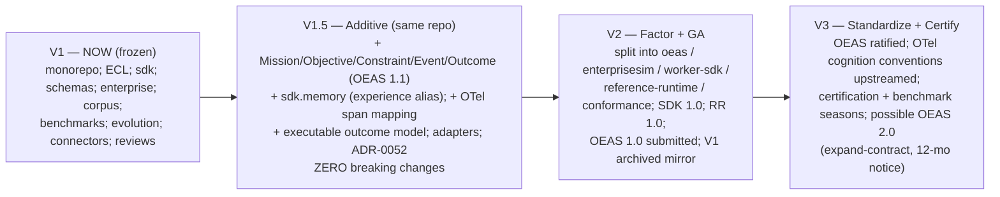

# EnterpriseSim V1 → V2 Migration Strategy

> **Status:** Migration blueprint (Draft). **Prime directive:** *evolution, not replacement.*
> **Guarantee:** nothing disappears without an explanation and a destination. Every V1 artifact
> is preserved, and V1 users are rewarded — not punished — for adopting early. Backward
> compatibility is a hard requirement through V2; breaking changes ship with adapters and long
> deprecation windows. Companion: `ENTERPRISE_AI_ECOSYSTEM.md`, `OPEN_STANDARDS_ROADMAP.md`.

## 0. Migration principles

1. **Preserve the investment.** V1 is hundreds of validated, cross-referenced artifacts. Default
   disposition is **Keep** or **Move** (relocate unchanged), then **Extend**. **Deprecate/Replace
   are last resorts** and appear only twice in this entire plan — both as *amendments with
   Superseded-by pointers*, never deletions.
2. **Additive first.** V1.5 introduces the missing primitives (Mission/Objective/Constraint/
   Event/Outcome) and generalizations (Experience→Memory) **without breaking any V1 schema or
   interface.** OEAS 1.1 is a strict superset of V1 `schemas/`.
3. **Split at the seams, keep git history.** The monorepo is factored into foundation projects at
   V2 using history-preserving tooling (`git filter-repo`/subtree); the V1 monorepo is archived
   as a read-only mirror, never deleted.
4. **Version independently.** After the split each project has its own SemVer; OEAS (the
   standard) moves slowest.

## Destination legend
`OEAS` = Open Enterprise AI Specification · `SIM` = EnterpriseSim (environment+benchmark) ·
`EWSDK` = Enterprise Worker SDK · `RR` = Reference Runtime · `FOUND` = foundation
governance/process/rationale · `PRIV` = private (out of the open ecosystem).

---

## Part 4.1 — Complete artifact migration matrix

| V1 artifact | Disposition | Destination | Rationale |
|---|---|---|---|
| `CANON.md` | **Keep + Split** | `SIM` (+ conventions referenced by `OEAS`) | Stays as EnterpriseSim's reference-enterprise canon (MCG). Its ID/naming conventions (§5–§6) are *referenced* (not copied) by OEAS. Remains frozen; V2 adds a thin "Mission/Objective" appendix via a new ADR (additive). |
| `docs/architecture/` (ECL `ARCH-01..07`) | **Move + Reframe + Extend** | `EWSDK` (spec) | The ECL is **not deleted** — it becomes the SDK's **inner cognitive-cycle specification** (the Worker's perceive→retrieve→deliberate→decide→act→evaluate→reflect loop). Reframed as *worker-internal*, with Mission/Objective/Constraint added *above* it. Content preserved verbatim; re-homed and re-titled. |
| `sdk/` (10 modules, interfaces) | **Move + Extend** | `EWSDK` | Core of the SDK project. All 10 module interfaces preserved. |
| ↳ `sdk/experience/` | **Rename + Generalize** | `EWSDK` `sdk.memory` | Generalized to a **Memory** interface; `ExperienceRetriever`/`ExperienceStore` become the *experiential* memory type behind the new interface. V1 imports kept working via an alias adapter (§4.5). |
| ↳ `sdk.knowledge/context/planner/decision/execution/evaluation/learning/workers` | **Keep** | `EWSDK` | Interfaces unchanged; additive methods only. |
| ↳ `sdk.models` (Model Gateway) | **Keep** | `EWSDK` | The one unambiguously-correct V1 component; provider-agnostic gateway retained as-is. |
| ↳ *(new)* `sdk.mission`, `sdk.objective`, `sdk.constraint`, `sdk.event` | **Add** | `EWSDK` | The missing primitives, added additively (V1.5). |
| `schemas/` (12 objects + `common`) | **Promote + Extend** | `OEAS` | Become the basis of the standard. **OEAS 1.0 == V1 schemas** (byte-compatible); OEAS 1.1 adds new object schemas. All V1 `$id`s and `schema_version: 2020-12.v1` remain valid forever. |
| ↳ `experience_object.schema.json` | **Extend (superset)** | `OEAS` `memory_record` (`type=experiential`) | V1 experience objects validate as memory records; no rewrite of existing data. |
| ↳ `evaluation_object.schema.json` | **Promote** | `OEAS` Evaluation Standard | Becomes the standardized evaluation format; extended with outcome/goal fields (additive). |
| ↳ *(new)* `mission`, `objective`, `outcome`, `actor`, `capability`, `policy`, `constraint`, `event` schemas | **Add** | `OEAS` | Standardize the primitives (see `OPEN_STANDARDS_ROADMAP.md`). |
| `docs/rfcs/` (RFC-0001..0030) | **Keep + Extend** | `FOUND` process | The RFC mechanism is a genuine asset — elevated to the foundation-wide change process; existing RFCs retained, future ones span projects. |
| `docs/adr/` (ADR-0001..0051) | **Keep + Extend** | `FOUND` process | All ADRs retained. Two *amendments* (not deletions) at V1.5 — see §4.6. |
| `benchmarks/` (13 specs + schemas + examples) | **Move + Extend** | `SIM` (eval format → `OEAS`) | The benchmark is part of the environment. Extended with **outcome-verified execution** and held-out families; benchmark object schemas promote the eval format to OEAS. |
| `docs/standards/` (9 engineering standards) | **Keep + Move** | `FOUND` (+ per-project copies) | Contributor/engineering standards become foundation-wide; each repo inherits them. |
| `docs/guides/` (6 developer guides) | **Split + Move** | `EWSDK` / `SIM` / `OEAS` | developer/extension/plugin/worker guides → EWSDK; architecture-guide → EWSDK+SIM; schema-guide → OEAS. Content preserved, re-homed. |
| `enterprise/` (registry, knowledge, jira, PRs, commits, tests, incidents, postmortems, api-specs, architecture, runbooks) | **Keep + Extend** | `SIM` | The reference enterprise — EnterpriseSim's core. Extended with Mission/Objective/Event/State objects and an **executable outcome model**. All existing datasets preserved and still valid. |
| `corpus/` (100 `RUN-*` bundles + `experience_store` + bundle schema) | **Move + Reframe + Extend** | `SIM` | Kept in full, **re-labeled as illustrative reference traces** (not empirical results — the review fix). The V2 benchmark harness generates *new* outcome-verified traces. `experience_store.json` seeds the Memory service. `worker_execution_bundle` schema → OEAS. |
| `evolution/` (13 sprints + 10 release notes + `timeline.json`) | **Keep + Move** | `SIM` | The environment's temporal history; feeds *temporal memory*. Retained. |
| `connectors/github/` (design + interfaces) | **Keep + Extend** | `SIM` | Reference connectors; V2 *implements* the design (was design-only), MCP-aligned. Design docs retained. |
| `research/reference_runtime/` (reference-runtime algorithm research) | **Keep + Move** | `SIM` | Design-only algorithm research for a reference runtime implementing the SDK interfaces; part of EnterpriseSim, retained. |
| `review/` (architecture review + ontology study) | **Keep + Move** | `FOUND` | Design rationale; becomes foundation design-history / informs the V2 ADRs. |
| `tools/refgen/` (`validate.py`, generators) | **Keep + Split** | `OEAS` (validator→conformance) / `SIM` (generators) | `validate.py` becomes the seed of the OEAS **conformance CLI**; the dataset generators stay with EnterpriseSim. |
| `ecosystem/` (these blueprints) | **Keep** | `FOUND` | The strategic plan itself. |
| `pyproject.toml`, `.gitignore`, LICENSE | **Keep + Split** | per-project | Each split repo gets its own packaging/license (all Apache-2.0). |

**Summary counts:** Keep/Move/Extend ≈ 100% of artifacts; **zero hard deletions**; two amendments
(ADR-0003 scope; corpus framing) handled as *supersede-with-pointer*, per §4.6.

The user's example mappings, reconciled:
- *ECL → Enterprise Worker SDK*: ✅ **Move + Reframe** (ECL = the SDK's cognitive-cycle spec).
- *Experience Layer → Memory Projection Interface*: ✅ **Rename + Generalize** (`sdk.experience` → `sdk.memory`; experience = one type).
- *Learning Corpus → Benchmark Dataset*: ✅ **Move + Reframe** (illustrative traces + the new outcome-verified benchmark dataset).
- *Reference Enterprise → EnterpriseSim*: ✅ **Keep** (`enterprise/` is EnterpriseSim's core).
- *Evaluation Objects → Evaluation Standard*: ✅ **Promote** (`evaluation_object.schema.json` → OEAS).

---

## Part 4.2 — Repository mapping (monorepo → polyrepo, at V2)

| V2 repository | Absorbs (from V1) | SemVer line | Stability target |
|---|---|---|---|
| `open-enterprise-ai/oeas` | `schemas/`, eval/benchmark object formats, `worker_execution_bundle` schema, `validate.py`→conformance | OEAS 1.x | ≥ 10y (the standard) |
| `open-enterprise-ai/enterprisesim` | `enterprise/`, `corpus/`, `benchmarks/`, `evolution/`, `connectors/`, dataset generators, `CANON.md` | SIM 2.x | env ≥ 3y; tasks per season |
| `open-enterprise-ai/enterprise-worker-sdk` | `sdk/`, `docs/architecture/` (ECL cycle), most of `docs/guides/` | EWSDK 1.x | API-2 ≥ 5y |
| `open-enterprise-ai/reference-runtime` | *(new)* implements EWSDK; consumes OEAS; runs in SIM | RR 1.x | tracks SDK |
| `open-enterprise-ai/conformance` | *(new)* + `validate.py` lineage; certification + leaderboards | CONF 1.x | tracks OEAS |
| `open-enterprise-ai/community` | `docs/standards/`, `docs/rfcs/`, `docs/adr/`, `review/`, `ecosystem/`, governance | n/a (process) | — |
| `enterprisesim-v1` (archived) | the entire V1 monorepo, read-only mirror | frozen | permanent |

History is preserved via `git filter-repo` subtree extraction; the archived V1 mirror
guarantees no artifact or commit is ever lost.

---

## Part 4.3 — Folder mapping (within V1.5, before the split)

During V1.5 everything stays in one repo (no user disruption) and is *re-organized additively*:

```
V1 (now)                          V1.5 (additive, same repo)
schemas/                     →    spec/            (alias; schemas/ symlinked/kept)
sdk/                         →    sdk/  (+ sdk/mission, sdk/objective, sdk/memory alias)
docs/architecture/           →    sdk/cognitive-cycle/ (referenced; docs/architecture/ kept)
enterprise/ corpus/          →    enterprisesim/   (aggregated view; originals kept in place)
benchmarks/ evolution/       →    enterprisesim/benchmark, enterprisesim/history
connectors/                  →    enterprisesim/connectors/
tools/refgen/validate.py     →    conformance/oeas-validate (same file, new entry point)
```

**Rule:** V1.5 adds *new paths and aliases*; it does not move or delete V1 paths. The physical
split to separate repos happens only at V2, with adapters in place.

---

## Part 4.4 — Compatibility matrix

| | OEAS 1.0 (=V1) | OEAS 1.1 (+primitives) | OEAS 2.0 (V3) |
|---|---|---|---|
| **V1 objects (`2020-12.v1`)** | native | ✅ valid (superset) | ✅ via adapter |
| **EWSDK 1.0** | ✅ | ✅ | ⚠️ adapter |
| **EWSDK 1.x (V1.5+)** | ✅ (reads v1) | ✅ native | ✅ |
| **Reference Runtime 1.x** | ✅ | ✅ | ✅ |
| **V1 corpus bundles** | native | ✅ (bundle schema promoted, backward-compatible) | ✅ via adapter |
| **Commercial runtime (any)** | must advertise supported OEAS range via `CapabilityDescriptor` | | |

**Interop rule:** a component MUST accept any object whose `schema_version` is within its
advertised supported range and MUST ignore unknown fields (`metadata` escape hatch, already in
V1). Version negotiation reuses and extends V1's `sdk.models.CapabilityDescriptor`.

---

## Part 4.5 — Versioning & SemVer plan

- **Per-project SemVer.** MAJOR = breaking contract change (requires adapter + deprecation
  window); MINOR = additive/backward-compatible; PATCH = fixes.
- **OEAS is the anchor and moves slowest.** `schema_version` strings embed the spec line
  (`2020-12.v1` today; `2020-12.v2` for OEAS 1.1 additions — same JSON Schema draft, additive).
  OEAS 2.0 is the only place expand-contract *contraction* is permitted, at V3, with ≥ 12-month
  notice.
- **Expand-contract everywhere** (`ADR-0033`): add new optional → dual-write/backfill → only
  later require/remove, after no producer emits the old shape.
- **Stability promises:** API-2 (Worker Contract) ≥ 5y; API-3 (OEAS objects/events) ≥ 10y (see
  ecosystem doc Part 5). A public "stable-API dashboard" tracks these.

## Part 4.6 — The two amendments (the only non-Keep dispositions)

Neither is a deletion; both are ADR *supersessions* with pointers (append-only ADR history):
1. **ADR-0003 ("learning lives outside the model," absolute)** → **Amend** via a new
   `ADR-0052 (Two-Speed Learning)`: external/reversible learning remains the default and
   authoritative; a *governed, optional distillation path* is permitted for stable,
   provenance-clean procedural memory. ADR-0003 marked `Superseded-by: ADR-0052`; text retained.
2. **Corpus "improvement" framing** → **Amend** documentation: the 100-run corpus is re-labeled
   **illustrative reference traces**; empirical "workers improve" claims move to the new
   outcome-verified benchmark (`review/Enterprise-AI-Ontology.md` §5). No data deleted; the
   generator and bundles are retained.

## Part 4.7 — Migration tooling & compatibility adapters

| Tool | Purpose |
|---|---|
| `oeas-migrate` | Upgrade objects `2020-12.v1 → v2` additively (wrap legacy objects with default Mission/Objective context where required; never mutates semantics). Reversible. |
| `experience→memory adapter` | Presents V1 `experience_object`s as `memory_record{type:experiential}`; keeps V1 `sdk.experience` imports working (alias) through V2. |
| `corpus re-labeler + outcome backfill` | Marks V1 bundles as illustrative; optionally re-runs them through the Reference Runtime to attach *verified* outcomes. |
| `oeas-validate` (from V1 `tools/refgen/validate.py`) | Conformance CLI: validates any object/runtime output against OEAS + reports schema-version compatibility. |
| `repo-split` (`git filter-repo`) | History-preserving extraction of each project; produces the archived V1 mirror. |
| `bench-season` | Freezes/rotates held-out benchmark task sets; enforces contamination controls. |

Adapters are maintained for **≥ 2 minor versions** after any breaking change and never removed
before the next MAJOR.

## Part 4.8 — Deprecation timeline

Deprecation is rare (only the two amendments above are even *scope* changes). Policy:
- **Announce** at a MINOR; **maintain adapter** ≥ 2 minors; **remove** only at the next MAJOR
  with ≥ 12 months notice; **archive** (never hard-delete) removed artifacts in the V1 mirror.
- No V1 schema, interface, dataset or document is scheduled for removal before **V3**, and even
  then only via expand-contract with adapters.

---

## Part 4.9 — Phased migration plan & visual roadmap



| Phase | Theme | Breaking? | Duration (indicative) | Exit criteria |
|---|---|---|---|---|
| **V1** | Frozen baseline (done) | — | — | V1 released & adopted |
| **V1.5** | Additive primitives + adapters | **No** | ~2 quarters | New primitives GA; all V1 artifacts still valid; adapters shipped; outcome model executable |
| **V2** | Repo factoring + project GA | Minimal, adapter-backed | ~3–4 quarters | Polyrepo live; SDK/RR 1.0; OEAS submitted; V1 mirror archived; conformance suite live |
| **V3** | Standardization + certification | Only via expand-contract | ~4–6 quarters | OEAS ratified; OTel conventions merged; certification program; benchmark seasons |

**Migration guarantee restated:** an organization on V1 upgrades to V1.5 with *no code changes*
(additive), reaches V2 by swapping monorepo imports for per-project packages (mechanical, adapter
-assisted), and never loses access to any V1 artifact (archived mirror + adapters). Early
adopters inherit the entire ecosystem — the reward for betting on V1.
