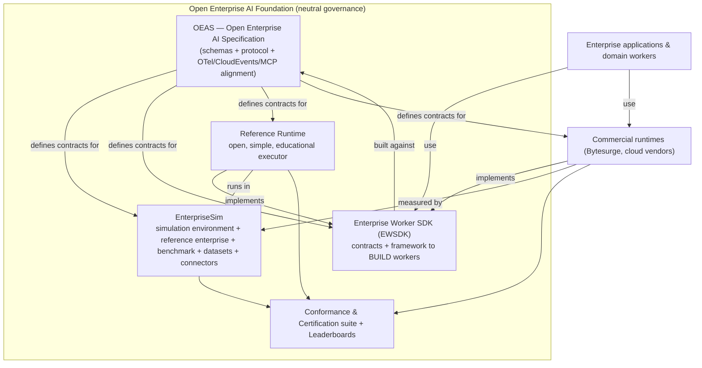
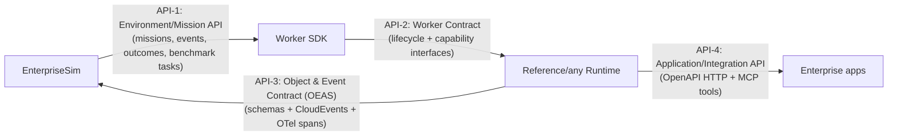

# The Open Enterprise AI Ecosystem — A Ten-Year Blueprint

> **Status:** Strategic blueprint (Draft for foundation review). **Scope:** the long-term
> ecosystem that EnterpriseSim V1 evolves into. **Prime directive:** *evolution over
> replacement.* Every recommendation is tagged **Keep / Rename / Extend / Move / Merge / Split
> / Deprecate / Replace**; deprecation is rare and justified. Backward compatibility is a
> first-class design goal. Companion documents: `ENTERPRISESIM_V2_MIGRATION.md`,
> `ENTERPRISE_WORKER_SDK_CHARTER.md`, `REFERENCE_RUNTIME_CHARTER.md`,
> `OPEN_STANDARDS_ROADMAP.md`. Grounded in `review/Enterprise-AI-Ontology.md`.

## 0. Thesis

The equivalents of Kubernetes/CNCF, OpenTelemetry, OpenAPI and Airflow were **not single
products**. They were **a neutral foundation hosting a small set of sharply-scoped projects — a
specification, a reference implementation, a conformance suite, and an environment — with clean
APIs between them and vendor-neutral governance.** Enterprise AI's open foundation should copy
that shape, not invent a new one.

EnterpriseSim V1's greatest risk is that it is *one monorepo trying to be five things* (a
spec, an SDK, a benchmark, a corpus, a runtime-shaped set of interfaces). Its greatest asset is
that all five things already exist, are internally consistent, and validate. The job of the
next decade is to **factor V1 into a foundation of well-bounded projects without losing a
single validated artifact.**

---

## Part 1 — Ecosystem vision

### 1.1 What the ecosystem must consist of

Not one repository. Not an infinite sprawl. **A foundation hosting four projects plus a
specification, with a neutral governance and conformance layer.**

### 1.2 Are the current project boundaries optimal? No — but they are *close*, and the fix is factoring, not rewriting.

V1 conflates four concerns that should be separately versioned and governed:

| Concern | V1 location | Should be |
|---|---|---|
| **The contract** (what things *are*) | `schemas/` | **OEAS** (a standard, submittable to a foundation) |
| **The world** (where workers are exercised) | `enterprise/`, `corpus/`, `benchmarks/`, `evolution/`, `connectors/` | **EnterpriseSim** (environment + benchmark) |
| **How to build a worker** (contracts + tooling) | `sdk/` | **Enterprise Worker SDK** |
| **How a worker runs** (executable reference) | *(absent — only interfaces)* | **Reference Runtime** (new) |

These four have **different release cadences, audiences and stability guarantees** — the
decisive reason to separate them: a standard must be glacially stable; a benchmark evolves with
tasks; an SDK moves at developer speed; a runtime iterates fastest. Coupling them in one repo
forces the slowest and fastest to share a version number — fatal at ecosystem scale.

### 1.3 Design principle: one substrate, one unit, one center

From the ontology study, the ecosystem is organized around: **an Event-sourced substrate**
(the source of truth, audit, memory and learning), **the Mission** as the operational unit of
accountable work, and **the Objective/Outcome** as the semantic center that makes everything
evaluable. Workers are *Actors* that execute Missions; Memory is a *projection* over the Event
log; the ECL is the Worker's *inner cognitive cycle*. This is additive to V1, not a rewrite.

---

## Part 2 — Core projects (evaluation & recommendation)

The brief proposes three projects (A EnterpriseSim, B Worker SDK, C Reference Runtime). We
evaluate them and recommend a **fourth (the specification) and a governance/conformance layer**,
because the standard is the thing that actually becomes "the OpenAPI of Enterprise AI."

### Project A — **EnterpriseSim** (Keep + Extend + Rename-scope)
- **Verdict: correct and central.** This is the project's crown identity per the ontology study:
  a controllable, executable, reproducible enterprise *world* + benchmark. **Keep** the name and
  all of `enterprise/`, `corpus/`, `benchmarks/`, `evolution/`, `connectors/`. **Extend** with
  first-class **Mission/Objective/Constraint/Event/Outcome** objects and an **executable outcome
  model** (so outcomes are *verified*, not asserted — the #1 review fix). **Rename its scope** in
  messaging from "reference implementation of the ECL" to "the open simulation environment and
  benchmark for Enterprise AI Workers."
- Contains: synthetic enterprise, missions, objectives, events, state, assets, policies,
  constraints, benchmark tasks, evaluation framework, synthetic datasets, reference connectors,
  and the SDK *contract conformance* tests.

### Project B — **Enterprise Worker SDK (EWSDK)** (Extend from V1 `sdk/`)
- **Verdict: correct.** This is where the V1 `sdk/` goes, **plus** the reframed ECL as the
  worker's inner cognitive cycle, **plus** the new Mission/Objective/Constraint interfaces, and
  a generalized **Memory** interface (V1 `sdk.experience` → `sdk.memory`, Experience becomes one
  type). Adds CLI, testing framework, reference workers (as *profiles*, composition not
  inheritance), plugin architecture (`RFC-0027`). See `ENTERPRISE_WORKER_SDK_CHARTER.md`.

### Project C — **Reference Runtime** (New — fills a real V1 gap)
- **Verdict: correct and *necessary*.** V1 shipped interfaces with **no executor**. A
  deliberately simple, non-optimized, non-proprietary runtime is essential for education,
  conformance and reproducibility, and to keep commercial runtimes honest against an open
  baseline. It must *intentionally not* implement proprietary ranking/memory/decision
  algorithms. See `REFERENCE_RUNTIME_CHARTER.md`.

### Project D (recommended addition) — **OEAS: Open Enterprise AI Specification**
- **Verdict: the highest-leverage project, missing from the brief.** The schemas + protocol +
  alignment with JSON Schema/CloudEvents/OpenTelemetry/OpenAPI/MCP. This is the artifact that
  becomes an industry standard and the thing people remember in 2035. Evolves from V1
  `schemas/`. See `OPEN_STANDARDS_ROADMAP.md`.

### Cross-cutting — **Conformance, Certification & Leaderboards** (recommended)
- A neutral suite that answers "is this runtime OEAS-conformant?" and "how does it score on the
  EnterpriseSim benchmark?" This is what makes the ecosystem a *market* (MLPerf/CNCF-conformance
  pattern) rather than a library.

### Recommended structure (strongest long-term)
**One foundation, five artifacts, polyrepo:** `open-enterprise-ai/oeas` (spec),
`/enterprisesim` (environment+benchmark), `/enterprise-worker-sdk`, `/reference-runtime`,
`/conformance`. V1's monorepo is preserved through V1.5 and *split* at V2 (see the migration
doc) so nothing is lost and history is retained.

---

## Part 3 — Canonical Enterprise AI ontology (condensed)

Full derivation in `review/Enterprise-AI-Ontology.md`; the canonical result the ecosystem
standardizes:

**Primitives (fundamental):** `Event` (immutable, event-sourced substrate) · `Actor`
(human · AI · system, unified) · `Objective` (absorbs Intent + Goal; the semantic center) ·
`Constraint`/`Policy` · `Belief`/`Knowledge` (fallible, versioned) · `Capability` (procedural
competence) · `Asset` · `Mission` (the operational unit: Actor pursuing Objectives under
Constraints over time, accountably).

**Derived / projections / processes:** `Memory` (bitemporal projection over Events+Beliefs+
Capability; 7 types: semantic/episodic/procedural/temporal/organizational/policy/execution) ·
`Plan` (=Intention) · `Decision`/`Evaluation`/`Reflection`/`Outcome` (Events) ·
`Learning`/`Governance` (processes) · `Worker` (= AI Actor) · `Context` (ephemeral) ·
`Process`/`Domain`/`Service` (compositions).

| Class | Concepts | Persistence | Mutability | Governed | Shared |
|---|---|---|---|---|---|
| Substrate | Event | persistent | immutable | access-governed | shared |
| Primitive/durable | Actor, Asset, Objective, Constraint, Knowledge, Capability, Mission | persistent | mutable (versioned) | yes | shared |
| Projection | Memory (7 types) | persistent | index-mutable | yes | shared |
| Ephemeral | Context | ephemeral | mutable | policy-filtered | private |
| Event-facts | Decision, Evaluation, Reflection, Outcome | persistent | immutable | yes | shared |
| Processes/functions | Learning, Governance | n/a | n/a | yes | shared |

Dependency graph: see `review/Enterprise-AI-Ontology.md` §0.3. The one-line invariant: *Missions
pursue Objectives, executed by Actors, recorded as Events, bounded by Policy — Memory is a
projection, Capability the reusable competence.*

---

## Part 5 — Stable APIs between the layers

Four contracts must stay stable for **years** (the "OpenAPI-grade" surfaces). Everything else
may move faster behind them.

| API | Between | Defines | Stability target | Versioning |
|---|---|---|---|---|
| **API-1 Environment/Mission** | EnterpriseSim ↔ SDK | how a worker is bound to a Mission, reads state/events, submits outcomes, is scored | stable ≥ 3y | SemVer major = breaking; capability discovery |
| **API-2 Worker Contract** | SDK ↔ Runtime | worker lifecycle + the 7 capability interfaces (perceive/retrieve/deliberate/decide/act/evaluate/reflect) | stable ≥ 5y (the crown-jewel API) | SemVer; new capabilities are additive |
| **API-3 Object & Event (OEAS)** | everything | the schemas (JSON Schema) + Enterprise Events (CloudEvents) + cognition spans (OTel) | **stable ≥ 10y** (the standard) | expand-contract; `schema_version` on every object |
| **API-4 App/Integration** | Runtime ↔ Apps | HTTP surface (OpenAPI 3.1) + tools (MCP) | stable ≥ 3y | SemVer + content negotiation |

**Compatibility rules:** (1) every object carries `schema_version`; (2) additive changes are
minor, never break readers; (3) breaking changes require a new major *and* a compatibility
adapter shipped alongside for ≥ 2 minor versions; (4) **version negotiation**: runtimes
advertise supported OEAS/API versions via a capability descriptor (evolving V1
`sdk.models.CapabilityDescriptor`); (5) unknown fields are ignored, never rejected (`metadata`
extension escape hatch, already in V1). API-3 is the contract that must outlive every
implementation.

---

## Part 9 — Community strategy

Copy the CNCF/Apache pattern that demonstrably works; do not invent governance.

- **Foundation:** neutral host (target: Linux Foundation / CNCF-style, or Apache). No single
  vendor controls the spec or the benchmark — the non-negotiable condition for adoption.
- **Governance:** a **Technical Steering Committee** over the projects; each project has
  **Maintainers** (merge rights) and **Reviewers**; changes to OEAS and to the benchmark go
  through the existing **RFC + ADR** process V1 already established (`docs/rfcs/`, `docs/adr/`) —
  **Keep and elevate this**; it is a genuine differentiator and already battle-tested (even
  `ADR-0051` demonstrated governed schema evolution).
- **Working groups:** (1) Specification/Standards, (2) Benchmark & Evaluation, (3) SDK &
  DevEx, (4) Memory & Learning, (5) Governance & Security, (6) Telemetry/OTel-alignment.
- **Contribution model:** DCO sign-off; Apache-2.0; synthetic-only content rule
  (`ADR-0049`) enforced by CI; two-maintainer review for spec/benchmark changes.
- **Reference implementations:** the Reference Runtime is the canonical one; vendors ship their
  own and self-certify.
- **Certification & compliance:** an **OEAS-Conformant** mark (schema + protocol conformance)
  and an **EnterpriseSim-Benchmarked** leaderboard (MLPerf-style, with reproducibility rules and
  contamination controls). Benchmark governance is separate from vendors.
- **Release process:** time-based minor releases; LTS majors; the benchmark has *frozen task
  sets* per season (like SWE-bench splits) to prevent overfitting and enable comparison.
- **Community roadmap:** public, RFC-driven, with a stable-API promise dashboard.

---

## Part 10 — Ten-year vision (2035)

- **EnterpriseSim** became *the* enterprise-cognition environment and benchmark — the
  "ImageNet + Gym + SWE-bench of enterprise AI." Every serious Enterprise AI product reports its
  EnterpriseSim score; procurement RFPs require it. New editions ship yearly with fresh,
  held-out mission families.
- **The Enterprise Worker SDK** became the default way to build enterprise agents — the
  "React/Spring of enterprise workers." Most workers are `WorkerProfiles` composed from
  community capability packs; "write a worker" means "declare a profile + a few capabilities."
- **The Reference Runtime** became the teaching runtime and the conformance oracle. Nobody runs
  it in production (by design); everybody learns from it and tests against it. Commercial
  runtimes (cloud vendors, Bytesurge-class engines) compete on the leaderboard.
- **Enterprises** run governed fleets of Missions over an Enterprise Memory graph; audits query
  the bitemporal event log ("what did the org know at incident time?"); humans and AI actors
  share mission state.
- **Universities** teach "Enterprise Cognitive Systems" from the OEAS spec and the Reference
  Runtime; students' first assignment is to trace one mission end-to-end and beat a baseline on
  a public EnterpriseSim family.
- **Researchers** benchmark memory, planning, calibration and learning *on EnterpriseSim* with
  outcome-verified, ablatable protocols; "SOTA on EnterpriseSim-Memory" is a standard claim.
- **Cloud providers** offer OEAS-conformant managed runtimes + memory-graph services; the
  interoperability guarantee is the OEAS object/event contract (API-3).
- **Startups** build domain workers and capability packs on the SDK, sell to the certified
  ecosystem, and differentiate on algorithms — not on reinventing the substrate.
- **Standards:** OEAS object schemas are a ratified spec; **cognition spans are an
  OpenTelemetry semantic convention**; enterprise events are CloudEvents; tools are MCP. The
  "reference architecture for Enterprise AI" turned out to be *a contract and an environment*,
  not a framework.

---

## Part 11 — Critical self-review

**Biggest assumptions (and their fragility):**
1. *A neutral foundation will form and hold.* If a single vendor captures the spec or the
   benchmark, adoption collapses (the OpenTelemetry-vs-proprietary-APM lesson). **Highest risk.**
2. *The synthetic environment can be made outcome-verifiable and credibly predictive of real
   enterprise performance.* If EnterpriseSim scores don't correlate with real value, it becomes
   a toy. Mitigation: validation studies correlating benchmark scores with real deployments;
   connectors that ingest real (metadata-only) signal.
3. *Evolution truly preserves the investment.* If V1→V2 breaks users, trust evaporates.
   Mitigation: the migration doc's adapters + long deprecation + compatibility matrix.

**Biggest risks:**
- **Governance capture / fragmentation** (competing "standards"). — the CNCF cure: one neutral
  home, conformance mark.
- **Benchmark overfitting / gaming** (Goodhart). — held-out families, rotating seasons,
  outcome verification, contamination controls, adversarial audits.
- **Scope creep** — the foundation tries to build the *engine*. Discipline: the ecosystem owns
  the *world, ruler, contract*; vendors own the engine.
- **Scalability** — the bitemporal memory graph at Fortune-500 event volumes is unsolved at the
  reference level (intentionally left to commercial runtimes; but the *spec* must not assume
  away sharding/retention).

**Missing concepts to watch:** cross-organization/federation (missions spanning entities);
security of the memory graph as an exfiltration surface; multi-worker/human coordination
protocols; cost accounting as a first-class, standardized signal; regulatory/audit certification
(the enterprise buyer's real gate).

**Research gaps:** multi-step credit assignment; calibrated cross-layer confidence;
memory-poisoning defense; correlation of synthetic scores with real outcomes; transfer across
domains. These are the academic backlog and belong in the literature, benchmarked on the env.

**What makes it succeed:** neutral governance + an outcome-verified benchmark that predicts real
value + a stable API-3 contract + a genuinely simple Reference Runtime + preserving V1's
investment so early adopters are rewarded, not punished.

**What makes it fail:** a vendor land-grab; a benchmark nobody trusts; a spec that churns; a
"reference runtime" that quietly becomes a product; or a V2 that breaks V1 and burns the
early community. Any one is sufficient to kill it.

**Committee disposition:** the *shape* (foundation + spec + environment/benchmark + SDK +
reference runtime + conformance) is correct and is the proven pattern. The decisive execution
risks are **governance neutrality** and **outcome-verified benchmark credibility** — not
architecture. Fund those two first.
