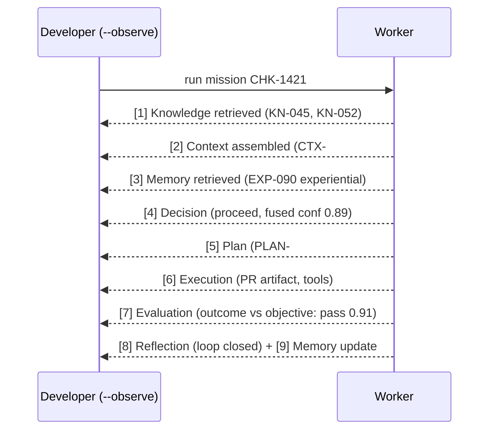

# Implementation Readiness — From Architecture to Engineering

> **Status:** Readiness assessment & engineering plan (Lead Maintainer). **Scope:** developer
> experience (Part 8), implementation readiness & backlog (Part 9), final readiness review
> (Part 11). **Prime directive:** the architecture is stabilizing — this document does not
> change it; it prepares to *build* it. Companion docs: `ENTERPRISE_WORKER_SPECIFICATION.md`,
> `ENTERPRISE_WORKER_SDK_CHARTER.md`, `ENTERPRISE_REFERENCE_RUNTIME_CHARTER.md`,
> `ENTERPRISESIM_V2_MIGRATION.md`, `COMMUNITY_AND_GOVERNANCE.md`, `TERMINOLOGY.md`.

---

## Part 8 — Developer experience (the golden path)

**North star:** a developer goes from `pip install` to *watching a Worker reason through a
Mission end-to-end* in **under 15 minutes**, and understands every step.

### The 5-minute quickstart (target)

```
pip install enterprise-worker-sdk          # the SDK
ewsdk new my-qa-worker --profile qa         # scaffold a Worker (a WorkerProfile)
cd my-qa-worker
ewsdk env pull enterprisesim/reference      # load the Reference Enterprise (MCG)
ewsdk run --mission CHK-1421 --observe       # execute a Mission in the Reference Runtime
ewsdk validate                               # check EWS-conformance
ewsdk bench --family guest-checkout          # score on a benchmark family
```

### Observing the full lifecycle

`--observe` MUST surface every cognition step as it happens, so the lifecycle is *legible*:



Each step is an OpenTelemetry span (so it also shows in any OTel viewer) and is recorded in a
`WorkerExecutionBundle` (the V1 corpus format), giving a durable, replayable trace.

### DX deliverables

| Surface | Content |
|---|---|
| **CLI (`ewsdk`)** | `new`, `env pull`, `run`, `observe`, `validate`, `test`, `bench`, `replay`, `trace` |
| **Quickstart** | the 5-minute path above, copy-pasteable, one page |
| **Tutorials** | (1) Trace the CHK-1421 mission; (2) Build a QA Worker; (3) Add a capability plugin; (4) Add a tool (MCP); (5) Make a Worker learn across a mission sequence |
| **Sample projects** | `hello-worker`, `qa-worker`, `support-worker`, `capability-plugin-example`, `tool-plugin-example` |
| **Reference Workers** | QA, Support, Security, Data-Quality — as `WorkerProfile`s (composition), shipped in the SDK |
| **Testing experience** | `ewsdk test` = contract tests vs EWS + capability unit tests + golden-trace replay (anchored on V1 `RUN-0001`/`RUN-0002`) |
| **Debugging experience** | `ewsdk trace <run>` renders the decision trace + dropped-context log + confidence at each step; deterministic replay to reproduce any run |

**DX principles:** legibility over magic; deterministic by default (seeded); every failure
points at the exact cognition step and the missing/dropped context; no step is a black box.

---

## Part 9 — Implementation readiness

### 9.1 What must exist before engineering starts

| Prerequisite | Status today | Action |
|---|---|---|
| **Architecture & contracts** | ✅ complete (V1 + reviews + EWS spec) | none — frozen/stable |
| **Object schemas** | ✅ V1 schemas exist; EWS additions specified | author EWS 1.0 schemas (Sprint 1) |
| **Repository layout** | ⚠️ monorepo; polyrepo planned | scaffold repos per `ENTERPRISESIM_V2_MIGRATION.md` §4.2 |
| **Package layout** | ✅ SDK interfaces exist (`sdk/`) | package as `enterprise-worker-sdk` (Sprint 2) |
| **Build system** | ⚠️ `pyproject.toml` present, minimal | per-project builds + publishable wheels |
| **Testing framework** | ✅ validator + generators (`tools/refgen/`) | promote to `ews-validate`; add pytest harness |
| **CI/CD** | ❌ none in-repo (pre-commit hooks only) | GitHub Actions: lint, typecheck, schema-conformance, tests, publish |
| **Coding standards** | ✅ `docs/standards/` (9 docs) | adopt per-repo |
| **Interfaces** | ✅ `sdk/` ABCs/Protocols | port to EWSDK; add `sdk.mission/objective/memory` |
| **Reference implementations** | ❌ none (V1 was interfaces-only) | Reference Runtime MVP (Sprint 3) |
| **Documentation** | ✅ extensive (`docs/`, `review/`, `ecosystem/`) | assemble developer portal |
| **Executable outcome model** | ❌ V1 outcomes asserted | build (Sprint 4) — the top *engineering* prerequisite for credible benchmarking |
| **Governance** | ✅ charter drafted | stand up foundation + WGs (`COMMUNITY_AND_GOVERNANCE.md`) |

**Verdict on prerequisites:** the *architecture* prerequisites are met; the outstanding items
are all **engineering scaffolding**, sequenced below. Nothing blocks starting.

### 9.2 Prioritized engineering backlog — five sprints, each ships working software

> Principle: every sprint ends with a runnable artifact a user can `pip install` or execute.

**Sprint 1 — The Contract & the Validator** (`ews` repo)
- Author EWS 1.0 JSON Schemas: keep V1 schemas byte-compatible; add `Event`, `Actor`,
  `Objective`, `Mission`, `Outcome`, generalize `experience_object → memory_record`.
- Promote `tools/refgen/validate.py` → **`ews-validate`** CLI (registry-based, all schemas).
- CI (lint + schema self-tests + example validation).
- **Ships:** published EWS 1.0 schemas + `ews-validate` that validates the V1 corpus/registry
  unchanged (proves backward compatibility).

**Sprint 2 — The SDK skeleton** (`enterprise-worker-sdk` repo)
- Port V1 `sdk/` interfaces; add `sdk.mission`, `sdk.objective`, `sdk.memory` (experience alias).
- `ewsdk` CLI: `new` (scaffold a WorkerProfile), `validate`, `test`.
- Testing framework: contract tests against EWS schemas.
- **Ships:** `pip install enterprise-worker-sdk`; `ewsdk new` produces a Worker whose objects
  validate against EWS.

**Sprint 3 — The Reference Runtime MVP** (`reference-runtime` repo)
- Naive implementations of each capability (retrieve/context/plan/decide/act/evaluate/reflect);
  in-memory event log; OTel spans per step; emits a `WorkerExecutionBundle`.
- **Ships:** `refrun run --mission CHK-1421 --observe` executes one mission end-to-end and
  produces a valid bundle + OTel trace, replayable to match a golden trace.

**Sprint 4 — EnterpriseSim environment + outcome-verified benchmark** (`enterprisesim` repo)
- Environment adapter (bind a Worker to a Mission; supply Knowledge/Memory/Events).
- **Executable outcome model** (deterministic state transitions + checks) so Outcomes are
  *verified*, not asserted.
- Benchmark harness for one family (guest-checkout) with reproducibility controls.
- **Ships:** `ewsdk bench --family guest-checkout` runs the Reference Runtime against
  EnterpriseSim and reports an outcome-verified score with CIs.

**Sprint 5 — Memory + learning demo** (across `reference-runtime` + `enterprisesim`)
- Naive Memory service (all 7 types over the event log); external, reversible learning hooks;
  one reference Worker (QA) over a mission *sequence*.
- **Ships:** a runnable demo showing measurable improvement (fewer repeated failures / higher
  score) when memory is on vs off across a sequence — the first *honest* evidence of the core
  thesis, with an ablation (`--no-memory`).

### 9.3 Backlog priority rationale
Contract first (everyone depends on it) → buildability (SDK) → executability (Runtime) →
measurability (outcome-verified benchmark) → the thesis (memory-driven learning). Each layer is
useless without the one before it; this ordering minimizes rework and yields a demo per sprint.

---

## Part 11 — Final readiness review

> Instruction: do not redesign. Answer readiness.

### Is EnterpriseSim ready to transition from architecture to implementation? **Yes.**

The architecture is complete and stable. The V1 foundation (canon, ECL, SDK interfaces,
schemas, RFCs/ADRs, benchmarks, reference enterprise, corpus, evolution, connector design) is
internally consistent and validated; the reviews identified the gaps; the ecosystem strategy
and this consolidation (terminology, EWS spec, charters, migration, governance) resolve them
*on paper* with an evolutionary, backward-compatible plan. **The remaining work is engineering,
not architecture.**

**There are no architectural blockers.** The three items that were substantive gaps are now
either specified or scheduled as engineering tasks, not open design questions:
1. **Objective/Outcome first-class** — *specified* in EWS §4.2; schemas authored in Sprint 1.
2. **Outcome verification (not assertion)** — *scheduled* as the executable outcome model,
   Sprint 4; it is an implementation task with a clear design.
3. **Repo/build/CI scaffolding** — *scheduled*, Sprints 1–2.

### I therefore declare the architecture phase COMPLETE.

The contracts are frozen or specified; terminology is canonical; every V1 artifact has a
destination; the API stability tiers are set. Engineering may begin.

### Recommendations

- **First engineering milestone (M1): "Build & Validate a Worker."** Complete Sprints 1–2 —
  EWS 1.0 schemas + `ews-validate` + the SDK skeleton where `ewsdk new` scaffolds a Worker whose
  objects validate against EWS and whose contract tests pass. This proves the contract is real
  and buildable, and rewards V1 adopters (their schemas still validate).
- **First public repository to build: `ews` (Enterprise Worker Specification + schemas +
  `ews-validate`).** It is the lowest-churn, highest-leverage, most-depended-upon artifact — the
  contract everything else builds against. Build the ruler before the players.
- **First public release: `ews 0.9` (schemas + validator), then `enterprise-worker-sdk 0.x`.**
  Ship the contract as a 0.9 preview (backward-compatible with V1 schemas), gather conformance
  feedback, then cut EWS 1.0 at ecosystem V2 alongside SDK/Runtime GA.

### One-line disposition
*Architecture: complete and stable. Green light for engineering. Build the contract first
(`ews`), prove a Worker validates against it (M1), then the runtime, then outcome-verified
benchmarking, then the memory-learning demo — a shippable artifact every sprint.*
