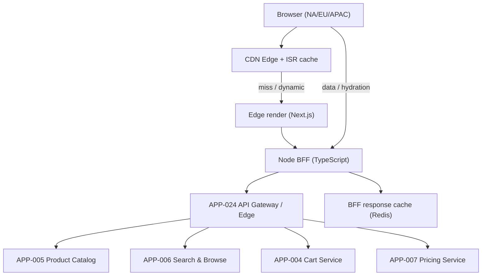
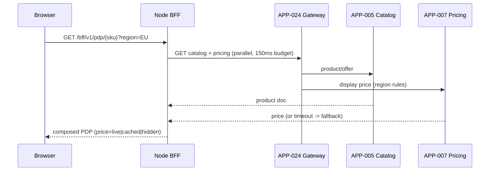

# AD-0001 — Storefront Rendering & BFF

| Field | Value |
|---|---|
| Doc id | AD-0001 |
| Title | Storefront Rendering & BFF |
| Owner team | TEAM-001 |
| Apps | APP-001 |
| Status | Accepted |
| Related | KN-200, APP-005, APP-006, APP-004, APP-007, APP-024, INC-2026-016, ADR-0026 |

## Purpose

This document describes the rendering and backend-for-frontend (BFF) architecture of the
Meridian Commerce Group Storefront Web application (APP-001), the Tier 0 customer-facing
surface for browse, product-detail, and pre-checkout experiences. It covers how server-side
rendering (SSR), edge rendering, and incremental static regeneration (ISR) combine to meet
strict latency and SEO requirements while a Node BFF fans out to downstream commerce services.

The storefront is the highest-traffic ingress into MCG's commerce estate. Its rendering
strategy and BFF aggregation directly determine perceived page speed, conversion, and the
blast radius of downstream degradation. This document exists to make the rendering tiers,
caching invariants, and BFF fan-out contract explicit and to record the decisions taken after
INC-2026-016 (storefront latency under load).

## Context

APP-001 is owned by TEAM-001 and built on Next.js/React with a Node BFF in TypeScript. It is
the primary web entry point and sits upstream of most catalog and merchandising services. All
downstream traffic is mediated by the API Gateway / Edge (APP-024), which handles OIDC token
validation, rate limiting, and regional routing.

The BFF aggregates read data from:
- APP-005 Product Catalog — canonical product/offer data for PDP and listing pages.
- APP-006 Search & Browse — search results, faceting, and category browse.
- APP-004 Cart Service — cart badge, mini-cart, and pre-checkout state.
- APP-007 Pricing Service — display prices, strike-through, and per-region price rules.

The storefront renders per-region (NA, EU, APAC; LATAM served from NA edge with locale
overrides) to honor currency, tax display, catalog availability, and price rules that differ
by region. Primary cloud is AWS; rendering runs on Kubernetes in each region plus a CDN edge
tier. Because APP-001 is Tier 0, it must degrade gracefully rather than fail when any single
downstream is impaired — a principle reinforced by INC-2026-016.

## Architecture

The storefront uses a three-tier rendering model. Static and semi-static pages (home,
category landing, evergreen PDP shells) are served via ISR from the CDN edge. Personalized or
volatile fragments (price, cart badge, availability) are hydrated client-side or resolved by
the BFF at request time. The Node BFF is the single aggregation point; browsers never call
downstream services directly.



The BFF composes a page by issuing parallel calls through APP-024, applying per-call timeouts
and a hedged deadline for the overall request. Catalog and search responses are cacheable at
the edge; price and cart are treated as volatile. The BFF collapses duplicate in-flight
requests (request coalescing) and short-caches catalog/search fragments in a Redis response
cache keyed by region and locale.



## Key decisions

1. **Node BFF as the single aggregation seam (API-first).** Browsers call only the BFF, which
   calls only APP-024. This keeps the downstream contract narrow, centralizes auth/rate-limit,
   and lets us evolve service topology without breaking clients.
2. **Three-tier rendering — ISR + edge SSR + client hydration (cloud-native).** Static shells
   from ISR maximize cache hit ratio and SEO; volatile data is resolved late. Trade-off: cache
   invalidation complexity, mitigated by tag-based purges on catalog change events.
3. **Price is always late-bound and never baked into ISR pages (correctness > cache).** Prices
   from APP-007 are fetched per-request or hydrated client-side to avoid serving stale prices.
   Trade-off: an extra hot-path call, budgeted at 150 ms with a cached fallback.
4. **Per-region rendering fleets (region/tier).** NA, EU, APAC each run their own render tier
   and BFF, honoring data residency, currency, and catalog scoping. LATAM is served from NA
   with locale overrides pending its own fleet.
5. **Bounded, parallel fan-out with per-call budgets (observability/SLOs).** Every downstream
   call has an independent timeout and circuit breaker; the page renders with whatever returns
   inside the deadline — directly informed by INC-2026-016.
6. **Degraded rendering modes (resilience).** If pricing is down, the BFF renders the PDP with
   price hidden and a "price at checkout" affordance rather than blocking the page.
7. **Request coalescing + short-TTL Redis response cache (efficiency).** Under load spikes,
   duplicate catalog/search reads are collapsed to protect downstreams from thundering herds.
8. **Open standards for edge auth (open standards / ADR-0026).** OIDC/OAuth2 tokens minted
   upstream are validated by APP-024; the BFF forwards a scoped service token, never raw creds.

## Data & APIs

BFF surface (read-only, composition-oriented):

| Method | Path | Purpose |
|---|---|---|
| GET | `/bff/v1/home?region={r}` | ISR-backed home composition |
| GET | `/bff/v1/browse/{category}?region={r}` | Search/browse listing (APP-006) |
| GET | `/bff/v1/pdp/{sku}?region={r}` | PDP: catalog + late-bound price |
| GET | `/bff/v1/cart/summary` | Mini-cart badge (APP-004) |

Downstream calls (via APP-024):
- `GET /v1/catalog/products/{sku}` (APP-005)
- `POST /v1/search/query` (APP-006)
- `GET /v1/pricing/display?sku=&region=` (APP-007)
- `GET /v1/cart/{cartId}` (APP-004)

Consumed events (for edge cache invalidation): `commerce.catalog.product-changed.v1` and
`commerce.pricing.price-changed.v1` on Kafka drive tag-based ISR/edge purges. The BFF does not
own a system of record; its stores are ephemeral (Redis response cache, keyspace
`bff:{region}:pdp:{sku}` with 30–60 s TTL). Error envelope returned to clients:

```json
{ "error": { "code": "UPSTREAM_TIMEOUT", "field": "pricing", "degraded": true } }
```

## Failure modes & resilience

- **Pricing (APP-007) slow/unavailable:** blast radius = PDP price only. Fallback: hide price,
  render "shown at checkout"; circuit breaker opens after sustained 5xx/timeout. Root scenario
  behind INC-2026-016 where a synchronous pricing dependency amplified tail latency.
- **Catalog (APP-005) unavailable:** serve last-good ISR shell from edge; disable add-to-cart
  for uncacheable SKUs. Blast radius contained to cold SKUs.
- **Search (APP-006) unavailable:** browse falls back to catalog category listings; search box
  shows a soft error and recent/popular suggestions.
- **Cart (APP-004) unavailable:** mini-cart badge renders as empty/neutral; add-to-cart queued
  client-side with retry; no hard page failure.
- **Load surge / thundering herd:** request coalescing + short-TTL cache + load-shedding at
  APP-024 (429 with Retry-After). Per-call budget 150 ms, overall page deadline ~800 ms p95.
- **Edge/CDN partial outage:** regional failover to SSR origin; ISR pages continue from origin
  cache.

## Observability

Golden-signal SLOs (Tier 0):
- **Latency:** BFF page composition p50 ≤ 120 ms, p95 ≤ 400 ms, p99 ≤ 800 ms (region-local).
- **Availability/error rate:** BFF 5xx < 0.1% monthly; degraded-render events tracked separately.
- **Saturation:** render pod CPU < 70% sustained; Redis response-cache hit ratio ≥ 85%.

Key signals: per-downstream call latency and breaker state, ISR/edge cache hit ratio, degraded
render counter (price-hidden rate), coalesced-request ratio. Distributed traces span
Browser → BFF → APP-024 → downstreams with the region and cache-tier tag. Alerts: breaker open
> 2 min, degraded-render rate > 1%, p99 SLO burn. Dashboards owned jointly with TEAM-032
(Observability/SRE); the INC-2026-016 postmortem added the "price-fallback rate" panel.

## Cross-references

- Sibling ADs: KN-200 (this AD's knowledge node), AD-0003 Checkout Orchestration, AD-0004 Cart
  State & Redis Resilience, AD-0005 Product Catalog & Indexing, AD-0006 Search Hybrid Ranking.
- Apps: APP-001 (this), APP-024, APP-005, APP-006, APP-004, APP-007.
- Teams: TEAM-001 (owner), TEAM-030 (API Gateway), TEAM-032 (SRE).
- Incidents: INC-2026-016 (storefront latency under load).
- ADRs: ADR-0026 (open standards).
