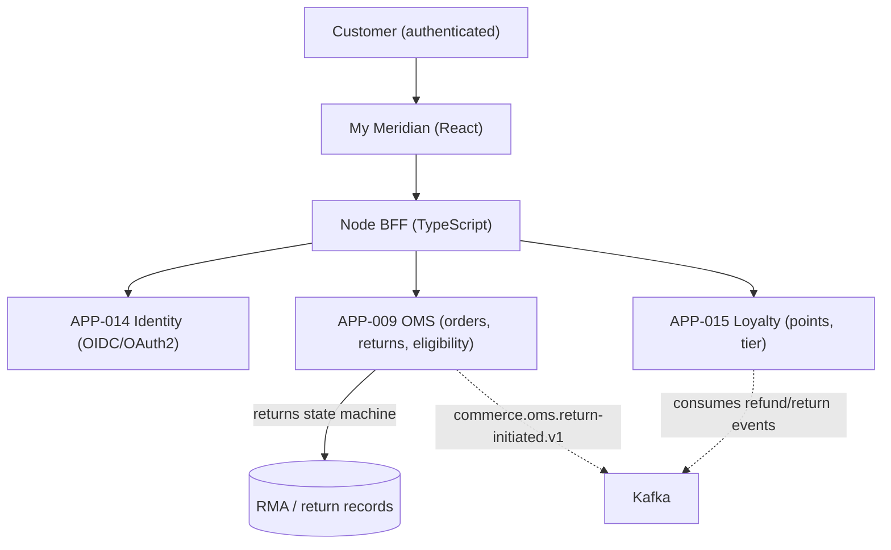
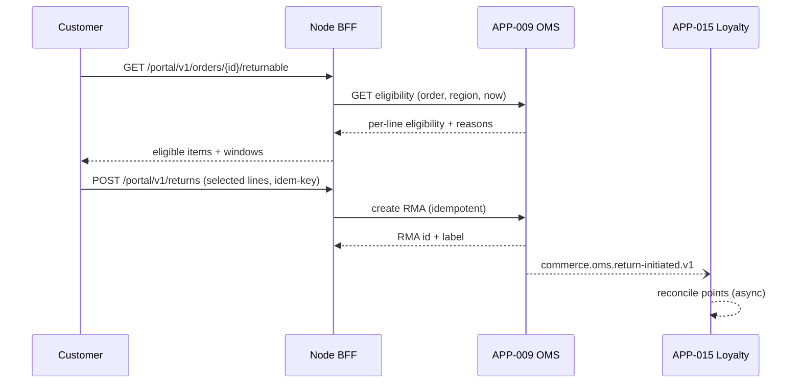

# AD-0002 — Customer Portal & Self-Service Returns (My Meridian)

| Field | Value |
|---|---|
| Doc id | AD-0002 |
| Title | Customer Portal & Self-Service Returns (My Meridian) |
| Owner team | TEAM-001 |
| Apps | APP-021 |
| Status | Accepted |
| Related | KN-201, APP-009, APP-014, APP-015, INC-2026-015, ADR-0043 |

## Purpose

This document describes the architecture of My Meridian (APP-021), the authenticated customer
self-service portal for Meridian Commerce Group. It covers account, order history, and the
self-service returns workflow, including how the Node BFF composes data from Order Management
(APP-009), Identity (APP-014), and Loyalty (APP-015), and where returns-eligibility logic
lives.

The portal is the primary post-purchase touchpoint. Returns eligibility is the most sensitive
piece of logic in the portal: an incorrect decision either blocks a legitimate return
(customer harm) or authorizes an ineligible one (financial leakage). This document records the
eligibility architecture adopted after INC-2026-015 (self-service returns showed wrong
eligibility) and shipped in REL-2026-008.

## Context

APP-021 is owned by TEAM-001 and built on React with a Node BFF, Tier 1. Unlike the storefront
(APP-001), every route is authenticated; the portal sits downstream of Identity (APP-014) via
OIDC/OAuth2 and reads from OMS and Loyalty.

Dependencies (canon):
- APP-009 Order Management (OMS) — orders, fulfillment status, and the returns/RMA workflow
  and its state machine (OMS is the system of record for returns).
- APP-014 Identity — OIDC/OAuth2 authentication, session, and customer identity resolution.
- APP-015 Loyalty — points balance, tier, and loyalty adjustments tied to refunds.

The portal never bypasses these owners: eligibility is *computed by OMS*, not by the BFF. The
BFF composes and presents; it must not become a shadow rules engine. This separation is the
central lesson of INC-2026-015, where duplicated/aged eligibility logic in the presentation
tier diverged from OMS policy. Regions: NA, EU, APAC honor different return windows and
consumer-protection rules; the BFF passes region context and OMS applies the correct policy.

## Architecture

The portal renders authenticated React views hydrated by the Node BFF. The BFF exchanges the
OIDC session for a scoped service token and fans out to OMS, Identity, and Loyalty. Returns
eligibility is always a live call into OMS; the BFF caches nothing eligibility-related.



The returns flow is a guided wizard: select order → select items → OMS evaluates eligibility
→ customer confirms → OMS creates an RMA and emits an event; Loyalty reconciles points
asynchronously off the event stream.



## Key decisions

1. **Eligibility is computed only by OMS (DDD / bounded context).** Returns policy lives in the
   OMS returns bounded context. The BFF and React tier never re-implement it. Trade-off: one
   extra live call per return view; accepted to prevent the divergence behind INC-2026-015.
2. **No caching of eligibility decisions (correctness).** Windows, promotions, and item states
   change; the BFF always fetches live eligibility. Order metadata (non-eligibility) may be
   short-cached.
3. **BFF as thin composition/auth seam (API-first).** The BFF translates OIDC sessions to
   scoped tokens and composes OMS/Identity/Loyalty; it holds no business rules.
4. **Region-aware policy passed to OMS (region/tier).** The BFF forwards region and locale;
   OMS applies NA/EU/APAC return windows and consumer-protection rules centrally.
5. **Idempotent return creation (resilience / ADR-0045 pattern).** RMA creation uses a
   client-supplied idempotency key so a retried submit never creates duplicate returns.
6. **Loyalty reconciliation is event-driven, not synchronous (event-driven Kafka).** Points
   adjustments happen off `commerce.oms.return-initiated.v1` / refund events; the return
   confirmation does not block on Loyalty. Trade-off: eventual consistency on points, surfaced
   in UI as "points update shortly."
7. **Security-by-design authZ on every order.** The BFF verifies the authenticated customer
   owns the order before any OMS call; ownership is re-checked server-side, never trusted from
   the client.
8. **Sensitivity travels with data (ADR-0043).** PII and order data carry sensitivity tags end
   to end; the BFF minimizes fields returned to the browser to what the view needs.

## Data & APIs

Portal BFF surface (authenticated):

| Method | Path | Purpose |
|---|---|---|
| GET | `/portal/v1/orders` | Order history (OMS) |
| GET | `/portal/v1/orders/{id}` | Order detail |
| GET | `/portal/v1/orders/{id}/returnable` | Live eligibility (OMS) |
| POST | `/portal/v1/returns` | Create RMA (idempotent) |
| GET | `/portal/v1/account` | Identity + loyalty summary |

Downstream: `GET /v1/oms/orders/{id}/eligibility`, `POST /v1/oms/returns` (APP-009);
`GET /v1/identity/me` (APP-014); `GET /v1/loyalty/balance` (APP-015).

Events: OMS emits `commerce.oms.return-initiated.v1` and `commerce.oms.return-completed.v1`
(CloudEvents on Kafka); APP-015 consumes them to reconcile points. Idempotency: header
`Idempotency-Key` on `POST /portal/v1/returns`, forwarded to OMS. Error envelope:

```json
{ "error": { "code": "RETURN_INELIGIBLE", "field": "orderLineId", "reason": "WINDOW_EXPIRED" } }
```

Data stores: portal owns no SoR. OMS owns RMA records; Identity owns customer records; Loyalty
owns points ledger.

## Failure modes & resilience

- **OMS eligibility slow/unavailable:** returns wizard shows a soft "temporarily unavailable"
  state rather than guessing eligibility — the explicit anti-pattern from INC-2026-015. Never
  fall back to a stale or client-side eligibility computation. Order history still renders.
- **Duplicate return submit:** idempotency key dedupes at OMS; retries are safe.
- **Identity (APP-014) unavailable:** session cannot be established/refreshed → portal shows a
  re-authenticate prompt; no unauthenticated data served.
- **Loyalty (APP-015) unavailable:** return still completes (event queued); points reconcile on
  recovery via event replay. Blast radius limited to points display.
- **Kafka lag on return events:** points appear delayed; UI messaging sets expectation; no data
  loss because OMS is SoR and events are replayable.
- **Timeouts/retries:** OMS eligibility call budgeted at 300 ms with one retry; RMA creation
  has a longer 2 s budget and circuit breaker.

## Observability

Golden-signal SLOs (Tier 1):
- **Latency:** eligibility call p95 ≤ 400 ms, p99 ≤ 900 ms; portal page p95 ≤ 700 ms.
- **Error rate:** BFF 5xx < 0.2% monthly.
- **Correctness KPI:** eligibility-dispute rate (customer-reported wrong eligibility) tracked
  as a first-class SLI after INC-2026-015; target near-zero.
- **Saturation:** BFF pod CPU < 70%; OMS eligibility call concurrency within budget.

Key signals: eligibility decision counts by reason code, return-create success/idempotent-hit
rate, loyalty reconciliation lag (event age), auth failure rate. Traces span
Portal → BFF → OMS/Identity/Loyalty with customer and region tags (PII-scrubbed). Alerts:
eligibility error rate spike, reconciliation lag > 5 min, dispute-rate anomaly. Dashboards
co-owned with TEAM-006 (OMS) and TEAM-032 (SRE).

## Cross-references

- Sibling ADs: KN-201, AD-0001 Storefront & BFF, AD-0003 Checkout Orchestration.
- Apps: APP-021 (this), APP-009, APP-014, APP-015.
- Teams: TEAM-001 (owner), TEAM-006 (OMS), TEAM-014 (Identity), TEAM-011 (Loyalty).
- Incidents: INC-2026-015 (self-service returns wrong eligibility).
- Releases: REL-2026-008. ADRs: ADR-0043 (sensitivity travels with data), ADR-0045 pattern
  (idempotent execution & rollback).
