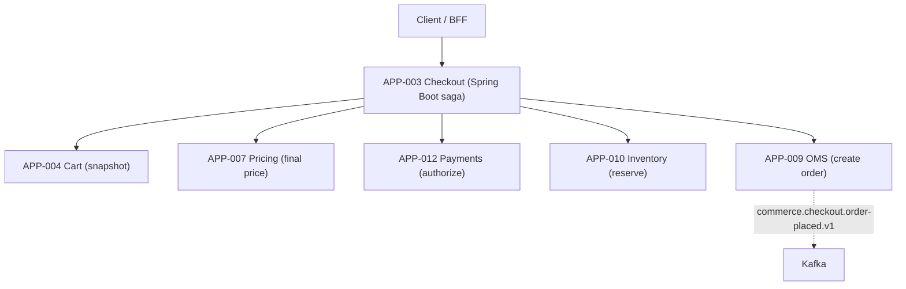
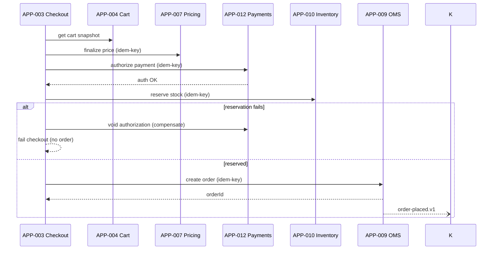

# AD-0003 — Checkout Orchestration

| Field | Value |
|---|---|
| Doc id | AD-0003 |
| Title | Checkout Orchestration |
| Owner team | TEAM-004 |
| Apps | APP-003 |
| Status | Accepted |
| Related | KN-202, APP-004, APP-007, APP-012, APP-010, APP-009, INC-2026-002, INC-2026-019, CHK-1421, ADR-0045 |

## Purpose

This document describes the Checkout Service (APP-003), the Tier 0 orchestrator that turns a
cart into a placed order at Meridian Commerce Group. It coordinates cart snapshot, pricing
finalization, payment authorization, inventory reservation, and order creation across five
downstream services, and enforces the invariants that make checkout financially and
inventory-correct.

Checkout is the commercial center of gravity: it is where money and stock commitments happen.
The orchestration model must be resilient to partial failure, idempotent under retries, and
strict about ordering — notably that payment is authorized *before* inventory is committed.
This document records the saga design, the guest-checkout support delivered under CHK-1421 and
shipped in REL-2026-001, and the mitigations for INC-2026-002 and INC-2026-019.

## Context

APP-003 is owned by TEAM-004 and built on Java / Spring Boot. It depends on (canon):
- APP-004 Cart Service — the cart snapshot and line items being purchased.
- APP-007 Pricing Service — authoritative final pricing (not display price) at order time.
- APP-012 Payments Service — payment authorization and capture via external PSPs.
- APP-010 Inventory Service — ATP check and stock reservation.
- APP-009 Order Management (OMS) — durable order creation and downstream fulfillment.

Checkout depends on these services; none depend on checkout (dependency direction is canon).
Guest checkout (CHK-1421) allows purchase without a pre-existing account; INC-2026-002 showed
that naive guest handling orphaned loyalty accounts, so identity/loyalty linkage is handled
carefully out-of-band. INC-2026-019 was a p99 regression caused by a synchronous promotions
call on the hot path; the design now keeps promo evaluation off the critical section.

## Architecture

Checkout is a **saga orchestrator**. It executes a strict sequence with compensating actions,
using idempotency keys so retries and redeliveries are safe. Reads (cart, price) come first;
then the money-and-stock commit section runs in a fixed order.



The invariant: **payment authorization precedes inventory commit**. If inventory reservation
fails after a successful auth, checkout compensates by voiding/reversing the auth; if payment
auth fails, no stock is touched.



## Key decisions

1. **Orchestration saga, not choreography (DDD / resilience).** A single orchestrator owns the
   checkout transaction boundary and compensations, making the payment-before-inventory
   invariant explicit and auditable. Trade-off: orchestrator is a critical component; mitigated
   by statelessness + durable saga log.
2. **Payment-auth-before-inventory-commit invariant (correctness).** We never reserve stock we
   cannot charge for, and never leave a charge without stock — compensation voids auth if
   reservation fails.
3. **Idempotency keys on every mutating downstream call (ADR-0045).** Pricing finalize, payment
   authorize, inventory reserve, and OMS create all carry a per-attempt idempotency key so
   retries and Kafka redeliveries are exactly-once in effect.
4. **Promotions evaluated off the hot path (INC-2026-019).** After the p99 regression from a
   synchronous promo call, promo application is resolved earlier (cart/pricing) or asynchronously;
   checkout does not make a blocking promotions call in the critical section.
5. **Guest checkout without account coupling (CHK-1421, INC-2026-002).** Guest orders proceed
   with a transient guest identity; loyalty/account linkage is done asynchronously and
   idempotently so a guest purchase never orphans or duplicates a loyalty account.
6. **Final price is re-fetched from APP-007 at order time (correctness).** Display price is
   advisory; checkout binds the authoritative price to prevent price drift between browse and
   purchase.
7. **OMS is the durable system of record (event-driven Kafka).** Order creation is the
   commit point; `commerce.checkout.order-placed.v1` fans out fulfillment asynchronously.
8. **Bounded timeouts + circuit breakers per downstream (observability/SLOs).** Each leg has an
   independent budget; a slow PSP trips the breaker rather than dragging checkout p99.

## Data & APIs

Checkout surface:

| Method | Path | Purpose |
|---|---|---|
| POST | `/v1/checkout/sessions` | Start checkout from a cart |
| POST | `/v1/checkout/sessions/{id}/place` | Place order (idempotent) |
| GET | `/v1/checkout/sessions/{id}` | Session/saga status |

Downstream calls: `GET /v1/cart/{cartId}` (APP-004); `POST /v1/pricing/finalize` (APP-007);
`POST /v1/payments/authorize` and `POST /v1/payments/{id}/void` (APP-012);
`POST /v1/inventory/reservations` (APP-010); `POST /v1/oms/orders` (APP-009).

Events: emits `commerce.checkout.order-placed.v1`; consumes payment/inventory result events
where async. Idempotency: `Idempotency-Key` header on `/place`, propagated to each downstream
mutation. Saga state persisted (PostgreSQL) for recovery. Error envelope:

```json
{ "error": { "code": "INVENTORY_UNAVAILABLE", "sagaStep": "reserve", "compensated": true } }
```

## Failure modes & resilience

- **Payment auth fails:** checkout aborts before touching inventory; no order; client sees a
  retriable payment error. Zero stock/financial side effect.
- **Inventory reserve fails after auth OK:** compensate by voiding the authorization; fail the
  checkout. This is the core saga compensation guarding the invariant.
- **OMS create fails after reserve+auth:** retry idempotently; if durably failing, compensate
  (release reservation, void auth) and fail — no partial order.
- **Slow PSP (cf. INC-2026-009 world):** payment leg circuit-breaker + timeout; checkout fails
  fast rather than regressing p99.
- **Synchronous promo call regression (INC-2026-019):** removed from hot path; promo failures
  degrade to no-promo, never block placement.
- **Guest checkout loyalty orphaning (INC-2026-002):** loyalty linkage is async + idempotent;
  a failure leaves a clean guest order, reconciled later, never an orphaned account.
- **Duplicate place / retry:** idempotency keys ensure one order per session attempt.

## Observability

Golden-signal SLOs (Tier 0):
- **Latency:** `/place` p50 ≤ 300 ms, p95 ≤ 900 ms, p99 ≤ 1.8 s (excludes PSP outliers, tracked
  separately). p99 is watched closely post-INC-2026-019.
- **Error rate:** checkout failure rate < 0.3%; compensation (void) rate tracked as an SLI.
- **Saturation:** saga worker concurrency and DB connection pool < 70%.

Key signals: per-step latency and breaker state (cart/pricing/payments/inventory/OMS),
compensation counts (auth voids), idempotent-replay rate, guest-vs-account checkout mix,
promo-degraded rate. Distributed traces span the full saga with a saga id and order id.
Alerts: void rate spike, p99 SLO burn, OMS create failure, PSP breaker open. Dashboards
co-owned with TEAM-009 (Payments), TEAM-012 (Inventory), TEAM-006 (OMS), TEAM-032 (SRE).

## Cross-references

- Sibling ADs: KN-202, AD-0004 Cart State & Redis Resilience, AD-0001 Storefront & BFF,
  AD-0002 Customer Portal & Returns.
- Apps: APP-003 (this), APP-004, APP-007, APP-012, APP-010, APP-009.
- Teams: TEAM-004 (owner), TEAM-009 (Payments), TEAM-012 (Inventory), TEAM-007 (Pricing),
  TEAM-006 (OMS).
- Incidents: INC-2026-002 (guest checkout orphaned loyalty), INC-2026-019 (p99 regression from
  sync promo call). Jira: CHK-1421 (guest checkout). Releases: REL-2026-001.
- ADRs: ADR-0045 (idempotent execution & rollback plans).
