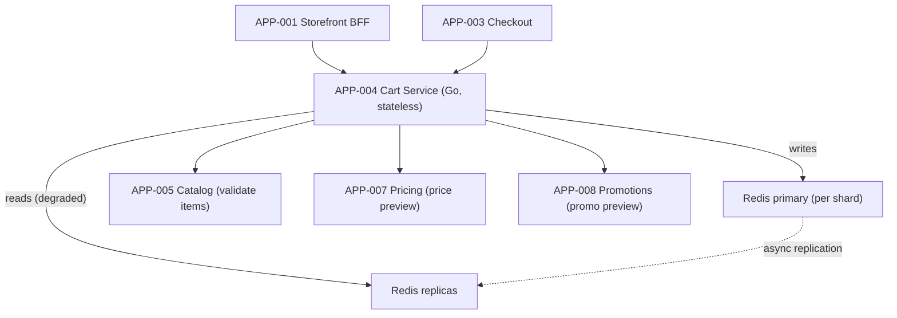
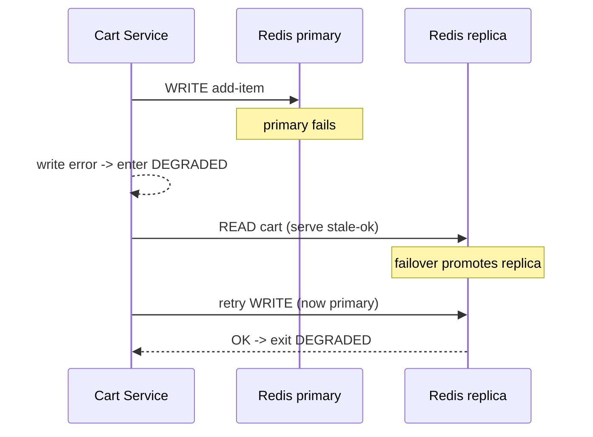

# AD-0004 — Cart State & Redis Resilience

| Field | Value |
|---|---|
| Doc id | AD-0004 |
| Title | Cart State & Redis Resilience |
| Owner team | TEAM-004 |
| Apps | APP-004 |
| Status | Accepted |
| Related | KN-203, APP-005, APP-007, APP-008, APP-003, INC-2026-001, ADR-0045 |

## Purpose

This document describes the Cart Service (APP-004), the Tier 0 service that holds shopping-cart
state for Meridian Commerce Group. It covers the Go service design, the Redis cluster that
backs cart state, how price and promotion previews are composed from Pricing (APP-007) and
Promotions (APP-008), and — centrally — how the service survives Redis primary failover.

The cart is a high-write, low-latency, ephemeral-but-important store: losing a cart mid-session
is a direct conversion loss. This document records the Redis resilience model (primary failover,
replica reads, degraded mode) adopted after INC-2026-001 (cart Redis primary failover) and the
work shipped in REL-2026-001.

## Context

APP-004 is owned by TEAM-004 and built in Go with Redis as its primary datastore. Its canon
dependencies are APP-005 Product Catalog (item validation/enrichment), APP-007 Pricing
Service (price preview), and APP-008 Promotions Engine (promo preview). It is a dependency of
the Checkout Service (APP-003) and the Storefront BFF (APP-001) — cart depends on catalog,
pricing, and promotions, never the reverse.

Cart state is intentionally treated as **soft state**: authoritative enough to drive the
session but reconstructable and never the financial system of record (checkout re-binds
authoritative price and OMS owns orders). This framing is what makes aggressive Redis-centric
design acceptable. INC-2026-001 was a Redis primary failover during which the service briefly
lost write availability; the current architecture defines explicit replica-read and degraded
modes so a failover is survivable. Regions NA/EU/APAC each run an independent cart cluster.

## Architecture

The Go service is stateless; all cart state lives in a Redis cluster (primary + replicas per
shard, with Sentinel/managed failover). Reads can be served from replicas; writes go to the
primary. Price and promo previews are best-effort overlays fetched from APP-007 and APP-008 and
are never persisted as authoritative.



On primary failure, managed failover promotes a replica. During the promotion window the
service enters degraded mode: it serves reads from replicas (possibly slightly stale) and
buffers/queues writes with retry, rather than hard-failing add-to-cart.



## Key decisions

1. **Cart is soft state, not a system of record (DDD / resilience).** Authoritative price and
   order state live in Pricing/Checkout/OMS. This lets cart optimize for latency and
   availability over strict durability. Trade-off: rare cart-item loss on catastrophic Redis
   loss, accepted and mitigated by replication.
2. **Stateless Go service + Redis cluster (cloud-native).** Horizontal scaling is trivial;
   state is externalized to a sharded Redis cluster per region.
3. **Explicit degraded mode on primary failover (INC-2026-001).** Instead of returning 5xx
   during failover, the service reads from replicas and retries writes, keeping add-to-cart
   working. Trade-off: brief eventual-consistency window on writes.
4. **Replica reads for read scaling (efficiency).** Non-critical reads (cart display) can hit
   replicas; checkout-critical reads prefer primary for freshness.
5. **Price/promo previews are best-effort overlays (correctness boundary).** APP-007 and
   APP-008 responses are advisory previews; if unavailable, cart renders without preview rather
   than failing. Authoritative pricing is re-bound at checkout (AD-0003).
6. **Idempotent cart mutations (ADR-0045 pattern).** Add/update/remove operations are keyed so
   client retries during a failover do not double-apply.
7. **TTL + write buffering (resilience).** Carts carry a TTL; during degraded windows, writes
   are buffered with bounded retry and re-applied on primary recovery.
8. **Per-region clusters (region/tier).** NA/EU/APAC each have isolated Redis clusters so a
   regional Redis incident cannot cross-contaminate other regions.

## Data & APIs

Cart surface:

| Method | Path | Purpose |
|---|---|---|
| GET | `/v1/cart/{cartId}` | Fetch cart (replica-ok) |
| POST | `/v1/cart/{cartId}/items` | Add item (idempotent) |
| PATCH | `/v1/cart/{cartId}/items/{sku}` | Update qty |
| DELETE | `/v1/cart/{cartId}/items/{sku}` | Remove item |
| GET | `/v1/cart/{cartId}/preview` | Price+promo preview overlay |

Downstream: `GET /v1/catalog/products/{sku}` (APP-005); `GET /v1/pricing/display` (APP-007);
`POST /v1/promotions/preview` (APP-008).

Redis keyspace: `cart:{region}:{cartId}` (hash of line items), with `cart:{region}:{cartId}:meta`
for timestamps/version; TTL ~30 days for logged-in, shorter for guest. Idempotency: header
`Idempotency-Key` per mutation. Consumes `commerce.catalog.product-changed.v1` to prune invalid
SKUs. Error envelope:

```json
{ "error": { "code": "CART_DEGRADED", "retryable": true, "mode": "replica-read" } }
```

## Failure modes & resilience

- **Redis primary failover (INC-2026-001):** enter degraded mode — replica reads + buffered
  write retries during the promotion window; exit when the new primary accepts writes. No hard
  outage of add-to-cart.
- **Redis cluster fully unavailable in a region:** cart operations fail fast with a retryable
  error; BFF renders neutral/empty cart; regional isolation prevents spread.
- **Pricing (APP-007) preview down:** preview overlay omitted; cart still functions; checkout
  re-binds price authoritatively.
- **Promotions (APP-008) preview down:** promo lines hidden in preview; no blocking.
- **Catalog (APP-005) down:** item validation skipped/deferred; invalid SKUs pruned later on
  event replay.
- **Split-brain / stale replica read:** version stamp on cart meta lets the service detect and
  reconcile; checkout always prefers primary read.
- **Timeouts/retries:** downstream previews budgeted ~120 ms with circuit breakers; Redis ops
  budgeted low-ms with bounded retry.

## Observability

Golden-signal SLOs (Tier 0):
- **Latency:** cart read p95 ≤ 40 ms, p99 ≤ 120 ms; write p95 ≤ 60 ms.
- **Availability:** cart write availability ≥ 99.95% monthly; degraded-mode time tracked as an
  SLI after INC-2026-001.
- **Saturation:** Redis primary CPU/memory < 70%; replication lag < 1 s.

Key signals: degraded-mode duration and entry count, Redis failover events, replication lag,
buffered-write depth and drain time, preview-fetch success rate. Traces span
BFF/Checkout → Cart → Redis and preview calls. Alerts: failover detected, degraded-mode > 60 s,
replication lag > 2 s, buffered-write backlog growing. Dashboards co-owned with TEAM-032 (SRE)
and TEAM-030 (Core Platform, Redis infra).

## Cross-references

- Sibling ADs: KN-203, AD-0003 Checkout Orchestration, AD-0001 Storefront & BFF.
- Apps: APP-004 (this), APP-005, APP-007, APP-008, APP-003, APP-001.
- Teams: TEAM-004 (owner), TEAM-007 (Pricing), TEAM-008 (Promotions), TEAM-030 (Core Platform),
  TEAM-032 (SRE).
- Incidents: INC-2026-001 (cart Redis primary failover). Releases: REL-2026-001.
- ADRs: ADR-0045 (idempotent execution & rollback plans).
