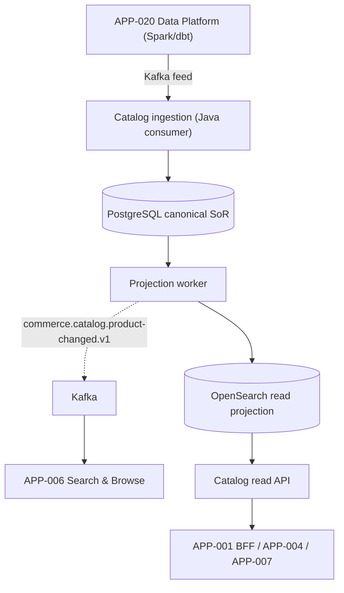
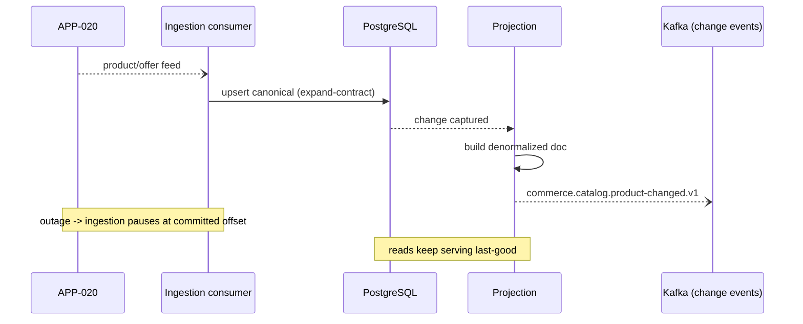

# AD-0005 — Product Catalog & Indexing

| Field | Value |
|---|---|
| Doc id | AD-0005 |
| Title | Product Catalog & Indexing |
| Owner team | TEAM-005 |
| Apps | APP-005 |
| Status | Accepted |
| Related | KN-204, APP-020, APP-006, APP-001, INC-2026-021, INC-2026-003, ADR-0033 |

## Purpose

This document describes the Product Catalog service (APP-005), the Tier 0 system of record for
Meridian Commerce Group's canonical product and offer data. It covers the PostgreSQL canonical
store, the OpenSearch projection used for read/query, Kafka ingestion from the Data Platform
(APP-020), and the catalog change events consumed downstream by Search (APP-006).

Catalog is the authoritative source for what MCG sells. Nearly every commerce surface reads
from it, so its correctness, freshness, and ingestion resilience are foundational. This
document records the ingestion and projection architecture hardened after INC-2026-021 (catalog
ingestion stalled on a data-platform outage) and the change-event contract relevant to
INC-2026-003 (search reindex lag → stale prices); the work shipped in REL-2026-002.

## Context

APP-005 is owned by TEAM-005 and built in Java with PostgreSQL as the canonical store and
OpenSearch as a query projection. Its canon dependency is APP-020 Data Platform
(Databricks/Spark, Snowflake, dbt) plus Kafka for ingestion. Its downstream consumers include
APP-006 Search & Browse, APP-001 Storefront (via BFF), APP-004 Cart, and APP-007 Pricing —
catalog depends on the data platform, and consumers depend on catalog; direction is canon.

Catalog separates the **write model** (normalized products, variants, offers in PostgreSQL,
the SoR) from the **read model** (denormalized documents in OpenSearch for fast lookups and
listing). Product enrichment (attributes, media, categorization) flows in from APP-020 over
Kafka. When ingestion stalls (INC-2026-021), the catalog must degrade to serving last-good data
rather than blocking, and it must resume cleanly without gaps. Change events must be timely and
ordered so that Search (APP-006) does not lag and serve stale-priced results (INC-2026-003).

## Architecture

Ingestion consumes enrichment/product feeds from APP-020 over Kafka, upserts the canonical
PostgreSQL model, then projects denormalized documents into OpenSearch and emits catalog change
events for downstream consumers.



Ingestion is checkpointed by Kafka offset; a data-platform outage stops new upserts but leaves
the canonical store and OpenSearch projection serving last-good data. On recovery, consumption
resumes from the committed offset with no gap.



## Key decisions

1. **CQRS split: PostgreSQL SoR + OpenSearch read projection (DDD / cloud-native).** Writes are
   normalized and consistent; reads are denormalized and fast. Trade-off: projection lag,
   bounded and monitored.
2. **Kafka-based, offset-checkpointed ingestion (event-driven).** Ingestion from APP-020 is a
   durable, replayable consumer. On outage it pauses at a committed offset and resumes without
   gaps — the core fix for INC-2026-021.
3. **Serve last-good on ingestion stall (resilience).** Catalog reads never block on ingestion
   health; a stalled feed degrades to freshness lag, not an outage.
4. **Expand-contract schema evolution (ADR-0033).** Product/offer schema changes roll out via
   additive expand then contract, so producers (APP-020) and consumers (APP-006) never break on
   a deploy.
5. **Ordered, per-SKU change events (correctness for downstream).** `product-changed` events are
   partitioned by SKU to preserve per-product ordering so Search applies updates in order and
   avoids the stale-price class of INC-2026-003.
6. **Idempotent upserts and projections (ADR-0045 pattern).** Redelivered feed messages and
   change events are safe to reprocess; projection is deterministic from the SoR.
7. **AI-ready canonical model (AI-ready).** Canonical attributes and embeddings-friendly fields
   are structured so APP-006's vector features and APP-020's ML can consume them cleanly.
8. **Region-aware offers (region/tier).** Offer availability and catalog scoping are region-tagged
   (NA/EU/APAC/LATAM) so downstreams can filter per region.

## Data & APIs

Catalog read surface:

| Method | Path | Purpose |
|---|---|---|
| GET | `/v1/catalog/products/{sku}` | Canonical product/offer doc |
| POST | `/v1/catalog/products:batchGet` | Bulk fetch for BFF/cart |
| GET | `/v1/catalog/categories/{id}` | Category tree node |

Data stores: PostgreSQL tables `product`, `variant`, `offer`, `category`, `product_attribute`
(canonical SoR); OpenSearch index `catalog-products-{region}` (read projection). Ingestion topic
`platform.catalog.product-feed.v1` (from APP-020); emitted event
`commerce.catalog.product-changed.v1` (CloudEvents, partitioned by SKU). Idempotency: feed
messages keyed by `(sku, sourceVersion)`; projection keyed by canonical version. Error envelope:

```json
{ "error": { "code": "PRODUCT_NOT_FOUND", "sku": "...", "projectionLagSec": 4 } }
```

## Failure modes & resilience

- **Data-platform outage / ingestion stall (INC-2026-021):** consumer pauses at committed
  offset; canonical store and OpenSearch keep serving last-good; freshness lag rises but no
  outage. Auto-resume on recovery, no gaps.
- **OpenSearch projection unavailable:** reads fall back to PostgreSQL for point lookups
  (higher latency); listing/search degraded. Projection rebuilds from SoR on recovery.
- **PostgreSQL primary failure:** managed failover to standby; brief write pause; reads continue
  from replicas.
- **Change-event lag to Search (INC-2026-003 upstream cause):** per-SKU ordering + lag SLO;
  alerting on projection/event lag so Search does not serve stale-priced docs unnoticed.
- **Poison feed message:** dead-letter with alert; consumer continues past it; SoR integrity
  preserved by idempotent upsert.
- **Schema drift from APP-020:** absorbed by expand-contract (ADR-0033); incompatible fields
  quarantined, not fatal.
- **Timeouts/retries:** downstream read timeouts ~200 ms; ingestion retries with backoff and DLQ.

## Observability

Golden-signal SLOs (Tier 0):
- **Latency:** catalog read p95 ≤ 60 ms, p99 ≤ 150 ms (OpenSearch path).
- **Freshness:** ingestion lag (feed → canonical) p95 ≤ 30 s; projection lag (canonical →
  OpenSearch) p95 ≤ 5 s — first-class SLIs after INC-2026-021 and INC-2026-003.
- **Error rate:** read 5xx < 0.1%; DLQ rate near zero.
- **Saturation:** PostgreSQL and OpenSearch CPU/IO < 70%; consumer lag bounded.

Key signals: Kafka consumer lag, ingestion/projection lag, change-event emit rate and per-SKU
ordering violations, DLQ depth, projection rebuild time. Traces span ingestion → PG → projection
→ change-event. Alerts: consumer lag > threshold, projection lag > 15 s, DLQ growth,
ingestion stalled > 2 min. Dashboards co-owned with TEAM-060 (Data Platform) and TEAM-032 (SRE).

## Cross-references

- Sibling ADs: KN-204, AD-0006 Search Hybrid Ranking, AD-0001 Storefront & BFF, AD-0004 Cart.
- Apps: APP-005 (this), APP-020, APP-006, APP-001, APP-004, APP-007.
- Teams: TEAM-005 (owner), TEAM-060 (Data Platform), TEAM-003 (Search), TEAM-032 (SRE).
- Incidents: INC-2026-021 (catalog ingestion stalled), INC-2026-003 (search reindex lag stale
  prices). Releases: REL-2026-002.
- ADRs: ADR-0033 (expand-contract schema evolution).
