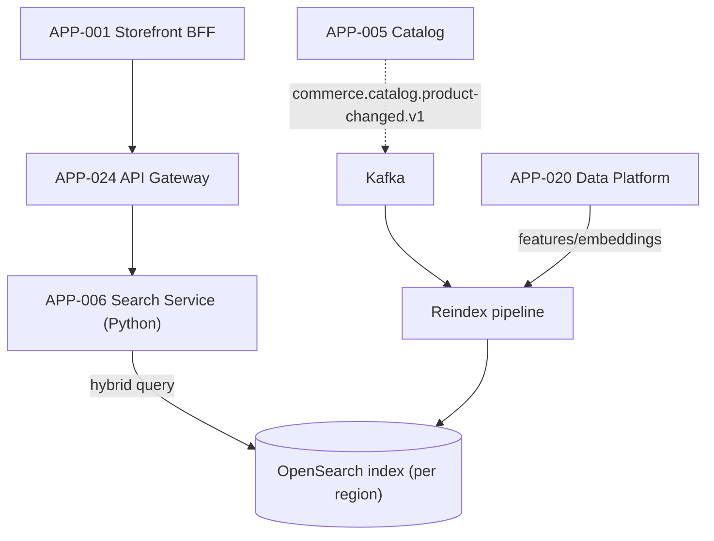
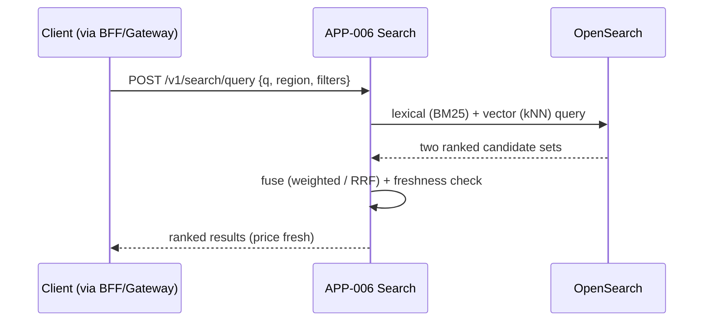

# AD-0006 — Search Hybrid Ranking

| Field | Value |
|---|---|
| Doc id | AD-0006 |
| Title | Search Hybrid Ranking |
| Owner team | TEAM-003 |
| Apps | APP-006 |
| Status | Accepted |
| Related | KN-205, APP-005, APP-020, APP-024, APP-001, INC-2026-003, ADR-0033 |

## Purpose

This document describes the Search & Browse service (APP-006), the Tier 0 system that powers
product search and category browse for Meridian Commerce Group. It covers the Python service
over OpenSearch, the hybrid lexical + vector ranking model, and the reindex pipeline that
consumes catalog change events from Product Catalog (APP-005) and features from the Data
Platform (APP-020) while keeping price data fresh.

Search is a primary discovery surface and a direct conversion lever. Ranking quality must be
high, but freshness is equally critical: results must not show stale prices. This document
records the reindex and price-freshness architecture adopted after INC-2026-003 (search reindex
lag caused stale prices in results) and shipped in REL-2026-002.

## Context

APP-006 is owned by TEAM-003 and built in Python with OpenSearch, consuming Kafka. Its canon
dependencies are APP-005 Product Catalog (catalog change events), APP-020 Data Platform
(ranking/vector features), and APP-024 API Gateway / Edge (ingress, auth, rate limiting). It is
consumed by APP-001 Storefront (via BFF). Search depends on catalog and the data platform;
consumers depend on search — direction is canon.

The service maintains a searchable index that is a *projection* built from two feeds: catalog
change events (product/offer/price attributes from APP-005) and offline features (embeddings,
popularity, learned-ranking signals from APP-020). Ranking combines classic lexical scoring
(BM25) with vector similarity for semantic recall. INC-2026-003 exposed that when the reindex
pipeline lagged, price fields in the index went stale and search results displayed outdated
prices; the design now treats price as a freshness-critical field with its own fast path and
lag SLOs. Regions NA/EU/APAC maintain region-scoped indices.

## Architecture

Queries hit APP-024, then the Python search service, which issues a hybrid query to OpenSearch
(lexical + vector) and fuses the results. The index is kept current by a reindex pipeline
consuming APP-005 change events (per-SKU ordered) and APP-020 feature batches.



Ranking fuses lexical (BM25) and vector (kNN) scores. Price and availability are freshness-critical:
the change-event fast path updates them ahead of the heavier feature reindex so results never
lag on price — the direct remediation of INC-2026-003.



## Key decisions

1. **Hybrid lexical + vector ranking (AI-ready).** BM25 handles exact/keyword intent; vector
   kNN adds semantic recall for natural-language and synonym queries. Fusion via weighted score
   or reciprocal-rank fusion. Trade-off: added vector index cost and tuning complexity.
2. **Index is a projection, not a SoR (DDD / correctness).** Catalog (APP-005) remains
   authoritative; search rebuilds are deterministic from catalog events + APP-020 features.
3. **Price is a freshness-critical field with a fast path (INC-2026-003).** Price/availability
   updates from catalog change events are applied ahead of the heavier feature reindex so
   results never show stale prices. Price-freshness lag is a first-class SLO.
4. **Per-SKU ordered event consumption (event-driven Kafka).** Consuming
   `commerce.catalog.product-changed.v1` partitioned by SKU preserves per-product ordering and
   prevents out-of-order price overwrites.
5. **Two-track reindex: fast (events) + batch (features) (efficiency/resilience).** Real-time
   catalog events keep core fields fresh; APP-020 feature batches refresh ranking signals on a
   slower cadence. A batch delay never blocks price freshness.
6. **Expand-contract on index mapping changes (ADR-0033).** Mapping/schema evolution uses
   alias-swap with expand-contract so reindexing is zero-downtime.
7. **Gateway-mediated ingress (API-first / security-by-design).** All query traffic flows
   through APP-024 for auth, rate limiting, and load-shedding; the service is not directly
   exposed.
8. **Region-scoped indices (region/tier).** NA/EU/APAC indices honor regional catalog scope,
   currency, and price rules; alias-per-region enables independent reindex.

## Data & APIs

Search surface:

| Method | Path | Purpose |
|---|---|---|
| POST | `/v1/search/query` | Hybrid search with filters/facets |
| GET | `/v1/search/suggest?q=` | Type-ahead suggestions |
| GET | `/v1/search/browse/{category}` | Category browse listing |

Data stores: OpenSearch indices `search-products-{region}` behind aliases `search-{region}-live`
for zero-downtime reindex; vector field for kNN embeddings from APP-020. Consumed:
`commerce.catalog.product-changed.v1` (APP-005, per-SKU) and `platform.search.features.v1`
(APP-020 feature batches). No owned SoR. Idempotency: index writes keyed by
`(sku, catalogVersion)`; last-writer-by-version wins to prevent stale overwrite. Error envelope:

```json
{ "error": { "code": "SEARCH_DEGRADED", "mode": "lexical-only", "priceFreshnessSec": 3 } }
```

## Failure modes & resilience

- **Reindex lag → stale prices (INC-2026-003):** price fast path decoupled from feature batch;
  price-freshness SLO with alerting; if the fast path lags, results are flagged and the price
  fallback defers to the BFF's late-bound price (AD-0001).
- **Vector index / feature service (APP-020) unavailable:** degrade to lexical-only (BM25)
  ranking; recall drops but search stays up and prices stay fresh.
- **Catalog event stream lag/stall (from APP-005/INC-2026-021):** index freshness degrades
  gracefully; consumer resumes from committed offset with no gap.
- **OpenSearch node/shard loss:** replica shards serve; alias points at healthy index; reindex
  can rebuild from catalog + features.
- **Query overload:** APP-024 rate-limits/sheds (mindful of INC-2026-013 over-aggressive
  thresholds); search applies query timeouts and returns partial top-k.
- **Bad feature batch:** alias-swap lets us roll back to the prior index without downtime.
- **Timeouts/retries:** OpenSearch query budget ~250 ms; kNN sub-query has its own budget and is
  droppable to keep p99 in check.

## Observability

Golden-signal SLOs (Tier 0):
- **Latency:** query p50 ≤ 80 ms, p95 ≤ 250 ms, p99 ≤ 500 ms.
- **Freshness:** price-freshness lag (catalog event → index) p95 ≤ 5 s — the primary SLI created
  after INC-2026-003; feature-batch freshness tracked separately (minutes).
- **Error rate:** query 5xx < 0.1%; lexical-only degraded time tracked as an SLI.
- **Saturation:** OpenSearch CPU/heap < 70%; reindex consumer lag bounded.

Key signals: hybrid vs lexical-only ratio, price-freshness lag, reindex consumer lag, kNN
sub-query drop rate, zero-result rate and ranking quality (CTR/conversion offline). Traces span
Gateway → Search → OpenSearch. Alerts: price-freshness lag > 15 s, degraded (lexical-only)
> 2 min, consumer lag spike, p99 SLO burn. Dashboards co-owned with TEAM-005 (Catalog),
TEAM-060 (Data Platform), TEAM-032 (SRE).

## Cross-references

- Sibling ADs: KN-205, AD-0005 Product Catalog & Indexing, AD-0001 Storefront & BFF.
- Apps: APP-006 (this), APP-005, APP-020, APP-024, APP-001.
- Teams: TEAM-003 (owner), TEAM-005 (Catalog), TEAM-060 (Data Platform), TEAM-030 (API Gateway),
  TEAM-032 (SRE).
- Incidents: INC-2026-003 (reindex lag stale prices); related INC-2026-021, INC-2026-013.
  Releases: REL-2026-002.
- ADRs: ADR-0033 (expand-contract schema evolution).
