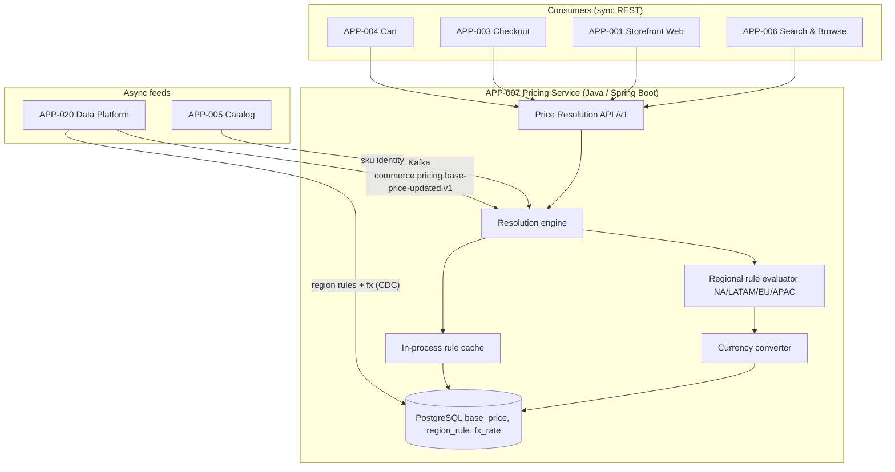

# AD-0007 — Pricing Resolution

| Field | Value |
|---|---|
| Doc id | AD-0007 |
| Title | Pricing Resolution |
| Owner team | TEAM-007 |
| Apps | APP-007 |
| Status | Accepted |
| Related | KN-207, APP-005, APP-020, APP-004, APP-003, APP-001, APP-006, INC-2026-004, INC-2026-003, ADR-0033, ADR-0043 |

## Purpose

This document describes how the **Pricing Service (APP-007)** resolves the final price for a
SKU in a given selling context. Price resolution is a Tier-0 read path: every product tile,
cart line, and checkout total in MCG ultimately calls into it, so correctness and latency are
both business-critical.

Pricing is deliberately a **bounded context** (DDD, §8). It owns base prices, regional pricing
rules, and currency conversion, and it publishes a single, authoritative *resolved price* to
downstream consumers. It does **not** own promotions or discounts — those belong to APP-008 —
which keeps the model composable and the blast radius of a pricing change contained.

The document exists to make the resolution algorithm, its inputs, and its failure semantics
explicit, because two production incidents (INC-2026-004, INC-2026-003) traced back to
ambiguity about *which* price is authoritative and *when* a price becomes visible.

## Context

APP-007 is owned by **TEAM-007**, built in **Java on Spring Boot** with **PostgreSQL** as the
system of record. It sits between the merchandising/data plane and the commerce read path:

- **Upstream (feeds):** **APP-020 Data Platform** (Databricks/Spark, Snowflake, dbt) publishes
  base-price and cost datasets and regional rule tables into Pricing via a batch + CDC pipeline.
  Product identity comes from **APP-005 Product Catalog**.
- **Downstream (consumers):** the resolution API is called by **APP-004 Cart**, **APP-003
  Checkout**, **APP-001 Storefront Web**, and **APP-006 Search & Browse**. This fan-out is why
  the service is Tier 0 and why a bad regional rule (INC-2026-004) is immediately customer-visible.

Regions are canon: **NA** (US, CA, MX), **LATAM** (BR), **EU** (GB, DE), **APAC** (AU). Each
region has its own rule set and settlement currency, so a single base price can resolve to many
region/currency outcomes. Primary cloud is AWS; the service runs on Kubernetes behind APP-024.

Business drivers: consistent prices across web, search, cart, and checkout; fast regional
rule rollout for merchandising; and a hard invariant that the price a customer sees in search
equals the price they pay at checkout for the same context and time.

## Architecture

Resolution is a layered pipeline: identity → base price → regional rules → currency → resolved
price. All layers read from Postgres (with a warm in-process cache); writes only ever arrive
asynchronously from APP-020.



Reads are synchronous and latency-bound. Feeds are asynchronous (event-driven, §8): APP-020
emits price and rule changes on Kafka, Pricing materializes them into Postgres, and the
in-process cache is refreshed on a bounded TTL plus an explicit invalidation event.

## Key decisions

1. **Single resolved-price authority (API-first, §8).** Consumers never re-implement pricing;
   they call `/v1/prices/resolve`. This is the fix-line for INC-2026-003 (search showed stale
   prices because it had its own copy) — search now resolves against APP-007 at index time and
   revalidates hot SKUs.
2. **Pricing owns price, not discount (DDD bounded context, §8).** Promotions (APP-008) consume
   resolved price and apply offers on top. This keeps the two engines independently deployable
   and prevents circular dependencies.
3. **Postgres as system of record, cache as accelerator.** Base prices and rules are durable in
   Postgres; the in-process cache exists only for latency. On cache miss the service falls back
   to Postgres, never to a consumer-supplied price.
4. **Regional rules are data, not code.** NA/LATAM/EU/APAC rules live in `region_rule` rows with
   effective-dating. INC-2026-004 (APAC rule misconfig) was a *data* defect, not a deploy — so
   the guardrail is validation on ingest, not a code release.
5. **Expand-contract for price schema (ADR-0033).** Adding a rule dimension (e.g. channel) ships
   as an additive column with a default, dual-read during migration, then contract. No
   flag-day changes to a Tier-0 read path.
6. **Effective-dated everything.** Every base price and rule has `effective_from`/`effective_to`.
   Resolution is deterministic for a given `(sku, region, currency, as_of)` tuple, which makes
   search-vs-checkout consistency provable and reproducible in tests.
7. **Sensitivity travels with cost data (ADR-0043).** Cost/margin fields from APP-020 are tagged
   restricted and are never returned on the public resolve API; only list/sale price is exposed.
8. **Currency conversion is explicit and versioned.** FX rates are stored with a source and
   timestamp; the resolved price always states the currency and the rate epoch it used.

## Data & APIs

Synchronous REST (JSON), served through APP-024:

```
POST /v1/prices/resolve
  body: { skuIds:[...], region:"APAC", currency:"AUD", asOf?:RFC3339, channel?:"web" }
  200 : { prices:[ { skuId, region, currency, basePrice, resolvedPrice, ruleIds:[...], fxRateEpoch } ] }
GET  /v1/prices/{skuId}?region=EU&currency=GBP
GET  /v1/rules/regions/{region}        # inspect active regional rules (internal)
```

Idempotency: resolve is a pure read (idempotent by definition). Batch resolve is capped at 200
SKUs per call; consumers page beyond that. Error envelope:

```json
{ "error": { "code": "PRICE_UNAVAILABLE", "skuId": "SKU-991", "region": "APAC", "traceId": "..." } }
```

| Store | Purpose |
|---|---|
| PostgreSQL `base_price` | list/base price by SKU, effective-dated |
| PostgreSQL `region_rule` | NA/LATAM/EU/APAC uplift/floor/rounding rules |
| PostgreSQL `fx_rate` | currency conversion rates by epoch |
| In-process cache | hot SKU + active-rule set, bounded TTL |

Key Kafka topics (CloudEvents): `commerce.pricing.base-price-updated.v1`,
`commerce.pricing.region-rule-changed.v1`, `commerce.pricing.price-resolved.v1` (audit stream
for APP-020). Consumed: base-price and rule feeds from APP-020.

## Failure modes & resilience

- **Stale search prices (INC-2026-003).** Root cause: search cached prices without revalidation.
  Mitigation: search resolves against APP-007 and subscribes to `region-rule-changed` /
  `base-price-updated` to invalidate affected SKUs; hot SKUs revalidated on a short TTL.
- **Bad regional rule (INC-2026-004).** A misconfigured APAC rule resolved incorrect prices for
  AU. Mitigation: ingest-time validation (bounds, floor ≥ 0, rounding sanity), effective-dating
  so a bad rule can be superseded without a deploy, and a canary compare of resolved vs prior price.
- **Postgres unavailable.** Reads served from in-process cache in a degraded, read-only mode with
  a max staleness budget; if both fail, resolve returns `PRICE_UNAVAILABLE` and consumers apply
  their own fail-closed policy (checkout blocks, search hides price rather than guessing).
- **Feed outage from APP-020.** Prices simply stop changing; last-good values remain authoritative
  and correct. Alert fires on feed lag; no customer impact until a scheduled change is missed.
- **FX rate gap.** If no in-window `fx_rate` exists, resolution fails closed for that currency
  rather than converting with a stale rate.

Timeouts: consumers set a 150 ms client timeout with one retry; the service sheds load above
saturation and returns cached results in preference to slow Postgres reads.

## Observability

Golden-signal SLOs (Tier 0 read path):

| Signal | Target |
|---|---|
| Latency p50 | ≤ 8 ms (cache hit) |
| Latency p95 | ≤ 35 ms |
| Latency p99 | ≤ 80 ms |
| Error rate | < 0.05% of resolves |
| Cache hit ratio | > 97% for hot SKUs |
| Feed lag (APP-020) | < 5 min p95 |

Metrics: `pricing.resolve.latency`, `pricing.cache.hit_ratio`, `pricing.rule.active_count` by
region, `pricing.feed.lag_seconds`. Traces span consumer → APP-024 → APP-007 → Postgres.
Alerts: resolved-price delta canary (guards INC-2026-004), feed-lag breach (guards INC-2026-003),
p99 breach, and `PRICE_UNAVAILABLE` rate. Dashboards split by region so an APAC-only regression
is visible immediately.

## Cross-references

- **Sibling ADs:** KN-207 (this doc), consumers APP-004/APP-003/APP-001/APP-006 architecture.
- **Apps:** APP-007 (Pricing), APP-005 (Catalog), APP-020 (Data Platform), APP-008 (Promotions).
- **Teams:** TEAM-007 (owner), TEAM-060 (Data Platform), TEAM-030 (Edge).
- **Incidents:** INC-2026-004 (APAC regional price rule misconfig), INC-2026-003 (search reindex
  lag stale prices).
- **ADRs:** ADR-0033 (expand-contract schema evolution), ADR-0043 (sensitivity travels with data).
- **Release:** REL-2026-003.
