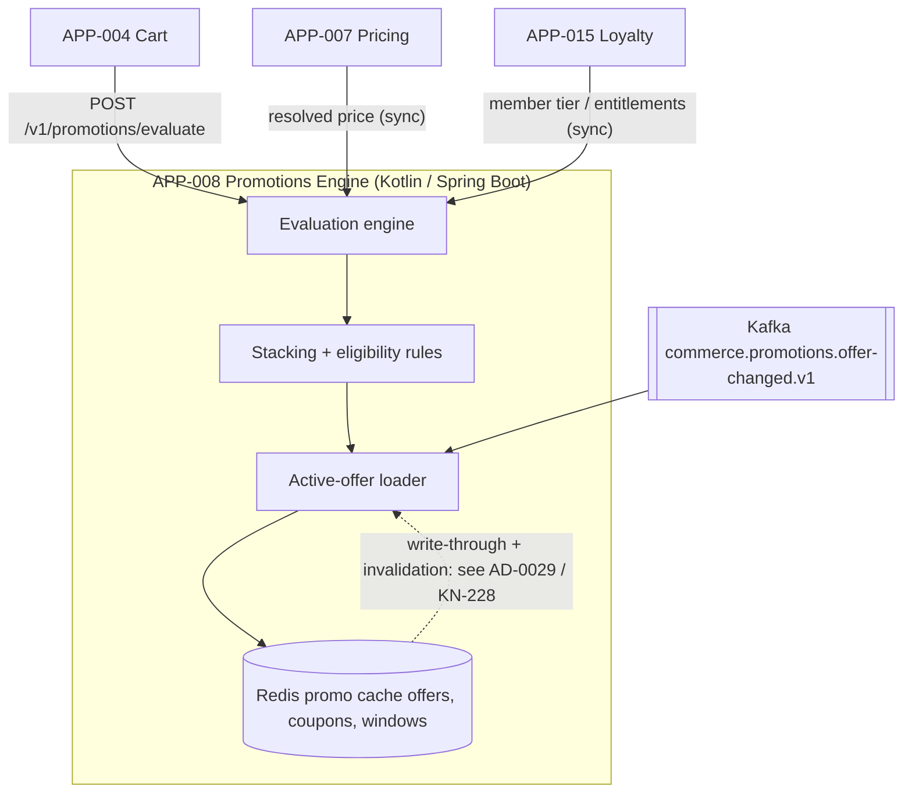

# AD-0008 — Promotions Engine & Cache

| Field | Value |
|---|---|
| Doc id | AD-0008 |
| Title | Promotions Engine & Cache |
| Owner team | TEAM-008 |
| Apps | APP-008 |
| Status | Accepted |
| Related | KN-208, KN-228, APP-007, APP-015, APP-004, INC-2026-007, INC-2026-011, INC-2026-018, ADR-0033, ADR-0045 |

## Purpose

This document describes the **Promotions Engine (APP-008)** holistically: how MCG evaluates
offers, coupons, and cart-level discounts, and how it uses a Redis promo cache to keep that
evaluation fast enough for a Tier-1 path that sits directly in the cart hot loop.

The engine is a **bounded context** (DDD, §8) that composes on top of pricing. It never sets a
base price — it reads a *resolved price* from **APP-007** and applies discounts on top. It also
reads loyalty context from **APP-015** so member-only and tiered offers evaluate correctly.

This document covers the engine as a whole. The **write-through and invalidation design of the
promo cache is a separate, deeper document (AD-0029 / KN-228)** — the cache-staleness incident
series (INC-2026-007, INC-2026-011, INC-2026-018) is addressed structurally there. Here we cover
the cache at the level needed to understand the engine; deep cache mechanics defer to AD-0029.

## Context

APP-008 is owned by **TEAM-008**, written in **Kotlin on Spring Boot** with **Redis** as the
promo cache. It is **Tier 1**: degraded promotions must never take down the cart, so the design
explicitly favors "fail open to no-discount" over blocking.

- **Dependencies (canon):** APP-007 Pricing (resolved price), APP-015 Loyalty (member tier and
  entitlements), and Kafka for offer-lifecycle events.
- **Consumer (canon):** APP-004 Cart calls the engine to price a cart with promotions applied.
- **Regions/tier:** offers can be region-scoped (NA/LATAM/EU/APAC) and time-boxed to promo
  windows and flash sales, which is exactly where the staleness incidents occurred.

Business drivers: flash-sale throughput, correct coupon stacking, and the invariant that the
discount shown in the cart equals the discount honored at checkout for the same promo window.

## Architecture

The engine evaluates a cart against the active offer set, reading resolved prices from Pricing
and loyalty context from Loyalty, with Redis serving the compiled active-offer set for speed.



The evaluate path is synchronous. Offer lifecycle (publish, activate, expire) is **event-driven**
(§8): offer changes arrive on Kafka, the loader recompiles the active-offer set, and the Redis
promo cache is refreshed. The *how* of that refresh — write-through ordering, versioned keys,
window-boundary invalidation — is owned by AD-0029.

## Key decisions

1. **Compose on pricing, don't duplicate it (DDD, §8).** The engine consumes APP-007's resolved
   price and applies discounts on top. It never re-derives base price, avoiding a whole class of
   price/discount disagreement.
2. **Fail open to no-discount (Tier-1 resilience).** If Redis or a dependency is unavailable, the
   cart still prices at full resolved price rather than blocking checkout. Promotions are additive
   upside, never a hard dependency of purchase.
3. **Active-offer set is compiled, not evaluated per rule.** Offers are compiled into an indexed
   active set keyed by region and window, so evaluation is a lookup + stacking pass, not a scan.
4. **Cache mechanics live in AD-0029 (KN-228).** The recurring staleness incidents
   (INC-2026-007 → 011 → 018) are a cache-coherency problem; the systemic fix (write-through +
   window-boundary invalidation) is specified once, in AD-0029, and referenced here.
5. **Idempotent evaluation with rollback awareness (ADR-0045).** Evaluate is a pure read; the
   offer-activation pipeline is idempotent and every activation carries a rollback plan so a bad
   offer can be withdrawn without a redeploy.
6. **Expand-contract for offer schema (ADR-0033).** New offer types (e.g. BOGO variants) ship as
   additive schema with dual-read, avoiding flag-day changes to a hot path.
7. **Explicit stacking policy.** Coupon + automatic-offer stacking order is defined data, not
   emergent behavior, so cart and checkout apply discounts identically.
8. **Loyalty is context, not a blocker.** If APP-015 is slow, member-only offers degrade to
   non-member evaluation rather than failing the whole cart.

## Data & APIs

Synchronous REST (JSON):

```
POST /v1/promotions/evaluate
  body: { region:"NA", currency:"USD", loyaltyTier?:"GOLD", lines:[ {skuId, qty, resolvedPrice} ], coupons?:["SAVE10"] }
  200 : { lines:[ {skuId, discount, appliedOfferIds:[...]} ], cartDiscount, appliedCoupons:[...] }
POST /v1/promotions/coupons/validate   # single-coupon check
GET  /v1/promotions/offers/active?region=EU   # internal introspection
```

Idempotency: evaluate is a read; coupon redemption uses an `Idempotency-Key` header so retries
during flash-sale spikes don't double-count. Error envelope:

```json
{ "error": { "code": "PROMO_DEGRADED", "reason": "cache_unavailable", "traceId": "..." } }
```

| Store / topic | Purpose |
|---|---|
| Redis `promo:offer:{region}:{id}` | compiled active offers (mechanics in AD-0029) |
| Redis `promo:coupon:{code}` | coupon definitions + counters |
| Redis `promo:window:{region}` | active promo-window index |
| Kafka `commerce.promotions.offer-changed.v1` | offer lifecycle (consumed) |
| Kafka `commerce.promotions.coupon-redeemed.v1` | redemption audit (emitted) |

## Failure modes & resilience

- **Promo-cache staleness series (INC-2026-007, INC-2026-011, INC-2026-018).** A price/offer
  change at a promo-window boundary was not reflected in the cache, so carts applied a stale
  discount. INC-2026-007 was the first occurrence, INC-2026-011 recurred under flash-sale load,
  and INC-2026-018 is the systemic fix — a **write-through + window-boundary invalidation** design
  **specified in AD-0029 (KN-228)**. This document defers the mechanism there but records the
  invariant: *no cart applies an offer that is not active for its region and current window.*
- **Redis unavailable.** Fail open to no-discount (Decision 2); cart continues at resolved price.
- **Pricing (APP-007) slow/unavailable.** Evaluate cannot proceed without a resolved price, so it
  fails fast and the cart falls back to full price; a circuit breaker sheds load to APP-007.
- **Loyalty (APP-015) slow.** Degrade to non-member evaluation; member offers simply don't apply.
- **Flash-sale thundering herd.** Compiled active-offer set + Redis keeps evaluation O(1)-ish;
  load-shedding and request coalescing protect the engine under spike.

Timeouts: 120 ms budget for the evaluate call from cart; single retry on transient Redis errors;
circuit breakers around APP-007 and APP-015.

## Observability

Golden-signal SLOs (Tier 1):

| Signal | Target |
|---|---|
| Latency p50 | ≤ 12 ms |
| Latency p95 | ≤ 45 ms |
| Latency p99 | ≤ 120 ms |
| Error rate | < 0.1% |
| Cache freshness | 100% within window boundary (tracked via AD-0029 invalidation lag) |

Metrics: `promo.evaluate.latency`, `promo.cache.staleness_seconds`, `promo.degraded.count`
(fail-open events), `promo.coupon.redeem.rate`. Traces: cart → APP-008 → {APP-007, APP-015, Redis}.
Alerts: cache-staleness breach at window boundary (the INC-2026-007/011/018 detector, wired to
AD-0029 invalidation metrics), fail-open rate spike, and p99 breach during flash sales.
Dashboards split by region and by active promo window.

## Cross-references

- **Sibling ADs:** KN-208 (this doc), **AD-0029 / KN-228** (promo-cache write-through & invalidation
  — authoritative for cache mechanics), AD-0007 (Pricing), AD-0004 (Cart).
- **Apps:** APP-008 (Promotions), APP-007 (Pricing), APP-015 (Loyalty), APP-004 (Cart).
- **Teams:** TEAM-008 (owner), TEAM-007, TEAM-011, TEAM-004.
- **Incidents:** INC-2026-007, INC-2026-011, INC-2026-018 (promo-cache staleness series).
- **ADRs:** ADR-0033 (expand-contract), ADR-0045 (idempotent execution & rollback plans).
- **Release:** REL-2026-004.
